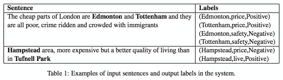
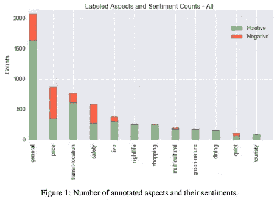
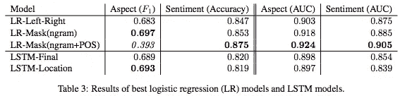
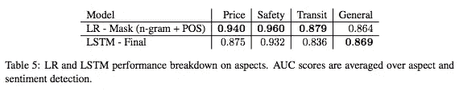
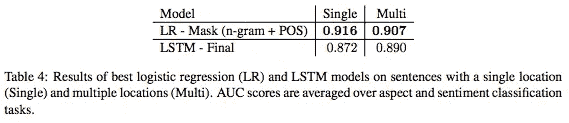

# #NLP365 的第 104 天:NLP 论文摘要——感知:城市街区基于目标特征的情感分析数据集

> 原文：<https://towardsdatascience.com/day-104-of-nlp365-nlp-papers-summary-sentihood-targeted-aspect-based-sentiment-analysis-f24a2ec1ca32?source=collection_archive---------49----------------------->

阅读和理解研究论文就像拼凑一个未解之谜。汉斯-彼得·高斯特在 [Unsplash](https://unsplash.com/s/photos/research-papers?utm_source=unsplash&utm_medium=referral&utm_content=creditCopyText) 上拍摄的照片。

## [内线艾](https://medium.com/towards-data-science/inside-ai/home) [NLP365](http://towardsdatascience.com/tagged/nlp365)

## NLP 论文摘要是我总结 NLP 研究论文要点的系列文章

项目#NLP365 (+1)是我在 2020 年每天记录我的 NLP 学习旅程的地方。请随意查看我在过去 100 天里学到的东西[这里](https://ryanong.co.uk/natural-language-processing-365/)。

今天的 NLP 论文是***sensitivity:城市街区基于目标特征的情感分析数据集*** 。以下是研究论文的要点。

# 目标和贡献

介绍了基于方面的目标情感分析(TABSA)的任务。这项工作扩展了基于方面的情感分析和目标情感分析，前者假设每个文档只有一个实体，后者假设对目标实体只有一个情感。这些贡献如下:

1.  介绍基于方面的目标情感分析(TABSA)的任务
2.  介绍了基于雅虎问答平台文本的感知数据集。
3.  使用逻辑回归和 LSTM 为未来的基准测试开发几个强基线模型

# 基于方面的情感分析(ABSA)和目标情感分析的局限性

情绪分析(总体情绪)-> ABSA 和针对性情绪分析->针对性 ABSA。

ABSA 涉及在同一文本单元中提取对一个实体的不同方面的情感。用于 ABSA 的数据集主要假设在一个评论片段中只讨论一个实体，但是可以表达对多个方面的意见。目标情感分析针对给定句子中提到的某个目标实体执行情感分析。该任务假设每个实体只有一个情感，并且数据集到目前为止每个文本单元只包含一个目标实体。

# 塔布萨 vs ABSA

我认为通过一个例子来说明这两个任务的区别是最好的方法。

## ABSA 数据集的一个示例:

"空间的设计令人惊叹，但服务却糟透了！"

ABSA 的任务是识别对环境方面的积极情绪和对服务方面的消极情绪。然而，假设这两种意见都是关于同一家餐馆的。

## TABSA 数据集的合成示例:

“麦当劳的空间设计很棒，但服务很糟糕，另一方面，肯德基的员工非常友好，食物也总是很美味。”

在这个例子中，有两个目标实体:麦当劳和肯德基。当前的 ABSA 任务只能识别对服务方面表达的正面和负面意见，但不能识别这些意见的目标实体。TABSA 旨在提取目标实体及其各个方面和相关情感。

# 感知数据集

TABSA 的标签示例[1]

*   包含带有一个或两个位置实体提及的注释句子
*   它有 5215 个句子，其中 3862 个句子包含一个位置实体，1353 个句子包含两个位置实体
*   下面是数据集中不同方面的图表，以及属于每个方面的句子数量。数据集只有正面或负面情绪:

按方面和情感细分的句子数量[1]

*   位置实体名称被位置 1 和位置 2 屏蔽
*   数据集还包括极性类别“无”，其中句子不包含对位置 l 的方面 a 的意见

TABSA 任务本质上是给定一个句子，提供元组(l，a，p)的列表，其中 p 是实体 l 的方面 a 的极性

# 实验

从数据集中选择了四个最常见的方面:“价格”、“安全”、“运输位置”和“一般”。结果被分解为单个位置的句子、两个位置的句子和整个测试集。其想法是，单个位置句子的结果将展示模型执行正确情感分析的能力，而两个位置句子的结果将展示模型检测某个方面的相关情感并识别意见的目标实体的能力。

## 基线模型

*   逻辑回归的不同变异与语言特征
*   具有最终和位置输出状态的 LSTM

## 估价

*   F1 分数—特征检测
*   准确性——情感分类
*   AUC(ROC 曲线下面积)—特征和情感检测

# 结果

总体结果比较[1]

按方面细分的结果[1]

单位置和两位置句子的结果比较[1]

*   表现最好的模型是带有位置掩蔽和位置信息的逻辑回归。LSTM 表现不佳可能是由于缺乏训练数据。
*   逻辑回归对 LSTM 的持续优于突出了当数据量低时特征工程的优势。

# 结论和未来工作

*   改进基线的方法可以包括使用解析树来识别每个位置的上下文
*   数据扩充可用于使模型对数据的变化更加稳健

**来源:**

[1] Saeidi，Marzieh 等人，“感知:城市街区基于目标特征的情感分析数据集。” *arXiv 预印本 arXiv:1610.03771* (2016)。网址:【https://www.aclweb.org/anthology/C16-1146.pdf 

【https://ryanong.co.uk】原载于 2020 年 4 月 13 日**。**