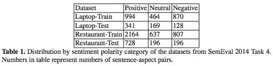
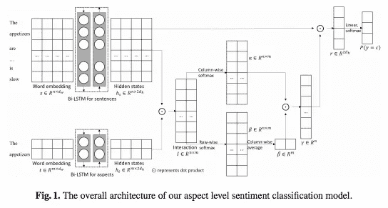
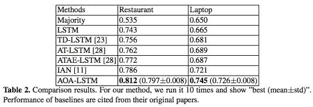
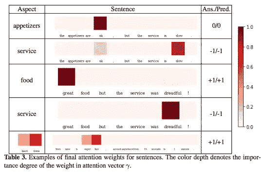

# #NLP365 的第 105 天:NLP 论文摘要——用注意力超过注意力的神经网络进行方面级情感分类

> 原文：<https://towardsdatascience.com/day-105-of-nlp365-nlp-papers-summary-aspect-level-sentiment-classification-with-3a3539be6ae8?source=collection_archive---------43----------------------->

阅读和理解研究论文就像拼凑一个未解之谜。汉斯-彼得·高斯特在 [Unsplash](https://unsplash.com/s/photos/research-papers?utm_source=unsplash&utm_medium=referral&utm_content=creditCopyText) 上拍摄的照片。

## [内线艾](https://medium.com/towards-data-science/inside-ai/home) [NLP365](http://towardsdatascience.com/tagged/nlp365)

## NLP 论文摘要是我总结 NLP 研究论文要点的系列文章

项目#NLP365 (+1)是我在 2020 年每天记录我的 NLP 学习旅程的地方。在这里，你可以随意查看我在过去的 100 天里学到了什么。

今天的 NLP 论文是 ***方面级情感分类与注意力过度注意神经网络*** s。下面是研究论文的关键要点。

# 目标和贡献

介绍了一种用于基于方面的情感分析的 AOA 神经网络。AOA 模块联合学习方面和句子的表示，并且明确地捕捉方面和上下文句子之间的交互。在笔记本电脑和餐馆数据集上的结果优于以前基于 LSTM 的架构。

# 数据集

使用来自 SemEval 2014 任务 4 的两个特定领域数据集进行实验:笔记本电脑和餐馆。准确性是评估标准。数据集汇总如下图所示:

带有情感的数据集汇总统计数据[1]

# 方法学

在这个任务中，我们被给定一个句子和一个体目标，我们的目标是对句子中体目标的情感极性进行分类。在下面显示的架构中有 4 个主要组件:单词嵌入、双 LSTM、注意力超过注意力(AOA)和最终预测。

基于方面的情感分析的建议架构[1]

## 单词嵌入和双 LSTM

单词嵌入是一个标准化的步骤，我们将文本句子和方面目标转换成它的数字表示。这里没什么特别的。一旦我们得到了词向量，我们就把它们分别输入到两个双 LSTM 中，来学习词在句子和体目标中隐藏的语义。

## 注意力过度集中(AOA)

下一步是使用 AOA 模块计算文本的注意力权重。下面是以下步骤:

1.  计算两个隐藏状态之间的成对交互矩阵，其中每个条目的值代表句子和目标之间的词对的相关性
2.  执行列级 softmax 以获得𝛼，目标到句子的关注
3.  执行行方式 softmax 以获得𝛽，句子到目标的注意
4.  计算𝛽的列平均值，以获得目标级别的关注度𝛽，它告诉我们方面目标中的重要部分
5.  最终句子级注意力𝛾是每个单独的目标到句子注意力𝛼的加权和，如下所示:𝛾=𝛼𝛽 𝑇

## 最终预测

通过将来自 AOA 模块的句子注意力应用于句子隐藏状态来计算最终的句子表示，如下所示:𝑟=ℎ_𝑠^𝑇 *𝛾.这个最终句子表示被馈送到具有 softmax 函数的线性层中，以输出情感类别的概率。给定方面目标，具有最高概率的情感类是句子的预测标签。

# 实验和结果

## 模型比较

*   ***多数*** 。简单基线，获取训练集中出现最频繁的情感，并将其分配给测试集中的样本
*   **T5【LSTM】T6**
*   ***TD-LSTM*** 。使用 LSTMs 来捕获方面术语周围的上下文
*   ***AT——LSTM***。结合 LSTM 隐藏状态和方面嵌入计算注意向量
*   ***ATAE-LSTM*** 。AT-LSTM 的扩展，它将方面嵌入附加到每个单词嵌入中
*   ***伊恩*** 。计算句子和体项的隐藏表示，并使用它来计算目标的注意力向量。句子和目标嵌入用于最终分类

## 结果

跨两个数据集的模型比较(准确性)[1]

展示句子中的哪些标记对最终的情感分类贡献最大[1]

*   根据结果表，AOA-LSTM 在与其他基线方法的比较中表现最佳
*   我们还包括了一个表格，通过可视化句子注意向量𝛾.来展示哪个单词对体情感极性贡献最大

# 结论和未来工作

在误差分析中，存在模型不能有效处理的情况。一是复杂的情感表达。另一个是生僻的成语。在未来的工作中，我们可以将句子的语法结构或先前的语言知识输入 AOA 神经网络。

## 来源:

[1]黄、、、欧和凯瑟琳·m·卡利。"方面级情感分类与注意力-注意力神经网络."*社会计算、行为文化建模和预测以及建模和仿真中的行为表现国际会议*。施普林格，查姆，2018。网址:【https://arxiv.org/pdf/1804.06536v1.pdf 

【https://ryanong.co.uk】原载于 2020 年 4 月 14 日**。**