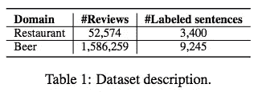
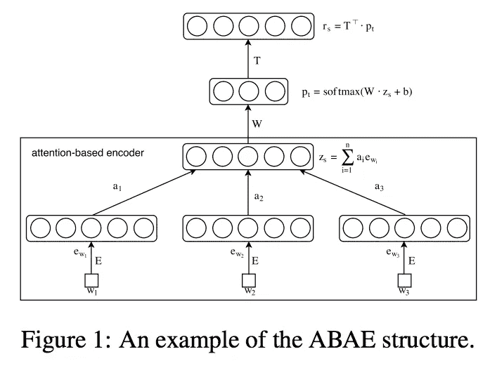
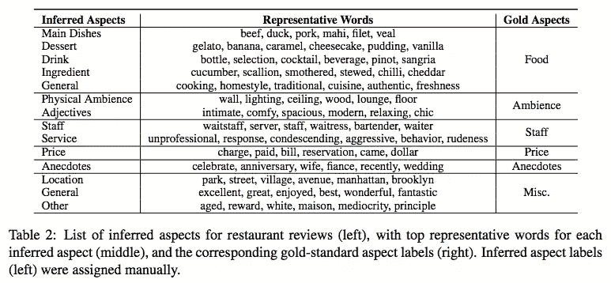
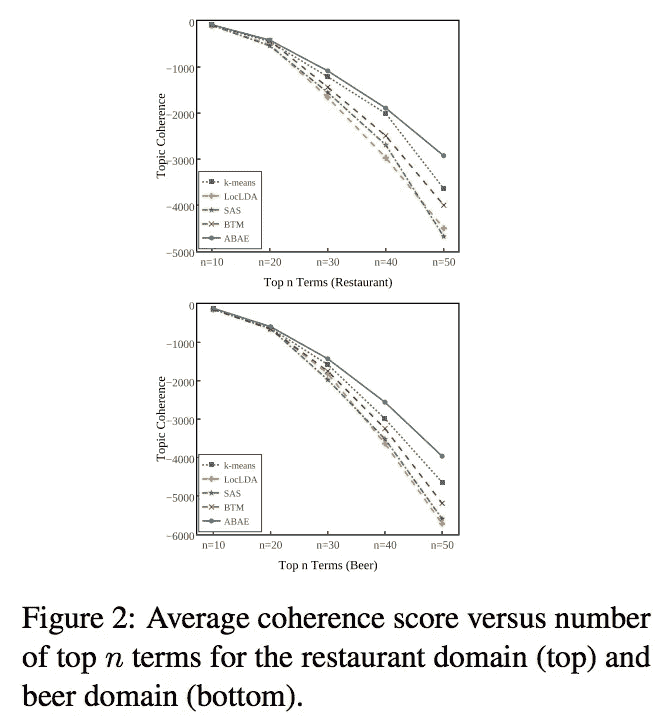
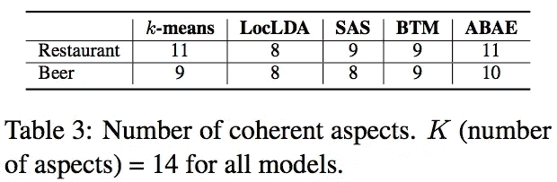
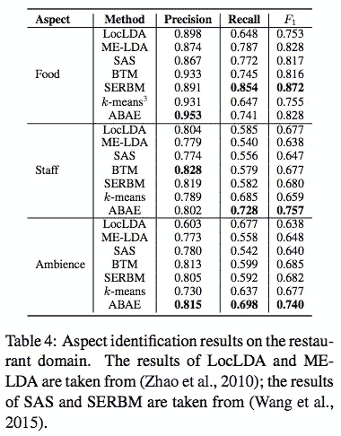
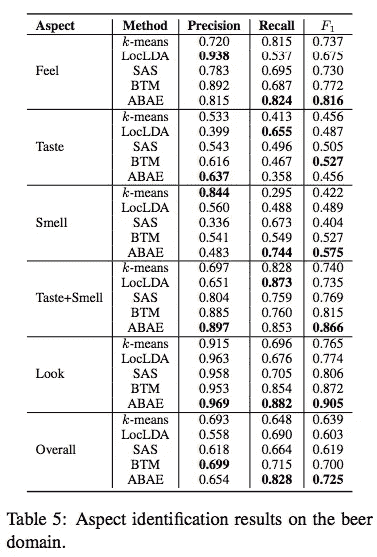

# #NLP365 的第 106 天:NLP 论文摘要——用于特征提取的无监督神经注意模型

> 原文：<https://towardsdatascience.com/day-106-of-nlp365-nlp-papers-summary-an-unsupervised-neural-attention-model-for-aspect-b874d007b6d0?source=collection_archive---------55----------------------->

阅读和理解研究论文就像拼凑一个未解之谜。汉斯-彼得·高斯特在 [Unsplash](https://unsplash.com/s/photos/research-papers?utm_source=unsplash&utm_medium=referral&utm_content=creditCopyText) 上拍摄的照片。

## [内线艾](https://medium.com/towards-data-science/inside-ai/home) [NLP365](http://towardsdatascience.com/tagged/nlp365)

## NLP 论文摘要是我总结 NLP 研究论文要点的系列文章

项目#NLP365 (+1)是我在 2020 年每天记录我的 NLP 学习旅程的地方。在这里，你可以随意查看我在过去的 100 天里学到了什么。

今天的 NLP 论文是 ***一个用于方面提取的无监督神经注意模型*** 。以下是研究论文的要点。

# 目标和贡献

目标是改进一致方面的发现，因为现有的工作没有产生高度一致的方面。本文提出了一种新的神经模型，基于注意力的方面提取(ABAE ),它通过使用单词嵌入来利用单词共现的分布来提高连贯性。该模型还使用一种注意机制来在训练过程中削弱不相关的单词，这进一步提高了方面的一致性。

## 传统 LDA 的弱点

*   不要直接对单词共现统计进行编码，这很重要，因为它们可以保持主题的连贯性
*   LDA 模型需要估计每个文档的主题分布。然而，评论文档往往很短，这使得估计每个文档的主题分布更加困难

# 数据集

两个真实世界的数据集:Citysearch(餐馆)和 BeerAdvocate(啤酒)。

两个评估数据集的汇总统计数据[1]

## 城市搜索语料库

这是一个餐馆评论文集。有 3400 个手动标记的方面。这些注释用于方面提取的评估。有 6 个定义的方面标签:食物、员工、氛围、价格、趣闻和杂项。

## BeerAdvocate

大约有 1000 篇评论(9245 句话)被标注了 5 个方面的标签:感觉、外观、气味、味道、整体。

# 基于注意力的特征抽取(ABAE)

提出的模型，基于注意力的方面提取(ABAE)，使用单词嵌入显式编码单词出现统计，使用降维来提取最重要的方面，并使用注意力机制来移除不相关的单词以进一步提高方面的一致性。

最终目标是学习方面嵌入并将其映射到嵌入空间。以下是 ABAE 建筑图以及主要步骤的突出显示:

ABAE 模型架构[1]

1.  将我们词汇表中的每个单词映射到它们各自的单词嵌入中。体嵌入是用来逼近我们词汇中的体词的
2.  利用注意机制过滤掉非体貌词并构造一个句子嵌入，𝑧𝑠.注意力机制告诉模型应该对单词 I 关注多少，以便捕捉句子的主要方面
3.  将句子嵌入重构为来自 T(方面嵌入矩阵)的方面嵌入的线性组合。𝑝𝑡是 k 个方面嵌入的权重向量，它告诉模型输入句子与相关方面的相关程度。通过将𝑧𝑠的维数从 d 维降低到 k(方面的数量)维和 softmax 非线性来获得𝑝𝑡。这个降维和重构的过程保留了嵌入体中的体词的大部分信息

培训目标是最大限度地减少重建损失。换句话说，该模型旨在尽量缩小𝑟𝑠和𝑧𝑠.之间的差异

# 实验

## 基线模型

*   *LocLDA* :标准 LDA。每个句子都被视为一个单独的文档
*   *K-means* :使用单词嵌入的 K-means 质心计算初始方面矩阵
*   *SAS* :提取方面和特定方面意见的混合模型
*   BTM:为短文本设计的双主题模型。它对无序词对的共现进行建模，以解决数据稀疏问题

## 估价

基于现有的工作，作者将餐馆和啤酒语料库的方面数量设置为 14 个。他们根据两个标准评价 ABAE:

1.  架构能识别有意义的和语义一致的方面吗？
2.  该架构能提高方面检测的性能吗？

# 结果

## 外观质量

由模型分类并映射到相应黄金方面的推断方面列表[1]

推断方面比黄金方面更精细。例如，它可以区分主菜和甜点。为了评估方面的质量，我们使用一致性分数。更高的一致性分数表明更好的方面可解释性，因此更有意义和语义一致性。下面是餐馆和啤酒语料库中每个模型的平均一致性分数。两个发现:1) ABAE 优于先前的模型，以及 2) k-means 在单词嵌入上足以比所有主题模型执行得更好，向我们显示单词嵌入是比 LDA 更强的用于捕获共现的模型。

主题中顶级术语的数量与这些术语的连贯性之间的关系[1]

作者还进行了人体评估。首先，人类法官必须评估他们有多少连贯的方面。如果一个方面的前 50 个术语中的大部分一致地表示该方面，则该方面是一致的。结果如下，ABAE 发现了最多的相干态。

ABAE 模型发现的相干态数目[1]

第二，人类裁判必须评估某个方面的顶项是否正确。只有当大多数裁判认为顶部术语反映了相关方面时，它才被认为是正确的。如下图所示。

ABAE 模型对不同主题的术语进行分类的精确度[1]

## 方面检测

方面召回餐馆数据集上的结果[1]

给定一个评论句子，ABAE 首先分配一个推断的方面标签，然后映射到适当的黄金标准标签。上表显示了餐馆语料库的结果。表中的 SERBM 模型报告了在餐馆语料库上的方面检测的 SOTA 结果，并且 ABAE 能够在员工和氛围方面胜过它。

啤酒语料库的结果如下所示。请注意，作者将味觉和嗅觉结合在一起，因为它们都高度相关。ABAE 在各方面都超过了所有车型，除了口味方面。

方面召回啤酒数据集上的结果[1]

另一个发现是，注意力机制被证明是驱动 ABAE 表现的关键因素。下表显示了 ABAE 和 ABAE 之间的性能比较，其中 ABAE 是没有注意机制的 ABAE 模型。ABAE 在所有方面，所有指标上都超过了 ABAE。

ABAE 和 ABAE——(无注意机制)模型的消融研究[1]

# 结论和未来工作

与 LDA 模型相比，ABAE 显式地捕捉单词共现，并克服了数据稀疏的问题。实验结果表明，与以前的模型相比，ABAE 学习了更高质量的方面，并且在捕捉评论方面更有效。基于这篇论文，这是第一个用于方面提取的无监督神经技术。ABAE 是一个简单而有效的神经注意模型，它的规模很大。

## 来源:

[1]何，r .，李，W.S .，吴，H.T .和达尔迈尔，d .，2017 年 7 月。用于特征提取的无监督神经注意模型。在*计算语言学协会第 55 届年会会议录(第 1 卷:长篇论文)*(第 388–397 页)。网址:【https://www.aclweb.org/anthology/P17-1036.pdf 

【https://ryanong.co.uk】原载于 2020 年 4 月 15 日**。**