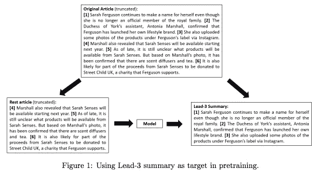
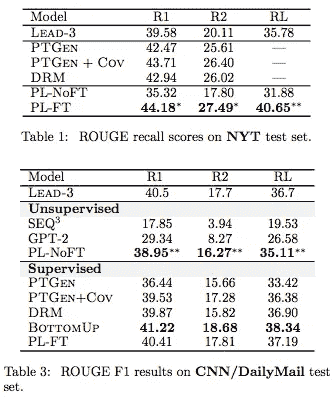
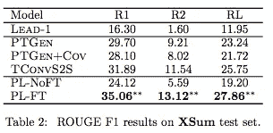
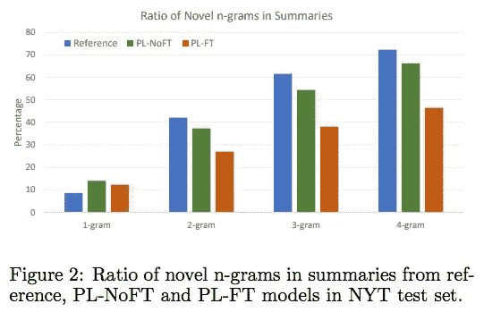
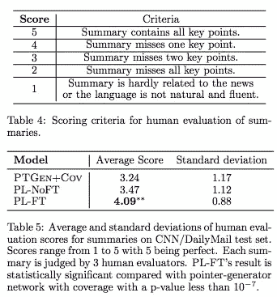

# #NLP365 的第 107 天:NLP 论文摘要——让领导偏向于你:一个简单有效的新闻摘要方法

> 原文：<https://towardsdatascience.com/day-107-of-nlp365-nlp-papers-summary-make-lead-bias-in-your-favor-a-simple-and-effective-4c52b1a569b8?source=collection_archive---------53----------------------->

阅读和理解研究论文就像拼凑一个未解之谜。汉斯-彼得·高斯特在 [Unsplash](https://unsplash.com/s/photos/research-papers?utm_source=unsplash&utm_medium=referral&utm_content=creditCopyText) 上拍摄的照片。

## [内线艾](https://medium.com/towards-data-science/inside-ai/home) [NLP365](http://towardsdatascience.com/tagged/nlp365)

## NLP 论文摘要是我总结 NLP 研究论文要点的系列文章

项目#NLP365 (+1)是我在 2020 年每天记录我的 NLP 学习旅程的地方。在这里，你可以随意查看我在过去的 100 天里学到了什么。

今天的 NLP 论文是 ***让铅偏向于你:一种简单有效的新闻摘要方法*** 。以下是研究论文的要点。

# 目标和贡献

目的是使用新闻数据中现有的领先偏倚来预训练无标记数据集上的摘要模型。我们希望该模型使用文章的其余部分来预测引导句。引导偏差是新闻数据集中的一个常见问题，文章开头的几个句子包含最重要的信息，因此在新闻数据集上训练的模型会偏向于选择这些句子，而忽略文章后面的句子。

# 数据集

我们根据前 3 个句子与文章其余部分的重叠不停顿词比率过滤文章后，收集了 21.4M 篇文章(2016 年 6 月—2019 年 6 月)。高重叠不间断单词比率告诉我们有很强的语义联系。

在三个基准新闻摘要数据集上进行评估:

1.  纽约时报(NYT)语料库— 104K 新闻文章
2.  Xsum — 227K 新闻文章
3.  CNN/每日邮报— 312K 新闻文章

# 方法学

使用 lead-3 作为摘要的数据集创建流程[1]

给定一篇新闻文章，我们把 lead-3 作为目标摘要，把文章的其余部分作为新闻内容，如上图所示。这允许我们利用未标记的新闻数据集来训练我们的摘要模型。这种预训练方法可以应用于任何具有结构偏差的数据集，例如，具有摘要的学术论文或具有目录的书籍。然而，预训练需要仔细的检查和清理，以确保我们对我们的内容有一个好的目标总结。

# 实验

抽象概括模型是传统的变换器编码器-解码器架构。我们不会在此详述架构。用未标记的导联-3 (PL)对目标数据集进行微调的预训练被表示为 PL-FT，而没有微调的被表示为 PL-NoFT。

## 数据清理流程是怎样的？

1.  使用正则表达式删除媒体机构、日期和其他无关内容
2.  只保留前三句有 10-150 个单词的文章，文章的其余部分有 150-1200 个单词。此外，删除所有在文章其余部分重复出现 lead-3 句子的文章。这是为了过滤掉太长或太短的文章，并鼓励抽象的总结
3.  删除含有“不相关”前 3 句的文章。使用前导 3 句子和文章其余部分之间的重叠单词的比率来计算相关性。高重叠词比率意味着前三句是文章其余部分的典型总结。阈值比率为 0.65。

## 模型比较

*   Lead-X:使用前 X 个句子作为摘要(对于 NYT 和 CNN/DM，X = 3；对于 XSum，X = 1)
*   指针生成器网络
*   DRM:使用深度强化学习
*   TConvS2S:卷积神经网络
*   自下而上:总结的两步方法
*   SEQ:使用重构和话题丢失
*   GPT-2:预训练语言模型

# 结果

评估指标是传统的 ROUGE 分数(ROUGE-1、ROUGE-2 和 ROUGE-1)。所有三个评估数据集的结果如下图所示:

NYT 和 CNN/每日邮报测试集的 ROUGE 分数[1]

XSum 测试集[1]的 ROUGE 分数

*   PL-FT 模型在 NYT 和 Xsum 数据集上都优于所有基线模型。在美国有线电视新闻网/每日邮报上，除了自下而上，它的表现超过了所有
*   PL-NoFT 在 CNN/Daily Mail 上的表现远远超过了所有无监督的模型。在 Xsum 中也表现不错。PL-NoFT 在所有三个数据集上都是相同的模型，展示了它的泛化能力

## 抽象性

PL-noFT 和 PL-FT 生成的摘要比参考摘要具有更新颖的单字。PL-noFT 与其他 n-grams 中的参考具有相似的新颖率，但是 PL-FT 在微调后具有相对较低的新颖率。

新 n 元语法在生成的摘要中所占的百分比，用于衡量抽象性[1]

## 人类评估

对 PL 模型和指针生成器网络生成的摘要进行人工评估。评分系统和结果如下所示。结果表明，PL-noFT 和 PL-FT 都优于指针生成器网络。这展示了预训练和微调策略的威力。

人体评价时的评分标准和评价结果[1]

# 结论和未来工作

本文利用新闻数据中存在的倾向性作为目标摘要和训练前摘要模型。我们的未经微调的预训练模型在不同的新闻摘要数据集上取得了 SOTA 结果。通过微调，性能进一步提高。总的来说，这种预训练方法可以应用于任何存在结构偏差的数据集。

## 来源:

[1]朱，，等.“使引导偏向于你:一种简单而有效的新闻摘要方法” *arXiv 预印本 arXiv:1912.11602* (2019)。网址:【https://arxiv.org/pdf/1912.11602.pdf 

【https://ryanong.co.uk】原载于 2020 年 4 月 16 日**。**