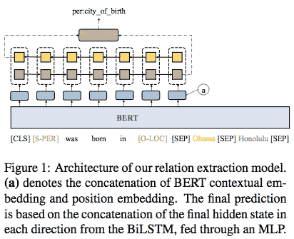
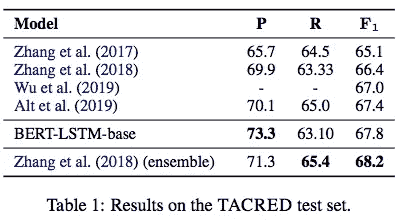
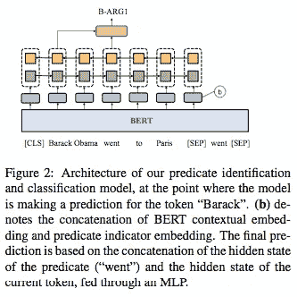
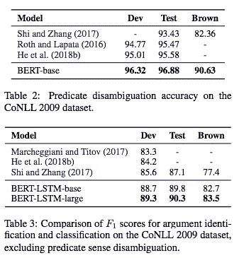
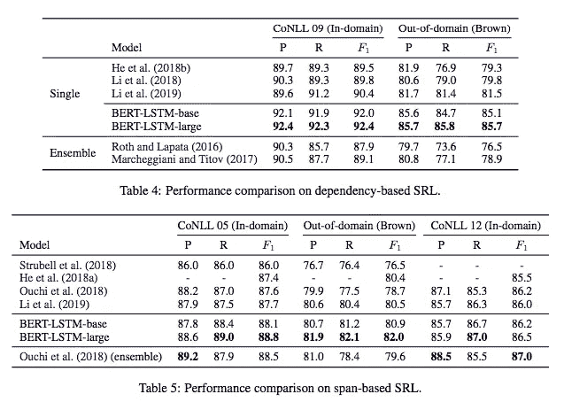

# #NLP365 的第 108 天:NLP 论文摘要——用于关系提取和语义角色标注的简单 BERT 模型

> 原文：<https://towardsdatascience.com/day-108-of-nlp365-nlp-papers-summary-simple-bert-models-for-relation-extraction-and-semantic-98f7698184d7?source=collection_archive---------31----------------------->

阅读和理解研究论文就像拼凑一个未解之谜。汉斯-彼得·高斯特在 [Unsplash](https://unsplash.com/s/photos/research-papers?utm_source=unsplash&utm_medium=referral&utm_content=creditCopyText) 上拍摄的照片。

## [内线艾](https://medium.com/towards-data-science/inside-ai/home) [NLP365](http://towardsdatascience.com/tagged/nlp365)

## NLP 论文摘要是我总结 NLP 研究论文要点的系列文章

项目#NLP365 (+1)是我在 2020 年每天记录我的 NLP 学习旅程的地方。在这里，你可以随意查看我在过去的 100 天里学到了什么。

今天的 NLP 论文是 ***用于关系抽取和语义角色标注的简单 BERT 模型*** 。以下是研究论文的要点。

# 目标和贡献

使用基于 BERT 的模型来实现关系提取和语义角色标记的 SOTA 性能。该论文声称是第一个成功地将 BERT 应用于关系抽取和语义角色标注的论文。

## 什么是语义角色标注？

对于语义角色标注，目标是提取句子的述元结构。这意味着我们要找出是什么事件，什么时候发生的，谁参与了，在哪里发生的等等。这对于逻辑推理很重要的下游 NLP 任务很有用。

# 用于关系抽取的 BERT

给定一个句子和两个实体跨度(非重叠)，我们的目标是预测两个实体之间的关系。下图是 BERT 架构的示意图。

用于关系抽取的 BERT 体系结构[1]

流程如下:

1.  向输入句子添加特殊标记([CLS]和[SEP])，并用屏蔽标记屏蔽实体提及，以防止过度拟合。有两种论元类型(主语和宾语)和两种实体类型(位置和人)。例如，[S-PER]表示主体实体是人。请参见上图中带有特殊标记的输入句子示例。
2.  使用单词块标记器进行标记化，并输入 BERT 编码器以获得上下文化的表示
3.  删除第一个[SEP]标记后的任何序列
4.  计算相对于主体实体和客体实体的位置序列
5.  将两个位置序列转换为位置嵌入，并将其连接到上下文化的表示中
6.  把它放进一个单层的 BiLSTM
7.  两个方向上的最终隐藏状态被送入一个多层(一个隐藏层)感知器

## 结果

用于关系提取的评估数据集是 TAC 关系提取数据集(TACRED)。结果如下所示。BERT-base 模型能够胜过所有其他现有的独立模型，然而，当与集合模型比较时，它仍然下降。

关于关系抽取任务的 BERT 结果[1]

# 语义角色标注的 BERT

语义角色标记由 4 个子任务组成:

1.  谓词检测
2.  谓词意义歧义消除
3.  变元识别
4.  论点分类

可以使用基于跨度和/或基于依赖来完成参数注释。本文将这两种标注方法统一起来。

## 谓词意义歧义消除

这里的目标是正确标记上下文中谓词的含义。步骤如下:

1.  使用单词块标记器的标记化
2.  谓词(或标记)用适当的标签进行标记
3.  其余的单词用“O”或“X”标记。“o”代表任何单词的第一个标记，而“X”代表单词的剩余部分
4.  将序列馈入 BERT 编码器以获得上下文化的表示
5.  将谓词指示符嵌入连接到上下文化嵌入，以让模型知道哪些标记是谓词标记
6.  将级联的嵌入和标签集馈送到 MLP 中用于最终预测

## 论点识别和分类

语义角色标注的 BERT 架构[1]

这里的目标是识别论元跨度或句法中心，并将它们映射到正确的语义角色标签。我们的输入是一个句子-谓词对，我们需要预测一个序列，其中标签集在生物标签方案和谓词参数之间重叠。模型如上图所示。

1.  将句子格式输入到[CLS]句子[SEP]谓词[SEP]中，以便谓词可以通过注意机制与整个句子进行交互
2.  将输入馈入 BERT 编码器
3.  将输出与谓词指示器嵌入连接起来
4.  将连接的输出送入一层 BiLSTM
5.  每个标记隐藏状态与谓词隐藏状态连接在一起，并被送入 MLP 进行最终预测

## 结果

对于基于跨度的语义角色标注，评估数据集是 CoNLL 2005 和 2012。对于基于依赖的语义角色标记，评估数据集是 CoNLL 2009。

结果如下所示。在表 2 中，我们有谓词意义消歧的准确性结果。以前的 SOTA 是一个具有语言学特征的 BiLSTM，基于 BERT 的模型能够胜过使用 MLP 模型的模型。表 3 展示了排除谓词意义歧义的论证识别和分类的结果。在比较中，基于 BERT 的模型再次胜过所有模型。

语义角色标注的 BERT 结果[1]

表 4 和表 5 显示了基于依赖性和基于跨度的语义角色标记的端到端结果。我们可以在表 4 中看到，伯特-LSTM-大型模型能够在 F1 分数方面胜过之前的 SOTA，并且击败没有任何语言特征的不同集成模型。对于基于跨度的语义角色标注，伯特-LSTM-大型模型优于包括集成模型在内的所有模型，但在 CoNLL 2012 数据集上，其 F1 分数略低于集成模型。

BERT 与基于依赖和基于跨度的 SRL 的结果比较[1]

# 结论和未来工作

基于 BERT 的简单模型产生的结果为未来的研究提供了强有力的基线。潜在的未来工作可能涉及重新引入句法特征，以评估它是否进一步改善目前的结果。额外的工作可以是多任务学习，看看我们是否能从同时学习关系提取和语义角色标记中受益。

## 来源:

[1]石，p .和林，j . 2019 .用于关系抽取和语义角色标注的简单 BERT 模型。 *arXiv 预印本 arXiv:1904.05255* 。网址:【https://arxiv.org/pdf/1904.05255.pdf 

【https://ryanong.co.uk】原载于 2020 年 4 月 17 日**。**