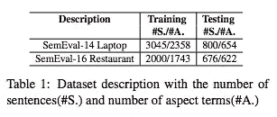
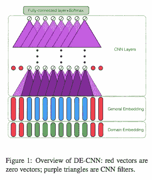
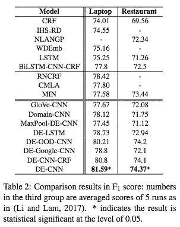

# #NLP365 的第 110 天:NLP 论文摘要——方面提取的双重嵌入和基于 CNN 的序列标记

> 原文：<https://towardsdatascience.com/day-110-of-nlp365-nlp-papers-summary-double-embeddings-and-cnn-based-sequence-labelling-for-b8a958f3bddd?source=collection_archive---------49----------------------->

阅读和理解研究论文就像拼凑一个未解之谜。汉斯-彼得·高斯特在 [Unsplash](https://unsplash.com/s/photos/research-papers?utm_source=unsplash&utm_medium=referral&utm_content=creditCopyText) 上拍摄的照片。

## [内线艾](https://medium.com/towards-data-science/inside-ai/home) [NLP365](http://towardsdatascience.com/tagged/nlp365)

## NLP 论文摘要是我总结 NLP 研究论文要点的系列文章

项目#NLP365 (+1)是我在 2020 年每天记录我的 NLP 学习旅程的地方。在这里，你可以随意查看我在过去的 100 天里学到了什么。在本文的最后，你可以找到以前的论文摘要，按自然语言处理领域分类:)

今天的 NLP 论文是 ***双重嵌入和基于 CNN 的序列标注进行方面提取*** 。以下是研究论文的要点。

# 目标和贡献

提出了一种新的双嵌入卷积神经网络(DE-CNN)模型用于有监督的特征提取。这两种预训练嵌入是通用嵌入和特定领域嵌入。本文首次将双重嵌入和 CNN 模型用于特征提取，性能优于 SOTA 方法。

# 数据集

有两个来自 SemEval 2014 和 2016 的评估数据集:笔记本电脑领域和餐馆领域数据集。请参见下面的数据集统计摘要。

笔记本电脑和餐厅数据集的汇总统计数据[1]

# 双重嵌入 CNN(去 CNN)

当构建方面提取的模型时(或者一般而言)，除了实现 SOTA 结果之外，还有另外两个重要的方面:

1.  自动化特征学习
2.  由于推理速度和实用性，简化和轻量级模型总是首选

DE-CNN(上图)就是针对这两个方面提出来的。第一个方面使用通用嵌入和特定领域嵌入的双重嵌入机制来解决。嵌入的质量至关重要，因为它们通常是 NLP 管道中的第一步。大多数方面提取只包括通用的嵌入，如 Word2Vec 或 GloVe。这可能不合适，因为不管上下文如何，对某些方面单词的通用嵌入保持不变。这就是为什么在处理细粒度含义时，特定于领域的嵌入在方面提取中非常有用。第二个方面是通过下述事实解决的，即 DE-CNN 是用于序列标记的纯 CNN 模型。下面是体系结构图和每个组件的简短描述:

DE-CNN 的模型架构[1]

1.  输入单词序列经过两个独立的嵌入层，得到两个连续的表示:输入的一般嵌入和特定领域嵌入
2.  将这两个嵌入连接在一起
3.  将级联嵌入馈送到 4 层 CNN，并获得所有单词的表示。注意，这些 CNN 层没有 max-pooling 层，因为我们需要模型很好地表示输入序列中的每个单词
4.  我们将 CNN 的输出输入到一个全连接的层，使用 softmax 函数计算输入序列中每个单词的标签概率分布。标签是{B，I，O}。b 和 I 代表体短语的开始词和非开始词，O 代表非体词

# 实验

## 模型比较

本文中的基准模型分为以下三组:

单一任务方法

1.  *条件随机场*。使用手套嵌入
2.  *HIS_RD* 。SemEval 任务中的最佳系统
3.  *NLANGP* 。SemEval 任务中的最佳系统
4.  *WBEmb* 。使用具有 3 种不同嵌入的 CRF
5.  *BiLSTM。*
6.  *比尔斯特姆-CNN-CRF* 。命名实体识别的 SOTA 模型

多任务方法

1.  *RNCRF* 依赖树神经网络和条件随机场的联合模型
2.  CMLA 。多层耦合注意网络
3.  *最小*。由三个 LSTM 组成，其中两个 lstm 共同学习提取方面和观点，最后一个 LSTM 学习区分情感和非情感句子

去 CNN 的变体

1.  *GloVe-CNN* 。没有特定领域的嵌入
2.  *域-CNN* 。没有通用嵌入
3.  *MaxPool-DE-CNN* 。包括最大池层
4.  *DE-OOD-CNN* 。用域外嵌入替换特定于域的嵌入
5.  *去 Google-CNN* 。使用 GoogleNews 嵌入代替手套
6.  *去 CNN-CRF* 。用 CRF 层替换 softmax 函数

# 结果

DE-CNN 和基线模型的变化之间的 F1 分数比较[1]

上面的结果表显示，DE-CNN 的性能优于所有基准模型。结果表明，拥有一个独立的嵌入层，无论是通用的还是特定领域的，都不足以获得好的结果。不同领域的特定领域嵌入是不同的，笔记本电脑和餐馆数据集之间的结果差异向我们表明，DE-CNN 在具有许多特定领域方面的领域中将表现得更好。

# 结论和未来工作

通过错误分析，DE-CNN 似乎有两大错误:

1.  标签不一致。同一个方面有时被标记，有时不被标记
2.  看不见的方面。该模型未能提取彼此密切相关的一对方面。这可能是一个潜在的未来工作，包括连接词的语义

## 来源:

[1]徐，h，刘，b，舒，l 和余，p . s . 2018 .面向方面提取的双重嵌入和基于 cnn 的序列标记。 *arXiv 预印本 arXiv:1805.04601* 。网址:【https://www.aclweb.org/anthology/P18-2094.pdf 

【https://ryanong.co.uk】原载于 2020 年 4 月 19 日**。**

## *特征提取/基于特征的情感分析*

*   *[https://towards data science . com/day-102-of-NLP 365-NLP-papers-summary-implicit-and-explicit-aspect-extraction-in-financial-BDF 00 a 66 db 41](/day-102-of-nlp365-nlp-papers-summary-implicit-and-explicit-aspect-extraction-in-financial-bdf00a66db41)*
*   *[https://towards data science . com/day-103-NLP-research-papers-utilizing-Bert-for-aspect-based-sense-analysis-via-construction-38ab 3e 1630 a3](/day-103-nlp-research-papers-utilizing-bert-for-aspect-based-sentiment-analysis-via-constructing-38ab3e1630a3)*
*   *[https://towards data science . com/day-104-of-NLP 365-NLP-papers-summary-senthious-targeted-aspect-based-sensitive-analysis-f 24 a2 EC 1 ca 32](/day-104-of-nlp365-nlp-papers-summary-sentihood-targeted-aspect-based-sentiment-analysis-f24a2ec1ca32)*
*   *[https://towards data science . com/day-105-of-NLP 365-NLP-papers-summary-aspect-level-sensation-class ification-with-3a 3539 be 6 AE 8](/day-105-of-nlp365-nlp-papers-summary-aspect-level-sentiment-classification-with-3a3539be6ae8)*
*   *[https://towards data science . com/day-106-of-NLP 365-NLP-papers-summary-an-unsupervised-neural-attention-model-for-aspect-b 874d 007 b 6d 0](/day-106-of-nlp365-nlp-papers-summary-an-unsupervised-neural-attention-model-for-aspect-b874d007b6d0)*

## *总结*

*   *[https://towards data science . com/day-107-of-NLP 365-NLP-papers-summary-make-lead-bias-in-your-favor-a-simple-effective-4c 52 B1 a 569 b 8](/day-107-of-nlp365-nlp-papers-summary-make-lead-bias-in-your-favor-a-simple-and-effective-4c52b1a569b8)*
*   *[https://towards data science . com/day-109-of-NLP 365-NLP-papers-summary-studing-summary-evaluation-metrics-in-the-619 F5 acb1b 27](/day-109-of-nlp365-nlp-papers-summary-studying-summarization-evaluation-metrics-in-the-619f5acb1b27)*

## *其他人*

*   *[https://towards data science . com/day-108-of-NLP 365-NLP-papers-summary-simple-Bert-models-for-relation-extraction-and-semantic-98f 7698184 D7](/day-108-of-nlp365-nlp-papers-summary-simple-bert-models-for-relation-extraction-and-semantic-98f7698184d7)*