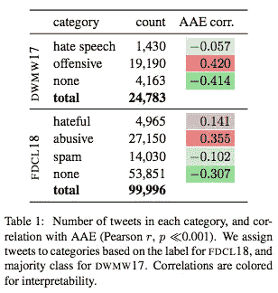

# #NLP365 第 111 天:NLP 论文摘要——仇恨言论检测中的种族偏见风险

> 原文：<https://towardsdatascience.com/day-111-of-nlp365-nlp-papers-summary-the-risk-of-racial-bias-in-hate-speech-detection-bff7f5f20ce5?source=collection_archive---------65----------------------->

阅读和理解研究论文就像拼凑一个未解之谜。汉斯-彼得·高斯特在 [Unsplash](https://unsplash.com/s/photos/research-papers?utm_source=unsplash&utm_medium=referral&utm_content=creditCopyText) 上拍摄的照片。

## [内线艾](https://medium.com/towards-data-science/inside-ai/home) [NLP365](http://towardsdatascience.com/tagged/nlp365)

## NLP 论文摘要是我总结 NLP 研究论文要点的系列文章

项目#NLP365 (+1)是我在 2020 年每天记录我的 NLP 学习旅程的地方。请随意查看我在过去 182 天里学到的东西[这里](https://ryanong.co.uk/natural-language-processing-365/)。在本文的最后，你可以找到以前的论文摘要，按自然语言处理领域分类:)

今天的 NLP 论文是 ***仇恨言论检测中种族偏见的风险*** 。以下是研究论文的要点。

# 目标和贡献

调查种族偏见是如何被标注者引入到仇恨言论检测的数据集中，增加了对少数民族的伤害，并提出了一种方法来改善方言和种族，以减少标注中的种族偏见。本文的贡献如下:

1.  在一些常见的仇恨言论数据集中，发现了非裔美国人英语(AAE)的表面市场与毒性评级之间的意外关联
2.  我发现，在这些数据集上训练的模型传播了这些偏见，AAE 的推文被贴上攻击性标签的可能性增加了一倍
3.  提出了一种方言和种族启动，通过突出推文中推断的方言或作者的种族背景来减少标注中的种族偏见

# 方法学

这篇论文用 AAE 方言来代表种族。这意味着每条推文将被归类为 AAE 推文或不是。选择 AAE 方言的理由是，它是美国黑人在社交媒体中常用的语言。使用链接到 AAE 英语或白人英语的词汇检测器来进行方言估计。给定一条推文，检测器将输出该推文是 AAE 语或白色对齐英语的概率。

# 有毒语言数据集中的偏见

该分析是在仇恨言论检测中常见的两个推特数据集上进行的:

1.  *DWMW17* 。2.5 万条推文带有 3 个攻击性标签:仇恨言论、攻击性或无
2.  *FDCL18* 。10 万条推文带有 4 个攻击性标签:仇恨、辱骂、垃圾邮件或无

## 数据偏差

该论文计算了每个攻击性标签和方言之间的相关性，以及它是 AAE 推文的概率。结果如下表所示，AAE 推文和不同的仇恨言论标签之间有很强的相关性。例如，AAE 推文和攻击性标签之间的相关性为 0.42，这意味着如果一条推文被分类为攻击性的，那么它很有可能是 AAE 推文。

按类别细分的数据集[1]

## 模型中的偏差传播

这项调查分为两步:

1.  找出 AAE 和白人对齐的英语推文之间的假阳性(FP)的差异
2.  使用我们训练好的模型(在 DWMW17 和 FDCL18 数据集上)计算 Demographic16 和 Userlevelrace18 twitter 有毒语言数据集上的平均毒性率

结果如下图所示。左图是第一步的结果，中图和右图展示了第二步的结果。左边的表格告诉我们，尽管模型在两个数据集上都取得了很高的准确率，但 DWMW17 分类器预测大约 46%的非冒犯性 AAE 推文是冒犯性的。在 FDCL18 分类器中也发现了类似的发现。与此同时，两个分类器都倾向于在白色对齐的 tweets 的“无”类别上具有高 FP 率，这表明模型的潜在歧视。

这些结果得到了第二步结果的进一步支持，在人口统计学 16 数据集中，AAE 的推文被归类为攻击性或辱骂性的可能性增加了一倍。在 Userlevelrace18 数据集中也发现了类似的种族偏见。

按种族和人口统计进行分类准确性和深入结果分析[1]

## 方言和种族启动效应

使用 Amazon Mechanical Turk 进行了一项实验，以评估方言信息对攻击性评级的影响。流程如下:

1.  要求员工对一条推文是否冒犯他们进行分类(否/可能/是)
2.  让员工对一条推文是否冒犯了任何人进行分类(否/可能/是)

然而，当工作人员对推文进行分类时，有三种情况:

1.  控制
2.  方言
3.  人种

在方言启动中，工作人员被给予推文的方言(这可能是 AAE 推文)，并被指示使用推文的方言作为作者种族的代表。在种族启动中，工作人员被指示根据推文作者推断的方言来考虑其最可能的种族背景。结果如下所示:

AAE 推文的攻击性注释比例[1]

结果表明，在方言和种族条件下启动工作人员减少了 AAE 推文的攻击性分类数量。其他发现包括注释者更有可能将一条推文归类为冒犯他人，而不是冒犯自己，这显示了冒犯性语言的主观性。

# 结论和未来工作

结果表明，提出的方言和种族启动降低了 AAE 推文被贴上攻击性标签的可能性。这告诉我们，我们应该额外注意注释过程，以避免仇恨言论检测中的任何意外偏差。

## 来源:

[1] Sap，m .，Card，d .，Gabriel，s .，Choi，y .和 Smith，N.A .，2019，7 月。仇恨言论检测中的种族偏见风险。在*计算语言学协会第 57 届年会的会议录*(第 1668-1678 页)。网址:【https://homes.cs.washington.edu/~msap/pdfs/sap2019risk.pdf 

【https://ryanong.co.uk】原载于 2020 年 4 月 20 日**。**

# *特征提取/基于特征的情感分析*

*   *[https://towards data science . com/day-102-of-NLP 365-NLP-papers-summary-implicit-and-explicit-aspect-extraction-in-financial-BDF 00 a 66 db 41](/day-102-of-nlp365-nlp-papers-summary-implicit-and-explicit-aspect-extraction-in-financial-bdf00a66db41)*
*   *[https://towards data science . com/day-103-NLP-research-papers-utilizing-Bert-for-aspect-based-sense-analysis-via-construction-38ab 3e 1630 a3](/day-103-nlp-research-papers-utilizing-bert-for-aspect-based-sentiment-analysis-via-constructing-38ab3e1630a3)*
*   *[https://towards data science . com/day-104-of-NLP 365-NLP-papers-summary-senthious-targeted-aspect-based-sensitive-analysis-f 24 a2 EC 1 ca 32](/day-104-of-nlp365-nlp-papers-summary-sentihood-targeted-aspect-based-sentiment-analysis-f24a2ec1ca32)*
*   *[https://towards data science . com/day-105-of-NLP 365-NLP-papers-summary-aspect-level-sensation-class ification-with-3a 3539 be 6 AE 8](/day-105-of-nlp365-nlp-papers-summary-aspect-level-sentiment-classification-with-3a3539be6ae8)*
*   *[https://towards data science . com/day-106-of-NLP 365-NLP-papers-summary-an-unsupervised-neural-attention-model-for-aspect-b 874d 007 b 6d 0](/day-106-of-nlp365-nlp-papers-summary-an-unsupervised-neural-attention-model-for-aspect-b874d007b6d0)*
*   *[https://towardsdatascience . com/day-110-of-NLP 365-NLP-papers-summary-double-embedding-and-CNN-based-sequence-labeling-for-b8a 958 F3 bddd](/day-110-of-nlp365-nlp-papers-summary-double-embeddings-and-cnn-based-sequence-labelling-for-b8a958f3bddd)*

# *总结*

*   *[https://towards data science . com/day-107-of-NLP 365-NLP-papers-summary-make-lead-bias-in-your-favor-a-simple-effective-4c 52 B1 a 569 b 8](/day-107-of-nlp365-nlp-papers-summary-make-lead-bias-in-your-favor-a-simple-and-effective-4c52b1a569b8)*
*   *[https://towards data science . com/day-109-of-NLP 365-NLP-papers-summary-studing-summary-evaluation-metrics-in-the-619 F5 acb1b 27](/day-109-of-nlp365-nlp-papers-summary-studying-summarization-evaluation-metrics-in-the-619f5acb1b27)*

# *其他人*

*   *[https://towards data science . com/day-108-of-NLP 365-NLP-papers-summary-simple-Bert-models-for-relation-extraction-and-semantic-98f 7698184 D7](/day-108-of-nlp365-nlp-papers-summary-simple-bert-models-for-relation-extraction-and-semantic-98f7698184d7)*