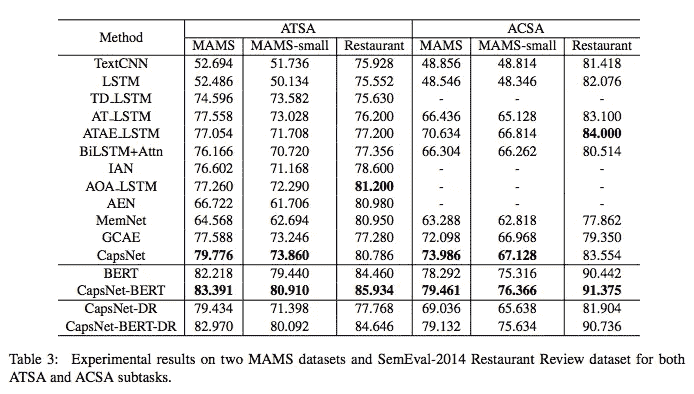

# #NLP365 的第 112 天:NLP 论文摘要——基于方面的情感分析的挑战数据集和有效模型

> 原文：<https://towardsdatascience.com/day-112-of-nlp365-nlp-papers-summary-a-challenge-dataset-and-effective-models-for-aspect-based-35b7a5e245b5?source=collection_archive---------60----------------------->

阅读和理解研究论文就像拼凑一个未解之谜。汉斯-彼得·高斯特在 [Unsplash](https://unsplash.com/s/photos/research-papers?utm_source=unsplash&utm_medium=referral&utm_content=creditCopyText) 上拍摄的照片。

## [内线艾](https://medium.com/towards-data-science/inside-ai/home) [NLP365](http://towardsdatascience.com/tagged/nlp365)

## NLP 论文摘要是我总结 NLP 研究论文要点的系列文章

项目#NLP365 (+1)是我在 2020 年每天记录我的 NLP 学习旅程的地方。在这里，你可以随意查看我在过去的 257 天里学到了什么。在本文的最后，你可以找到以前的论文摘要，按自然语言处理领域分类:)

今天的 NLP 论文是 ***基于方面的情感分析的挑战数据集和有效模型*** 。以下是研究论文的要点。

# 目标和贡献

引入了一种新的基于方面的情感分析(ABSA)数据集，称为多方面多情感(MAMS)，其中每个句子包含至少两个不同的方面和两个不同的情感。提出的 MAMS 数据集可以解决现有 ABSA 数据集的共同问题，其中大多数句子包含不同方面的相同情感，从而将 ABSA 退化为句子级情感分析。论文还为数据集提出了一个简单的基线模型 CapsNet-BERT。

# 数据集构建

MAMS 的数据集构建分为三个步骤:

1.  数据收集
2.  数据注释
3.  数据集分析

## 数据收集

对 Citysearch New York 数据集进行类似于 SemEval-2014 数据集的注记。删除任何超过 70 个单词的句子。

## 数据注释

创建了两个版本的 MAMS 数据集来处理基于方面的情感分析的两个领域:方面-术语情感分析(ATSA)和方面-类别情感分析(ACSA)。对于 ATSA，我们提取句子中的方面术语，并将它们与适当的情感进行映射，并删除具有相同情感的一个方面或多个方面的任何句子。数据集还包括每个特征项的开始和结束位置。对于 ACSA，我们预定义了八个方面类别:食物、服务、员工、价格、氛围、菜单、地点和其他。每个句子都被映射到一个方面类别，以及对该方面类别的适当情感。该数据集仅包括具有至少两个不同情感的独特体类别的句子。

## 数据集分析

ATSA 包含 13854 个句子，平均 2.62 个体项。ACSA 有 8879 个句子，平均 2.25 个体范畴。请注意，MAMS 中的所有句子都包含不同情绪的多个方面。现有的 ABSA 数据集(SemEval-2014 和 Twitter)包含的多方面多情感句子不超过 30%，有些甚至不到 1%。

MAMS 数据集的描述性统计[1]

# CapsNet-BERT

给定一个句子和一个方面术语或一个方面类别，我们希望该模型预测该句子关于方面的情感。提议的模型是 CapsNet-BERT，它由 4 层组成:

1.  嵌入层
2.  编码层
3.  初级被膜层
4.  类别胶囊层

CapsNet-BERT [1]

## 嵌入层

在这一层，我们将输入的句子和体转换成单词嵌入。对于方面项嵌入，我们将其计算为方面词嵌入的平均值。对于方面类别嵌入，我们随机初始化嵌入并在训练中学习。嵌入层的输出是方面感知的句子嵌入，其中我们将方面嵌入与句子中的每个单词嵌入连接起来。

## 编码层

我们采用体貌感知句子嵌入，并通过剩余连接将其输入到双向 GRU 中，以获得上下文化的表示。

## 初级被膜层

使用线性变换和挤压激活，我们使用上下文化表示得到主胶囊 P，使用来自嵌入层的方面嵌入得到方面胶囊。这一层还有两种机制:

1.  *方面感知标准化*。这是为了应对句子长度的变化导致训练不稳定的事实，因此我们使用方面胶囊来归一化主胶囊权重，以选择重要的主胶囊。
2.  *胶囊引导路由*。这利用了情感类别的先验知识来改进路由过程。在训练期间，情感矩阵被初始化，并被输入到 squash 激活中以获得情感胶囊。然后通过测量主胶囊和情感胶囊之间的相似性来计算路由权重。

## 类别胶囊层

使用初级胶囊、方面感知的标准化权重和胶囊引导的路由权重，我们可以计算最终类别胶囊。注意，对于 CapsNet-BERT，嵌入和编码层被替换为预训练的 BERT。

# 实验和结果

有三个评估数据集:ATSA、ACSA 和 SemEval-2014 餐厅评论。

## 模型比较

模型分为 4 类:

1.  总部设在 LSTM
2.  基于 CNN 的
3.  基于注意力
4.  消融研究，以比较 CapsNet 和 BERT 组合的有效性以及所提出的机制的效果

## 结果

ATSA 和 ACSA 子任务的实验结果[1]

*   如上所述，句子级情感分类器(TextCNN 和 LSTM)在 SemEval-2014 中表现有竞争力，但在 MAMS 数据集上表现不佳
*   SemEval-2014 上的 SOTA ABSA 方法在 MAMS 数据集上表现不佳或一般，表明 MAMS 数据集的高难度水平
*   没有正确模拟单词序列的基于注意力的模型在 MAMS 中表现很差，因为它们丢失了句子的序列信息，因此无法将上下文与方面联系起来
*   CapsNet 在 6 个数据集的 4 个数据集上表现优于 BERT，显示了 CapsNet 的实力。CapsNet-BERT 的组合在所有数据集上都优于所有模型
*   CapsNet-DR 和 CapsNet-BERT-DR 用于测量胶囊导向路径的有效性。我们使用标准化的动态路由(DR ),这降低了模型的性能，性能不如我们的 CapsNet-BERT

## 来源:

[1]蒋，q，陈，l，徐，r，敖，x，杨，m，2019，11 月。基于方面的情感分析的挑战数据集和有效模型。在*2019 自然语言处理经验方法会议和第九届自然语言处理国际联合会议(EMNLP-IJCNLP)* (第 6281–6286 页)的会议录中。

*原载于 2020 年 4 月 21 日*[*【https://ryanong.co.uk】*](https://ryanong.co.uk/2020/04/21/day-112-nlp-papers-summary-a-challenge-dataset-and-effective-models-for-aspect-based-sentiment-analysis/)*。*

# 特征提取/基于特征的情感分析

*   [https://towards data science . com/day-102-of-NLP 365-NLP-papers-summary-implicit-and-explicit-aspect-extraction-in-financial-BDF 00 a 66 db 41](/day-102-of-nlp365-nlp-papers-summary-implicit-and-explicit-aspect-extraction-in-financial-bdf00a66db41)
*   [https://towards data science . com/day-103-NLP-research-papers-utilizing-Bert-for-aspect-based-sense-analysis-via-construction-38ab 3e 1630 a3](/day-103-nlp-research-papers-utilizing-bert-for-aspect-based-sentiment-analysis-via-constructing-38ab3e1630a3)
*   [https://towards data science . com/day-104-of-NLP 365-NLP-papers-summary-senthious-targeted-aspect-based-sensitivity-analysis-f 24 a2 EC 1 ca 32](/day-104-of-nlp365-nlp-papers-summary-sentihood-targeted-aspect-based-sentiment-analysis-f24a2ec1ca32)
*   [https://towards data science . com/day-105-of-NLP 365-NLP-papers-summary-aspect-level-sensation-class ification-with-3a 3539 be 6 AE 8](/day-105-of-nlp365-nlp-papers-summary-aspect-level-sentiment-classification-with-3a3539be6ae8)
*   [https://towards data science . com/day-106-of-NLP 365-NLP-papers-summary-an-unsupervised-neural-attention-model-for-aspect-b 874d 007 b 6d 0](/day-106-of-nlp365-nlp-papers-summary-an-unsupervised-neural-attention-model-for-aspect-b874d007b6d0)
*   [https://towardsdatascience . com/day-110-of-NLP 365-NLP-papers-summary-double-embedding-and-CNN-based-sequence-labeling-for-b8a 958 F3 bddd](/day-110-of-nlp365-nlp-papers-summary-double-embeddings-and-cnn-based-sequence-labelling-for-b8a958f3bddd)

# 总结

*   [https://towards data science . com/day-107-of-NLP 365-NLP-papers-summary-make-lead-bias-in-your-favor-a-simple-effective-4c 52 B1 a 569 b 8](/day-107-of-nlp365-nlp-papers-summary-make-lead-bias-in-your-favor-a-simple-and-effective-4c52b1a569b8)
*   [https://towards data science . com/day-109-of-NLP 365-NLP-papers-summary-studing-summary-evaluation-metrics-in-the-619 F5 acb1 b 27](/day-109-of-nlp365-nlp-papers-summary-studying-summarization-evaluation-metrics-in-the-619f5acb1b27)

# 其他人

*   [https://towards data science . com/day-108-of-NLP 365-NLP-papers-summary-simple-Bert-models-for-relation-extraction-and-semantic-98f 7698184 D7](/day-108-of-nlp365-nlp-papers-summary-simple-bert-models-for-relation-extraction-and-semantic-98f7698184d7)
*   [https://towards data science . com/day-111-of-NLP 365-NLP-papers-summary-the-risk-of-race-of-bias-in-hate-speech-detection-BFF 7 F5 f 20 ce 5](/day-111-of-nlp365-nlp-papers-summary-the-risk-of-racial-bias-in-hate-speech-detection-bff7f5f20ce5)