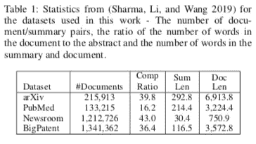
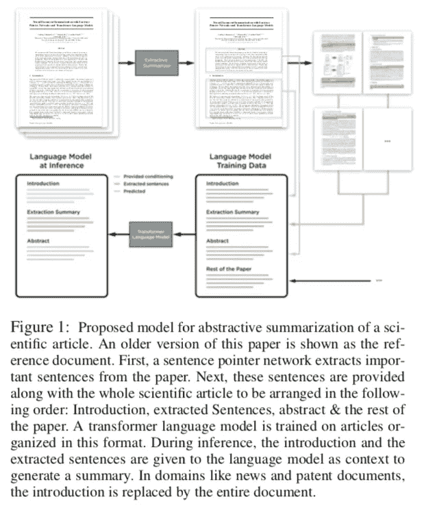
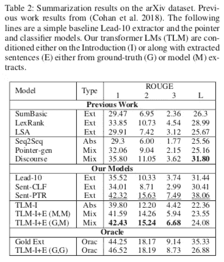
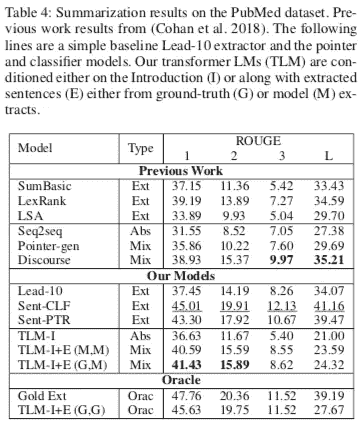
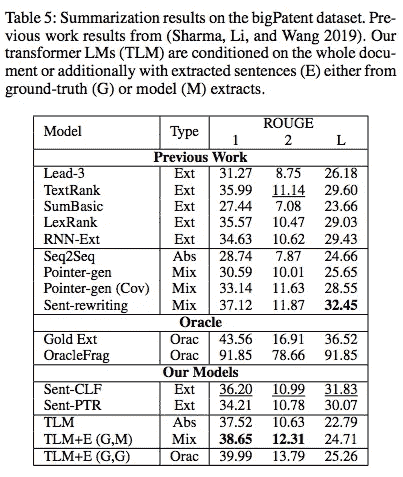
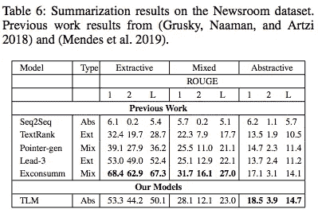
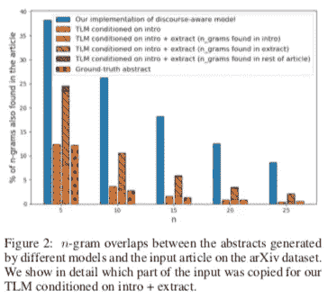
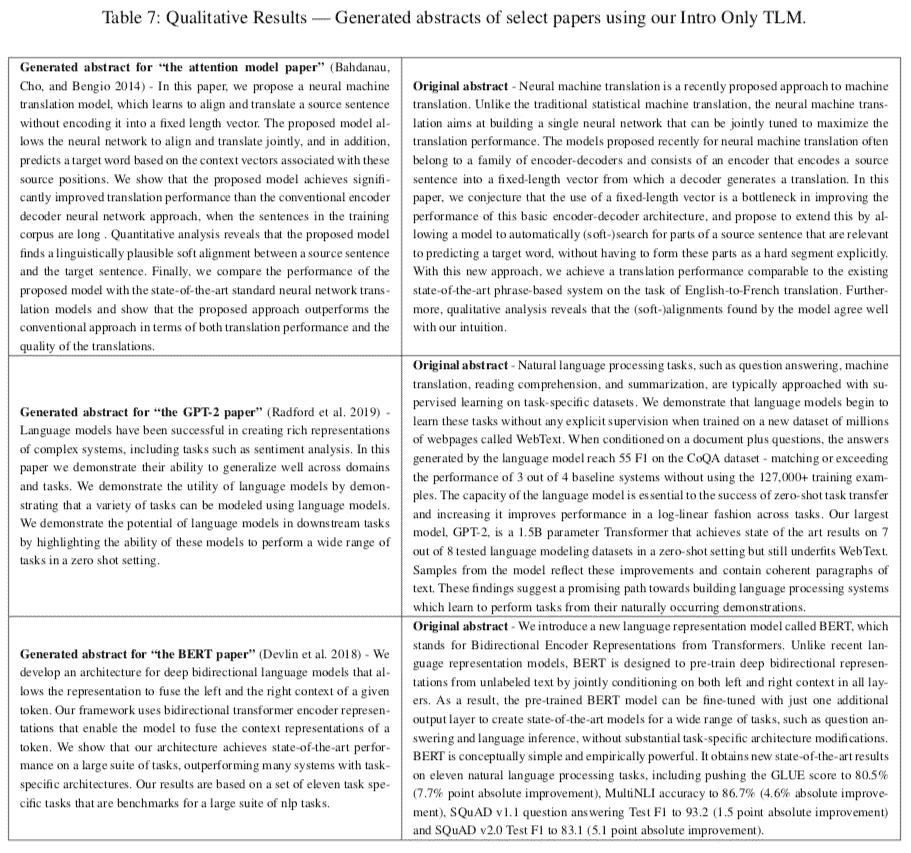

# #NLP365 的第 113 天:NLP 论文摘要——关于使用 Transformer 语言模型的提取和抽象神经文档摘要

> 原文：<https://towardsdatascience.com/day-113-of-nlp365-nlp-papers-summary-on-extractive-and-abstractive-neural-document-87168b7e90bc?source=collection_archive---------51----------------------->

阅读和理解研究论文就像拼凑一个未解之谜。汉斯-彼得·高斯特在 [Unsplash](https://unsplash.com/s/photos/research-papers?utm_source=unsplash&utm_medium=referral&utm_content=creditCopyText) 上拍摄的照片。

## [内线艾](https://medium.com/towards-data-science/inside-ai/home) [NLP365](http://towardsdatascience.com/tagged/nlp365)

## NLP 论文摘要是我总结 NLP 研究论文要点的系列文章

项目#NLP365 (+1)是我在 2020 年每天记录我的 NLP 学习旅程的地方。在这里，你可以随意查看我在过去的 257 天里学到了什么。在本文的最后，你可以找到以前的论文摘要，按自然语言处理领域分类:)

今天的 NLP 论文是 ***关于使用 Transformer 语言模型*** 的提取和抽象神经文档摘要。以下是研究论文的要点。

# 目标和贡献

提出了一种长文档的抽象摘要方法。这是通过提取和抽象概括的两步过程实现的。提取步骤的输出用于训练抽象转换器语言模型。这一提取步骤对最终总结结果非常重要。此外，生成的抽象概要比使用复制机制的先前工作更抽象，并且还产生更高的 ROUGE 分数。这些贡献是:

1.  展示了 transformer 语言模型在总结长篇科学文章方面的有效性，优于 Seq2Seq 模型
2.  与以前的工作相比，提出的模型能够产生更抽象的摘要，并且仍然获得更高的 ROUGE 分数

## 人类总结过程

1.  阅读并理解源文件
2.  选择源文档中最重要的部分
3.  解释这些重要部分中的关键概念
4.  生成连贯流畅的输出摘要

# 数据集

有四种不同的长文档汇总数据集:

1.  arXiv
2.  Pubmed
3.  大专利
4.  报刊阅览室

汇总数据集的描述性统计[1]

# 结构

提议的框架分为两个独立的部分:

1.  *摘录总结*。一种分层文档模型，它复制或分类文档中的句子以构建摘录摘要
2.  *抽象概括*。摘录摘要以及文档用于调节转换器语言模型

## 摘录摘要

提取步骤包括使用两种不同的分层文档模型进行句子提取:分层 seq2seq 句子指针和句子分类器。目标是过滤掉嘈杂的句子，提取重要的句子，更好地训练我们的 transformer 语言模型。分级 seq2seq 语句指针具有编码器-解码器架构:

1.  编码器是单词和句子级别(分级)的双向 LSTM
2.  解码器是自回归 LSTM

分级编码器结合了单词级和句子级的方向 LSTM。令牌级 biLSTM 对文档中的每个句子进行编码，以获得句子嵌入。句子级 biLSTM 对这些句子嵌入进行编码，以获得文档表示。解码器是一个自回归 LSTM，它将先前提取的句子的隐藏状态作为输入，并预测下一个要提取的句子。

类似于指针网络，句子分类器使用分级 LSTM 来编码文档并产生句子嵌入序列。最终的文档表示是这些句子嵌入的平均值。最终的文档表示被连接到每个嵌入的句子，并被馈送到具有 sigmoid 函数的神经网络中，以获得每个句子被包括在摘要中的概率。

## 抽象概括

我们使用“格式化的”数据从头开始训练一个单一的 transformer 语言模型。转换器语言模型是 GPT-2。通过自回归分解单词的联合分布来训练语言模型。这启发我们以特定的格式组织训练数据，我们将基础事实摘要放在模型通常用来生成摘要的信息之后。这样，我们在训练期间对文档和摘要的联合分布进行建模，并在推理时使用条件分布(给定文档)来生成摘要。因此，训练数据被格式化为 4 个不同的部分:

1.  *论文简介*。假设简介应包含足够的内容以生成摘要
2.  *摘录摘要(摘自摘录摘要)*
3.  *摘要(地面实况总结)*
4.  *论文其余部分*。用于训练语言模型以理解领域语言

对于一些数据集，引言部分将是整个文档，因为没有论文部分的其余部分。下图展示了整体框架。

建议对研究论文进行抽象概括的训练过程[1]

# 结果和分析

表 2 和表 4 显示，我们的提取模型在 arXiv 和 PubMed 数据集上都优于所有以前的提取基线。在新闻编辑室数据集(表 6)上，我们的 TLM 远远超过了另一个抽象模型 Seq2Seq，也超过了指针生成器网络。然而，消费后模型主导了提取和混合结果。

arXiv 和 PubMed 上的总结结果[1]

bigPatent 和新闻编辑室的总结结果[1]

性能最好的 TLM (TLM-I+E (G，M))在除了 ROUGE-L 之外的大多数 ROUGE 得分指标上都超过了以前的抽象结果。我们认为这可能是因为我们没有适当的复制机制，这使得在大型 n 元文法上获得精确匹配非常具有挑战性。下图支持了这一假设，因为话语感知模型的复制机制可以从源文档中复制多达 25 个字母。此外，下图还展示了我们的 TLM 通过生成的摘要和源文档之间低百分比的 n 元语法重叠生成了比以前的工作更抽象的摘要。

对生成的摘要进行 n 元语法重叠分析[1]

我们还通过在训练和测试中包括基本事实提取的句子来测量我们的 TLM (TLM-I+E (G，G))的上限性能。最后，下图展示了 TLM 生成的摘要的定性结果。

提议模型生成的摘要示例[1]

# 结论和未来工作

生成的摘要的流畅性和连贯性是很强的。然而，仍然存在抽象概要产生虚构/不准确内容的问题。在评估总结模型时，潜在的未来工作可以更加关注事实的正确性和一致性。

## 来源:

[1] Subramanian，s .，Li，r .，Pilault，j .和 Pal，c .，2019。基于 transformer 语言模型的抽取和抽象神经文档摘要。 *arXiv 预印本 arXiv:1909.03186* 。

*原载于 2020 年 4 月 22 日*[*【https://ryanong.co.uk】*](https://ryanong.co.uk/2020/04/22/day-113-nlp-papers-summary-on-extractive-and-abstractive-neural-document-summarization-with-transformer-language-models/)*。*

# 特征提取/基于特征的情感分析

*   [https://towards data science . com/day-102-of-NLP 365-NLP-papers-summary-implicit-and-explicit-aspect-extraction-in-financial-BDF 00 a 66 db 41](/day-102-of-nlp365-nlp-papers-summary-implicit-and-explicit-aspect-extraction-in-financial-bdf00a66db41)
*   [https://towards data science . com/day-103-NLP-research-papers-utilizing-Bert-for-aspect-based-sense-analysis-via-construction-38ab 3e 1630 a3](/day-103-nlp-research-papers-utilizing-bert-for-aspect-based-sentiment-analysis-via-constructing-38ab3e1630a3)
*   [https://towards data science . com/day-104-of-NLP 365-NLP-papers-summary-senthious-targeted-aspect-based-sensitivity-analysis-f 24 a2 EC 1 ca 32](/day-104-of-nlp365-nlp-papers-summary-sentihood-targeted-aspect-based-sentiment-analysis-f24a2ec1ca32)
*   [https://towards data science . com/day-105-of-NLP 365-NLP-papers-summary-aspect-level-sensation-class ification-with-3a 3539 be 6 AE 8](/day-105-of-nlp365-nlp-papers-summary-aspect-level-sentiment-classification-with-3a3539be6ae8)
*   [https://towards data science . com/day-106-of-NLP 365-NLP-papers-summary-an-unsupervised-neural-attention-model-for-aspect-b 874d 007 b 6d 0](/day-106-of-nlp365-nlp-papers-summary-an-unsupervised-neural-attention-model-for-aspect-b874d007b6d0)
*   [https://towardsdatascience . com/day-110-of-NLP 365-NLP-papers-summary-double-embedding-and-CNN-based-sequence-labeling-for-b8a 958 F3 bddd](/day-110-of-nlp365-nlp-papers-summary-double-embeddings-and-cnn-based-sequence-labelling-for-b8a958f3bddd)
*   [https://towards data science . com/day-112-of-NLP 365-NLP-papers-summary-a-challenge-dataset-and-effective-models-for-aspect-based-35b 7 a5 e 245 b5](/day-112-of-nlp365-nlp-papers-summary-a-challenge-dataset-and-effective-models-for-aspect-based-35b7a5e245b5)

# 总结

*   [https://towards data science . com/day-107-of-NLP 365-NLP-papers-summary-make-lead-bias-in-your-favor-a-simple-effective-4c 52 B1 a 569 b 8](/day-107-of-nlp365-nlp-papers-summary-make-lead-bias-in-your-favor-a-simple-and-effective-4c52b1a569b8)
*   [https://towards data science . com/day-109-of-NLP 365-NLP-papers-summary-studing-summary-evaluation-metrics-in-the-619 F5 acb1 b 27](/day-109-of-nlp365-nlp-papers-summary-studying-summarization-evaluation-metrics-in-the-619f5acb1b27)

# 其他人

*   [https://towards data science . com/day-108-of-NLP 365-NLP-papers-summary-simple-Bert-models-for-relation-extraction-and-semantic-98f 7698184 D7](/day-108-of-nlp365-nlp-papers-summary-simple-bert-models-for-relation-extraction-and-semantic-98f7698184d7)
*   [https://towards data science . com/day-111-of-NLP 365-NLP-papers-summary-the-risk-of-race-of-bias-in-hate-speech-detection-BFF 7 F5 f 20 ce 5](/day-111-of-nlp365-nlp-papers-summary-the-risk-of-racial-bias-in-hate-speech-detection-bff7f5f20ce5)