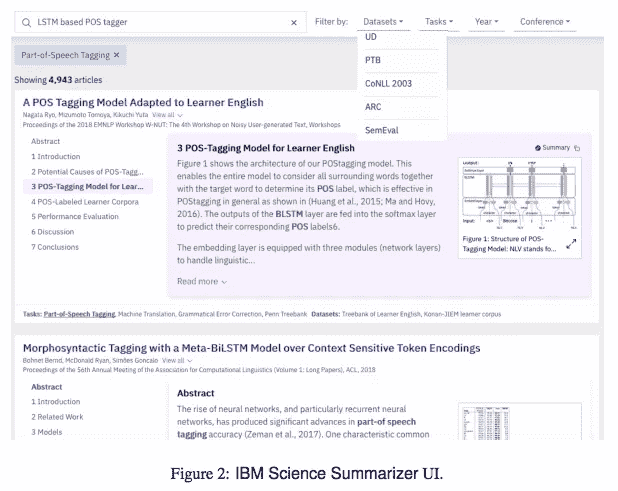
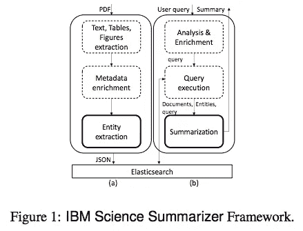
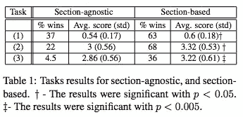

# #NLP365 的第 114 天:NLP 论文摘要——科学文献的摘要系统

> 原文：<https://towardsdatascience.com/day-114-of-nlp365-nlp-papers-summary-a-summarization-system-for-scientific-documents-aebdc6e081f8?source=collection_archive---------40----------------------->

阅读和理解研究论文就像拼凑一个未解之谜。汉斯-彼得·高斯特在 [Unsplash](https://unsplash.com/s/photos/research-papers?utm_source=unsplash&utm_medium=referral&utm_content=creditCopyText) 上拍摄的照片。

## [内线艾](https://medium.com/towards-data-science/inside-ai/home) [NLP365](http://towardsdatascience.com/tagged/nlp365)

## NLP 论文摘要是我总结 NLP 研究论文要点的系列文章

项目#NLP365 (+1)是我在 2020 年每天记录我的 NLP 学习旅程的地方。在这里，你可以随意查看我在过去的 257 天里学到了什么。在本文的最后，你可以找到以前的论文摘要，按自然语言处理领域分类:)

今天的 NLP 论文是 ***一个科学文献的摘要系统*** 。以下是研究论文的要点。

# 目标和贡献

用于总结计算机科学研究论文的 IBM Science Summariser。该系统可以识别不同的场景，例如科学文档的发现、探索和理解。提议的系统以两种方式总结研究论文:自由文本查询或通过选择分类值，如科学任务、数据集等。提议的系统吸收了 270，000 篇论文。

IBM Science Summariser 生成关注用户查询的摘要(以查询为中心的摘要)。它独立地总结了论文的各个部分，允许用户只关注相关的部分。这允许用户的查询和论文中的各种实体之间的交互。

下图展示了 IBM Science Summariser 的用户界面。用户提出他们的查询(或使用元数据字段上的过滤器)。然后，相关论文连同总结结果一起返回。每个部分都清楚地显示，实体精确地突出显示。

IBM Science Summariser 的用户界面[1]

# 科学文章的总结——什么，为什么，如何？

科学论文的摘要系统由什么组成？

1.  提取结构
2.  从 PDF 中提取表格和图表
3.  识别重要的实体
4.  生成有用的摘要

## 为什么需要这样做？

以下是学术研究人员的痛点:

1.  及时了解当前工作
2.  准备研究项目/拨款申请
3.  写论文时准备相关作品
4.  检验一个想法的新颖性

第一个痛点往往发生在每天/每周，信息过载，大量时间花在阅读论文上。难点 2-4 很重要，但不太常见。

## 研究人员如何搜索和阅读研究论文？

1.  研究人员通过关键词、实体(如任务名称、数据集名称或模型等)或引文进行搜索。例如，“班的最先进的结果”
2.  阅读标题->摘要。然而，研究人员提到，摘要的信息量不足以确定相关性

# 系统概况

IBM 科学摘要的总体框架[1]

该系统(如上图)有两个组件:

1.  摄取管道和搜索引擎(Elasticsearch)
2.  总结

## 摄入管道

该系统包含来自 arXiv 和 ACL 的 270，000 篇论文。管道由 3 个主要步骤组成:

1.  提取论文的正文、表格和图表
2.  使用注释和实体丰富元数据
3.  实体提取

该系统使用 Science-Parse 提取 PDF 文本、表格和图表。Science-Parse 支持将图形和表格提取到图像文件(及其标题文本)中。检测文本段落中的图表引用。我们还提取了任务、数据集和指标。输出以 JSON 格式返回。Elasticsearch 用于索引论文，我们索引其标题、摘要文本、章节文本和一些元数据。

该系统有三种类型的实体:任务、数据集和指标。实现了基于字典和基于学习的方法。基于字典的是使用 paperswithcode 网站手工创建的。为了涵盖所有不断发展的主题，我们采用了基于学习的方法来分析整篇论文，以提取三种类型的实体。这被视为一个文本蕴涵任务，其中论文内容是文本和目标任务-数据集-指标(TDM)三元组作为假设。这种方法迫使模型学习文本和三元组之间的相似性模式。总体而言，该系统已经索引了来自整个语料库的 872 个任务、345 个数据集和 62 个指标。

## 总结

摘要可以是通用的，也可以是针对查询的。各节之间的语言可能有很大的不同，因此各节被独立地总结，然后这些基于节的总结被组合在一起成为一个总结。摘要的输入是查询(可选)、实体和搜索引擎返回的相关论文。总结分为多个步骤:

1.  查询处理
2.  预处理
3.  总结

如果给出查询 Q，它可以非常精确，也可以非常详细。如果它简短而精确，我们将使用查询扩展来扩展它，查询扩展将 Q 转换为 100 个单字项(通过分析从 Q 返回的顶级论文获得)。如果 Q 是 verbose，则使用定点加权模式对查询词进行排序。如果没有问题，论文的关键短语被用作查询的代理。

在预处理方面，我们执行句子标记化、单词标记化、小写和停用词的去除。每个句子然后被转换成单字母和双字母 BoW 表示。

在摘要方面，我们使用了 SOTA 无监督的、提取的、查询聚焦的摘要算法。该算法接受论文部分、查询 Q、期望的摘要长度(10 个句子)和一组链接到查询的实体。生成的摘要是通过非监督优化方案从论文部分选择的句子的子集。这句话的选择是提出了一个多标准优化问题，其中几个总结质量目标的考虑。这些汇总质量是:

1.  *查询显著度*。摘要是否包含许多与查询相关的术语(余弦相似度)？
2.  *实体覆盖*。摘要中包含的实体与我们的实体集匹配吗？
3.  *文字报道*。总结涵盖了论文部分的多少内容？
4.  *句子长度*。我们希望摘要偏向于更长的句子，这样会提供更多的信息。

# 人类评估

## 评估设置

我们接触了 12 位作者，请他们评价他们合著的两篇论文的摘要。这样我们总共有 24 篇论文。对于每篇论文，我们生成两种类型的摘要:基于章节的摘要和与章节无关的摘要(将论文内容视为平面文本)。这是为了让我们评估部门总结的好处。这使我们总共有 48 个摘要需要评估。

作者需要对每个摘要执行 3 项任务:

1.  对于每个句子，确定该句子是否应该作为摘要的一部分(精度的二进制度量)
2.  总结中涵盖论文各部分的程度(回忆的衡量标准，1-5 分，3 分为好)
3.  评估摘要的整体质量(1-5 分，3 分为好)

## 结果

结果如下图所示。在任务 2 中，68%的论文以章节为基础的总结得分较高。基于章节的摘要的平均分数是 3.32，这突出了基于章节的摘要的质量。

总结结果——不可知部分与基于部分的对比[1]

# 结论和未来工作

作为未来的工作，IBM Science Summariser 计划增加对更多实体的支持，并吸收更多的论文。正在进行更多的定性研究，以评估其使用情况和摘要质量，包括摘要的自动评价。

## 来源:

[1] Erera，s .，shmu Eli-朔伊尔，m .，Feigenblat，g .，Nakash，O.P .，Boni，o .，Roitman，h .，Cohen，d .，Weiner，b .，Mass，y .，Rivlin，o .和 Lev，g .，2019 .科学文献摘要系统。 *arXiv 预印本 arXiv:1908.11152* 。

*原载于 2020 年 4 月 23 日 https://ryanong.co.uk***。**

# *特征提取/基于特征的情感分析*

*   *[https://towards data science . com/day-102-of-NLP 365-NLP-papers-summary-implicit-and-explicit-aspect-extraction-in-financial-BDF 00 a 66 db 41](/day-102-of-nlp365-nlp-papers-summary-implicit-and-explicit-aspect-extraction-in-financial-bdf00a66db41)*
*   *[https://towards data science . com/day-103-NLP-research-papers-utilizing-Bert-for-aspect-based-sense-analysis-via-construction-38ab 3e 1630 a3](/day-103-nlp-research-papers-utilizing-bert-for-aspect-based-sentiment-analysis-via-constructing-38ab3e1630a3)*
*   *[https://towards data science . com/day-104-of-NLP 365-NLP-papers-summary-senthious-targeted-aspect-based-sensitive-analysis-f 24 a2 EC 1 ca 32](/day-104-of-nlp365-nlp-papers-summary-sentihood-targeted-aspect-based-sentiment-analysis-f24a2ec1ca32)*
*   *[https://towards data science . com/day-105-of-NLP 365-NLP-papers-summary-aspect-level-sensation-class ification-with-3a 3539 be 6 AE 8](/day-105-of-nlp365-nlp-papers-summary-aspect-level-sentiment-classification-with-3a3539be6ae8)*
*   *[https://towards data science . com/day-106-of-NLP 365-NLP-papers-summary-an-unsupervised-neural-attention-model-for-aspect-b 874d 007 b 6d 0](/day-106-of-nlp365-nlp-papers-summary-an-unsupervised-neural-attention-model-for-aspect-b874d007b6d0)*
*   *[https://towardsdatascience . com/day-110-of-NLP 365-NLP-papers-summary-double-embedding-and-CNN-based-sequence-labeling-for-b8a 958 F3 bddd](/day-110-of-nlp365-nlp-papers-summary-double-embeddings-and-cnn-based-sequence-labelling-for-b8a958f3bddd)*
*   *[https://towards data science . com/day-112-of-NLP 365-NLP-papers-summary-a-challenge-dataset-and-effective-models-for-aspect-based-35b 7 a5 e 245 b5](/day-112-of-nlp365-nlp-papers-summary-a-challenge-dataset-and-effective-models-for-aspect-based-35b7a5e245b5)*

# *总结*

*   *[https://towards data science . com/day-107-of-NLP 365-NLP-papers-summary-make-lead-bias-in-your-favor-a-simple-effective-4c 52 B1 a 569 b 8](/day-107-of-nlp365-nlp-papers-summary-make-lead-bias-in-your-favor-a-simple-and-effective-4c52b1a569b8)*
*   *[https://towards data science . com/day-109-of-NLP 365-NLP-papers-summary-studing-summary-evaluation-metrics-in-the-619 F5 acb1b 27](/day-109-of-nlp365-nlp-papers-summary-studying-summarization-evaluation-metrics-in-the-619f5acb1b27)*
*   *[https://towards data science . com/day-113-of-NLP 365-NLP-papers-summary-on-extractive-and-abstract-neural-document-87168 b 7 e 90 BC](/day-113-of-nlp365-nlp-papers-summary-on-extractive-and-abstractive-neural-document-87168b7e90bc)*

# *其他人*

*   *[https://towards data science . com/day-108-of-NLP 365-NLP-papers-summary-simple-Bert-models-for-relation-extraction-and-semantic-98f 7698184 D7](/day-108-of-nlp365-nlp-papers-summary-simple-bert-models-for-relation-extraction-and-semantic-98f7698184d7)*
*   *[https://towards data science . com/day-111-of-NLP 365-NLP-papers-summary-the-risk-of-race-of-bias-in-hate-speech-detection-BFF 7 F5 f 20 ce 5](/day-111-of-nlp365-nlp-papers-summary-the-risk-of-racial-bias-in-hate-speech-detection-bff7f5f20ce5)*