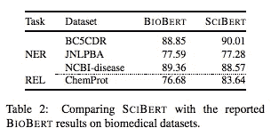
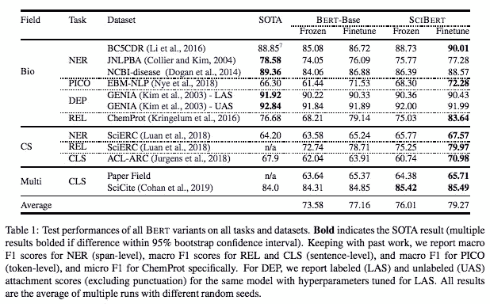

# #NLP365 第 115 天:NLP 论文摘要——sci Bert:科学文本的预训练语言模型

> 原文：<https://towardsdatascience.com/day-115-of-nlp365-nlp-papers-summary-scibert-a-pretrained-language-model-for-scientific-text-185785598e33?source=collection_archive---------53----------------------->

阅读和理解研究论文就像拼凑一个未解之谜。汉斯-彼得·高斯特在 [Unsplash](https://unsplash.com/s/photos/research-papers?utm_source=unsplash&utm_medium=referral&utm_content=creditCopyText) 上拍摄的照片。

## [内线艾](https://medium.com/towards-data-science/inside-ai/home) [NLP365](http://towardsdatascience.com/tagged/nlp365)

## NLP 论文摘要是我总结 NLP 研究论文要点的系列文章

项目#NLP365 (+1)是我在 2020 年每天记录我的 NLP 学习旅程的地方。在这里，你可以随意查看我在过去的 257 天里学到了什么。在本文的最后，你可以找到以前的论文摘要，按自然语言处理领域分类:)

今天的 NLP 论文是 ***SCIBERT:科学文本的预训练语言模型*** 。以下是研究论文的要点。

# 目标和贡献

发布了 SCIBERT，这是一个在多个科学语料库上训练的预训练语言模型，用于执行不同的下游科学 NLP 任务。这些任务包括序列标记、句子分类、依存句法分析等等。在这些下游任务中，SCIBERT 已经取得了新的 SOTA 结果。我们还对微调与特定任务架构的性能、冻结嵌入的效果以及域内词汇的效果进行了广泛的实验。

# 方法学

## 西伯特和伯特有什么不同？

1.  科学词汇
2.  科学团体训练

SCIBERT 基于 BERT 架构。一切都和 BERT 一样，除了它是在科学实验体上预先训练的。BERT 使用 WordPiece 来标记输入文本，并为模型构建词汇表(BASEVOCAB)。词汇表包含最常用的单词/子单词单元。我们使用句子片段库在科学语料库上构建新的单词片段词汇表(SCIVOCAB)。BASEVOCAB 和 SCIVOCAB 之间有 42%的重叠，表明需要新的词汇来处理科学文本。

SCIBERT 接受了语义学者 114 万篇论文的训练。论文的全文被使用，包括摘要。这些论文的平均长度为 154 个句子，句子使用 ScispaCy 拆分。

# 实验装置

## 下游的 NLP 任务是什么？

1.  命名实体识别(NER)
2.  微微萃取
3.  文本分类(CLS)
4.  关系抽取(REL)
5.  依存句法分析(DEP)

PICO 提取是一项序列标记任务，它在描述临床试验论文中的参与者、干预、比较和结果的文本中提取跨度。

## 模型比较

1.  两个基于 BERT 的模型。带 BASEVOCAB 有壳和无壳版本的普通 BERT
2.  四个赛伯特模型。有外壳和无外壳，有 BASEVOCAB 和 SCIVOCAB 两种版本

有套管模型用于 NER，无套管模型用于所有其他任务。

## 微调伯特

我们遵循相同的方法为各种下游任务微调 BERT。对于 CLS 和 REL，我们将[CLS]令牌的最终 BERT 矢量馈入线性层。对于序列标记(NER 和皮科)，我们将每个令牌的最终 BERT 向量送入线性层。对于依赖性分析，我们使用具有依赖性标签和弧嵌入的模型以及 BERT 向量上的双分配矩阵注意力。

## 冻结 BERT 嵌入

我们探索在简单的特定任务模型上使用 BERT 作为预训练的上下文化单词嵌入，以观察它在这些 NLP 任务上的表现。对于文本分类，它是一个具有多层感知器的 2 层 BiLSTM。对于序列标记，它是一个 2 层 BiLSTM 和一个条件随机场(CRF)。对于依赖关系解析，它与上面的两层 BiLSTM 模型相同。

# 结果

结果分为三个部分:生物医学领域，计算机科学领域和多个领域。高水平的结果展示了 SCIBERT 在科学文本上优于 BERT-Base，并在许多下游任务上实现了新 SOTA。

对于生物医学领域，SCIBERT 在所有七个生物医学数据集上都超过了 BERT，在四个数据集上取得了 SOTA 结果，在其他三个数据集上低于 SOTA。在下图中，我们对 SCIBERT 和 BIOBERT(一个更大的模型)进行了直接比较，发现 SCIBERT 在两个数据集上的表现优于 BIOBERT，在另外两个数据集上的表现也有竞争力，如下所示:

SCIBERT 与 BIOBERT 的结果[1]

对于计算机科学和多个领域，SCIBERT 胜过 BERT，并在所有五个数据集上都取得了 SOTA 结果。上面讨论的所有结果如下所示:

基于 BERT 的模型在不同 NLP 任务上的测试性能[1]

结果还展示了在冻结嵌入之上微调 BERT 而非特定任务架构的强大效果。微调的 BERT 始终优于冻结嵌入模型，并且优于大多数具有冻结嵌入的 SCIBERT，除了两个数据集。我们还评估了领域内词汇的重要性，并观察到使用 SCIVOCAB 时 F1 增加了 0.60。改进的幅度表明，尽管领域内词汇是有用的，但它不是关键驱动因素。关键驱动因素是对科学文本的预处理过程。

# 结论和未来工作

除了在一些下游任务上取得 SOTA 成果外，SCIBERT 在生物医学任务上的得分也与 BIOBERT 不相上下。在未来的工作中，我们将发布更大版本的 SCIBERT(匹配 BERT-Large ),并对来自不同领域的论文进行实验，目标是训练一个跨多个领域工作的单一总结模型。

## 来源:

[1] Beltagy，I .，Lo，k .和 Cohan，a .，2019 年。SciBERT:科学文本的预训练语言模型。 *arXiv 预印本 arXiv:1903.10676* 。

*原载于 2020 年 4 月 24 日*[*【https://ryanong.co.uk】*](https://ryanong.co.uk/2020/04/24/day-115-nlp-papers-summary-scibert-a-pretrained-language-model-for-scientific-text/)*。*

# 特征提取/基于特征的情感分析

*   [https://towards data science . com/day-102-of-NLP 365-NLP-papers-summary-implicit-and-explicit-aspect-extraction-in-financial-BDF 00 a 66 db 41](/day-102-of-nlp365-nlp-papers-summary-implicit-and-explicit-aspect-extraction-in-financial-bdf00a66db41)
*   [https://towards data science . com/day-103-NLP-research-papers-utilizing-Bert-for-aspect-based-sense-analysis-via-construction-38ab 3e 1630 a3](/day-103-nlp-research-papers-utilizing-bert-for-aspect-based-sentiment-analysis-via-constructing-38ab3e1630a3)
*   [https://towards data science . com/day-104-of-NLP 365-NLP-papers-summary-senthious-targeted-aspect-based-sensitive-analysis-f 24 a2 EC 1 ca 32](/day-104-of-nlp365-nlp-papers-summary-sentihood-targeted-aspect-based-sentiment-analysis-f24a2ec1ca32)
*   [https://towards data science . com/day-105-of-NLP 365-NLP-papers-summary-aspect-level-sensation-class ification-with-3a 3539 be 6 AE 8](/day-105-of-nlp365-nlp-papers-summary-aspect-level-sentiment-classification-with-3a3539be6ae8)
*   [https://towards data science . com/day-106-of-NLP 365-NLP-papers-summary-an-unsupervised-neural-attention-model-for-aspect-b 874d 007 b 6d 0](/day-106-of-nlp365-nlp-papers-summary-an-unsupervised-neural-attention-model-for-aspect-b874d007b6d0)
*   [https://towards data science . com/day-110-of-NLP 365-NLP-papers-summary-double-embedding-and-CNN-based-sequence-labeling-for-b8a 958 F3 bddd](/day-110-of-nlp365-nlp-papers-summary-double-embeddings-and-cnn-based-sequence-labelling-for-b8a958f3bddd)
*   [https://towards data science . com/day-112-of-NLP 365-NLP-papers-summary-a-challenge-dataset-and-effective-models-for-aspect-based-35b 7 a5 e 245 b5](/day-112-of-nlp365-nlp-papers-summary-a-challenge-dataset-and-effective-models-for-aspect-based-35b7a5e245b5)

# 总结

*   [https://towards data science . com/day-107-of-NLP 365-NLP-papers-summary-make-lead-bias-in-your-favor-a-simple-effective-4c 52 B1 a 569 b 8](/day-107-of-nlp365-nlp-papers-summary-make-lead-bias-in-your-favor-a-simple-and-effective-4c52b1a569b8)
*   [https://towards data science . com/day-109-of-NLP 365-NLP-papers-summary-studing-summary-evaluation-metrics-in-the-619 F5 acb1 b 27](/day-109-of-nlp365-nlp-papers-summary-studying-summarization-evaluation-metrics-in-the-619f5acb1b27)
*   [https://towards data science . com/day-113-of-NLP 365-NLP-papers-summary-on-extractive-and-abstract-neural-document-87168 b 7 e 90 BC](/day-113-of-nlp365-nlp-papers-summary-on-extractive-and-abstractive-neural-document-87168b7e90bc)
*   [https://towardsdatascience . com/day-114-of-NLP 365-NLP-papers-summary-a-summary-system-for-scientific-documents-aeb dc6 e 081 f 8](/day-114-of-nlp365-nlp-papers-summary-a-summarization-system-for-scientific-documents-aebdc6e081f8)

# 其他人

*   [https://towards data science . com/day-108-of-NLP 365-NLP-papers-summary-simple-Bert-models-for-relation-extraction-and-semantic-98f 7698184 D7](/day-108-of-nlp365-nlp-papers-summary-simple-bert-models-for-relation-extraction-and-semantic-98f7698184d7)
*   [https://towards data science . com/day-111-of-NLP 365-NLP-papers-summary-the-risk-of-race-of-bias-in-hate-speech-detection-BFF 7 F5 f 20 ce 5](/day-111-of-nlp365-nlp-papers-summary-the-risk-of-racial-bias-in-hate-speech-detection-bff7f5f20ce5)