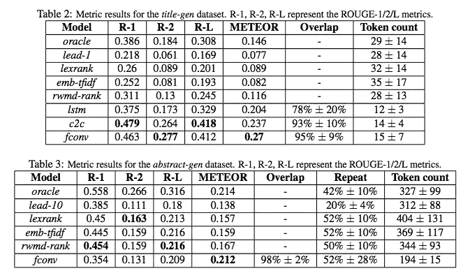
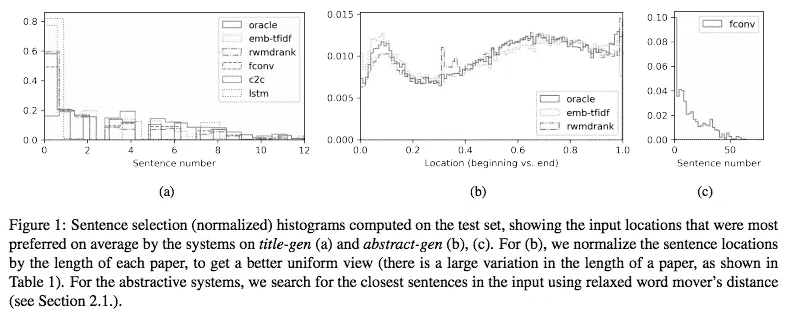
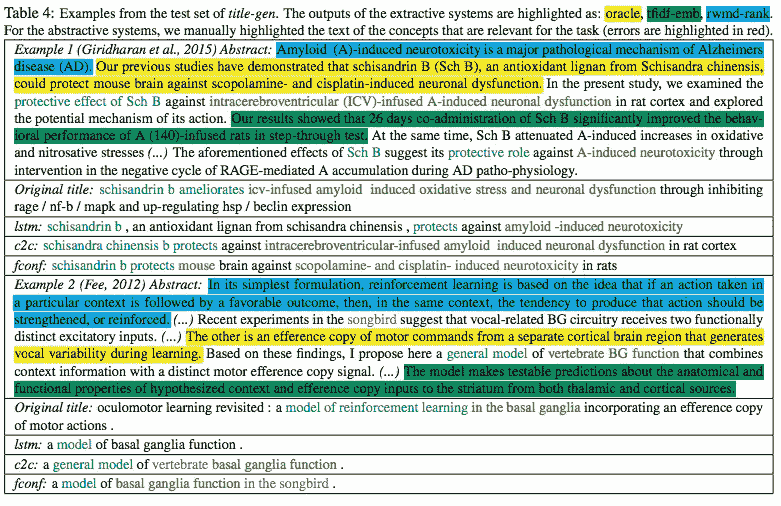

# #NLP365 的第 116 天:NLP 论文摘要——科学论文的数据驱动摘要

> 原文：<https://towardsdatascience.com/day-116-of-nlp365-nlp-papers-summary-data-driven-summarization-of-scientific-articles-3fba016c733b?source=collection_archive---------51----------------------->

阅读和理解研究论文就像拼凑一个未解之谜。汉斯-彼得·高斯特在 [Unsplash](https://unsplash.com/s/photos/research-papers?utm_source=unsplash&utm_medium=referral&utm_content=creditCopyText) 上拍摄的照片。

## [内线艾](https://medium.com/towards-data-science/inside-ai/home) [NLP365](http://towardsdatascience.com/tagged/nlp365)

## NLP 论文摘要是我总结 NLP 研究论文要点的系列文章

项目#NLP365 (+1)是我在 2020 年每天记录我的 NLP 学习旅程的地方。在这里，你可以随意查看我在过去的 257 天里学到了什么。在本文的最后，你可以找到以前的论文摘要，按自然语言处理领域分类:)

今天的 NLP 论文是 ***数据驱动的科学文章摘要*** 。以下是研究论文的要点。

# 目标和贡献

从科学文章中创建了两个多句子摘要数据集:标题-摘要对(title-gen)和摘要-正文对(abstract-gen ),并对其应用了广泛的提取和抽象模型。title-gen 数据集包含 500 万篇生物医学论文，而 abstract-gen 数据集包含 90 万篇论文。分析表明，科学论文适合数据驱动的总结。

## 什么是数据驱动汇总？

这是一种说法，即总结模型的近期 SOTA 结果在很大程度上依赖于大量训练数据。

# 数据集

两个评估数据集是 title-gen 和 abstract-gen。Title-gen 使用 MEDLINE 构建，abstract-gen 使用 PubMed 进行。title-gen 将摘要与论文标题配对，而 abstract-gen 数据集将全文(没有表格和图表)与摘要摘要配对。文本处理管道如下:

1.  符号化和小写
2.  移除 URL
3.  数字被替换为# token
4.  仅包括摘要长度为 150–370 个标记、标题长度为 6–25 个标记和正文长度为 700–10000 个标记的对

我们还计算了每个数据对的重叠分数和重复分数。重叠分数测量摘要(标题或摘要)和输入文本(摘要或全文)之间的重叠标记。重复分数测量文本中每个句子与文本其余部分的平均重叠。这是为了测量存在于论文正文中的重复内容，其中相同的概念被一遍又一遍地重复。下面是两个数据集的统计摘要。

数据集[1]的统计数据

# 实验设置和结果

## 模型比较

1.  *提取总结方法*。这里有两个无监督基线:TFIDF-emb 和 rwmd-rank。TFIDF-emb 通过计算其组成单词嵌入的加权和来创建句子表示。Rwmd-rank 根据句子与文档中所有其他句子的相似程度对句子进行排序。Rwmd 代表宽松单词移动器的距离，它是用于计算相似性的公式，随后使用 LexRank 对句子进行排序。
2.  *抽象总结方法*。这里有三条基线:lstm、fconv 和 c2c。Lstm 是常见的 LSTM 编码器-解码器模型，但是具有单词级的注意机制。Fconv 是一个子字级的 CNN 编码器-解码器，使用字节对编码(BPE)将字分成更小的单元。字符级模型擅长处理罕见/不在词汇表中(OOV)的单词。C2c 是一个字符级的编码器-解码器模型。它使用 CNN 从输入中构建字符表示，并将其送入 LSTM 编码器-解码器模型。

## 结果

评价指标为胭脂评分、流星评分、重叠评分和重复评分。尽管 ROUGE scores 有弱点，但它们在 summarisaiton 中很常见。METEOR 评分用于机器翻译，Overlap 评分可以衡量模型在多大程度上直接从输入文本复制文本作为摘要。重复分数可以衡量摘要中包含重复短语的频率，这是抽象摘要中的一个常见问题。

标题生成和抽象生成数据集的结果[1]

对于 title-gen 结果(表 2)，rwmd-rank 是最好的提取模型，然而，c2c(抽象模型)远远超过所有提取模型，包括 oracle。c2c 和 fconv 都取得了相似的结果，具有相似的高重叠分数。对于抽象基因结果(表 3)，铅-10 是一个强大的基线，只有提取模型设法超过它。所有提取模型获得相似的胭脂分数和相似的重复分数。抽象模型在 ROUGE 评分上表现不佳，但在 METEOR 评分上优于所有模型，因此很难得出结论。

定性评估是常见的，并且在生成的摘要上进行。见下面标题-性别定性评估的例子。观察结果如下:

1.  标题提取模型选择的句子位置变化很大，摘要中的第一句最重要
2.  许多抽象生成的标题往往是高质量的，显示了它们选择重要信息的能力
3.  Lstm 倾向于生成更多的新单词，而 c2c 和 fconv 倾向于从输入文本中复制更多的单词
4.  生成的标题偶尔会出现用词不当的错误，过于笼统，无法抓住论文的要点。这可能会导致事实上的不一致
5.  对于 abstract-gen，看来引言和结论部分与生成摘要最相关。然而，重要的内容分散在各个部分，有时读者更关注方法和结果
6.  fconv 抽象模型的输出质量很差，缺少一致性和内容流。摘要中还存在句子或短语重复的常见问题

句子选择分析[1]

不同模型的定性总结结果[1]

# 结论和未来工作

结果喜忧参半，模型在标题生成方面表现良好，但在抽象生成方面表现不佳。这可以用理解长输入和输出序列的高难度来解释。未来的工作是混合提取-抽象的端到端方法。

## 来源:

[1]n . I . niko lov，m . Pfeiffer 和 r . h . Hahn loser，2018 年。科学论文的数据驱动摘要。 *arXiv 预印本 arXiv:1804.08875* 。

*原载于 2020 年 4 月 25 日*[*【https://ryanong.co.uk】*](https://ryanong.co.uk/2020/04/25/day-116-nlp-papers-summary-data-driven-summarization-of-scientific-articles/)*。*

# 特征提取/基于特征的情感分析

*   [https://towards data science . com/day-102-of-NLP 365-NLP-papers-summary-implicit-and-explicit-aspect-extraction-in-financial-BDF 00 a 66 db 41](/day-102-of-nlp365-nlp-papers-summary-implicit-and-explicit-aspect-extraction-in-financial-bdf00a66db41)
*   [https://towards data science . com/day-103-NLP-research-papers-utilizing-Bert-for-aspect-based-sense-analysis-via-construction-38ab 3e 1630 a3](/day-103-nlp-research-papers-utilizing-bert-for-aspect-based-sentiment-analysis-via-constructing-38ab3e1630a3)
*   [https://towards data science . com/day-104-of-NLP 365-NLP-papers-summary-senthious-targeted-aspect-based-sensitive-analysis-f 24 a2 EC 1 ca 32](/day-104-of-nlp365-nlp-papers-summary-sentihood-targeted-aspect-based-sentiment-analysis-f24a2ec1ca32)
*   [https://towards data science . com/day-105-of-NLP 365-NLP-papers-summary-aspect-level-sensation-class ification-with-3a 3539 be 6 AE 8](/day-105-of-nlp365-nlp-papers-summary-aspect-level-sentiment-classification-with-3a3539be6ae8)
*   [https://towards data science . com/day-106-of-NLP 365-NLP-papers-summary-an-unsupervised-neural-attention-model-for-aspect-b 874d 007 b 6d 0](/day-106-of-nlp365-nlp-papers-summary-an-unsupervised-neural-attention-model-for-aspect-b874d007b6d0)
*   [https://towardsdatascience . com/day-110-of-NLP 365-NLP-papers-summary-double-embedding-and-CNN-based-sequence-labeling-for-b8a 958 F3 bddd](/day-110-of-nlp365-nlp-papers-summary-double-embeddings-and-cnn-based-sequence-labelling-for-b8a958f3bddd)
*   [https://towards data science . com/day-112-of-NLP 365-NLP-papers-summary-a-challenge-dataset-and-effective-models-for-aspect-based-35 B7 a5 e 245 b5](/day-112-of-nlp365-nlp-papers-summary-a-challenge-dataset-and-effective-models-for-aspect-based-35b7a5e245b5)

# 总结

*   [https://towards data science . com/day-107-of-NLP 365-NLP-papers-summary-make-lead-bias-in-your-favor-a-simple-effective-4c 52 B1 a 569 b 8](/day-107-of-nlp365-nlp-papers-summary-make-lead-bias-in-your-favor-a-simple-and-effective-4c52b1a569b8)
*   [https://towards data science . com/day-109-of-NLP 365-NLP-papers-summary-studing-summary-evaluation-metrics-in-the-619 F5 acb1 b 27](/day-109-of-nlp365-nlp-papers-summary-studying-summarization-evaluation-metrics-in-the-619f5acb1b27)
*   [https://towards data science . com/day-113-of-NLP 365-NLP-papers-summary-on-extractive-and-abstract-neural-document-87168 b 7 e 90 BC](/day-113-of-nlp365-nlp-papers-summary-on-extractive-and-abstractive-neural-document-87168b7e90bc)

# 其他人

*   [https://towards data science . com/day-108-of-NLP 365-NLP-papers-summary-simple-Bert-models-for-relation-extraction-and-semantic-98f 7698184 D7](/day-108-of-nlp365-nlp-papers-summary-simple-bert-models-for-relation-extraction-and-semantic-98f7698184d7)
*   [https://towards data science . com/day-111-of-NLP 365-NLP-papers-summary-the-risk-of-race-of-bias-in-hate-speech-detection-BFF 7 F5 f 20 ce 5](/day-111-of-nlp365-nlp-papers-summary-the-risk-of-racial-bias-in-hate-speech-detection-bff7f5f20ce5)
*   [https://towards data science . com/day-115-of-NLP 365-NLP-papers-summary-scibert-a-pre trained-language-model-for-scientific-text-185785598 e33](/day-115-of-nlp365-nlp-papers-summary-scibert-a-pretrained-language-model-for-scientific-text-185785598e33)