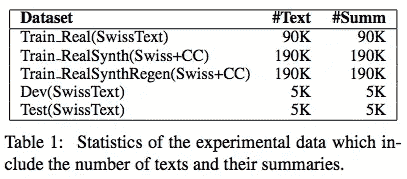
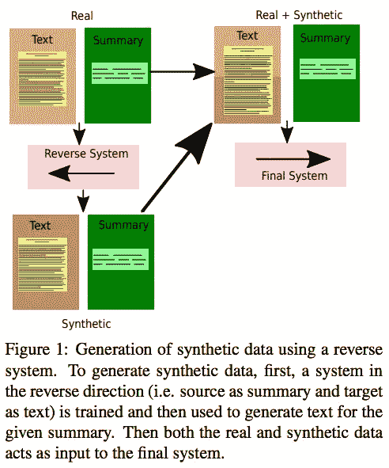
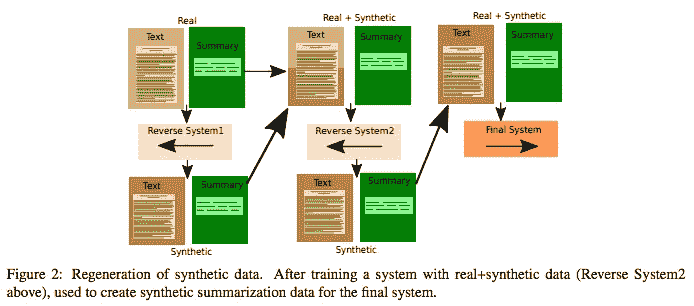
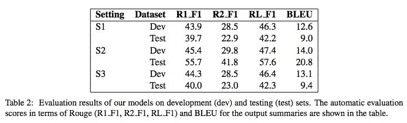
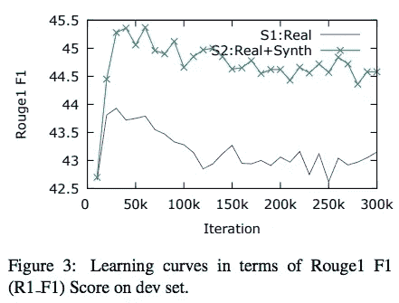

# #NLP365 的第 117 天:NLP 论文摘要-摘要文本摘要:低资源挑战

> 原文：<https://towardsdatascience.com/day-117-of-nlp365-nlp-papers-summary-abstract-text-summarization-a-low-resource-challenge-61ae6cdf32f?source=collection_archive---------73----------------------->

阅读和理解研究论文就像拼凑一个未解之谜。汉斯-彼得·高斯特在 [Unsplash](https://unsplash.com/s/photos/research-papers?utm_source=unsplash&utm_medium=referral&utm_content=creditCopyText) 上拍摄的照片。

## [内线艾](https://medium.com/towards-data-science/inside-ai/home) [NLP365](http://towardsdatascience.com/tagged/nlp365)

## NLP 论文摘要是我总结 NLP 研究论文要点的系列文章

项目#NLP365 (+1)是我在 2020 年每天记录我的 NLP 学习旅程的地方。在这里，你可以随意查看我在过去的 257 天里学到了什么。在本文的最后，你可以找到以前的论文摘要，按自然语言处理领域分类:)

今天的 NLP 论文是 ***摘要文本摘要:低资源挑战*** 。以下是研究论文的要点。

# 目标和贡献

提出了一种迭代数据扩充技术，使用真实的德语汇总数据生成合成数据。随后，他们使用 Transformer 为德语建立了一个抽象概括模型。本文解决了其他非英语语言的 NLP 任务中存在的低资源挑战。当与没有数据扩充而训练的模型相比时，数据扩充提高了抽象概括模型的性能。

# 方法学

数据集的统计数据[1]

转换器模型是使用 OpenNMT-py 实现的。上图展示了我们数据集汇总统计数据。我们使用了两个德国维基数据集，即 SwissText 2019 和 Common Crawl。SwissText 2019 用作真实数据，而 Common Crawl 用作合成数据。真实数据 SwissText 2019 (100K 数据)分为 train、val、test 比例为 90:5:5。对于通用爬网，以下是生成合成数据的以下步骤:

1.  使用 SwissText 数据集构建最常用德语词汇
2.  基于词汇和阈值的通用爬行数据集中的句子选择。例如，一个句子有 20 个单词，阈值是 10%，只有当它在我们的词汇表中至少有 20 个单词时，才会被选择
3.  从步骤 2 中随机选择句子
4.  100K 个选择的句子被用作摘要，我们需要建立一个模型来生成相应的输入文本。因此，我们使用摘要作为输入，目标是文本。这是反向训练的模型，如下所示。最终的总数据集为 190K

使用逆向系统生成合成数据[1]

最后，为了提高合成数据的质量，我们使用了如下所示的迭代方法。我们将首先使用真实的和合成的数据来训练我们的变压器模型。然后，我们将使用经过训练的变压器模型来重新生成我们的合成数据，以训练我们的最终变压器模型。

合成数据再生的最终过程[1]

# 实验设置和结果

有如下三种实验设置:

1.  *S1* 。仅使用真实数据(90K)来训练我们的变压器模型。这是基线
2.  *S2* 。使用真实和合成数据(190K)训练我们的变压器模型
3.  *S3* 。使用真实的和再生的合成数据来训练我们的变压器模型

## 结果

开发和测试集的结果[1]

尽管努力提高 S3 合成数据的质量，S2 模型表现最好。如下图所示，ROUGE score 的开发在早期迭代中达到了顶峰，展示了通过更快的训练过程可以达到良好的结果。与 S1 相比，S2 模型在单词和短语生成以及摘要长度方面往往有更多的差异。S2 的平均摘要长度是 41.42，而 S1 是 39.81。

ROUGE-1 学习曲线[1]

# 结论和未来工作

潜在的未来工作可能涉及对合成摘要数据的进一步调查，并利用迁移学习对具有低资源数据的非英语语言进行文本摘要。

## 来源:

[1]帕里达，s .和莫特利切克，p . 2019，11 月。低资源挑战。在*2019 自然语言处理经验方法会议暨第九届国际自然语言处理联合会议(EMNLP-IJCNLP)* (第 5996–6000 页)。

*原载于 2020 年 4 月 26 日 https://ryanong.co.uk**的* [*。*](https://ryanong.co.uk/2020/04/26/day-117-nlp-papers-summary-abstract-text-summarization-a-low-resource-challenge/)

# 特征提取/基于特征的情感分析

*   [https://towards data science . com/day-102-of-NLP 365-NLP-papers-summary-implicit-and-explicit-aspect-extraction-in-financial-BDF 00 a 66 db 41](/day-102-of-nlp365-nlp-papers-summary-implicit-and-explicit-aspect-extraction-in-financial-bdf00a66db41)
*   [https://towards data science . com/day-103-NLP-research-papers-utilizing-Bert-for-aspect-based-sensation-analysis-via-construction-38ab 3e 1630 a3](/day-103-nlp-research-papers-utilizing-bert-for-aspect-based-sentiment-analysis-via-constructing-38ab3e1630a3)
*   [https://towards data science . com/day-104-of-NLP 365-NLP-papers-summary-senthious-targeted-aspect-based-sensitive-analysis-f 24 a2 EC 1 ca 32](/day-104-of-nlp365-nlp-papers-summary-sentihood-targeted-aspect-based-sentiment-analysis-f24a2ec1ca32)
*   [https://towards data science . com/day-105-of-NLP 365-NLP-papers-summary-aspect-level-sensation-class ification-with-3a 3539 be 6 AE 8](/day-105-of-nlp365-nlp-papers-summary-aspect-level-sentiment-classification-with-3a3539be6ae8)
*   [https://towardsdatascience . com/day-106-of-NLP 365-NLP-papers-summary-an-unsupervised-neural-attention-model-for-aspect-b 874d 007 b 6d 0](/day-106-of-nlp365-nlp-papers-summary-an-unsupervised-neural-attention-model-for-aspect-b874d007b6d0)
*   [https://towardsdatascience . com/day-110-of-NLP 365-NLP-papers-summary-double-embedding-and-CNN-based-sequence-labeling-for-b8a 958 F3 bddd](/day-110-of-nlp365-nlp-papers-summary-double-embeddings-and-cnn-based-sequence-labelling-for-b8a958f3bddd)
*   [https://towards data science . com/day-112-of-NLP 365-NLP-papers-summary-a-challenge-dataset-and-effective-models-for-aspect-based-35b 7 a5 e 245 b5](/day-112-of-nlp365-nlp-papers-summary-a-challenge-dataset-and-effective-models-for-aspect-based-35b7a5e245b5)

# 总结

*   [https://towards data science . com/day-107-of-NLP 365-NLP-papers-summary-make-lead-bias-in-your-favor-a-simple-effective-4c 52 B1 a 569 b 8](/day-107-of-nlp365-nlp-papers-summary-make-lead-bias-in-your-favor-a-simple-and-effective-4c52b1a569b8)
*   [https://towards data science . com/day-109-of-NLP 365-NLP-papers-summary-studing-summary-evaluation-metrics-in-the-619 F5 acb1 b 27](/day-109-of-nlp365-nlp-papers-summary-studying-summarization-evaluation-metrics-in-the-619f5acb1b27)
*   [https://towards data science . com/day-113-of-NLP 365-NLP-papers-summary-on-extractive-and-abstract-neural-document-87168 b 7 e 90 BC](/day-113-of-nlp365-nlp-papers-summary-on-extractive-and-abstractive-neural-document-87168b7e90bc)
*   [https://towards data science . com/day-116-of-NLP 365-NLP-papers-summary-data-driven-summary-of-scientific-articles-3 FBA 016 c 733 b](/day-116-of-nlp365-nlp-papers-summary-data-driven-summarization-of-scientific-articles-3fba016c733b)

# 其他人

*   [https://towards data science . com/day-108-of-NLP 365-NLP-papers-summary-simple-Bert-models-for-relation-extraction-and-semantic-98f 7698184 D7](/day-108-of-nlp365-nlp-papers-summary-simple-bert-models-for-relation-extraction-and-semantic-98f7698184d7)
*   [https://towards data science . com/day-111-of-NLP 365-NLP-papers-summary-the-risk-of-race-of-bias-in-hate-speech-detection-BFF 7 F5 f 20 ce 5](/day-111-of-nlp365-nlp-papers-summary-the-risk-of-racial-bias-in-hate-speech-detection-bff7f5f20ce5)
*   [https://towards data science . com/day-115-of-NLP 365-NLP-papers-summary-scibert-a-pre trained-language-model-for-scientific-text-185785598 e33](/day-115-of-nlp365-nlp-papers-summary-scibert-a-pretrained-language-model-for-scientific-text-185785598e33)