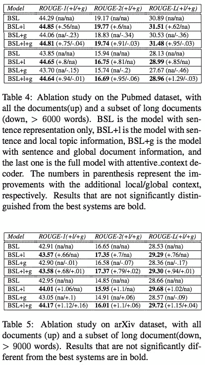

# #NLP365 的第 118 天:NLP 论文摘要——通过结合全球和本地上下文对长文档进行摘要

> 原文：<https://towardsdatascience.com/day-118-of-nlp365-nlp-papers-summary-extractive-summarization-of-long-documents-by-combining-aea118a5eb3f?source=collection_archive---------64----------------------->

阅读和理解研究论文就像拼凑一个未解之谜。汉斯-彼得·高斯特在 [Unsplash](https://unsplash.com/s/photos/research-papers?utm_source=unsplash&utm_medium=referral&utm_content=creditCopyText) 上拍摄的照片。

## [内线艾](https://medium.com/towards-data-science/inside-ai/home) [NLP365](http://towardsdatascience.com/tagged/nlp365)

## NLP 论文摘要是我总结 NLP 研究论文要点的系列文章

项目#NLP365 (+1)是我在 2020 年每天记录我的 NLP 学习旅程的地方。在这里，你可以随意查看我在过去的 262 天里学到了什么。在本文的最后，你可以找到以前的论文摘要，按自然语言处理领域分类:)

今天的 NLP 论文是 ***结合全局和局部上下文*** 对长文档的抽取摘要。以下是研究论文的要点。

# 目标和贡献

提出了一种新颖的摘要模型，它结合了全球和本地上下文来总结一个长文档。在给定的长文档中，它通常包含各种主题。我们相信使用这些主题来指导总结会有所改进。我们利用全局上下文(整个文档)和局部上下文(部分)来确定一个句子的信息是否足以包含在摘要中。这些贡献如下:

1.  首次使用 LSTM 减号进行文本摘要
2.  该模型在 ArXiv 和 PubMed 数据集上取得了 SOTA 结果，并显示出随着文档长度的增加，性能有所提高
3.  发现模型的性能可以主要归因于局部情境的建模

# 方法学

整体模型架构[1]

该架构由三个组件组成:

1.  句子编码器
2.  文件编码器
3.  句子分类器

## 句子编码器

要计算句子嵌入，我们只需使用平均单词嵌入的简单方法。在计算句子嵌入时，这已经被证明和 RNN 和 CNN 一样有效。BERT 句子嵌入表现不佳。

## 文件编码器

文档编码器是一个 biGRU，这意味着每个句子有两个隐藏状态，一个向前的(黄色)和一个向后的隐藏状态(蓝色)。该文档编码器创建三个输出:

1.  句子表征
2.  文档表示
3.  主题片段表示

对于每个句子，句子表示将简单地是向前和向后隐藏状态的连接。对于文档表示，它将是向前和向后隐藏状态的最终状态的串联(红色)。对于主题片段表示，我们使用 LSTM-负。LSTM 减用于学习文本跨度嵌入。它最初是为依存句法分析而提出的，在依存句法分析中，一个句子被分成三个部分(前缀、中缀和后缀), LSTM-负号用于为每个部分创建嵌入。它的工作原理如下:

1.  对整个句子应用 LSTM，以获得句子中每个单词的隐藏状态
2.  要为每个段(从单词 I 到单词 j)创建嵌入，请计算隐藏状态 I 和隐藏状态 j 之间的差异。这背后的想法是，给定自然 LSTM，每个隐藏状态包含来自先前隐藏状态加上当前单词的信息，这允许模型使用段外部和内部的信息来创建段嵌入
3.  最终的主题表示是向前和向后片段嵌入的连接(上图中 C 的细节)

## 句子分类器

有了句子和文档编码器，我们现在有了句子表示、文档表示和主题段表示。这三种表示被输入到多层感知器(MLP)中，以预测该句子是否应该包括在摘要中。已经探索了结合这三种表示的两种方法:

1.  *串联*。简单地将所有三个表示连接在一起，形成最终的表示
2.  *细心语境*。这是我们计算每个句子的加权上下文向量的地方，允许模型学习在文档和主题段表示上关注多少权重。这个加权的上下文向量与相应的句子表示连接，并被馈送到具有 sigmoid 激活函数的 MLP 中，以确定该句子是否应该被包括在摘要中

# 实验设置和结果

有两个评估数据集:arXiv 和 PubMed。我们将使用 ROUGE 和 METEOR 作为自动评估指标，将我们的模型与之前的抽象和抽取模型进行比较。

## 模型比较

用于比较的模型分为不同的类别:

1.  *传统提取模式*。SumBasic、LSA 和 LexRank
2.  *神经抽象模型*。注意序列、指针生成器网络和话语意识
3.  *神经提取模型*。程&拉帕塔和 SummaRuNNer
4.  *基线、销售线索和预测*。基线仅是 MLP 的 feed 句子表示(没有本地或全局上下文)，lead 是前 k 个单词，oracle 使用地面实况提取标签来测量模型性能的上限

## 结果

arXiv 和 Pubmed 数据集上模型的总体结果[1]

ROUGE-1 和 ROUGE-2 用于测量摘要的信息量，而 ROUGE-1 用于测量摘要的流畅性。表 2 展示了 ArXiv 数据集上的结果，表 3 展示了 PubMed 数据集上的结果。正如预期的那样，在 ROUGE-1 和 ROUGE-2 中，神经提取模型远远超过了传统提取模型和神经提取模型。ROUGE-L 上的结果是混合的，这可能是因为我们的模型是在 ROUGE-1 地面真实提取标签上训练的。话语感知抽象模型优于 ROUGE-L 中的所有提取模型，这可能是因为它们是直接在抽象摘要上训练的。低铅结果表明，科学论文中不存在像新闻文章中那样的句子位置偏差，尽管科学论文中可能存在其他位置偏差，这可能是未来的潜在工作。

我们的模型在所有评估指标上都优于所有其他提取模型。我们的模型相对于基线模型的性能提升证明了包含本地和全球背景的好处。我们方法的目标是有效地处理长文档的摘要。下图显示了随着文档长度的增加，我们的模型与当前的 SOTA 模型相比有了很好的性能提升。

Pubmed 和 arXiv 数据集上增加文档长度的模型结果[1]

## 消融研究

消融研究旨在研究将全球和本地背景纳入我们的总结方法的效果，并评估哪一个对整体绩效贡献更大。从下面的结果来看，似乎本地主题上下文极大地提高了模型的整体性能。相比之下，纳入全球背景似乎没有太大好处。这样做的原因留待今后的工作。

消融研究的结果[1]

# 结论和未来工作

未来潜在的工作将是研究处理冗余的方法。我们还可以将特征工程(例如句子位置、显著性)等传统方法集成到我们的神经模型中。此外，我们可以研究一种更好的表示文档的结构，如话语树。对总结的评价一直是总结中的一个大问题。ROUGE scores 并不像评估指标那样可靠，因此在未来引入人工评估将是一件好事。最后，提取和抽象总结方法的整合值得在未来探索。

[1]肖，w .和卡雷尼尼，g . 2019 .结合全局和局部上下文的长文档文摘。 *arXiv 预印本 arXiv:1909.08089* 。

*原载于 2020 年 4 月 27 日 https://ryanong.co.uk***。**

# *特征提取/基于特征的情感分析*

*   *[https://towards data science . com/day-102-of-NLP 365-NLP-papers-summary-implicit-and-explicit-aspect-extraction-in-financial-BDF 00 a 66 db 41](/day-102-of-nlp365-nlp-papers-summary-implicit-and-explicit-aspect-extraction-in-financial-bdf00a66db41)*
*   *[https://towards data science . com/day-103-NLP-research-papers-utilizing-Bert-for-aspect-based-sense-analysis-via-construction-38ab 3e 1630 a3](/day-103-nlp-research-papers-utilizing-bert-for-aspect-based-sentiment-analysis-via-constructing-38ab3e1630a3)*
*   *[https://towards data science . com/day-104-of-NLP 365-NLP-papers-summary-senthious-targeted-aspect-based-sensitive-analysis-f 24 a2 EC 1 ca 32](/day-104-of-nlp365-nlp-papers-summary-sentihood-targeted-aspect-based-sentiment-analysis-f24a2ec1ca32)*
*   *[https://towards data science . com/day-105-of-NLP 365-NLP-papers-summary-aspect-level-sensation-class ification-with-3a 3539 be 6 AE 8](/day-105-of-nlp365-nlp-papers-summary-aspect-level-sentiment-classification-with-3a3539be6ae8)*
*   *[https://towards data science . com/day-106-of-NLP 365-NLP-papers-summary-an-unsupervised-neural-attention-model-for-aspect-b 874d 007 b 6d 0](/day-106-of-nlp365-nlp-papers-summary-an-unsupervised-neural-attention-model-for-aspect-b874d007b6d0)*
*   *[https://towardsdatascience . com/day-110-of-NLP 365-NLP-papers-summary-double-embedding-and-CNN-based-sequence-labeling-for-b8a 958 F3 bddd](/day-110-of-nlp365-nlp-papers-summary-double-embeddings-and-cnn-based-sequence-labelling-for-b8a958f3bddd)*
*   *[https://towards data science . com/day-112-of-NLP 365-NLP-papers-summary-a-challenge-dataset-and-effective-models-for-aspect-based-35b 7 a5 e 245 b5](/day-112-of-nlp365-nlp-papers-summary-a-challenge-dataset-and-effective-models-for-aspect-based-35b7a5e245b5)*

# *总结*

*   *[https://towards data science . com/day-107-of-NLP 365-NLP-papers-summary-make-lead-bias-in-your-favor-a-simple-effective-4c 52 B1 a 569 b 8](/day-107-of-nlp365-nlp-papers-summary-make-lead-bias-in-your-favor-a-simple-and-effective-4c52b1a569b8)*
*   *[https://towards data science . com/day-109-of-NLP 365-NLP-papers-summary-studing-summary-evaluation-metrics-in-the-619 F5 acb1b 27](/day-109-of-nlp365-nlp-papers-summary-studying-summarization-evaluation-metrics-in-the-619f5acb1b27)*
*   *[https://towards data science . com/day-113-of-NLP 365-NLP-papers-summary-on-extractive-and-abstract-neural-document-87168 b 7 e 90 BC](/day-113-of-nlp365-nlp-papers-summary-on-extractive-and-abstractive-neural-document-87168b7e90bc)*
*   *[https://towards data science . com/day-116-of-NLP 365-NLP-papers-summary-data-driven-summary-of-scientific-articles-3 FBA 016 c 733 b](/day-116-of-nlp365-nlp-papers-summary-data-driven-summarization-of-scientific-articles-3fba016c733b)*
*   *[https://towards data science . com/day-117-of-NLP 365-NLP-papers-summary-abstract-text-summary-a-low-resource-challenge-61 AE 6 CDF 32 f](/day-117-of-nlp365-nlp-papers-summary-abstract-text-summarization-a-low-resource-challenge-61ae6cdf32f)*

# *其他人*

*   *[https://towards data science . com/day-108-of-NLP 365-NLP-papers-summary-simple-Bert-models-for-relation-extraction-and-semantic-98f 7698184 D7](/day-108-of-nlp365-nlp-papers-summary-simple-bert-models-for-relation-extraction-and-semantic-98f7698184d7)*
*   *[https://towards data science . com/day-111-of-NLP 365-NLP-papers-summary-the-risk-of-race-of-bias-in-hate-speech-detection-BFF 7 F5 f 20 ce 5](/day-111-of-nlp365-nlp-papers-summary-the-risk-of-racial-bias-in-hate-speech-detection-bff7f5f20ce5)*
*   *[https://towards data science . com/day-115-of-NLP 365-NLP-papers-summary-scibert-a-pre trained-language-model-for-scientific-text-185785598 e33](/day-115-of-nlp365-nlp-papers-summary-scibert-a-pretrained-language-model-for-scientific-text-185785598e33)*