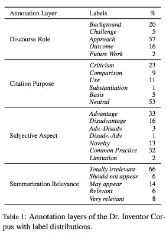
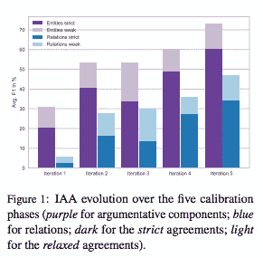
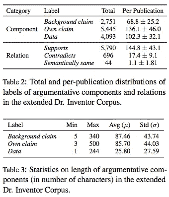
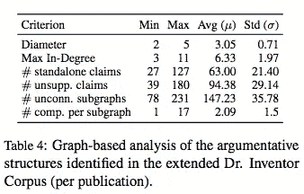
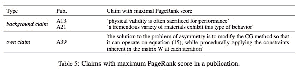
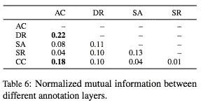

# #NLP365 的第 119 天:NLP 论文摘要——科学出版物的论据注释文集

> 原文：<https://towardsdatascience.com/day-119-nlp-papers-summary-an-argument-annotated-corpus-of-scientific-publications-d7b9e2ea1097?source=collection_archive---------48----------------------->

阅读和理解研究论文就像拼凑一个未解之谜。汉斯-彼得·高斯特在 [Unsplash](https://unsplash.com/s/photos/research-papers?utm_source=unsplash&utm_medium=referral&utm_content=creditCopyText) 上拍摄的照片。

## [内线艾](https://medium.com/towards-data-science/inside-ai/home) [NLP365](http://towardsdatascience.com/tagged/nlp365)

## NLP 论文摘要是我总结 NLP 研究论文要点的系列文章

项目#NLP365 (+1)是我在 2020 年每天记录我的 NLP 学习旅程的地方。在这里，你可以随意查看我在过去的 262 天里学到了什么。在本文的最后，你可以找到以前的论文摘要，按自然语言处理领域分类:)

今天的 NLP 论文是 ***一个带论据注释的科学出版物语料库*** 。以下是研究论文的要点。

# 目标和贡献

使用论证组件和关系注释扩展了 Dr. Inventor 语料库，并进行了注释研究。这里的目标是理解科学文本中的不同论点，以及它们是如何联系在一起的。我们对带注释的论证进行了分析，并探索了存在于科学写作中的论证之间的关系。这些贡献如下:

1.  为涵盖不同研究领域的科技文本提出了一个通用的议论文注释方案
2.  具有论证组件和关系注释的扩展的 Dr. Inventor 语料库
3.  对语料库进行了信息论分析

# 注释方案

有许多论证的理论框架，我们最初使用图尔敏模型，因为它简单并且与人工智能和论证挖掘相关。图尔敏模式有 6 种论证成分:主张、数据、保证、支持、限定和反驳。然而，在最初的注释之后，我们意识到并不是所有的组件都存在。因此，我们将注释方案简化为以下三个论证部分:

1.  *自己的主张*。与作者作品相关的论证性陈述
2.  *背景权利要求*。与作者作品相关的论述性陈述
3.  *数据组件*。支持或反对某一主张的事实。这包括参考资料和带有例子的事实

有了这些论证成分集，我们引入了以下三种关系类型:

1.  *支撑*。如果一个组件的实际准确性随着另一个组件的增加而增加，则这种关系在两个组件之间成立
2.  *与*相矛盾。如果一个组件的实际准确性随着另一个组件而降低，则这种关系在两个组件之间成立
3.  *语义相同*。这种关系捕获语义相同的声明或数据组件。这类似于自变量共指和/或事件共指

# 注释研究

我们对 Dr. Inventor 语料库进行了注释研究，并扩展了数据集。Dr. Inventor 语料库有四层带有子标签的修辞注释，如下所示:

1.  话语角色
2.  引用目的
3.  主观方面
4.  总结相关性

4 个不同的注释层[1]

注释过程由一名专家和三名非专家注释者组成。注释者在校准阶段接受培训，所有注释者一起注释一个出版物。我们为每次迭代计算注释者间的一致(IAA ),并讨论任何分歧。下图展示了跨 5 次迭代的 IAA 分数进展。有严格和软弱两个版本。严格版本要求实体在跨度和类型上完全匹配，关系在组件、方向和关系类型上完全匹配。弱版本要求类型匹配，范围重叠。协议(IAA)如预期的那样随着迭代而增加。此外，关系上的一致程度较低，因为这通常更加主观，更不用说关系上的一致会受到组件上的一致的影响。

注释者间协议(IAA) [1]

# 语料库分析

## 辩论注释分析

表 2 展示了在 Dr. Inventor 语料库中每个论证成分和关系的汇总统计。大约有。自有主张的数量是背景主张的 2 倍，这是意料之中的，因为语料库由原创研究论文组成。此外，数据组件只有索赔的一半多。这可能是因为并非所有索赔都得到支持，或者索赔可以得到其他索赔的支持。自然，有许多支持关系，因为作者倾向于通过用数据组件或其他声明来支持它来加强他们的声明。表 3 展示了论证部分的长度。自有和背景索赔的长度相似，而数据部分的长度是一半。这可以归因于这样一个事实，即在计算机科学中，解释往往是简短的，而且大多数情况下，作者只会参考表格和数字来支持。

发明家博士语料库统计[1]

科学论文的论证结构遵循有向无环图(DAG ),其中论证部分是节点，边是关系。下面的表 4 展示了科学论文论证结构的 DAG 的图形分析。有 27 件独立索赔和 39 件无证据的索赔。最大入度显示了节点之间的最大连接数。平均 6 个告诉我们，有许多索赔提供了强有力的支持证据。我们还运行了 PageRank 算法来识别最重要的声明，并在表 5 中列出了一些示例。结果显示，大多数排名最高的索赔来自背景索赔，告诉我们，在计算机图形学论文中，他们倾向于把更多的重点放在他们的工作动机的研究差距，而不是实证结果。

左图:基于图表的论证结构分析|右图:主张类型的示例以及与这些主张相关的句子[1]

## 与其他修辞方面的联系

我们的新论证组件与 Inventor 博士语料库中的现有注释有多好的联系？在下面的表 6 中，我们展示了归一化互信息(NMI ),它测量五个标注层之间的共享信息量。我们展示了所有注释对的 NMI 分数:

1.  变元组件(AC)
2.  话语角色
3.  主观方面
4.  相关概述
5.  引用上下文(CC)

标准化互信息(NMI) [1]

AC 和 DR 之间有一个很强的 NMI 分数，这是有意义的，因为背景声明可能会在话语角色背景部分找到。另一个高 NMI 得分介于 AC 和 CC 之间。这是有意义的，因为在背景技术权利要求中经常引用引文。

# 结论和未来工作

我们创建了第一个带论证注释的科学论文语料库，并提供了语料库和论证分析的关键摘要统计数据。潜在的未来工作可能涉及扩展其他领域论文的语料库，并进一步开发分析科学写作的模型。

## 来源:

[1]劳舍尔，a .，格拉瓦什，g .和庞泽托，S.P .，2018 年 11 月。附有论证注释的科学出版物文集。在*关于论点挖掘的第五次研讨会的会议录*(第 40-46 页)。

*原载于 2020 年 4 月 28 日*[*【https://ryanong.co.uk】*](https://ryanong.co.uk/2020/04/28/day-119-nlp-papers-summary-an-argument-annotated-corpus-of-scientific-publications/)*。*

# 特征提取/基于特征的情感分析

*   [https://towards data science . com/day-102-of-NLP 365-NLP-papers-summary-implicit-and-explicit-aspect-extraction-in-financial-BDF 00 a 66 db 41](/day-102-of-nlp365-nlp-papers-summary-implicit-and-explicit-aspect-extraction-in-financial-bdf00a66db41)
*   [https://towards data science . com/day-103-NLP-research-papers-utilizing-Bert-for-aspect-based-sensation-analysis-via-construction-38ab 3e 1630 a3](/day-103-nlp-research-papers-utilizing-bert-for-aspect-based-sentiment-analysis-via-constructing-38ab3e1630a3)
*   [https://towards data science . com/day-104-of-NLP 365-NLP-papers-summary-senthious-targeted-aspect-based-sensitive-analysis-f 24 a2 EC 1 ca 32](/day-104-of-nlp365-nlp-papers-summary-sentihood-targeted-aspect-based-sentiment-analysis-f24a2ec1ca32)
*   [https://towards data science . com/day-105-of-NLP 365-NLP-papers-summary-aspect-level-sensation-class ification-with-3a 3539 be 6 AE 8](/day-105-of-nlp365-nlp-papers-summary-aspect-level-sentiment-classification-with-3a3539be6ae8)
*   [https://towardsdatascience . com/day-106-of-NLP 365-NLP-papers-summary-an-unsupervised-neural-attention-model-for-aspect-b 874d 007 b 6d 0](/day-106-of-nlp365-nlp-papers-summary-an-unsupervised-neural-attention-model-for-aspect-b874d007b6d0)
*   [https://towardsdatascience . com/day-110-of-NLP 365-NLP-papers-summary-double-embedding-and-CNN-based-sequence-labeling-for-b8a 958 F3 bddd](/day-110-of-nlp365-nlp-papers-summary-double-embeddings-and-cnn-based-sequence-labelling-for-b8a958f3bddd)
*   [https://towards data science . com/day-112-of-NLP 365-NLP-papers-summary-a-challenge-dataset-and-effective-models-for-aspect-based-35b 7 a5 e 245 b5](/day-112-of-nlp365-nlp-papers-summary-a-challenge-dataset-and-effective-models-for-aspect-based-35b7a5e245b5)

# 总结

*   [https://towards data science . com/day-107-of-NLP 365-NLP-papers-summary-make-lead-bias-in-your-favor-a-simple-effective-4c 52 B1 a 569 b 8](/day-107-of-nlp365-nlp-papers-summary-make-lead-bias-in-your-favor-a-simple-and-effective-4c52b1a569b8)
*   [https://towards data science . com/day-109-of-NLP 365-NLP-papers-summary-studing-summary-evaluation-metrics-in-the-619 F5 acb1 b 27](/day-109-of-nlp365-nlp-papers-summary-studying-summarization-evaluation-metrics-in-the-619f5acb1b27)
*   [https://towards data science . com/day-113-of-NLP 365-NLP-papers-summary-on-extractive-and-abstract-neural-document-87168 b 7 e 90 BC](/day-113-of-nlp365-nlp-papers-summary-on-extractive-and-abstractive-neural-document-87168b7e90bc)
*   [https://towards data science . com/day-116-of-NLP 365-NLP-papers-summary-data-driven-summary-of-scientific-articles-3 FBA 016 c 733 b](/day-116-of-nlp365-nlp-papers-summary-data-driven-summarization-of-scientific-articles-3fba016c733b)
*   [https://towards data science . com/day-117-of-NLP 365-NLP-papers-summary-abstract-text-summary-a-low-resource-challenge-61a E6 CDF 32 f](/day-117-of-nlp365-nlp-papers-summary-abstract-text-summarization-a-low-resource-challenge-61ae6cdf32f)
*   [https://towards data science . com/day-118-of-NLP 365-NLP-papers-summary-extractive-summary-of-long-documents-by-combining-AEA 118 a5 eb3f](/day-118-of-nlp365-nlp-papers-summary-extractive-summarization-of-long-documents-by-combining-aea118a5eb3f)

# 其他人

*   [https://towards data science . com/day-108-of-NLP 365-NLP-papers-summary-simple-Bert-models-for-relation-extraction-and-semantic-98f 7698184 D7](/day-108-of-nlp365-nlp-papers-summary-simple-bert-models-for-relation-extraction-and-semantic-98f7698184d7)
*   [https://towards data science . com/day-111-of-NLP 365-NLP-papers-summary-the-risk-of-race-of-bias-in-hate-speech-detection-BFF 7 F5 f 20 ce 5](/day-111-of-nlp365-nlp-papers-summary-the-risk-of-racial-bias-in-hate-speech-detection-bff7f5f20ce5)
*   [https://towards data science . com/day-115-of-NLP 365-NLP-papers-summary-scibert-a-pre trained-language-model-for-scientific-text-185785598 e33](/day-115-of-nlp365-nlp-papers-summary-scibert-a-pretrained-language-model-for-scientific-text-185785598e33)