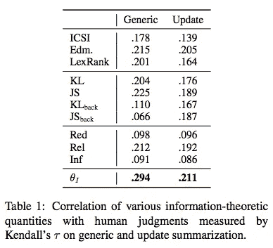

# #NLP365 的第 120 天:NLP 论文摘要——摘要重要性的简单理论模型

> 原文：<https://towardsdatascience.com/day-120-of-nlp365-nlp-papers-summary-a-simple-theoretical-model-of-importance-for-summarization-843ddbbcb9b?source=collection_archive---------65----------------------->

阅读和理解研究论文就像拼凑一个未解之谜。汉斯-彼得·高斯特在 [Unsplash](https://unsplash.com/s/photos/research-papers?utm_source=unsplash&utm_medium=referral&utm_content=creditCopyText) 上拍摄的照片。

## [内线艾](https://medium.com/towards-data-science/inside-ai/home) [NLP365](http://towardsdatascience.com/tagged/nlp365)

## NLP 论文摘要是我总结 NLP 研究论文要点的系列文章

项目#NLP365 (+1)是我在 2020 年每天记录我的 NLP 学习旅程的地方。在这里，你可以随意查看我在过去的 262 天里学到了什么。在本文的最后，你可以找到以前的论文摘要，按自然语言处理领域分类:)

今天的 NLP 论文是 ***对于总结*** 重要性的简单理论模型。以下是研究论文的要点。

# 目标和贡献

提出了一个简单的理论模型来捕捉总结中的信息重要性。该模型捕捉冗余、相关性和信息量，这三者都有助于信息在总结中的重要性。我们展示了如何有人可以使用这个框架来指导和改善总结系统。这些贡献如下:

1.  定义总结中的三个关键概念:冗余、相关性和信息量
2.  使用总结中的三个关键概念来阐述重要性概念，以及如何解释结果
3.  表明我们的理论模型对总结的重要性与人类总结有很好的相关性，使其对指导未来的实证工作有用

# 总体框架

语义单位被认为是一小段信息。\(\omega\)表示所有可能的语义单位。文本输入 X 被认为是由许多语义单元组成的，因此可以用概率分布\(\mathbb{P}_X\) over \(\Omega\)来表示。\(\mathbb{P}_X\)可以简单地指语义单位在整个文本中的频率分布。\(\mathbb{P}_X(w_i)\)可以解释为语义单位\(w_i\)出现在文本 X 中的概率，也可以解释为\(w_i\)对文本 X 的整体意义的贡献。

## 裁员

摘要中呈现的信息量由熵来度量，如下所示:

\(H(S)=-\ sum _ { w _ I } \ mathbb { P } _ S(w _ I)x log(\ mathbb { P } _ S(w _ I))\)

熵测量覆盖水平，并且当摘要中的每个语义单元仅出现一次时，H(S)最大化，因此冗余公式如下:

\(Red(S) = H_{max} — H(S)\)

## 关联

相关摘要应该与原文非常接近。换句话说，相关摘要应该具有最小的信息损失。为了测量相关性，我们需要使用交叉熵比较源文档\(\mathbb{P}_D\)和摘要\(\mathbb{P}_S\)的概率分布，如下所示:

\(Rel(S，D) = — CE(S，D)= \ sum _ { w _ I } \ mathbb { P } _ S(w _ I)x log(\ mathbb { P } _ D(w _ I))\)

该公式被视为在期望 D 源文档时产生 S 摘要的平均意外。具有低交叉熵(以及如此低的惊奇)的摘要 S 暗示关于原始文档是什么的低不确定性。只有当\(\mathbb{P}_S\)类似于\(\mathbb{P}_D\)时，才可能出现这种情况。

当使用源文档 D 生成摘要 s 时，KL 散度测量信息的损失。最小化 KL 散度的摘要最小化冗余并最大化相关性，因为它是最少偏差(最少冗余)的匹配 D 的摘要。KL 散度如下连接冗余和相关性:

\(KL(S||D) = CE(S，D)-H(S)\)
\(-KL(S | | D)= Rel(S，D)-Red(S)\)

## 信息量

信息含量介绍背景知识 K，以获取以前的知识用于总结。K 在所有语义单位上都用\(\mathbb{P}_K\)表示。概要 S 中的新信息量由概要和背景知识之间的交叉熵来度量，如下所示:

\(Inf(S，K) = CE(S，K)\)
\(Inf(S，K)=-\ sum _ { w _ I } \ mathbb { P } _ S(w _ I)x log(\ mathbb { P } _ K(w _ I))\)

相关性的交叉熵应该较低，因为我们希望摘要与源文档尽可能相似和相关，而信息量的交叉熵应该较高，因为我们正在测量用于生成摘要的背景知识量。这种背景知识的引入允许我们根据我们想要包括的知识种类来定制模型，无论是特定领域的知识还是特定用户的知识还是一般知识。它还引入了更新汇总的概念。更新摘要包括对已经看过文档/摘要 U 的源文档 D 进行摘要。文档/摘要 U 可以由背景知识 K 建模，这使得 U 成为先前的知识。

## 重要

重要性是指导摘要中应包含哪些信息的指标。给定一个具有知识 K 的用户，生成摘要的目的应该是给用户带来最新的信息。因此，对于每个语义单元，我们需要一个函数\(f(d_i，k_i)\)取源文档 D 中语义单元的概率(\(d_i = \mathbb{P}_D(w_i)\))和背景知识(\(k_i = \mathbb{P}_K(w_i)\)，来确定其重要性。函数\(f(d_i，k_i)\)有四个要求:

1.  *信息量*。如果两个语义单元在源文档中同等重要，我们会选择信息量更大的一个，这是由背景知识决定的
2.  *关联*。如果两个语义单元的信息量相同，那么我们更喜欢源文档中更重要的语义单元
3.  *可加性*。这是一个一致性约束，允许添加信息度量
4.  *正常化*。为了确保函数是有效的分布

## 汇总评分功能

\(\mathbb{P}_{(\frac{D}{K})}\)编码语义单位的相对重要性，即相关性和信息量之间的权衡。这种分布将捕获的一个例子是，如果语义单元在源文档中是重要的，但是在背景知识中是未知的，那么对于该语义单元来说\(\mathbb{P}_{(\frac{D}{K})}\)非常高，因为它非常希望被包括在摘要中，因为它增加了知识差距。下图对此进行了说明。该摘要应该是无冗余的和最佳的近似\(\mathbb{P}_{(\frac{D}{K})}\)，如下所示:

\(S * = arg max \ theta _ I = arg min KL(S | | \ math bb { P } _ {(\ frac { D } { K })})\(\ theta _ I(S，D，K)=-KL(\ math bb { S } | | \ math bb { P } _ {(\ frac { D } { K })})\)

来源、背景知识和目标分布之间的分布细分[1]

## 可总结性

我们可以使用\(\mathbb{P}_{(\frac{D}{K})}\)来衡量可以从分布中提取多少好的摘要，如下所示:

\(H _ { \ frac { D } { K } } = H(\ mathbb { P } _ {(\ frac { D } { K })})\)

如果\(H_{\frac{D}{K}}\)很高，那么可以从分布中生成许多类似的好摘要。反之，如果低了，好的总结就少了。就汇总评分函数而言，另一种表达方式如下:

\(\theta_I(S，D，K) = -Red(S) + \alpha Rel(S，D) + \beta Inf(S，K)\)

最大化\(\theta_I\)相当于最大化相关性和信息量，同时最小化冗余，这正是我们在高质量摘要中想要的。\(\alpha\)表示相关性分量的强度，而\(\beta\)表示信息性分量的强度。这意味着 H(S)，CE(S，D)和 CE(S，K)是影响重要性概念的三个独立因素。

## 潜在信息

到目前为止，我们已经使用相关性将摘要 S 与源文档 D 连接起来，使用信息性将摘要 S 与背景知识 K 连接起来。但是，我们也可以将源文档 D 与背景知识 k 联系起来。如果源文档 D 与背景知识 k 有很大不同，我们可以从源文档 D 中提取大量新信息。除了在源文档 D 和背景知识 k 之间，其计算与信息量相同。这个新的交叉熵表示在给定背景知识 k 的情况下从源文档 D 中可能获得的最大信息增益。

# 实验

我们使用了两个评估数据集:TAC-2008 和 TAC-2009。数据集集中在两个不同的摘要任务上:多文档的普通摘要和更新摘要。背景知识 K、\(\alpha\)和\(\beta\)是我们用于总结的理论模型的参数。我们将\(\alpha = \beta = 1\)和背景知识 K 设置为背景文档中单词的频率分布或来自源文档的所有单词的概率分布。

## 与人类判断的相关性

我们评估我们的数量与人类判断的相关性。我们的框架中的每一个量都可以用来对句子进行总结评分，因此我们可以评估它们与人类判断的相关性。结果展示如下。在这三个量中，相关性似乎与人类的判断有最高的相关性。背景知识的包含与预期的更新总结一起工作得更好。最后，\(\theta_I\)在两种类型的汇总中都给出了最好的性能。单个数量本身并没有很强的表现，但一旦将它们放在一起，就给了我们一个可靠的很强的汇总得分功能。

肯德尔的陶对一般和更新总结[1]的相关性进行了衡量

## 与参考摘要的比较

理想情况下，我们希望生成的摘要(使用\(\mathbb{P}_{(\frac{D}{K})}\))与人类参考摘要(\(\mathbb{P}_R\))相似。我们使用\(\theta_I\)对这两个摘要进行了评分，发现人类参考摘要的评分明显高于我们生成的摘要，证明了我们评分函数的可靠性。

# 结论和未来工作

当进行总结时，重要性统一了冗余、相关性和信息量这三个常见的度量标准，并告诉我们在最终的总结中应该丢弃或包含哪些信息。背景知识和语义单位的选择是理论模型的开放参数，这意味着它们对实验/探索是开放的。n-gram 是语义单元的很好的近似，但是我们在这里可以考虑什么其他粒度呢？

背景知识的潜在未来工作可能是使用该框架从数据中学习知识。具体来说，您可以训练一个模型来学习背景知识，以便该模型与人类的判断具有最高的相关性。如果您汇总所有用户和主题的所有信息，您可以找到通用的背景知识。如果您聚合所有用户，但在一个特定的主题中，您可以找到特定主题的背景知识，并且可以为单个用户完成类似的工作。

## 来源:

[1] Peyrard，m .，2018。一个简单的理论模型对总结的重要性。 *arXiv 预印本 arXiv:1801.08991* 。

*原载于 2020 年 4 月 29 日*[*【https://ryanong.co.uk】*](https://ryanong.co.uk/2020/04/29/day-120-nlp-papers-summary-a-simple-theoretical-model-of-importance-for-summarization/)*。*

# 特征提取/基于特征的情感分析

*   [https://towards data science . com/day-102-of-NLP 365-NLP-papers-summary-implicit-and-explicit-aspect-extraction-in-financial-BDF 00 a 66 db 41](/day-102-of-nlp365-nlp-papers-summary-implicit-and-explicit-aspect-extraction-in-financial-bdf00a66db41)
*   [https://towards data science . com/day-103-NLP-research-papers-utilizing-Bert-for-aspect-based-sense-analysis-via-construction-38ab 3e 1630 a3](/day-103-nlp-research-papers-utilizing-bert-for-aspect-based-sentiment-analysis-via-constructing-38ab3e1630a3)
*   [https://towards data science . com/day-104-of-NLP 365-NLP-papers-summary-senthious-targeted-aspect-based-sensitive-analysis-f 24 a2 EC 1 ca 32](/day-104-of-nlp365-nlp-papers-summary-sentihood-targeted-aspect-based-sentiment-analysis-f24a2ec1ca32)
*   [https://towards data science . com/day-105-of-NLP 365-NLP-papers-summary-aspect-level-sensation-class ification-with-3a 3539 be 6 AE 8](/day-105-of-nlp365-nlp-papers-summary-aspect-level-sentiment-classification-with-3a3539be6ae8)
*   [https://towards data science . com/day-106-of-NLP 365-NLP-papers-summary-an-unsupervised-neural-attention-model-for-aspect-b 874d 007 b 6d 0](/day-106-of-nlp365-nlp-papers-summary-an-unsupervised-neural-attention-model-for-aspect-b874d007b6d0)
*   [https://towardsdatascience . com/day-110-of-NLP 365-NLP-papers-summary-double-embedding-and-CNN-based-sequence-labeling-for-b8a 958 F3 bddd](/day-110-of-nlp365-nlp-papers-summary-double-embeddings-and-cnn-based-sequence-labelling-for-b8a958f3bddd)
*   [https://towards data science . com/day-112-of-NLP 365-NLP-papers-summary-a-challenge-dataset-and-effective-models-for-aspect-based-35b 7 a5 e 245 b5](/day-112-of-nlp365-nlp-papers-summary-a-challenge-dataset-and-effective-models-for-aspect-based-35b7a5e245b5)

# 总结

*   [https://towards data science . com/day-107-of-NLP 365-NLP-papers-summary-make-lead-bias-in-your-favor-a-simple-effective-4c 52 B1 a 569 b 8](/day-107-of-nlp365-nlp-papers-summary-make-lead-bias-in-your-favor-a-simple-and-effective-4c52b1a569b8)
*   [https://towards data science . com/day-109-of-NLP 365-NLP-papers-summary-studing-summary-evaluation-metrics-in-the-619 F5 acb1b 27](/day-109-of-nlp365-nlp-papers-summary-studying-summarization-evaluation-metrics-in-the-619f5acb1b27)
*   [https://towards data science . com/day-113-of-NLP 365-NLP-papers-summary-on-extractive-and-abstract-neural-document-87168 b 7 e 90 BC](/day-113-of-nlp365-nlp-papers-summary-on-extractive-and-abstractive-neural-document-87168b7e90bc)
*   [https://towards data science . com/day-116-of-NLP 365-NLP-papers-summary-data-driven-summary-of-scientific-articles-3 FBA 016 c 733 b](/day-116-of-nlp365-nlp-papers-summary-data-driven-summarization-of-scientific-articles-3fba016c733b)
*   [https://towards data science . com/day-117-of-NLP 365-NLP-papers-summary-abstract-text-summary-a-low-resource-challenge-61 AE 6 CDF 32 f](/day-117-of-nlp365-nlp-papers-summary-abstract-text-summarization-a-low-resource-challenge-61ae6cdf32f)
*   [https://towards data science . com/day-118-of-NLP 365-NLP-papers-summary-extractive-summary-of-long-documents-by-combining-AEA 118 a5 eb3f](/day-118-of-nlp365-nlp-papers-summary-extractive-summarization-of-long-documents-by-combining-aea118a5eb3f)

# 其他人

*   [https://towards data science . com/day-108-of-NLP 365-NLP-papers-summary-simple-Bert-models-for-relation-extraction-and-semantic-98f 7698184 D7](/day-108-of-nlp365-nlp-papers-summary-simple-bert-models-for-relation-extraction-and-semantic-98f7698184d7)
*   [https://towards data science . com/day-111-of-NLP 365-NLP-papers-summary-the-risk-of-race-of-bias-in-hate-speech-detection-BFF 7 F5 f 20 ce 5](/day-111-of-nlp365-nlp-papers-summary-the-risk-of-racial-bias-in-hate-speech-detection-bff7f5f20ce5)
*   [https://towards data science . com/day-115-of-NLP 365-NLP-papers-summary-scibert-a-pre trained-language-model-for-scientific-text-185785598 e33](/day-115-of-nlp365-nlp-papers-summary-scibert-a-pretrained-language-model-for-scientific-text-185785598e33)
*   [https://towards data science . com/day-119-NLP-papers-summary-an-argument-annoted-corpus-of-scientific-publications-d 7 b 9 e 2e ea 1097](/day-119-nlp-papers-summary-an-argument-annotated-corpus-of-scientific-publications-d7b9e2ea1097)