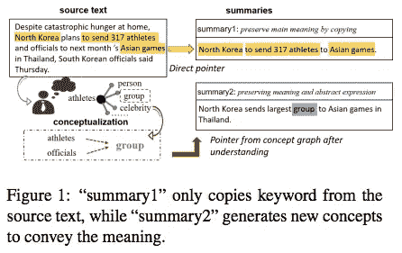
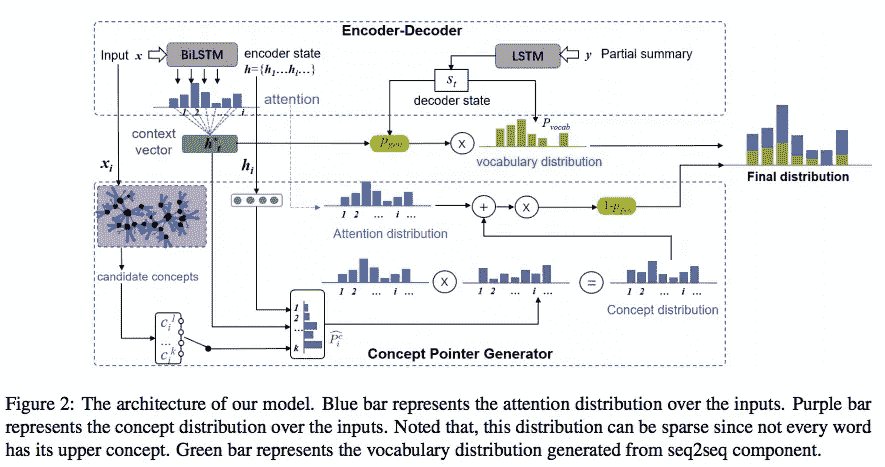
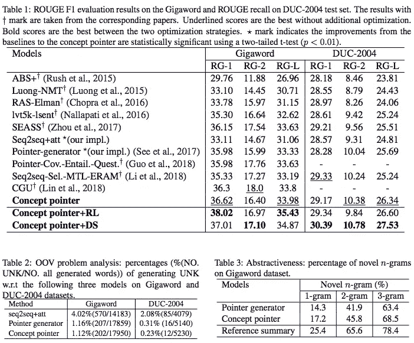
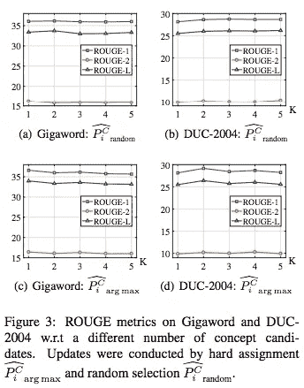
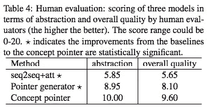

# #NLP365 的第 121 天:NLP 论文摘要——抽象摘要的概念指针网络

> 原文：<https://towardsdatascience.com/day-121-of-nlp365-nlp-papers-summary-concept-pointer-network-for-abstractive-summarization-cd55e577f6de?source=collection_archive---------53----------------------->

阅读和理解研究论文就像拼凑一个未解之谜。汉斯-彼得·高斯特在 [Unsplash](https://unsplash.com/s/photos/research-papers?utm_source=unsplash&utm_medium=referral&utm_content=creditCopyText) 上拍摄的照片。

## [内线艾](https://medium.com/towards-data-science/inside-ai/home) [NLP365](http://towardsdatascience.com/tagged/nlp365)

## NLP 论文摘要是我总结 NLP 研究论文要点的系列文章

项目#NLP365 (+1)是我在 2020 年每天记录我的 NLP 学习旅程的地方。在这里，你可以随意查看我在过去的 262 天里学到了什么。在本文的最后，你可以找到以前的论文摘要，按自然语言处理领域分类:)

今天的 NLP 论文是 ***概念指针网络，用于抽象概括*** n .以下是研究论文的要点。

# 目标和贡献

提出了用于抽象概括的概念指针网络，它使用基于知识和上下文感知的概念化来导出一组候选概念。然后，当生成抽象摘要时，模型将在概念集和原始源文本之间进行选择。对生成的摘要进行自动和人工评估。

提出的概念指针网络不只是简单地从源文档中复制文本，它还会从人类知识中生成新的抽象概念，如下所示:

指针网络框架概念[1]

在我们新颖的模型架构之上，我们还提出了一种远程监督学习技术，以允许我们的模型适应不同的数据集。自动和人工评估都显示出相对于 SOTA 基线的显著改进。

# 提议的模式

我们的模型架构由两个模块组成:

1.  编码器-解码器
2.  概念指针生成器

概念指针生成器的体系结构[1]

## 编码器-解码器

编解码框架由两层双向 LSTM-RNN 编码器和一层带注意机制的 LSTM-RNN 解码器组成。输入序列中的每个单词都由向前和向后隐藏状态的串联来表示。通过对隐藏状态表示应用注意机制来计算上下文向量。这个上下文向量被馈送到我们的解码器，在那里它将使用上下文向量来确定从我们的词汇分布生成新单词(p_gen)的概率。

## 概念指针生成器

首先，我们使用微软概念图将一个单词映射到它的相关概念。这个知识库覆盖了一个巨大的概念空间，概念和实体之间的关系是概率性的，这取决于它们的相关程度。本质上，概念图将接受这个单词，并估计这个单词属于一个特定概念 p(c|x)的概率。对于概率，这意味着给定每个单词，概念图将有一组它认为该单词所属的候选概念(具有不同的置信度)。为了让我们的模型选择正确的候选概念，例如，区分单词“apple”的水果和公司概念，我们将使用编码器-解码器框架中的上下文向量。

我们将使用上下文向量来更新概念分布。我们通过将当前隐藏状态、上下文向量和当前候选概念馈送到 softmax 分类器中来计算更新的权重。然后，这个更新的权重被添加到现有的概念概率中，以考虑输入序列的上下文，从而允许我们导出上下文感知的概念概率。

我们的概念指针网络由指向源文档的普通指针和指向给定源文档的相关概念的概念指针组成。概念指针通过注意力分布按元素进行缩放，并被添加到普通指针(注意力分布)。这将是模型复制的复制分布，它包括在原始源文档上的普通文本分布之上的概念分布。

## 模型适应的远程监控

如果我们的训练集的摘要-文档对不同于测试集，我们的模型将表现不佳。为了应对这种情况，我们需要重新训练我们的模型，以降低最终损失中的这种差异。为此，我们需要标签来表明我们的训练集与测试集有多接近。为了创建这些标签，我们使用每个训练参考概要和来自测试集的一组文档之间的 KL 散度。换句话说，训练对是远距离标记的。参考文献摘要和文档的表示都是通过对组成单词嵌入求和来计算的。这个 KL 散度损失函数包含在训练过程中，并且它测量测试集和我们的每个参考摘要-文档对之间的总距离。这允许我们确定我们的训练集对于模型适应是相关还是不相关。

# 实验设置和结果

有两个评估数据集:千兆字和 DUC-2004。评估指标是 ROUGE 分数。

## 模型比较

有 8 种基线模型:

1.  *ABS+* 。抽象概括模型
2.  *卢昂-NMT* 。LSTM 编码器-解码器
3.  *拉斯-埃尔曼*。CNN 关注编码器，RNN 关注解码器
4.  *Seq2seq+att* 。BiLSTM 编码器和带注意力解码器的 LSTM
5.  *Lvt5k-lsent* 。利用对解码器的时间关注来减少摘要中的重复
6.  *季节*。使用选择门来控制从编码器到解码器的信息流
7.  *指针生成器*。正常 PG
8.  CGU 。使用卷积门控单元和自我关注进行编码

## 结果

表 Concept Pointer 和其他基准模型之间的 ROUGE 结果和比较。表 2——词汇外问题分析。表 3 —抽象性的度量[1]

在表 1 中，我们的概念指针在所有指标上都优于所有基线模型，除了在 Gigaword 上的 RG-2(CGU 得分最高)。在表 2 中，我们显示由概念指针生成的摘要具有最低的 UNK 词百分比，缓解了 OOV 问题。在表 3 中，我们展示了我们生成的摘要的抽象性。我们证明了由我们的概念指针生成的摘要具有相对较高的抽象级别，并且接近于引用摘要级别。

我们试验了两种不同的培训策略:强化学习(RL)和远程监督(DS)。应用于概念指针的两种训练策略都优于普通概念指针。此外，在 DUC-2004 数据集，概念指针+ DS 持续优于概念指针+ RL，展示了远程监督对更好的模型适应的影响。

## 上下文感知概念化

我们想衡量概念更新策略的影响，所以我们对不同数量的候选概念进行了实验。结果如下所示。在不同数量概念候选者之间，ROUGE 分数只有很小的变化。

ROUGE 在 Gigaword 和 DUC 2004 数据集上的结果[1]

## 人工评估

我们进行了人体评估，每位志愿者都必须回答以下问题:

1.  *抽象* —摘要中的抽象概念有多贴切？
2.  *总体质量* —摘要的可读性、相关性和信息量如何？

我们随机选择了 20 个例子，每个例子都有三个不同的摘要(来自三个模型),并对每种类型的摘要被选中的频率进行评分。结果如下所示，显示了指针网络的概念优于 seq2seq 模型和指针生成器。生成的摘要看起来流畅且信息丰富，然而，它仍然不像人类参考摘要那样抽象。

人对抽象和整体质量的评价[1]

# 结论和未来工作

在我们新颖的模型架构之上，我们还提出了一种远程监督学习技术，以允许我们的模型适应不同的数据集。自动和人工评估都显示出相对于 SOTA 基线的显著改进。

## 来源:

[1]王，王伟，高，黄海燕，周，2019，11 月.用于抽象摘要的概念指针网络。在*2019 自然语言处理经验方法会议暨第九届国际自然语言处理联合会议(EMNLP-IJCNLP)* 论文集(第 3067–3076 页)。

*原载于 2020 年 4 月 30 日 https://ryanong.co.uk**[*。*](https://ryanong.co.uk/2020/04/30/day-121-nlp-papers-summary-concept-pointer-network-for-abstractive-summarization/)*

# *特征提取/基于特征的情感分析*

*   *[https://towards data science . com/day-102-of-NLP 365-NLP-papers-summary-implicit-and-explicit-aspect-extraction-in-financial-BDF 00 a 66 db 41](/day-102-of-nlp365-nlp-papers-summary-implicit-and-explicit-aspect-extraction-in-financial-bdf00a66db41)*
*   *[https://towards data science . com/day-103-NLP-research-papers-utilizing-Bert-for-aspect-based-sense-analysis-via-construction-38ab 3e 1630 a3](/day-103-nlp-research-papers-utilizing-bert-for-aspect-based-sentiment-analysis-via-constructing-38ab3e1630a3)*
*   *[https://towards data science . com/day-104-of-NLP 365-NLP-papers-summary-senthious-targeted-aspect-based-sensitive-analysis-f 24 a2 EC 1 ca 32](/day-104-of-nlp365-nlp-papers-summary-sentihood-targeted-aspect-based-sentiment-analysis-f24a2ec1ca32)*
*   *[https://towards data science . com/day-105-of-NLP 365-NLP-papers-summary-aspect-level-sensation-class ification-with-3a 3539 be 6 AE 8](/day-105-of-nlp365-nlp-papers-summary-aspect-level-sentiment-classification-with-3a3539be6ae8)*
*   *[https://towards data science . com/day-106-of-NLP 365-NLP-papers-summary-an-unsupervised-neural-attention-model-for-aspect-b 874d 007 b 6d 0](/day-106-of-nlp365-nlp-papers-summary-an-unsupervised-neural-attention-model-for-aspect-b874d007b6d0)*
*   *[https://towardsdatascience . com/day-110-of-NLP 365-NLP-papers-summary-double-embedding-and-CNN-based-sequence-labeling-for-b8a 958 F3 bddd](/day-110-of-nlp365-nlp-papers-summary-double-embeddings-and-cnn-based-sequence-labelling-for-b8a958f3bddd)*
*   *[https://towards data science . com/day-112-of-NLP 365-NLP-papers-summary-a-challenge-dataset-and-effective-models-for-aspect-based-35 B7 a5 e 245 b5](/day-112-of-nlp365-nlp-papers-summary-a-challenge-dataset-and-effective-models-for-aspect-based-35b7a5e245b5)*

# *总结*

*   *[https://towards data science . com/day-107-of-NLP 365-NLP-papers-summary-make-lead-bias-in-your-favor-a-simple-effective-4c 52 B1 a 569 b 8](/day-107-of-nlp365-nlp-papers-summary-make-lead-bias-in-your-favor-a-simple-and-effective-4c52b1a569b8)*
*   *[https://towards data science . com/day-109-of-NLP 365-NLP-papers-summary-studing-summary-evaluation-metrics-in-the-619 F5 acb1 b 27](/day-109-of-nlp365-nlp-papers-summary-studying-summarization-evaluation-metrics-in-the-619f5acb1b27)*
*   *[https://towards data science . com/day-113-of-NLP 365-NLP-papers-summary-on-extractive-and-abstract-neural-document-87168 b 7 e 90 BC](/day-113-of-nlp365-nlp-papers-summary-on-extractive-and-abstractive-neural-document-87168b7e90bc)*
*   *[https://towards data science . com/day-116-of-NLP 365-NLP-papers-summary-data-driven-summary-of-scientific-articles-3 FBA 016 c 733 b](/day-116-of-nlp365-nlp-papers-summary-data-driven-summarization-of-scientific-articles-3fba016c733b)*
*   *[https://towards data science . com/day-117-of-NLP 365-NLP-papers-summary-abstract-text-summary-a-low-resource-challenge-61a E6 CDF 32 f](/day-117-of-nlp365-nlp-papers-summary-abstract-text-summarization-a-low-resource-challenge-61ae6cdf32f)*
*   *[https://towards data science . com/day-118-of-NLP 365-NLP-papers-summary-extractive-summary-of-long-documents-by-combining-AEA 118 a5 eb3f](/day-118-of-nlp365-nlp-papers-summary-extractive-summarization-of-long-documents-by-combining-aea118a5eb3f)*
*   *[https://towards data science . com/day-120-of-NLP 365-NLP-papers-summary-a-simple-theory-model-of-importance-for-summary-843 ddbcb 9b](/day-120-of-nlp365-nlp-papers-summary-a-simple-theoretical-model-of-importance-for-summarization-843ddbbcb9b)*

# *其他人*

*   *[https://towards data science . com/day-108-of-NLP 365-NLP-papers-summary-simple-Bert-models-for-relation-extraction-and-semantic-98f 7698184 D7](/day-108-of-nlp365-nlp-papers-summary-simple-bert-models-for-relation-extraction-and-semantic-98f7698184d7)*
*   *[https://towards data science . com/day-111-of-NLP 365-NLP-papers-summary-the-risk-of-race-of-bias-in-hate-speech-detection-BFF 7 F5 f 20 ce 5](/day-111-of-nlp365-nlp-papers-summary-the-risk-of-racial-bias-in-hate-speech-detection-bff7f5f20ce5)*
*   *[https://towards data science . com/day-115-of-NLP 365-NLP-papers-summary-scibert-a-pre trained-language-model-for-scientific-text-185785598 e33](/day-115-of-nlp365-nlp-papers-summary-scibert-a-pretrained-language-model-for-scientific-text-185785598e33)*
*   *[https://towards data science . com/day-119-NLP-papers-summary-an-argument-annoted-corpus-of-scientific-publications-d 7 b 9 e 2e ea 1097](/day-119-nlp-papers-summary-an-argument-annotated-corpus-of-scientific-publications-d7b9e2ea1097)*