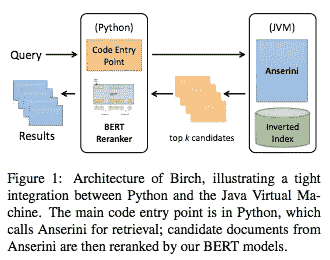
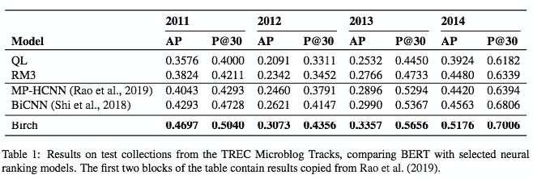
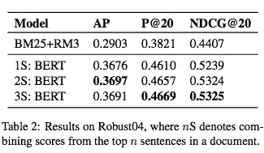

# #NLP365 的第 122 天:NLP 论文摘要——将 BERT 应用于 Birch 的文献检索

> 原文：<https://towardsdatascience.com/day-122-of-nlp365-nlp-papers-summary-applying-bert-to-document-retrieval-with-birch-766eaeac17ab?source=collection_archive---------47----------------------->

阅读和理解研究论文就像拼凑一个未解之谜。汉斯-彼得·高斯特在 [Unsplash](https://unsplash.com/s/photos/research-papers?utm_source=unsplash&utm_medium=referral&utm_content=creditCopyText) 上拍摄的照片。

## [内线艾](https://medium.com/towards-data-science/inside-ai/home) [NLP365](http://towardsdatascience.com/tagged/nlp365)

## NLP 论文摘要是我总结 NLP 研究论文要点的系列文章

项目#NLP365 (+1)是我在 2020 年每天记录我的 NLP 学习旅程的地方。在这里，你可以随意查看我在过去的 262 天里学到了什么。在本文的最后，你可以找到以前的论文摘要，按自然语言处理领域分类:)

今天的 NLP 论文是 ***用 Birch*** 将 BERT 应用于文档检索。以下是研究论文的要点。

# 目标和贡献

Birch，一个使用 BERT 进行文档检索的建议系统。它与 Anserini 信息检索工具包集成，为大型文档集带来完整的端到端文档检索。

文档检索是给定一个大的文档集合，系统应该根据用户的查询返回一组排序的文档。Lucene(以及 Solr 和 Elasticsearch)是业界构建搜索引擎的主要平台。然而，当涉及到连接 NLP 和 IR 时，存在一个技术挑战，Lucene 是用 Java 实现的，然而，大多数深度学习技术是用 Python 和 C++后端实现的。

# 桦树

桦树的建筑[1]

Birch 的建筑由两个阶段组成:

1.  使用 Anserini 进行检索
2.  使用基于 BERT 的模型进行重新排序

Python 是代码入口点，它使用 Pyjnuis 库访问 Java 类与 Anserini 集成。总的来说，Python 是主要的开发语言，连接到 Java 虚拟机(JVM)后端进行检索。

我们针对文本的相关性分类对 BERT 进行了微调。给定文档 D 和查询 Q，我们将它们连接成以下文本序列:[CLS] + Q + [SEP] + D + [SEP]。对于每个小批量，我们将序列填充到 N 个令牌，其中 N 是批量中的最大长度令牌。像往常一样，[CLS]令牌被输入到一个单层神经网络中。一个问题是，BERT 不是为长文档推理而设计的，所以我们决定在每个文档的句子级别进行推理，并聚合句子级别的推理来对文档进行排序。先前的工作发现，文档中的最佳得分句子提供了文档相关性的良好代理。

# 检索结果

有两个评估数据集:TREC 2011-2014 微博轨迹和 TREC 2004 健壮轨迹。对于微博轨迹，Birch 应用于一组推文。使用查询可能性和 RM3 相关反馈来检索初始候选集(大约 100 个)，使用 BERT 来推断整个候选文档(因为它很短，BERT 可以覆盖整个文档，而不是句子级的聚合)。结果如下所示。检索的两个常见评估指标是平均精度(AP)和排名 30 的精度(P@30)。如图所示，Birch 在基线和高级神经模型的基础上每年都有很大的进步。

结果在 TREC 微博上追踪报道[1]

健壮跟踪器由用于文档检索任务的新闻专线文章组成。这个数据集的另一个挑战是没有足够的数据来微调我们的 BERT 模型，因为相关性标签是在文档级别。先前工作的令人惊讶的发现是，尽管两个数据集在不同的领域，但用微博轨迹微调的 BERT 模型在新闻专线文章排名方面工作得很好。BERT 能够学习在不同领域的句子级别上建立相关性模型，这已被证明对新闻专线文章的排名是有用的。对于稳健的跟踪，我们用 MARCO 女士和微博数据对 BERT 进行了微调，结果如下所示。我们将 BERT 的分数与文档分数(BM25 + RM3)结合起来。1-3 指的是将前 1-3 个句子的得分相加。总的来说，结果表明我们可以通过预测句子级别的相关性来准确地对文档进行排序。

Robust04 的结果[1]

# 结论和未来工作

通过句子级推理和分数聚合，该系统架构使用 BERT 对文档进行排序。我们已经成功地将 PyTorch 与 Java 虚拟机后端集成在一起，允许研究人员在他们熟悉的环境中进行代码开发。

## 来源:

[1]，张志安，王，杨，张，林，2019 年 11 月.BERT 在 birch 文献检索中的应用。在*2019 自然语言处理经验方法会议暨第九届国际自然语言处理联合会议(EMNLP-IJCNLP)论文集:系统演示*(第 19–24 页)。

*原载于 2020 年 5 月 1 日*[*【https://ryanong.co.uk】*](https://ryanong.co.uk/2020/05/01/day-122-nlp-papers-summary-applying-bert-to-document-retrieval-with-birch/)*。*

# 特征提取/基于特征的情感分析

*   [https://towards data science . com/day-102-of-NLP 365-NLP-papers-summary-implicit-and-explicit-aspect-extraction-in-financial-BDF 00 a 66 db 41](/day-102-of-nlp365-nlp-papers-summary-implicit-and-explicit-aspect-extraction-in-financial-bdf00a66db41)
*   [https://towards data science . com/day-103-NLP-research-papers-utilizing-Bert-for-aspect-based-sense-analysis-via-construction-38ab 3e 1630 a3](/day-103-nlp-research-papers-utilizing-bert-for-aspect-based-sentiment-analysis-via-constructing-38ab3e1630a3)
*   [https://towards data science . com/day-104-of-NLP 365-NLP-papers-summary-senthious-targeted-aspect-based-sensitive-analysis-f 24 a2 EC 1 ca 32](/day-104-of-nlp365-nlp-papers-summary-sentihood-targeted-aspect-based-sentiment-analysis-f24a2ec1ca32)
*   [https://towards data science . com/day-105-of-NLP 365-NLP-papers-summary-aspect-level-sensation-class ification-with-3a 3539 be 6 AE 8](/day-105-of-nlp365-nlp-papers-summary-aspect-level-sentiment-classification-with-3a3539be6ae8)
*   [https://towards data science . com/day-106-of-NLP 365-NLP-papers-summary-an-unsupervised-neural-attention-model-for-aspect-b 874d 007 b 6d 0](/day-106-of-nlp365-nlp-papers-summary-an-unsupervised-neural-attention-model-for-aspect-b874d007b6d0)
*   [https://towards data science . com/day-110-of-NLP 365-NLP-papers-summary-double-embedding-and-CNN-based-sequence-labeling-for-b8a 958 F3 bddd](/day-110-of-nlp365-nlp-papers-summary-double-embeddings-and-cnn-based-sequence-labelling-for-b8a958f3bddd)
*   [https://towards data science . com/day-112-of-NLP 365-NLP-papers-summary-a-challenge-dataset-and-effective-models-for-aspect-based-35b 7 a5 e 245 b5](/day-112-of-nlp365-nlp-papers-summary-a-challenge-dataset-and-effective-models-for-aspect-based-35b7a5e245b5)

# 总结

*   [https://towards data science . com/day-107-of-NLP 365-NLP-papers-summary-make-lead-bias-in-your-favor-a-simple-effective-4c 52 B1 a 569 b 8](/day-107-of-nlp365-nlp-papers-summary-make-lead-bias-in-your-favor-a-simple-and-effective-4c52b1a569b8)
*   [https://towards data science . com/day-109-of-NLP 365-NLP-papers-summary-studing-summary-evaluation-metrics-in-the-619 F5 acb1 b 27](/day-109-of-nlp365-nlp-papers-summary-studying-summarization-evaluation-metrics-in-the-619f5acb1b27)
*   [https://towards data science . com/day-113-of-NLP 365-NLP-papers-summary-on-extractive-and-abstract-neural-document-87168 b 7 e 90 BC](/day-113-of-nlp365-nlp-papers-summary-on-extractive-and-abstractive-neural-document-87168b7e90bc)
*   [https://towards data science . com/day-116-of-NLP 365-NLP-papers-summary-data-driven-summary-of-scientific-articles-3 FBA 016 c 733 b](/day-116-of-nlp365-nlp-papers-summary-data-driven-summarization-of-scientific-articles-3fba016c733b)
*   [https://towards data science . com/day-117-of-NLP 365-NLP-papers-summary-abstract-text-summary-a-low-resource-challenge-61a E6 CDF 32 f](/day-117-of-nlp365-nlp-papers-summary-abstract-text-summarization-a-low-resource-challenge-61ae6cdf32f)
*   [https://towards data science . com/day-118-of-NLP 365-NLP-papers-summary-extractive-summary-of-long-documents-by-combining-AEA 118 a5 eb3f](/day-118-of-nlp365-nlp-papers-summary-extractive-summarization-of-long-documents-by-combining-aea118a5eb3f)
*   [https://towards data science . com/day-120-of-NLP 365-NLP-papers-summary-a-simple-theory-model-of-importance-for-summary-843 ddbcb 9b](/day-120-of-nlp365-nlp-papers-summary-a-simple-theoretical-model-of-importance-for-summarization-843ddbbcb9b)
*   [https://towards data science . com/day-121-of-NLP 365-NLP-papers-summary-concept-pointer-network-for-abstract-summary-cd55e 577 F6 de](/day-121-of-nlp365-nlp-papers-summary-concept-pointer-network-for-abstractive-summarization-cd55e577f6de)

# 其他人

*   [https://towards data science . com/day-108-of-NLP 365-NLP-papers-summary-simple-Bert-models-for-relation-extraction-and-semantic-98f 7698184 D7](/day-108-of-nlp365-nlp-papers-summary-simple-bert-models-for-relation-extraction-and-semantic-98f7698184d7)
*   [https://towards data science . com/day-111-of-NLP 365-NLP-papers-summary-the-risk-of-race-of-bias-in-hate-speech-detection-BFF 7 F5 f 20 ce 5](/day-111-of-nlp365-nlp-papers-summary-the-risk-of-racial-bias-in-hate-speech-detection-bff7f5f20ce5)
*   [https://towards data science . com/day-115-of-NLP 365-NLP-papers-summary-scibert-a-pre trained-language-model-for-scientific-text-185785598 e33](/day-115-of-nlp365-nlp-papers-summary-scibert-a-pretrained-language-model-for-scientific-text-185785598e33)
*   [https://towards data science . com/day-119-NLP-papers-summary-an-argument-annoted-corpus-of-scientific-publications-d 7 b 9 e 2e ea 1097](/day-119-nlp-papers-summary-an-argument-annotated-corpus-of-scientific-publications-d7b9e2ea1097)