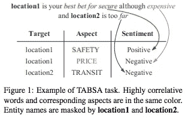
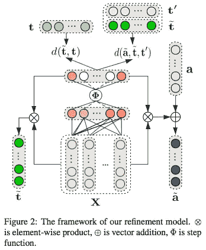
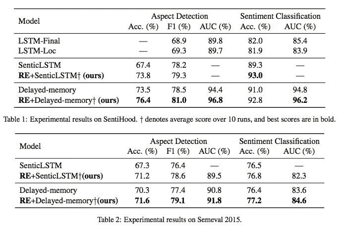
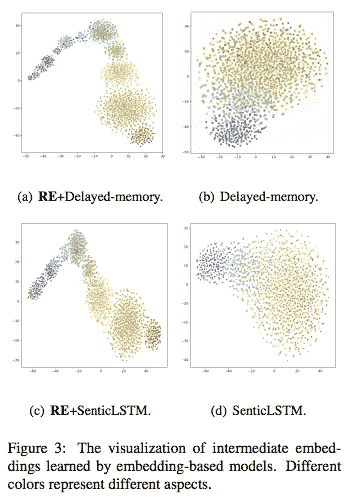

# #NLP365 的第 123 天:NLP 论文摘要——用于基于方面的目标情感分析的上下文感知嵌入

> 原文：<https://towardsdatascience.com/day-123-of-nlp365-nlp-papers-summary-context-aware-embedding-for-targeted-aspect-based-be9f998d1131?source=collection_archive---------64----------------------->

阅读和理解研究论文就像拼凑一个未解之谜。汉斯-彼得·高斯特在 [Unsplash](https://unsplash.com/s/photos/research-papers?utm_source=unsplash&utm_medium=referral&utm_content=creditCopyText) 上拍摄的照片。

## [内线艾](https://medium.com/towards-data-science/inside-ai/home) [NLP365](http://towardsdatascience.com/tagged/nlp365)

## NLP 论文摘要是我总结 NLP 研究论文要点的系列文章

项目#NLP365 (+1)是我在 2020 年每天记录我的 NLP 学习旅程的地方。在这里，你可以随意查看我在过去的 262 天里学到了什么。在本文的最后，你可以找到以前的论文摘要，按自然语言处理领域分类:)

今天的 NLP 论文是 ***针对有针对性的基于方面的情感分析的上下文感知嵌入*** 。以下是研究论文的要点。

# 目标和贡献

提出了上下文感知嵌入，使用高度相关的词来改进目标和方面的嵌入。大量先前的工作使用上下文无关向量来构造目标和方面嵌入，这导致语义信息的丢失，并且未能捕捉特定目标、其方面和其上下文之间的相互联系。这种方法导致了基于方面的目标情感分析(TABSA)的 SOTA 结果。TABSA 的目标是给定一个输入句子，我们想要提取属于目标的方面的情感。下图展示了 TABSA 任务:

这些贡献如下:

1.  通过使用稀疏系数向量来识别与目标高度相关的单词并相应地改进目标嵌入，来为目标构建上下文感知嵌入
2.  微调方面嵌入以尽可能接近高度相关的目标嵌入
3.  在 SentiHood 和 SemEval 2015 上取得 SOTA 成果

# 方法学

上下文感知嵌入的架构[1]

模型框架具有以下步骤:

1.  句子嵌入矩阵 X 被馈入全连接层和阶跃函数以创建稀疏系数向量 u’。
2.  u '的隐藏输出用于细化目标和方面嵌入
3.  计算平方欧几里德函数并训练模型以最小化距离，从而获得目标和方面的最终精确嵌入

## 目标表示

可以通过将句子单词嵌入 X 乘以稀疏系数向量 u’来计算精确的目标嵌入。稀疏系数向量使用阶跃函数展示了上下文中不同单词的重要性。对于每个目标，我们通过迭代最小化目标和句子中高度相关单词之间的平方欧几里德距离来计算上下文感知目标嵌入。

## 方面表示

我们通过使用高度相关词的稀疏系数向量来细化方面嵌入。这背后的论点是，方面词通常包含重要的信息，上下文信息通常与方面有很高的联系。同样，对于每个方面，我们通过最小化方面嵌入、上下文感知目标嵌入和不相关嵌入之间的平方欧几里德距离来计算上下文感知方面嵌入。这将微调我们的方面嵌入，使其更接近高度相关的目标嵌入，并远离不相关的嵌入。

# 实验和结果

有两个评估数据集:SentiHood 和 SemEval 2015 Task 12。

## 模型比较

1.  *LSTM-决赛*。只使用最终隐藏状态的 BiLSTM
2.  *LSTM-洛克*。使用位置目标所在的隐藏状态的 BiLSTM
3.  *SenticLSTM* 。使用外部知识的 BiLSTM
4.  *延迟记忆*。延迟记忆机制
5.  *RE+SenticLSTM* 。我们的精致嵌入+ SenticLSTM
6.  *RE+延时记忆*。我们的精细嵌入+延迟记忆

## 结果

关于 SentiHood 和 Semeval 2015 的结果[1]

对于情感，我们提出的方法在 SenticLSTM 和延迟记忆的基础上，在方面检测和情感分类方面都取得了比原始模型更好的性能。我们的上下文感知嵌入允许模型更好地捕捉方面和情感信息，因为我们能够更好地对目标、其方面和上下文之间的互连进行建模。对于 SemEval 2015，我们展示了类似的结果，我们提出的方法优于原始模型。下图显示了我们提出的上下文感知嵌入与使用 TSNE 的原始方面嵌入的对比。如图所示，使用我们的上下文感知嵌入，不同方面之间有更多的分离，展示了它在上下文中区分不同方面的能力以及捕捉特定方面的共同特征的能力。

通过不同的基于嵌入的模型学习的中间嵌入[1]

# 结论和未来工作

通过选择和使用高度相关的词来提炼目标和方面嵌入，我们能够提取特定目标、其方面和其上下文之间的联系，以生成更好的有意义的嵌入。未来的工作包括为其他类似的 NLP 任务探索这种方法。

## 来源:

[1]梁，b，杜，j，徐，r，李，b，黄，h，2019 .面向基于方面的情感分析的上下文感知嵌入。 *arXiv 预印本 arXiv:1906.06945* 。

*原载于 2020 年 5 月 2 日*[*【https://ryanong.co.uk】*](https://ryanong.co.uk/2020/05/02/day-123-nlp-papers-summary-context-aware-embedding-for-targeted-aspect-based-sentiment-analysis/)*。*

# 特征提取/基于特征的情感分析

*   [https://towards data science . com/day-102-of-NLP 365-NLP-papers-summary-implicit-and-explicit-aspect-extraction-in-financial-BDF 00 a 66 db 41](/day-102-of-nlp365-nlp-papers-summary-implicit-and-explicit-aspect-extraction-in-financial-bdf00a66db41)
*   [https://towards data science . com/day-103-NLP-research-papers-utilizing-Bert-for-aspect-based-sense-analysis-via-construction-38ab 3e 1630 a3](/day-103-nlp-research-papers-utilizing-bert-for-aspect-based-sentiment-analysis-via-constructing-38ab3e1630a3)
*   [https://towards data science . com/day-104-of-NLP 365-NLP-papers-summary-senthious-targeted-aspect-based-sensitive-analysis-f 24 a2 EC 1 ca 32](/day-104-of-nlp365-nlp-papers-summary-sentihood-targeted-aspect-based-sentiment-analysis-f24a2ec1ca32)
*   [https://towards data science . com/day-105-of-NLP 365-NLP-papers-summary-aspect-level-sensation-class ification-with-3a 3539 be 6 AE 8](/day-105-of-nlp365-nlp-papers-summary-aspect-level-sentiment-classification-with-3a3539be6ae8)
*   [https://towards data science . com/day-106-of-NLP 365-NLP-papers-summary-an-unsupervised-neural-attention-model-for-aspect-b 874d 007 b 6d 0](/day-106-of-nlp365-nlp-papers-summary-an-unsupervised-neural-attention-model-for-aspect-b874d007b6d0)
*   [https://towards data science . com/day-110-of-NLP 365-NLP-papers-summary-double-embedding-and-CNN-based-sequence-labeling-for-b8a 958 F3 bddd](/day-110-of-nlp365-nlp-papers-summary-double-embeddings-and-cnn-based-sequence-labelling-for-b8a958f3bddd)
*   [https://towards data science . com/day-112-of-NLP 365-NLP-papers-summary-a-challenge-dataset-and-effective-models-for-aspect-based-35b 7 a5 e 245 b5](/day-112-of-nlp365-nlp-papers-summary-a-challenge-dataset-and-effective-models-for-aspect-based-35b7a5e245b5)

# 总结

*   [https://towards data science . com/day-107-of-NLP 365-NLP-papers-summary-make-lead-bias-in-your-favor-a-simple-effective-4c 52 B1 a 569 b 8](/day-107-of-nlp365-nlp-papers-summary-make-lead-bias-in-your-favor-a-simple-and-effective-4c52b1a569b8)
*   [https://towards data science . com/day-109-of-NLP 365-NLP-papers-summary-studing-summary-evaluation-metrics-in-the-619 F5 acb1b 27](/day-109-of-nlp365-nlp-papers-summary-studying-summarization-evaluation-metrics-in-the-619f5acb1b27)
*   [https://towards data science . com/day-113-of-NLP 365-NLP-papers-summary-on-extractive-and-abstract-neural-document-87168 b 7 e 90 BC](/day-113-of-nlp365-nlp-papers-summary-on-extractive-and-abstractive-neural-document-87168b7e90bc)
*   [https://towards data science . com/day-116-of-NLP 365-NLP-papers-summary-data-driven-summary-of-scientific-articles-3 FBA 016 c 733 b](/day-116-of-nlp365-nlp-papers-summary-data-driven-summarization-of-scientific-articles-3fba016c733b)
*   [https://towards data science . com/day-117-of-NLP 365-NLP-papers-summary-abstract-text-summary-a-low-resource-challenge-61 AE 6 CDF 32 f](/day-117-of-nlp365-nlp-papers-summary-abstract-text-summarization-a-low-resource-challenge-61ae6cdf32f)
*   [https://towards data science . com/day-118-of-NLP 365-NLP-papers-summary-extractive-summary-of-long-documents-by-combining-AEA 118 a5 eb3f](/day-118-of-nlp365-nlp-papers-summary-extractive-summarization-of-long-documents-by-combining-aea118a5eb3f)
*   [https://towards data science . com/day-120-of-NLP 365-NLP-papers-summary-a-simple-theory-model-of-importance-for-summary-843 ddbcb 9b](/day-120-of-nlp365-nlp-papers-summary-a-simple-theoretical-model-of-importance-for-summarization-843ddbbcb9b)
*   [https://towards data science . com/day-121-of-NLP 365-NLP-papers-summary-concept-pointer-network-for-abstract-summary-cd55e 577 F6 de](/day-121-of-nlp365-nlp-papers-summary-concept-pointer-network-for-abstractive-summarization-cd55e577f6de)

# 其他人

*   [https://towards data science . com/day-108-of-NLP 365-NLP-papers-summary-simple-Bert-models-for-relation-extraction-and-semantic-98f 7698184 D7](/day-108-of-nlp365-nlp-papers-summary-simple-bert-models-for-relation-extraction-and-semantic-98f7698184d7)
*   [https://towards data science . com/day-111-of-NLP 365-NLP-papers-summary-the-risk-of-race-of-bias-in-hate-speech-detection-BFF 7 F5 f 20 ce 5](/day-111-of-nlp365-nlp-papers-summary-the-risk-of-racial-bias-in-hate-speech-detection-bff7f5f20ce5)
*   [https://towards data science . com/day-115-of-NLP 365-NLP-papers-summary-scibert-a-pre trained-language-model-for-scientific-text-185785598 e33](/day-115-of-nlp365-nlp-papers-summary-scibert-a-pretrained-language-model-for-scientific-text-185785598e33)
*   [https://towards data science . com/day-119-NLP-papers-summary-an-argument-annoted-corpus-of-scientific-publications-d 7 b 9 e 2e ea 1097](/day-119-nlp-papers-summary-an-argument-annotated-corpus-of-scientific-publications-d7b9e2ea1097)
*   [https://towards data science . com/day-122-of-NLP 365-NLP-papers-summary-applying-Bert-to-document-retrieval-with-birch-766 EAC 17 ab](/day-122-of-nlp365-nlp-papers-summary-applying-bert-to-document-retrieval-with-birch-766eaeac17ab)