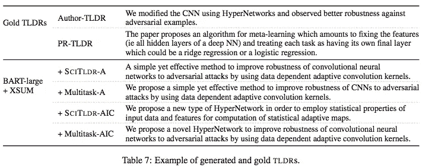

# 第 124 天:NLP 论文摘要——TLDR:科学文献的极端摘要

> 原文：<https://towardsdatascience.com/day-124-nlp-papers-summary-tldr-extreme-summarization-of-scientific-documents-106cd915f9a3?source=collection_archive---------60----------------------->

阅读和理解研究论文就像拼凑一个未解之谜。汉斯-彼得·高斯特在 [Unsplash](https://unsplash.com/s/photos/research-papers?utm_source=unsplash&utm_medium=referral&utm_content=creditCopyText) 上拍摄的照片。

## [内线艾](https://medium.com/towards-data-science/inside-ai/home) [NLP365](http://towardsdatascience.com/tagged/nlp365)

## NLP 论文摘要是我总结 NLP 研究论文要点的系列文章

项目#NLP365 (+1)是我在 2020 年每天记录我的 NLP 学习旅程的地方。在这里，你可以随意查看我在过去的 270 天里学到了什么。在本文的最后，你可以找到以前的论文摘要，按自然语言处理领域分类:)

今天的 NLP 论文是 ***TLDR:科学文献的极端摘要*** 。以下是研究论文的要点。

# 目标和贡献

介绍了 TLDR 生成任务和 SCITLDR，这是一个新的极端摘要数据集，研究人员可以使用它来训练模型，为科学论文生成 TLDR。引入注释协议，使用同行评审意见创建不同的基本事实摘要，允许我们扩展数据集，并且第一次有多个摘要链接到单个源文档。最后，我们提出了一个基于 TLDR 和标题生成的多任务训练策略来适应我们的预训练语言模型 BART。这已经显示出优于提取和抽象基线。

# TLDR 生成任务介绍

TLDR 生成任务旨在生成忽略背景或方法细节的 tldr，并更加关注关键方面，如论文的贡献。这要求模型具有背景知识以及理解特定领域语言的能力。下图展示了 TLDR 任务的一个示例，以及出现在 TLDR 的信息类别列表。

TLDR 极限汇总任务简介[1]

# SCITLDR 数据集

SCITLDR 在计算机科学科学文献中有 3935 个 TLDR。SCITLDR 包括论文原作者和同行评议撰写的 TLDR。然而，这里的关键区别在于，作者和同行评审是基于评审者的评论而不是原始研究论文来撰写 TLDR 的。这种方法假设读者有很好的背景知识来了解一般的研究领域，所以我们的 TLDRs 可以省略常见的概念。此外，审稿人的评论是由该领域的专家撰写的，因此它们是高质量的摘要。下图展示了注释过程的一个例子。

SCITLDR 数据集的注释过程[1]

SCITLDR 的独特性之一是，测试集中的每篇论文都映射到多个基础事实 TLDR，一个由原作者编写，其余由同行评审。这将 a)允许我们更好地评估我们生成的摘要，因为现在有多个基本事实摘要来计算 ROUGE 分数，b)拥有作者和读者的 TLDR 允许我们基于读者的视角捕捉摘要中的变化。

## 数据集分析

首先，SCITLDR 是一个小得多的数据集，由于手动数据收集和注释，只有 3.2K 的论文。其次，与其他数据集相比，SCITLDR 具有极高的压缩比。平均文档长度是 5009，它被压缩成 19 的平均摘要长度。这使得总结非常具有挑战性。表 3 展示了这些汇总统计数据。SCITLDR 对于测试集中的每篇论文至少有两个基础事实 TLDR，因此我们研究不同基础事实 tldr 之间的 ROUGE 分数差异。作者生成的 tldr 和 PR 生成的 tldr 之间存在较低的 ROUGEE-1 重叠(27.40)。作者生成的 TLDRs 的 ROUGE-1 为 34.1，标题为论文。PR 生成的 TLDRs 只有 24.7 的 ROUGE-1。这展示了多个基础事实 TLDRs 在总结中的重要性，因为一个源文件可能有多个相关的总结。

左:数据集比较|右:摘要的新颖程度[1]

# 实验设置和结果

## 模特培训

我们微调了巴特模型来生成 TLDR。但是，限制很少。首先，我们训练数据的大小。我们有一个小数据集来训练神经网络。这使我们从 arXiv 收集了额外的 20K 论文标题对，并对我们的 SCITLDR 进行了采样，以匹配新的卷。我们收集标题的原因是因为它通常包含关于论文的重要信息，我们相信如果我们训练模型也执行标题生成，它将学习如何从论文中选择重要信息。有了新的信息，我们就可以训练我们的模型了。首先，我们在 XSUM 数据集上训练 BART-large 模型，这是一个通用新闻领域的极端概括数据集。然后，我们将在 SCITLDR 和 title 数据集上微调我们的 BART 模型。

我们面临的第二个限制是，BART 对输入长度有限制，因此我们将 BART 放在两个设置下:BART_abstract (SCITLDR_Abst)和 BART _ abstract _ intro _ 结论(SCITLDR_AIC)。这些是用于生成标题/TLDR 的不同输入。现有的研究表明，研究论文中最重要的信息是摘要、引言和结论。

## 模型比较

1.  *提取模型*。PACSUM(text rank 的非监督扩展)和 BERTSUMEXT(监督扩展)
2.  *抽象模型*。BART 的不同变体

我们使用 ROUGE 指标进行评估。我们将计算每个地面实况 TLDRs 的胭脂分数，并选择最大值。

## 结果

SCITLDR 的总体结果，包括 AIC 和 Abst 版本[1]

提取摘要的上限[1]

提取预言提供了一个上限性能。在表 6 中，我们可以看到随着输入空间的增加，ROUGE 得分不断增加。具体来说，当包括介绍和结论作为输入时，有 5 个 ROUGE 分数的提高，展示了它们在生成有用的摘要中的重要性。虽然从《AIC》到《全文》的胭脂评分有所提高，但提高幅度并不大，说明论文其他部分的附加值没有《AIC》高。

在表 5 中，我们可以看到 BART 在原始 SCITLDR 上的微调足以胜过其他提取和抽象基线。在 XSUM 上预训练 BART 时显示了进一步的改进，但是，这种改进只适用于 SCITLDR_AIC。我们的多任务学习策略已经超越了所有基线模型，并在 BART + XSUM 的基础上实现了进一步的改进。这展示了为标题和 TLDR 一代培训模型的附加值。下图展示了由不同模型生成的摘要的定性示例。

BART tldr 的定性示例[1]

# 结论和未来工作

潜在的未来工作可以利用整篇论文的信息，捕捉更多的背景。此外，我们可以明确地对读者的背景知识建模，根据读者是谁来创建 TLDRs。最后，我们可以将我们的注释过程应用于其他数据集，并将任何同行评审意见转换为 TLDRs 摘要。

## 来源:

[1]卡舒拉，I .，罗，k .，科汉，a .和韦尔德，D.S .，2020 年。TLDR:科学文献的极端摘要。 *arXiv 预印本 arXiv:2004.15011* 。

*原载于 2020 年 5 月 3 日 https://ryanong.co.uk**[*。*](https://ryanong.co.uk/2020/05/03/day-124-nlp-papers-summary-tldr-extreme-summarization-of-scientific-documents/)*

# *特征提取/基于特征的情感分析*

*   *[https://towards data science . com/day-102-of-NLP 365-NLP-papers-summary-implicit-and-explicit-aspect-extraction-in-financial-BDF 00 a 66 db 41](/day-102-of-nlp365-nlp-papers-summary-implicit-and-explicit-aspect-extraction-in-financial-bdf00a66db41)*
*   *[https://towards data science . com/day-103-NLP-research-papers-utilizing-Bert-for-aspect-based-sense-analysis-via-construction-38ab 3e 1630 a3](/day-103-nlp-research-papers-utilizing-bert-for-aspect-based-sentiment-analysis-via-constructing-38ab3e1630a3)*
*   *[https://towards data science . com/day-104-of-NLP 365-NLP-papers-summary-senthious-targeted-aspect-based-sensitive-analysis-f 24 a2 EC 1 ca 32](/day-104-of-nlp365-nlp-papers-summary-sentihood-targeted-aspect-based-sentiment-analysis-f24a2ec1ca32)*
*   *[https://towards data science . com/day-105-of-NLP 365-NLP-papers-summary-aspect-level-sensation-class ification-with-3a 3539 be 6 AE 8](/day-105-of-nlp365-nlp-papers-summary-aspect-level-sentiment-classification-with-3a3539be6ae8)*
*   *[https://towards data science . com/day-106-of-NLP 365-NLP-papers-summary-an-unsupervised-neural-attention-model-for-aspect-b 874d 007 b 6d 0](/day-106-of-nlp365-nlp-papers-summary-an-unsupervised-neural-attention-model-for-aspect-b874d007b6d0)*
*   *[https://towardsdatascience . com/day-110-of-NLP 365-NLP-papers-summary-double-embedding-and-CNN-based-sequence-labeling-for-b8a 958 F3 bddd](/day-110-of-nlp365-nlp-papers-summary-double-embeddings-and-cnn-based-sequence-labelling-for-b8a958f3bddd)*
*   *[https://towards data science . com/day-112-of-NLP 365-NLP-papers-summary-a-challenge-dataset-and-effective-models-for-aspect-based-35b 7 a5 e 245 b5](/day-112-of-nlp365-nlp-papers-summary-a-challenge-dataset-and-effective-models-for-aspect-based-35b7a5e245b5)*
*   *[https://towards data science . com/day-123-of-NLP 365-NLP-papers-summary-context-aware-embedding-for-targeted-aspect-based-be9f 998d 1131](/day-123-of-nlp365-nlp-papers-summary-context-aware-embedding-for-targeted-aspect-based-be9f998d1131)*

# *总结*

*   *[https://towards data science . com/day-107-of-NLP 365-NLP-papers-summary-make-lead-bias-in-your-favor-a-simple-effective-4c 52 B1 a 569 b 8](/day-107-of-nlp365-nlp-papers-summary-make-lead-bias-in-your-favor-a-simple-and-effective-4c52b1a569b8)*
*   *[https://towards data science . com/day-109-of-NLP 365-NLP-papers-summary-studing-summary-evaluation-metrics-in-the-619 F5 acb1 b 27](/day-109-of-nlp365-nlp-papers-summary-studying-summarization-evaluation-metrics-in-the-619f5acb1b27)*
*   *[https://towards data science . com/day-113-of-NLP 365-NLP-papers-summary-on-extractive-and-abstract-neural-document-87168 b 7 e 90 BC](/day-113-of-nlp365-nlp-papers-summary-on-extractive-and-abstractive-neural-document-87168b7e90bc)*
*   *[https://towards data science . com/day-116-of-NLP 365-NLP-papers-summary-data-driven-summary-of-scientific-articles-3 FBA 016 c 733 b](/day-116-of-nlp365-nlp-papers-summary-data-driven-summarization-of-scientific-articles-3fba016c733b)*
*   *[https://towards data science . com/day-117-of-NLP 365-NLP-papers-summary-abstract-text-summary-a-low-resource-challenge-61 AE 6 CDF 32 f](/day-117-of-nlp365-nlp-papers-summary-abstract-text-summarization-a-low-resource-challenge-61ae6cdf32f)*
*   *[https://towards data science . com/day-118-of-NLP 365-NLP-papers-summary-extractive-summary-of-long-documents-by-combining-AEA 118 a5 eb3f](/day-118-of-nlp365-nlp-papers-summary-extractive-summarization-of-long-documents-by-combining-aea118a5eb3f)*
*   *[https://towards data science . com/day-120-of-NLP 365-NLP-papers-summary-a-simple-theory-model-of-importance-for-summary-843 ddbcb 9b](/day-120-of-nlp365-nlp-papers-summary-a-simple-theoretical-model-of-importance-for-summarization-843ddbbcb9b)*
*   *[https://towards data science . com/day-121-of-NLP 365-NLP-papers-summary-concept-pointer-network-for-abstract-summary-cd55e 577 F6 de](/day-121-of-nlp365-nlp-papers-summary-concept-pointer-network-for-abstractive-summarization-cd55e577f6de)*

# *其他人*

*   *[https://towards data science . com/day-108-of-NLP 365-NLP-papers-summary-simple-Bert-models-for-relation-extraction-and-semantic-98f 7698184 D7](/day-108-of-nlp365-nlp-papers-summary-simple-bert-models-for-relation-extraction-and-semantic-98f7698184d7)*
*   *[https://towards data science . com/day-111-of-NLP 365-NLP-papers-summary-the-risk-of-race-of-bias-in-hate-speech-detection-BFF 7 F5 f 20 ce 5](/day-111-of-nlp365-nlp-papers-summary-the-risk-of-racial-bias-in-hate-speech-detection-bff7f5f20ce5)*
*   *[https://towards data science . com/day-115-of-NLP 365-NLP-papers-summary-scibert-a-pre trained-language-model-for-scientific-text-185785598 e33](/day-115-of-nlp365-nlp-papers-summary-scibert-a-pretrained-language-model-for-scientific-text-185785598e33)*
*   *[https://towards data science . com/day-119-NLP-papers-summary-an-argument-annoted-corpus-of-scientific-publications-d 7 b 9 e 2e ea 1097](/day-119-nlp-papers-summary-an-argument-annotated-corpus-of-scientific-publications-d7b9e2ea1097)*
*   *[https://towards data science . com/day-122-of-NLP 365-NLP-papers-summary-applying-Bert-to-document-retrieval-with-birch-766 EAC 17 ab](/day-122-of-nlp365-nlp-papers-summary-applying-bert-to-document-retrieval-with-birch-766eaeac17ab)*