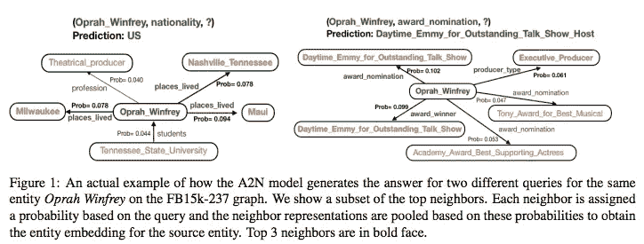

# #NLP365 的第 125 天:NLP 论文摘要— A2N:关注知识图推理的邻居

> 原文：<https://towardsdatascience.com/day-125-of-nlp365-nlp-papers-summary-a2n-attending-to-neighbors-for-knowledge-graph-inference-87305c3aebe2?source=collection_archive---------73----------------------->

阅读和理解研究论文就像拼凑一个未解之谜。汉斯-彼得·高斯特在 [Unsplash](https://unsplash.com/s/photos/research-papers?utm_source=unsplash&utm_medium=referral&utm_content=creditCopyText) 上拍摄的照片。

## [内线艾](https://medium.com/towards-data-science/inside-ai/home) [NLP365](http://towardsdatascience.com/tagged/nlp365)

## NLP 论文摘要是我总结 NLP 研究论文要点的系列文章

项目#NLP365 (+1)是我在 2020 年每天记录我的 NLP 学习旅程的地方。在这里，你可以随意查看我在过去的 270 天里学到了什么。在本文的最后，你可以找到以前的论文摘要，按自然语言处理领域分类:)

今天的 NLP 论文是 ***A2N:参加邻居进行知识图推理*** 。以下是研究论文的要点。

# 目标和贡献

提出了一种新的基于注意力的方法 A2N 来处理知识图(KG)完成任务，该方法结合实体的相关图邻域来计算依赖于查询的实体嵌入。所提出的方法在两个评估数据集上表现出竞争性或优于当前的 SOTA 模型，并且通过定性探测，我们能够探索模型如何围绕知识图跳跃以导出其最终推理。

# KG 完成任务

KG 完成的任务包括从 KG 中填充和推断缺失的实体关系。这通常被公式化为目标实体预测任务，由此给定源实体和关系，目标实体是什么？因此，给定一个 KG，它由(s，r，t)的许多元组组成，其中 s 是源实体，r 是关系，t 是目标实体，我们的目标是在给定 s 和 r 的情况下预测目标实体，使得预测的元组在图中不存在。

大多数基于嵌入的 KG 完成方法涉及为 KG 中的每个元组定义一个评分函数。评分函数可以不同，但它接受源实体、关系和目标实体的嵌入。在本文中，我们使用 DistMult 评分函数。

# A2N 模型

我们提出的 A2N 接受查询，并使用对实体的图邻域的双线性关注来生成依赖于查询的实体嵌入。这种特殊的嵌入随后被用于为查询的目标实体评分。下图展示了在给定两个不同查询的情况下，模型如何对同一节点的相邻节点进行不同评分的示例。

A2N 模型如何生成答案[1]

以下是 A2N 中每个步骤的分解:

1.  每个图形实体有一个初始嵌入\(\tilde{e}⁰\，每个关系 r 有一个嵌入
2.  给定实体和关系的嵌入，我们现在可以将相邻的实体和关系编码到嵌入中。实体 s 的邻居(\(\tilde{n}_i\))的嵌入通过 a)连接初始实体嵌入和关系嵌入以及 b)对其应用线性变换来计算
3.  该模型使用评分函数计算每个相邻嵌入的关注度得分(a_i ),并将其归一化以获得概率(p_i)
4.  步骤 3 给出了每个相邻嵌入在回答查询时的相关程度的概率。我们聚集这些加权的相邻嵌入来生成实体 s 的查询相关嵌入，\(\hat{s}\)
5.  最后，我们将依赖于查询的嵌入与初始的源嵌入连接起来，以创建最终的源嵌入\(\tilde{s}\)

现在我们已经获得了最终的源嵌入，我们可以使用最终的源嵌入、关系嵌入和评分函数来对 KG 中所有可能的目标实体进行评分。这将为我们提供特定查询的潜在实体的排序列表。

# 实验设置和结果

有两个 KG 完井评价数据集:FB15k-237 和 WN18RR。评估度量是正确实体的平均倒数排名(MRR)和 Hits@N，Hits @ N 衡量前 N 个预测的准确性。

## 结果

FB15k-237 和 WN18RR 数据集的总体结果[1]

对于仅针对目标的预测(表 1)，我们的 A2N 模型在两个数据集的所有评估指标上都显著优于之前的 SOTA 性能。对于源和目标预测(表 2)，我们得到了混合的结果。除了 Hits@10，A2N 模型在所有指标上都优于 WN18RR 数据集中的所有模型。然而，在 FB15k-237 数据集上，我们的模型表现不如 ConvE，然而，它仍然实现了接近 SOTA 的竞争性能。

如上图所示，该模型能够根据查询加入同一实体的不同相邻节点，并执行多跳推理。例如，使用相邻的“places _ lived”，实体被映射到相关的嵌入子空间中，并且使用评分函数和关系“nationality”，我们能够为目标实体 US 获得高分，这是我们的模型的最终预测。给定这个例子，我们有一个两跳推理，首先是关于居住的地方，然后是关于这些地方的国家。更多示例见下图。

查询和顶级预测的示例[1]

# 结论和未来工作

所提出的 A2N 模型是可解释的，并且其大小不依赖于实体邻域的数量。潜在的未来工作可能涉及应用这些方法来关注除了图之外的实体的文本提及，以联合推理文本和知识图。

## 来源:

[1]班萨尔，t .，胡安，D.C .，拉维，s .和麦卡勒姆，a .，2019 年 7 月。A2N:关注邻居进行知识图推理。在*计算语言学协会第 57 届年会的会议录*(第 4387–4392 页)。

*原载于 2020 年 5 月 4 日*[*【https://ryanong.co.uk】*](https://ryanong.co.uk/2020/05/04/day-125-nlp-papers-summary-a2n-attending-to-neighbors-for-knowledge-graph-inference/)*。*

# 特征提取/基于特征的情感分析

*   [https://towards data science . com/day-102-of-NLP 365-NLP-papers-summary-implicit-and-explicit-aspect-extraction-in-financial-BDF 00 a 66 db 41](/day-102-of-nlp365-nlp-papers-summary-implicit-and-explicit-aspect-extraction-in-financial-bdf00a66db41)
*   [https://towards data science . com/day-103-NLP-research-papers-utilizing-Bert-for-aspect-based-sense-analysis-via-construction-38ab 3e 1630 a3](/day-103-nlp-research-papers-utilizing-bert-for-aspect-based-sentiment-analysis-via-constructing-38ab3e1630a3)
*   [https://towards data science . com/day-104-of-NLP 365-NLP-papers-summary-senthious-targeted-aspect-based-sensitive-analysis-f 24 a2 EC 1 ca 32](/day-104-of-nlp365-nlp-papers-summary-sentihood-targeted-aspect-based-sentiment-analysis-f24a2ec1ca32)
*   [https://towards data science . com/day-105-of-NLP 365-NLP-papers-summary-aspect-level-sensation-class ification-with-3a 3539 be 6 AE 8](/day-105-of-nlp365-nlp-papers-summary-aspect-level-sentiment-classification-with-3a3539be6ae8)
*   [https://towards data science . com/day-106-of-NLP 365-NLP-papers-summary-an-unsupervised-neural-attention-model-for-aspect-b 874d 007 b 6d 0](/day-106-of-nlp365-nlp-papers-summary-an-unsupervised-neural-attention-model-for-aspect-b874d007b6d0)
*   [https://towardsdatascience . com/day-110-of-NLP 365-NLP-papers-summary-double-embedding-and-CNN-based-sequence-labeling-for-b8a 958 F3 bddd](/day-110-of-nlp365-nlp-papers-summary-double-embeddings-and-cnn-based-sequence-labelling-for-b8a958f3bddd)
*   [https://towards data science . com/day-112-of-NLP 365-NLP-papers-summary-a-challenge-dataset-and-effective-models-for-aspect-based-35b 7 a5 e 245 b5](/day-112-of-nlp365-nlp-papers-summary-a-challenge-dataset-and-effective-models-for-aspect-based-35b7a5e245b5)
*   [https://towardsdatascience . com/day-123-of-NLP 365-NLP-papers-summary-context-aware-embedding-for-targeted-aspect-based-be9f 998d 1131](/day-123-of-nlp365-nlp-papers-summary-context-aware-embedding-for-targeted-aspect-based-be9f998d1131)

# 总结

*   [https://towards data science . com/day-107-of-NLP 365-NLP-papers-summary-make-lead-bias-in-your-favor-a-simple-effective-4c 52 B1 a 569 b 8](/day-107-of-nlp365-nlp-papers-summary-make-lead-bias-in-your-favor-a-simple-and-effective-4c52b1a569b8)
*   [https://towards data science . com/day-109-of-NLP 365-NLP-papers-summary-studing-summary-evaluation-metrics-in-the-619 F5 acb1 b 27](/day-109-of-nlp365-nlp-papers-summary-studying-summarization-evaluation-metrics-in-the-619f5acb1b27)
*   [https://towards data science . com/day-113-of-NLP 365-NLP-papers-summary-on-extractive-and-abstract-neural-document-87168 b 7 e 90 BC](/day-113-of-nlp365-nlp-papers-summary-on-extractive-and-abstractive-neural-document-87168b7e90bc)
*   [https://towards data science . com/day-116-of-NLP 365-NLP-papers-summary-data-driven-summary-of-scientific-articles-3 FBA 016 c 733 b](/day-116-of-nlp365-nlp-papers-summary-data-driven-summarization-of-scientific-articles-3fba016c733b)
*   [https://towards data science . com/day-117-of-NLP 365-NLP-papers-summary-abstract-text-summary-a-low-resource-challenge-61a E6 CDF 32 f](/day-117-of-nlp365-nlp-papers-summary-abstract-text-summarization-a-low-resource-challenge-61ae6cdf32f)
*   [https://towards data science . com/day-118-of-NLP 365-NLP-papers-summary-extractive-summary-of-long-documents-by-combining-AEA 118 a5 eb3f](/day-118-of-nlp365-nlp-papers-summary-extractive-summarization-of-long-documents-by-combining-aea118a5eb3f)
*   [https://towards data science . com/day-120-of-NLP 365-NLP-papers-summary-a-simple-theory-model-of-importance-for-summary-843 ddbcb 9b](/day-120-of-nlp365-nlp-papers-summary-a-simple-theoretical-model-of-importance-for-summarization-843ddbbcb9b)
*   [https://towards data science . com/day-121-of-NLP 365-NLP-papers-summary-concept-pointer-network-for-abstract-summary-CD 55 e 577 f 6 de](/day-121-of-nlp365-nlp-papers-summary-concept-pointer-network-for-abstractive-summarization-cd55e577f6de)
*   [https://towards data science . com/day-124-NLP-papers-summary-tldr-extreme-summary-of-scientific-documents-106 CD 915 F9 a 3](/day-124-nlp-papers-summary-tldr-extreme-summarization-of-scientific-documents-106cd915f9a3)

# 其他人

*   [https://towards data science . com/day-108-of-NLP 365-NLP-papers-summary-simple-Bert-models-for-relation-extraction-and-semantic-98f 7698184 D7](/day-108-of-nlp365-nlp-papers-summary-simple-bert-models-for-relation-extraction-and-semantic-98f7698184d7)
*   [https://towards data science . com/day-111-of-NLP 365-NLP-papers-summary-the-risk-of-race-of-bias-in-hate-speech-detection-BFF 7 F5 f 20 ce 5](/day-111-of-nlp365-nlp-papers-summary-the-risk-of-racial-bias-in-hate-speech-detection-bff7f5f20ce5)
*   [https://towards data science . com/day-115-of-NLP 365-NLP-papers-summary-scibert-a-pre trained-language-model-for-scientific-text-185785598 e33](/day-115-of-nlp365-nlp-papers-summary-scibert-a-pretrained-language-model-for-scientific-text-185785598e33)
*   [https://towards data science . com/day-119-NLP-papers-summary-an-argument-annoted-corpus-of-scientific-publications-d 7 b 9 e 2e ea 1097](/day-119-nlp-papers-summary-an-argument-annotated-corpus-of-scientific-publications-d7b9e2ea1097)
*   [https://towards data science . com/day-122-of-NLP 365-NLP-papers-summary-applying-Bert-to-document-retrieval-with-birch-766 EAC 17 ab](/day-122-of-nlp365-nlp-papers-summary-applying-bert-to-document-retrieval-with-birch-766eaeac17ab)