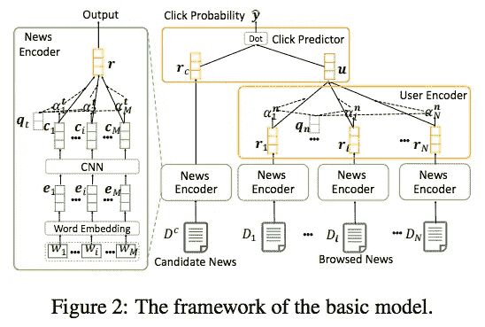
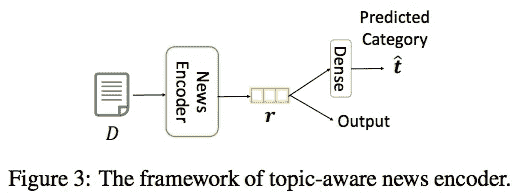
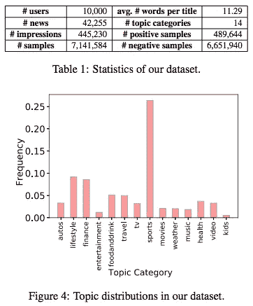
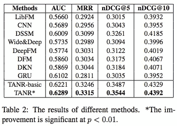
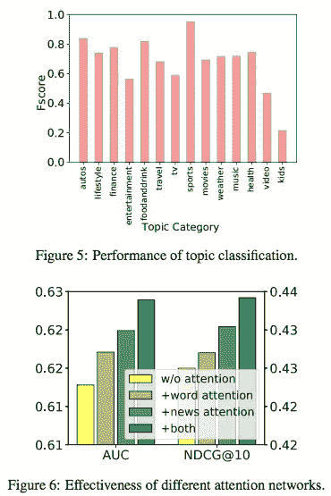
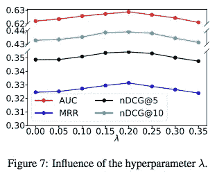

# #NLP365 的第 126 天:NLP 论文摘要-具有话题感知新闻表示的神经新闻推荐

> 原文：<https://towardsdatascience.com/day-126-of-nlp365-nlp-papers-summary-neural-news-recommendation-with-topic-aware-news-4eb9604330bb?source=collection_archive---------66----------------------->

阅读和理解研究论文就像拼凑一个未解之谜。汉斯-彼得·高斯特在 [Unsplash](https://unsplash.com/s/photos/research-papers?utm_source=unsplash&utm_medium=referral&utm_content=creditCopyText) 上拍摄的照片。

## [内线艾](https://medium.com/towards-data-science/inside-ai/home) [NLP365](http://towardsdatascience.com/tagged/nlp365)

## NLP 论文摘要是我总结 NLP 研究论文要点的系列文章

项目#NLP365 (+1)是我在 2020 年每天记录我的 NLP 学习旅程的地方。在这里，你可以随意查看我在过去的 273 天里学到了什么。在本文的最后，你可以找到以前的论文摘要，按自然语言处理领域分类:)

今天的 NLP 论文是 ***带话题感知新闻表示的神经新闻推荐*** 。以下是研究论文的要点。

# 目标和贡献

提出了 TANR，一个具有话题感知新闻嵌入的神经新闻推荐系统。这包括一个主题感知新闻编码器和一个用户编码器。新闻编码器使用 CNN 网络和注意力机制来选择使用新闻标题的重要单词。我们联合训练新闻编码器和辅助主题分类任务。对于用户编码器，我们通过用户阅读过的历史新闻来学习表征，并使用注意机制为用户选择信息丰富的新闻。实验结果表明，该方法提高了新闻推荐的性能。

# 方法学

## 模型架构

整体模型架构[1]

模型架构由三个主要模块组成:

1.  新闻编码器
2.  用户编码器
3.  点击预测器

新闻编码器的目标是从标题中学习新闻表示。有三层。第一层是单词嵌入层，它将标题的单词转换成单词嵌入。第二层是 CNN 层，它接收单词嵌入，并通过捕获本地上下文信息输出上下文单词嵌入。最后一层是关注层，让模型关注标题中更重要的词。这一层生成最终的新闻表示，它是所有上下文单词嵌入的加权和。

用户编码器的目标是从历史浏览新闻中学习用户的表现。这个想法是，历史浏览新闻允许我们捕捉关于特定用户的不同信息/偏好。我们使用新闻编码器对所有浏览过的历史新闻进行编码，获得新闻表示。用户编码器接收这些新闻表示，并对其应用关注机制，以选择给我们提供关于用户的更好信息的关键新闻。最终的用户表征是所有用户历史浏览新闻表征的加权和。

点击预测器的目标是预测用户点击候选新闻的概率。点击预测器采用候选新闻表示和用户表示，并通过采用两个表示之间的内积来计算点击概率分数。

## 话题感知新闻编码器

新闻文章的主题对于新闻推荐很重要，因此包含主题信息将改善新闻和用户的表现。然而，我们有有限的主题信息，所以我们决定联合训练我们的新闻编码器与新闻主题分类模型，如下所示。这给了我们一个话题感知新闻编码器。新闻主题分类模型由新闻编码器和主题预测器模块组成。新闻编码器与新闻推荐模型共享，主题预测器模块用于根据新闻表示预测主题分布(使用 softmax)。使用共享的新闻编码器，新闻编码器将对主题信息进行编码，并由新闻推荐模型使用。联合训练新闻推荐和主题分类任务意味着我们有两个损失要优化。总损失是这两个损失的总和。

话题感知新闻编码器的总体框架[1]

# 实验设置和结果

真实世界的数据集是一个月的 MSN 新闻。数据集和主题分布的统计如下所示。评估指标为 AUC、MRR、nDCG@5 和 nDCG@10。

我们数据集的描述性统计[1]

## 模型比较

1.  *LibFM* 。用于推荐的矩阵分解技术
2.  *DSSM* 。使用历史浏览新闻作为查询来检索候选新闻
3.  *宽&深*。宽线性通道+深度神经网络
4.  *DeepFM* 。使用不同的分解机器和神经网络
5.  *DFM* 。组合不同等级密集层并使用注意机制
6.  *DKN* 。使用知识图中的实体信息
7.  *TANR-基本*。没有话题感知新闻编码器的 TANR

# 结果

使用不同评估指标的总体结果[1]

神经网络模型比传统的矩阵分解技术更好，因为神经网络可以学习更好的新闻和用户表示。TANR 基础和 TANR 都超过了所有的基线模型。TANR 的表现一直优于 TANR-basic，展示了整合新闻主题进行新闻推荐的好处，以及我们联合训练模型的策略的有效性。

就我们的主题分类器的性能而言，F1 结果如下所示。不同主题的分类都很好，除了“孩子”类。这可能是因为“孩子”类的训练数据有限。总的来说，结果表明我们的新闻编码器已经编码了主题信息，这改进了我们的新闻推荐模型的结果。

话题分析和不同注意网络的有效性[1]

在图 6 中，我们展示了使用不同注意力网络的结果。结果表明，新闻级和单词级注意都是有用的，因为它们都优于无注意网络的基线。这又回到了一个假设，即不同的新闻包含关于用户的不同信息，不同的词在表示新闻时具有不同的重要性，我们的注意力网络允许我们挑选最有信息量的新闻和重要的词。结合这两种注意力网络会产生更高的结果。

最后，我们研究了超参数λ的影响。该超参数控制主题分类任务的相对重要性，因为它决定了模型在多大程度上关注主题分类损失函数的优化。下面显示的结果告诉我们，如果 lambda 太低，我们的模型的性能不是最佳的，因为新闻编码器没有学习到足够的主题信息。如果 lambda 太高，模型会过于关注主题分类任务，而忽略了新闻推荐任务。最佳λ似乎是 0.2。

λ超参数的影响[1]

## 来源:

[1]吴，c，吴，f，安，m，黄，y，谢，x，2019，7 月。具有话题感知新闻表示的神经新闻推荐。在*计算语言学协会第 57 届年会的会议录*(第 1154-1159 页)。

*原载于 2020 年 5 月 5 日*[*【https://ryanong.co.uk】*](https://ryanong.co.uk/2020/05/05/day-126-nlp-papers-summary-neural-news-recommendation-with-topic-aware-news-representation/)*。*

# 特征提取/基于特征的情感分析

*   [https://towards data science . com/day-102-of-NLP 365-NLP-papers-summary-implicit-and-explicit-aspect-extraction-in-financial-BDF 00 a 66 db 41](/day-102-of-nlp365-nlp-papers-summary-implicit-and-explicit-aspect-extraction-in-financial-bdf00a66db41)
*   [https://towards data science . com/day-103-NLP-research-papers-utilizing-Bert-for-aspect-based-sensation-analysis-via-construction-38ab 3e 1630 a3](/day-103-nlp-research-papers-utilizing-bert-for-aspect-based-sentiment-analysis-via-constructing-38ab3e1630a3)
*   [https://towards data science . com/day-104-of-NLP 365-NLP-papers-summary-senthious-targeted-aspect-based-sensitive-analysis-f 24 a2 EC 1 ca 32](/day-104-of-nlp365-nlp-papers-summary-sentihood-targeted-aspect-based-sentiment-analysis-f24a2ec1ca32)
*   [https://towards data science . com/day-105-of-NLP 365-NLP-papers-summary-aspect-level-sensation-class ification-with-3a 3539 be 6 AE 8](/day-105-of-nlp365-nlp-papers-summary-aspect-level-sentiment-classification-with-3a3539be6ae8)
*   [https://towardsdatascience . com/day-106-of-NLP 365-NLP-papers-summary-an-unsupervised-neural-attention-model-for-aspect-b 874d 007 b 6d 0](/day-106-of-nlp365-nlp-papers-summary-an-unsupervised-neural-attention-model-for-aspect-b874d007b6d0)
*   [https://towardsdatascience . com/day-110-of-NLP 365-NLP-papers-summary-double-embedding-and-CNN-based-sequence-labeling-for-b8a 958 F3 bddd](/day-110-of-nlp365-nlp-papers-summary-double-embeddings-and-cnn-based-sequence-labelling-for-b8a958f3bddd)
*   [https://towards data science . com/day-112-of-NLP 365-NLP-papers-summary-a-challenge-dataset-and-effective-models-for-aspect-based-35b 7 a5 e 245 b5](/day-112-of-nlp365-nlp-papers-summary-a-challenge-dataset-and-effective-models-for-aspect-based-35b7a5e245b5)
*   [https://towards data science . com/day-123-of-NLP 365-NLP-papers-summary-context-aware-embedding-for-targeted-aspect-based-be9f 998d 1131](/day-123-of-nlp365-nlp-papers-summary-context-aware-embedding-for-targeted-aspect-based-be9f998d1131)

# 总结

*   [https://towards data science . com/day-107-of-NLP 365-NLP-papers-summary-make-lead-bias-in-your-favor-a-simple-effective-4c 52 B1 a 569 b 8](/day-107-of-nlp365-nlp-papers-summary-make-lead-bias-in-your-favor-a-simple-and-effective-4c52b1a569b8)
*   [https://towards data science . com/day-109-of-NLP 365-NLP-papers-summary-studing-summary-evaluation-metrics-in-the-619 F5 acb1 b 27](/day-109-of-nlp365-nlp-papers-summary-studying-summarization-evaluation-metrics-in-the-619f5acb1b27)
*   [https://towards data science . com/day-113-of-NLP 365-NLP-papers-summary-on-extractive-and-abstract-neural-document-87168 b 7 e 90 BC](/day-113-of-nlp365-nlp-papers-summary-on-extractive-and-abstractive-neural-document-87168b7e90bc)
*   [https://towards data science . com/day-116-of-NLP 365-NLP-papers-summary-data-driven-summary-of-scientific-articles-3 FBA 016 c 733 b](/day-116-of-nlp365-nlp-papers-summary-data-driven-summarization-of-scientific-articles-3fba016c733b)
*   [https://towards data science . com/day-117-of-NLP 365-NLP-papers-summary-abstract-text-summary-a-low-resource-challenge-61 AE 6 CDF 32 f](/day-117-of-nlp365-nlp-papers-summary-abstract-text-summarization-a-low-resource-challenge-61ae6cdf32f)
*   [https://towards data science . com/day-118-of-NLP 365-NLP-papers-summary-extractive-summary-of-long-documents-by-combining-AEA 118 a5 eb3f](/day-118-of-nlp365-nlp-papers-summary-extractive-summarization-of-long-documents-by-combining-aea118a5eb3f)
*   [https://towards data science . com/day-120-of-NLP 365-NLP-papers-summary-a-simple-theory-model-of-importance-for-summary-843 ddbcb 9b](/day-120-of-nlp365-nlp-papers-summary-a-simple-theoretical-model-of-importance-for-summarization-843ddbbcb9b)
*   [https://towards data science . com/day-121-of-NLP 365-NLP-papers-summary-concept-pointer-network-for-abstract-summary-cd55e 577 F6 de](/day-121-of-nlp365-nlp-papers-summary-concept-pointer-network-for-abstractive-summarization-cd55e577f6de)
*   [https://towards data science . com/day-124-NLP-papers-summary-tldr-extreme-summary-of-scientific-documents-106 CD 915 F9 a 3](/day-124-nlp-papers-summary-tldr-extreme-summarization-of-scientific-documents-106cd915f9a3)

# 其他人

*   [https://towards data science . com/day-108-of-NLP 365-NLP-papers-summary-simple-Bert-models-for-relation-extraction-and-semantic-98f 7698184 D7](/day-108-of-nlp365-nlp-papers-summary-simple-bert-models-for-relation-extraction-and-semantic-98f7698184d7)
*   [https://towards data science . com/day-111-of-NLP 365-NLP-papers-summary-the-risk-of-race-of-bias-in-hate-speech-detection-BFF 7 F5 f 20 ce 5](/day-111-of-nlp365-nlp-papers-summary-the-risk-of-racial-bias-in-hate-speech-detection-bff7f5f20ce5)
*   [https://towards data science . com/day-115-of-NLP 365-NLP-papers-summary-scibert-a-pre trained-language-model-for-scientific-text-185785598 e33](/day-115-of-nlp365-nlp-papers-summary-scibert-a-pretrained-language-model-for-scientific-text-185785598e33)
*   [https://towards data science . com/day-119-NLP-papers-summary-an-argument-annoted-corpus-of-scientific-publications-d 7 b 9 e 2e ea 1097](/day-119-nlp-papers-summary-an-argument-annotated-corpus-of-scientific-publications-d7b9e2ea1097)
*   [https://towards data science . com/day-122-of-NLP 365-NLP-papers-summary-applying-Bert-to-document-retrieval-with-birch-766 EAC 17 ab](/day-122-of-nlp365-nlp-papers-summary-applying-bert-to-document-retrieval-with-birch-766eaeac17ab)
*   [https://towards data science . com/day-125-of-NLP 365-NLP-papers-summary-a2n-attending-to-neighbors-for-knowledge-graph-inference-87305 C3 aebe 2](/day-125-of-nlp365-nlp-papers-summary-a2n-attending-to-neighbors-for-knowledge-graph-inference-87305c3aebe2)