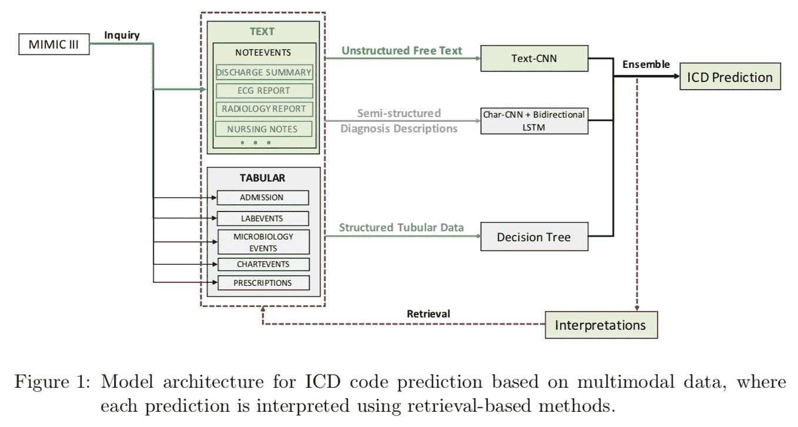
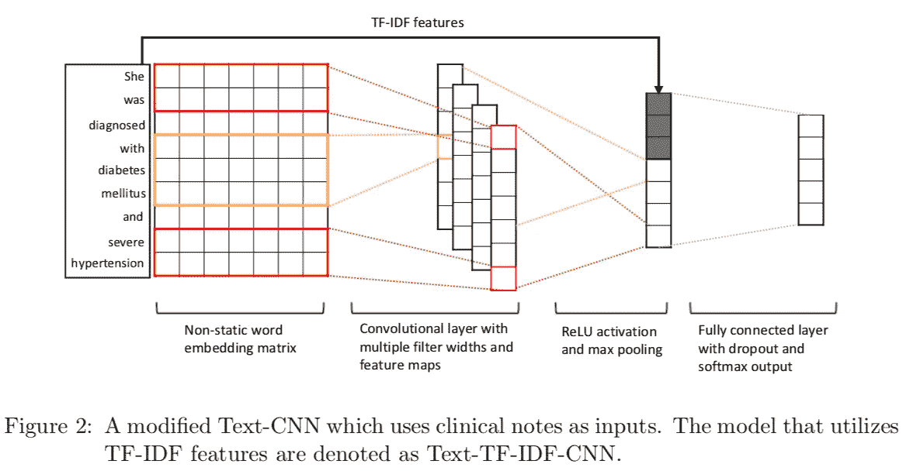
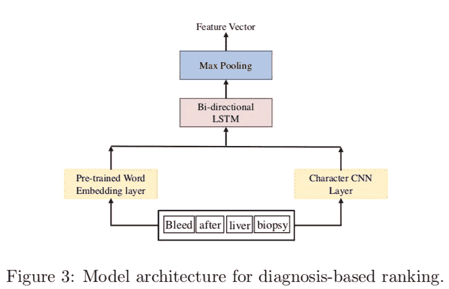
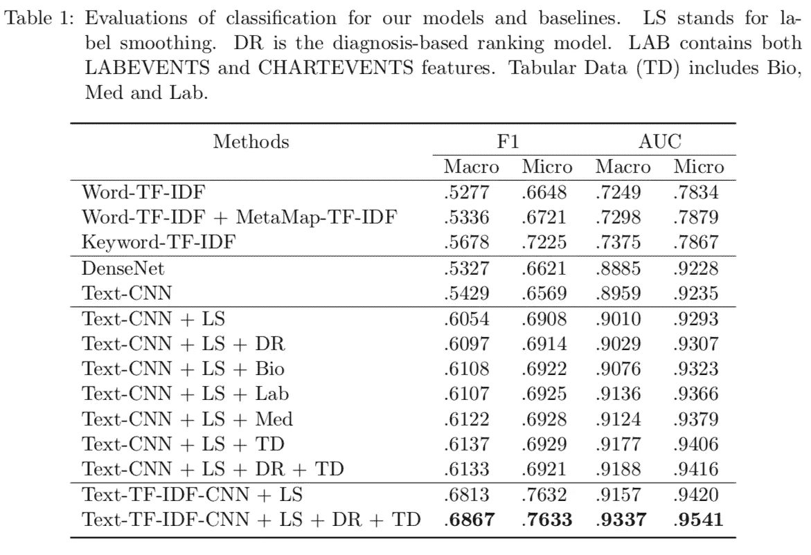
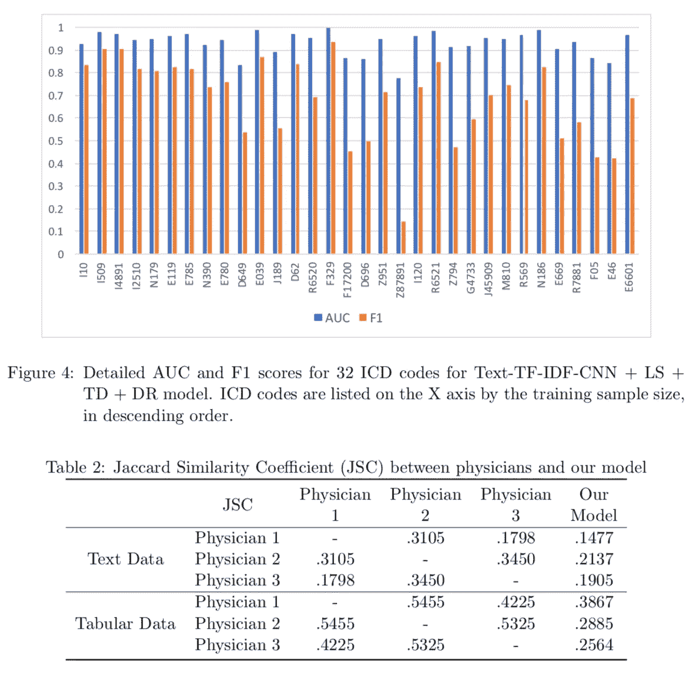

# #NLP365 的第 140 天:NLP 论文摘要——自动 ICD 编码的多模态机器学习

> 原文：<https://towardsdatascience.com/day-140-of-nlp365-nlp-papers-summary-multimodal-machine-learning-for-automated-icd-coding-b32e02997ea2?source=collection_archive---------63----------------------->

阅读和理解研究论文就像拼凑一个未解之谜。汉斯-彼得·高斯特在 [Unsplash](https://unsplash.com/s/photos/research-papers?utm_source=unsplash&utm_medium=referral&utm_content=creditCopyText) 上拍摄的照片。

## [内线艾](https://medium.com/towards-data-science/inside-ai/home) [NLP365](http://towardsdatascience.com/tagged/nlp365)

## NLP 论文摘要是我总结 NLP 研究论文要点的系列文章

项目#NLP365 (+1)是我在 2020 年每天记录我的 NLP 学习旅程的地方。在这里，你可以随意查看我在过去的 273 天里学到了什么。在本文的最后，你可以找到以前的论文摘要，按自然语言处理领域分类:)

今天的 NLP 论文是 ***自动 ICD 编码的多模态机器学习*** 。以下是研究论文的要点。

# 目标和贡献

提出了一种新的预测 ICD-10 编码的多模态机器学习模型。这个模型是一个集合模型，它结合了三种不同的 ML 模型，这三种模型是为处理三种不同的数据类型而开发的:非结构化、半结构化和结构化数据。我们的模型优于所有的基线模型，并且具有离医生不远的高解释水平。

# 临床 ICD 景观

ICD 是诊断和程序代码的医学分类列表。这些代码广泛用于诊断信息的报销、存储和检索。分配 ICD 代码的过程非常耗时，因为临床编码员需要从电子病历(EMR)中提取关键信息并分配正确的代码。编码错误很常见，而且代价高昂。EMR 通常以三种不同的形式存储数据:

1.  *非结构化文本*。护理记录、实验室报告、测试报告和出院总结
2.  *半结构化文本*。描述医生所写诊断的结构化短语列表
3.  *结构化表格数据*。包含处方和临床测量，如数值测试结果

# 资料组

评估数据集是重症监护 III (MIMIC-III)的医疗信息集市。总共有 44，659 人被录取。诊断代码从原来的 ICD-9 映射到 ICD-10(一对一)。该数据集涵盖了 32 个 ICD 代码，它们是 MIMIC-III 和美国一家国立医院中的前 50 个频率。共有 6 张桌子:

1.  *录取*。病人入院的所有信息
2.  *标签*。所有实验室测量
3.  *药方*。与订单条目相关的药物
4.  *微生物学*。微生物信息
5.  *图表事件*患者常规体征和其他相关健康信息的所有图表数据
6.  *注意事件*。所有记录，包括护理和医生记录、出院总结和超声心动图报告

# 方法学

整体架构的集成模型的三个不同类型的模型，涵盖不同类型的数据集[1]

上图是我们基于集成的模型，它结合了以下三种不同的 ML 模型:

1.  *Text-CNN* 。用于非结构化文本的多标签分类
2.  *Char-CNN + BiLSTM* 。用于分析诊断描述和 ICD 代码描述之间的语义相似性
3.  *决策树*。将结构化数字特征转换为二进制特征以分类 ICD 码

在推理过程中，我们的模型结合了三个最大似然模型进行预测，并从原始数据中提取关键证据进行检验，以提高可解释性。

## 文本-CNN

对于非结构化数据，我们有 Noteevents。这包括两个步骤:

1.  *数据预处理*
2.  *正文-CNN 分类*

对于数据预处理，对步骤 2 的输入进行简单的清理和标准化。对于步骤 2，我们使用 Text-CNN 进行多标签分类。我们还修改了 Text-CNN 来开发 TEXT-TF-IDF-CNN，如下所示。该模型包括从非结构化指南中提取的关键字和短语的 TFIDF 向量，以模拟临床指南经常用于指导诊断的真实世界情况。额外的 TFIDF 输入馈入 Text-CNN 的全连接层。

非结构化数据的模型架构[1]

数据集中存在类别不平衡，这可能会降低我们的 ML 模型的性能，因此我们决定使用标签平滑正则化(LSR)，这可以防止我们的分类器在训练期间对标签过于确定。

## Char-CNN + BiLSTM

临床编码人员经常试图提取临床记录中的关键短语和句子，并将其分配给适当的 ICD 编码。最常见的是，编码描述和诊断描述之间存在紧密的语义相似性。我们将此过程公式化为基于诊断的排序(DR)问题，其中所有代码描述都在低维密集向量空间中表示。在推理过程中，诊断描述被映射到相同的向量空间，并且基于诊断向量和每个编码向量之间的距离对 ICD 码进行排序。因此，我们决定采用如下所示的架构。

半结构化数据的模型架构[1]

我们使用字符级 CNN 和预训练的单词嵌入将诊断和 ICD 编码描述编码到同一个空间。单词嵌入是在 PubMed 上预先训练的，PubMed 包含超过 550，000 篇生物医学论文。然后，编码的嵌入被馈送到 biLSTM 和 max-pooling 层，以生成最终的特征向量。

损失函数通过最小化诊断实例和阳性实例(阳性对)之间的距离以及最大化诊断实例和阴性实例(阴性对)之间的距离来捕捉实例之间的相对相似性。距离是用欧几里得度量的。MIMIC-III 数据集没有 ICD 代码和诊断的一对一映射，因此我们在网上爬行以提取 ICD-10 代码的同义词。每个 ICD 电码的所有同义词都是正面例子。使用类似于代码描述的 n-grams 来创建反例。

## 决策图表

表 2-5 都是表格数据。我们的方法是对表中的二进制特征应用决策树，并利用一对多策略进行多标签分类。为了消除班级不平衡，来自少数民族班级的样本被赋予更高的权重。

## 模型集成

在推理期间，我们的集合模型采用从三个单独模型预测的概率的加权和来计算每个类别的最终预测概率。

## 可解释性方法

为了识别导致预测的 ICD 码的关键短语，我们试图捕捉单词 w 和 ICD 码 y 之间的关联强度。我们通过从我们的神经网络中提取连接 w 和 y 的所有路径并计算影响分数来实现这一点。然后将所有路径的分数相加，以测量关联强度。为了捕捉关键短语，我们组合了具有非零分数的连续单词，并按照最高分数对它们进行排序。排名靠前的短语被认为是确定特定 ICD 码预测的重要信号。

对于每个表格特征，我们使用局部可解释的模型不可知解释(LIME)来计算该特征对模型最终预测的重要性。

# 实验设置和结果

我们使用两个评估指标来衡量模型的分类性能和可解释性:

1.  *分类*。F1 和 AUC 来测量精度和召回率，并总结不同阈值下的性能
2.  *可解释性*。Jaccard 相似性系数(JSC)来衡量提取的证据和医生的注释之间的重叠

## 结果

模拟数据集的总体结果[1]

我们使用 TFIDF 的不同变体作为基线。大多数模型都是基于 CNN 的。vanilla Text-CNN 和 DenseNet 在 F1 得分方面与基线模型表现相似，在 AUC 得分方面优于基线模型。如 F1 和 AUC 分数的显著改善所示，标签平滑在缓解类别不平衡问题方面是有效的。基于诊断的分级显示了类似的改善。

随着我们转向不同的系综模型，我们的 F1 和 AUC 得分表现持续增长。Text-CNN + LS + DR + TD 显示，与普通 Text-CNN 相比，macro-F1 得分提高了 7%,其他指标也有类似的提高。这展示了我们的集成方法的有效性。

在最后一节中，我们展示了通过以 TFIDF 特征向量的形式合并临床指南，在性能方面的进一步强大改进。这表明在没有外部临床指南的情况下，宏观 F1 评分比表现最好的集合模型增加了 7%。我们的 Text-TFIDF-CNN + LS + DR + TD 优于所有基线和集合模型，这告诉我们，将外部知识结合到分类任务中会显著提高模型的性能。

AUC、F1 和 Jaccard 相似性得分[1]

在可解释性评估方面，我们从 5 个 ICD-10 编码中收集了 25 个样本的测试集，并由 3 名有经验的医生对它们进行了注释。我们将从我们的模型中提取的 top-k 短语与人类注释进行比较，并测量它们之间的重叠分数。结果如上表 2 所示。平均而言，我们的模型对于文本数据获得了 0.1806 的 JSC。我们的模型能够捕捉与特定疾病直接相关的短语，或者为最终预测提供间接关系。

在表格数据方面，我们选择了 LIME 发现的 k 个最重要的特征作为模型预测的证据。同样，我们计算了这些特征和人工注释之间的重叠分数，结果显示在表 2 中。人类注释者之间的平均 JSC 是 0.5，高于我们的模型和人类注释者之间的平均 JSC 0.31。总的来说，我们的模型能够捕获比人类注释者更多的特征，其中一些特征对于诊断是有用的，而人类注释者没有发现。

# 结论和未来工作

总的来说，我们的集成模型优于所有的基线方法，我们看到通过将人类知识融入模型中，性能得到了进一步的提高。此外，我们的模型的预测更容易解释。潜在的未来工作包括扩大编码列表，减少表格数据的特征维数，以及进一步研究添加人类知识的不同方法可以产生更好的结果。

## 来源:

[1] Xu，k .，Lam，m .，Pang，j .，Gao，x .，Band，c .，Mathur，p .，Papay，f .，Khanna，A.K .，Cywinski，J.B .，Maheshwari，k .和 Xie，p .，2019 年 10 月。自动 ICD 编码的多模态机器学习。在*医疗保健机器学习会议*(第 197-215 页)。PMLR。

*原载于 2020 年 5 月 19 日***。**

# *特征提取/基于特征的情感分析*

*   *[https://towards data science . com/day-102-of-NLP 365-NLP-papers-summary-implicit-and-explicit-aspect-extraction-in-financial-BDF 00 a 66 db 41](/day-102-of-nlp365-nlp-papers-summary-implicit-and-explicit-aspect-extraction-in-financial-bdf00a66db41)*
*   *[https://towards data science . com/day-103-NLP-research-papers-utilizing-Bert-for-aspect-based-sense-analysis-via-construction-38ab 3e 1630 a3](/day-103-nlp-research-papers-utilizing-bert-for-aspect-based-sentiment-analysis-via-constructing-38ab3e1630a3)*
*   *[https://towards data science . com/day-104-of-NLP 365-NLP-papers-summary-senthious-targeted-aspect-based-sensitive-analysis-f 24 a2 EC 1 ca 32](/day-104-of-nlp365-nlp-papers-summary-sentihood-targeted-aspect-based-sentiment-analysis-f24a2ec1ca32)*
*   *[https://towards data science . com/day-105-of-NLP 365-NLP-papers-summary-aspect-level-sensation-class ification-with-3a 3539 be 6 AE 8](/day-105-of-nlp365-nlp-papers-summary-aspect-level-sentiment-classification-with-3a3539be6ae8)*
*   *[https://towards data science . com/day-106-of-NLP 365-NLP-papers-summary-an-unsupervised-neural-attention-model-for-aspect-b 874d 007 b 6d 0](/day-106-of-nlp365-nlp-papers-summary-an-unsupervised-neural-attention-model-for-aspect-b874d007b6d0)*
*   *[https://towards data science . com/day-110-of-NLP 365-NLP-papers-summary-double-embedding-and-CNN-based-sequence-labeling-for-b8a 958 F3 bddd](/day-110-of-nlp365-nlp-papers-summary-double-embeddings-and-cnn-based-sequence-labelling-for-b8a958f3bddd)*
*   *[https://towards data science . com/day-112-of-NLP 365-NLP-papers-summary-a-challenge-dataset-and-effective-models-for-aspect-based-35b 7 a5 e 245 b5](/day-112-of-nlp365-nlp-papers-summary-a-challenge-dataset-and-effective-models-for-aspect-based-35b7a5e245b5)*
*   *[https://towards data science . com/day-123-of-NLP 365-NLP-papers-summary-context-aware-embedding-for-targeted-aspect-based-be9f 998d 1131](/day-123-of-nlp365-nlp-papers-summary-context-aware-embedding-for-targeted-aspect-based-be9f998d1131)*

# *总结*

*   *[https://towards data science . com/day-107-of-NLP 365-NLP-papers-summary-make-lead-bias-in-your-favor-a-simple-effective-4c 52 B1 a 569 b 8](/day-107-of-nlp365-nlp-papers-summary-make-lead-bias-in-your-favor-a-simple-and-effective-4c52b1a569b8)*
*   *[https://towards data science . com/day-109-of-NLP 365-NLP-papers-summary-studing-summary-evaluation-metrics-in-the-619 F5 acb1b 27](/day-109-of-nlp365-nlp-papers-summary-studying-summarization-evaluation-metrics-in-the-619f5acb1b27)*
*   *[https://towards data science . com/day-113-of-NLP 365-NLP-papers-summary-on-extractive-and-abstract-neural-document-87168 b 7 e 90 BC](/day-113-of-nlp365-nlp-papers-summary-on-extractive-and-abstractive-neural-document-87168b7e90bc)*
*   *[https://towards data science . com/day-116-of-NLP 365-NLP-papers-summary-data-driven-summary-of-scientific-articles-3 FBA 016 c 733 b](/day-116-of-nlp365-nlp-papers-summary-data-driven-summarization-of-scientific-articles-3fba016c733b)*
*   *[https://towards data science . com/day-117-of-NLP 365-NLP-papers-summary-abstract-text-summary-a-low-resource-challenge-61a E6 CDF 32 f](/day-117-of-nlp365-nlp-papers-summary-abstract-text-summarization-a-low-resource-challenge-61ae6cdf32f)*
*   *[https://towards data science . com/day-118-of-NLP 365-NLP-papers-summary-extractive-summary-of-long-documents-by-combining-AEA 118 a5 eb3f](/day-118-of-nlp365-nlp-papers-summary-extractive-summarization-of-long-documents-by-combining-aea118a5eb3f)*
*   *[https://towards data science . com/day-120-of-NLP 365-NLP-papers-summary-a-simple-theory-model-of-importance-for-summary-843 ddbcb 9b](/day-120-of-nlp365-nlp-papers-summary-a-simple-theoretical-model-of-importance-for-summarization-843ddbbcb9b)*
*   *[https://towards data science . com/day-121-of-NLP 365-NLP-papers-summary-concept-pointer-network-for-abstract-summary-cd55e 577 F6 de](/day-121-of-nlp365-nlp-papers-summary-concept-pointer-network-for-abstractive-summarization-cd55e577f6de)*
*   *[https://towards data science . com/day-124-NLP-papers-summary-tldr-extreme-summary-of-scientific-documents-106 CD 915 F9 a 3](/day-124-nlp-papers-summary-tldr-extreme-summarization-of-scientific-documents-106cd915f9a3)*

# *其他人*

*   *[https://towards data science . com/day-108-of-NLP 365-NLP-papers-summary-simple-Bert-models-for-relation-extraction-and-semantic-98f 7698184 D7](/day-108-of-nlp365-nlp-papers-summary-simple-bert-models-for-relation-extraction-and-semantic-98f7698184d7)*
*   *[https://towards data science . com/day-111-of-NLP 365-NLP-papers-summary-the-risk-of-race-of-bias-in-hate-speech-detection-BFF 7 F5 f 20 ce 5](/day-111-of-nlp365-nlp-papers-summary-the-risk-of-racial-bias-in-hate-speech-detection-bff7f5f20ce5)*
*   *[https://towards data science . com/day-115-of-NLP 365-NLP-papers-summary-scibert-a-pre trained-language-model-for-scientific-text-185785598 e33](/day-115-of-nlp365-nlp-papers-summary-scibert-a-pretrained-language-model-for-scientific-text-185785598e33)*
*   *[https://towards data science . com/day-119-NLP-papers-summary-an-argument-annoted-corpus-of-scientific-publications-d 7 b 9 e 2e ea 1097](/day-119-nlp-papers-summary-an-argument-annotated-corpus-of-scientific-publications-d7b9e2ea1097)*
*   *[https://towards data science . com/day-122-of-NLP 365-NLP-papers-summary-applying-Bert-to-document-retrieval-with-birch-766 EAC 17 ab](/day-122-of-nlp365-nlp-papers-summary-applying-bert-to-document-retrieval-with-birch-766eaeac17ab)*
*   *[https://towards data science . com/day-125-of-NLP 365-NLP-papers-summary-a2n-attending-to-neighbors-for-knowledge-graph-inference-87305 C3 aebe 2](/day-125-of-nlp365-nlp-papers-summary-a2n-attending-to-neighbors-for-knowledge-graph-inference-87305c3aebe2)*
*   *[https://towards data science . com/day-126-of-NLP 365-NLP-papers-summary-neural-news-recommendation-with-topic-aware-news-4eb 9604330 bb](/day-126-of-nlp365-nlp-papers-summary-neural-news-recommendation-with-topic-aware-news-4eb9604330bb)*