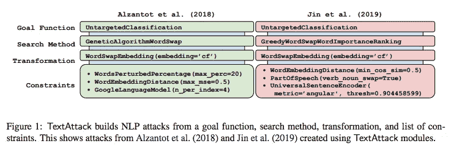
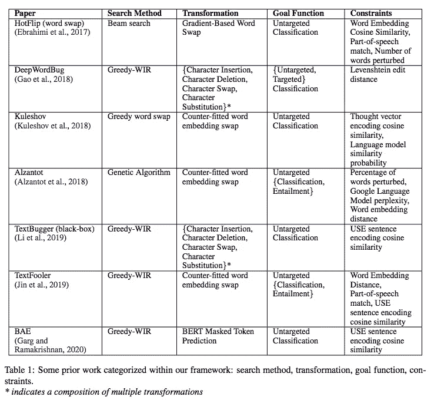

# #NLP365 第 141 天:NLP 论文摘要—文本攻击:自然语言处理中对抗性攻击的框架

> 原文：<https://towardsdatascience.com/day-141-of-nlp365-nlp-papers-summary-textattack-a-framework-for-adversarial-attacks-in-aac2a282d72c?source=collection_archive---------63----------------------->

阅读和理解研究论文就像拼凑一个未解之谜。汉斯-彼得·高斯特在 [Unsplash](https://unsplash.com/s/photos/research-papers?utm_source=unsplash&utm_medium=referral&utm_content=creditCopyText) 上拍摄的照片。

## [内线艾](https://medium.com/towards-data-science/inside-ai/home) [NLP365](http://towardsdatascience.com/tagged/nlp365)

## NLP 论文摘要是我总结 NLP 研究论文要点的系列文章

项目#NLP365 (+1)是我在 2020 年每天记录我的 NLP 学习旅程的地方。在这里，你可以随意查看我在过去的 273 天里学到了什么。在本文的最后，你可以找到以前的论文摘要，按自然语言处理领域分类:)

今天的 NLP 论文是 ***TextAttack:自然语言处理中对抗性攻击的框架*** 。以下是研究论文的要点。

# 目标和贡献

介绍了 TextAttack，这是一个 python 库，可以对自然语言处理(NLP)模型进行对抗性攻击。TextAttack 可以使用它的四个组件创建不同的攻击变体:搜索方法、目标函数、转换和约束集。TextAttack 目前支持对文本分类和蕴涵的攻击，由于其模块化设计，它可以很容易地扩展到其他 NLP 任务和模型。Github 回购在 https://github.com/QData/TextAttack[这里](https://github.com/QData/TextAttack)。

# NLP 攻击的组成是什么？

NLP 攻击的目标是给定一个输入序列 x，我们想要扰乱它并向它添加噪声以创建 x_adversarial，使得 x_adversarial 满足特定的目标函数和语言约束。总的来说，每个攻击都可以使用四个不同的组件来构建:

1.  目标函数
2.  约束集
3.  转换
4.  搜索方法

## 目标函数

该组件根据模型输出来定义攻击的成功程度，它因任务而异。它接受一个输入 x，并确定攻击是否完成。

## 限制

该组件设置控制扰动是否有效的约束。一个扰动只有在满足每个攻击的约束条件时才被认为是有效的。TextAttack 中目前有三种类型的约束:

1.  *编辑距离*。这度量了原始 x 和敌对 x 之间的相似性。TextAttack 具有不同的编辑距离度量，包括最大 BLEU 分数差、流星分数差、Levenshtein 编辑距离等等
2.  *语法性*。这是为了防止在制造敌对攻击时出现任何语法错误。这是由词性一致性和文本攻击中语法错误的最大数量决定的
3.  *语义*。这试图在创建对抗性攻击 x 时保留 x 的原始含义。这由最小余弦相似性、不同的句子编码器和语言模型来控制

## 转换

该组件负责接收输入并返回所有可能的候选扰动。我们将转换分为两类:

1.  *白盒*。可以访问模型，并可以检查其参数以帮助转换。例如，基于当前输入单词向量寻找候选替换单词
2.  *黑匣子*。确定候选扰动时无权访问模型

TextAttack 中目前有四种转换:嵌入空间中的单词交换、使用 WordNet 的单词交换、带有字符转换的单词交换，以及返回多个转换结果的复合转换。

## 搜索方法

该组件从变换组件获取候选扰动集，并搜索满足目标函数并满足所有约束的扰动。TextAttack 目前支持以下搜索算法:

1.  贪婪于单词重要性排名
2.  波束搜索
3.  遗传算法

TextAttack 的模块化允许我们将现有作品的许多不同攻击实现到一个共享库中。下表和下图展示了我们使用 TextAttack 实施的一些现有 NLP 攻击:

TextAttack 工作原理概述[1]

现有的前期工作[1]

# 使用 TextAttack 进行研究

您可以使用 TextAttack 库来衡量现有 NLP 模型的健壮性。该库可以在任何深度学习框架中实现，使用实现每个组件所需功能的基础抽象类可以很容易地形成新的攻击。这使得研究人员可以简单地在核心组件之上添加新的组件，以形成新的攻击。最后，有许多方法可以可视化连接结果，包括命令行、csv 文件、HTML 表格、演示 web 应用程序等等。

# 结论和未来工作

潜在的未来工作是向我们的 TextAttack 添加新的组件和攻击，以支持将来更容易的 NLP 攻击的开发和比较。

## 来源:

[1] Morris，J.X .，Lifland，e .，Yoo，J.Y .和 Qi，y .，2020 .文本攻击:自然语言处理中对抗性攻击的框架。 *arXiv 预印本 arXiv:2005.05909* 。

*原载于 2020 年 5 月 20 日 https://ryanong.co.uk***。**

# *特征提取/基于特征的情感分析*

*   *[https://towards data science . com/day-102-of-NLP 365-NLP-papers-summary-implicit-and-explicit-aspect-extraction-in-financial-BDF 00 a 66 db 41](/day-102-of-nlp365-nlp-papers-summary-implicit-and-explicit-aspect-extraction-in-financial-bdf00a66db41)*
*   *[https://towards data science . com/day-103-NLP-research-papers-utilizing-Bert-for-aspect-based-sense-analysis-via-construction-38ab 3e 1630 a3](/day-103-nlp-research-papers-utilizing-bert-for-aspect-based-sentiment-analysis-via-constructing-38ab3e1630a3)*
*   *[https://towards data science . com/day-104-of-NLP 365-NLP-papers-summary-senthious-targeted-aspect-based-sensitive-analysis-f 24 a2 EC 1 ca 32](/day-104-of-nlp365-nlp-papers-summary-sentihood-targeted-aspect-based-sentiment-analysis-f24a2ec1ca32)*
*   *[https://towards data science . com/day-105-of-NLP 365-NLP-papers-summary-aspect-level-sensation-class ification-with-3a 3539 be 6 AE 8](/day-105-of-nlp365-nlp-papers-summary-aspect-level-sentiment-classification-with-3a3539be6ae8)*
*   *[https://towards data science . com/day-106-of-NLP 365-NLP-papers-summary-an-unsupervised-neural-attention-model-for-aspect-b 874d 007 b 6d 0](/day-106-of-nlp365-nlp-papers-summary-an-unsupervised-neural-attention-model-for-aspect-b874d007b6d0)*
*   *[https://towardsdatascience . com/day-110-of-NLP 365-NLP-papers-summary-double-embedding-and-CNN-based-sequence-labeling-for-b8a 958 F3 bddd](/day-110-of-nlp365-nlp-papers-summary-double-embeddings-and-cnn-based-sequence-labelling-for-b8a958f3bddd)*
*   *[https://towards data science . com/day-112-of-NLP 365-NLP-papers-summary-a-challenge-dataset-and-effective-models-for-aspect-based-35b 7 a5 e 245 b5](/day-112-of-nlp365-nlp-papers-summary-a-challenge-dataset-and-effective-models-for-aspect-based-35b7a5e245b5)*
*   *[https://towards data science . com/day-123-of-NLP 365-NLP-papers-summary-context-aware-embedding-for-targeted-aspect-based-be9f 998d 1131](/day-123-of-nlp365-nlp-papers-summary-context-aware-embedding-for-targeted-aspect-based-be9f998d1131)*

# *总结*

*   *[https://towards data science . com/day-107-of-NLP 365-NLP-papers-summary-make-lead-bias-in-your-favor-a-simple-effective-4c 52 B1 a 569 b 8](/day-107-of-nlp365-nlp-papers-summary-make-lead-bias-in-your-favor-a-simple-and-effective-4c52b1a569b8)*
*   *[https://towards data science . com/day-109-of-NLP 365-NLP-papers-summary-studing-summary-evaluation-metrics-in-the-619 F5 acb1 b 27](/day-109-of-nlp365-nlp-papers-summary-studying-summarization-evaluation-metrics-in-the-619f5acb1b27)*
*   *[https://towards data science . com/day-113-of-NLP 365-NLP-papers-summary-on-extractive-and-abstract-neural-document-87168 b 7 e 90 BC](/day-113-of-nlp365-nlp-papers-summary-on-extractive-and-abstractive-neural-document-87168b7e90bc)*
*   *[https://towards data science . com/day-116-of-NLP 365-NLP-papers-summary-data-driven-summary-of-scientific-articles-3 FBA 016 c 733 b](/day-116-of-nlp365-nlp-papers-summary-data-driven-summarization-of-scientific-articles-3fba016c733b)*
*   *[https://towards data science . com/day-117-of-NLP 365-NLP-papers-summary-abstract-text-summary-a-low-resource-challenge-61a E6 CDF 32 f](/day-117-of-nlp365-nlp-papers-summary-abstract-text-summarization-a-low-resource-challenge-61ae6cdf32f)*
*   *[https://towards data science . com/day-118-of-NLP 365-NLP-papers-summary-extractive-summary-of-long-documents-by-combining-AEA 118 a5 eb3f](/day-118-of-nlp365-nlp-papers-summary-extractive-summarization-of-long-documents-by-combining-aea118a5eb3f)*
*   *[https://towards data science . com/day-120-of-NLP 365-NLP-papers-summary-a-simple-theory-model-of-importance-for-summary-843 ddbcb 9b](/day-120-of-nlp365-nlp-papers-summary-a-simple-theoretical-model-of-importance-for-summarization-843ddbbcb9b)*
*   *[https://towards data science . com/day-121-of-NLP 365-NLP-papers-summary-concept-pointer-network-for-abstract-summary-cd55e 577 F6 de](/day-121-of-nlp365-nlp-papers-summary-concept-pointer-network-for-abstractive-summarization-cd55e577f6de)*
*   *[https://towards data science . com/day-124-NLP-papers-summary-tldr-extreme-summary-of-scientific-documents-106 CD 915 F9 a 3](/day-124-nlp-papers-summary-tldr-extreme-summarization-of-scientific-documents-106cd915f9a3)*

# *其他人*

*   *[https://towards data science . com/day-108-of-NLP 365-NLP-papers-summary-simple-Bert-models-for-relation-extraction-and-semantic-98f 7698184 D7](/day-108-of-nlp365-nlp-papers-summary-simple-bert-models-for-relation-extraction-and-semantic-98f7698184d7)*
*   *[https://towards data science . com/day-111-of-NLP 365-NLP-papers-summary-the-risk-of-race-of-bias-in-hate-speech-detection-BFF 7 F5 f 20 ce 5](/day-111-of-nlp365-nlp-papers-summary-the-risk-of-racial-bias-in-hate-speech-detection-bff7f5f20ce5)*
*   *[https://towards data science . com/day-115-of-NLP 365-NLP-papers-summary-scibert-a-pre trained-language-model-for-scientific-text-185785598 e33](/day-115-of-nlp365-nlp-papers-summary-scibert-a-pretrained-language-model-for-scientific-text-185785598e33)*
*   *[https://towards data science . com/day-119-NLP-papers-summary-an-argument-annoted-corpus-of-scientific-publications-d 7 b 9 e 2e ea 1097](/day-119-nlp-papers-summary-an-argument-annotated-corpus-of-scientific-publications-d7b9e2ea1097)*
*   *[https://towards data science . com/day-122-of-NLP 365-NLP-papers-summary-applying-Bert-to-document-retrieval-with-birch-766 EAC 17 ab](/day-122-of-nlp365-nlp-papers-summary-applying-bert-to-document-retrieval-with-birch-766eaeac17ab)*
*   *[https://towards data science . com/day-125-of-NLP 365-NLP-papers-summary-a2n-attending-to-neighbors-for-knowledge-graph-inference-87305 C3 aebe 2](/day-125-of-nlp365-nlp-papers-summary-a2n-attending-to-neighbors-for-knowledge-graph-inference-87305c3aebe2)*
*   *[https://towards data science . com/day-126-of-NLP 365-NLP-papers-summary-neural-news-recommendation-with-topic-aware-news-4eb 9604330 bb](/day-126-of-nlp365-nlp-papers-summary-neural-news-recommendation-with-topic-aware-news-4eb9604330bb)*
*   *[https://towards data science . com/day-140-of-NLP 365-NLP-papers-summary-multimodal-machine-learning-for-automated-ICD-coding-b32e 02997 ea 2](/day-140-of-nlp365-nlp-papers-summary-multimodal-machine-learning-for-automated-icd-coding-b32e02997ea2)*