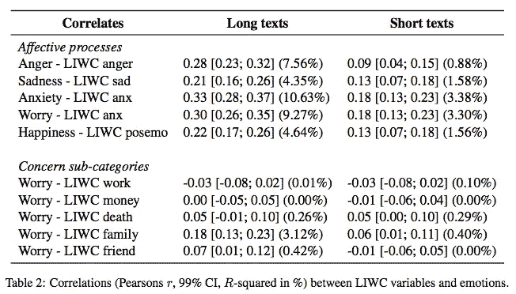

# #NLP365 的第 142 天:NLP 论文摘要——测量新冠肺炎真实世界忧虑数据集中的情绪

> 原文：<https://towardsdatascience.com/day-142-of-nlp365-nlp-papers-summary-measuring-emotions-in-the-covid-19-real-world-worry-d565098a0937?source=collection_archive---------64----------------------->

阅读和理解研究论文就像拼凑一个未解之谜。汉斯-彼得·高斯特在 [Unsplash](https://unsplash.com/s/photos/research-papers?utm_source=unsplash&utm_medium=referral&utm_content=creditCopyText) 上拍摄的照片。

## [内线艾](https://medium.com/towards-data-science/inside-ai/home) [NLP365](http://towardsdatascience.com/tagged/nlp365)

## NLP 论文摘要是我总结 NLP 研究论文要点的系列文章

项目#NLP365 (+1)是我在 2020 年每天记录我的 NLP 学习旅程的地方。在这里，你可以随意查看我在过去的 280 天里学到了什么。在本文的最后，你可以找到以前的论文摘要，按自然语言处理领域分类:)

今天的 NLP 论文是 ***测量新冠肺炎真实世界担忧数据集*** 中的情绪。以下是研究论文的要点。

# 目标和贡献

创建了真实世界焦虑数据集(RWWD)，这是新冠肺炎第一个情绪反应的真实数据集，由 2500 个短文本和 2500 个长文本组成。数据集上的主题模型显示，英国人主要关心家庭和经济。了解新冠肺炎疫情期间公众的情绪反应非常重要，该数据集是开发一种自动分析情绪反应和担忧的方法的垫脚石。

# 新冠肺炎真实世界担忧数据集

RWWD 数据集捕捉了英国居民对新冠肺炎的情感反应。数据是在 4 月 6 日和 7 日收集的，我们认为这两天是情况的“高峰期”。英国处于封锁状态，死亡人数不断增加，首相鲍里斯·约翰逊进入新冠肺炎的重症监护病房。我们使用直接调查法，而不是依赖第三方注释，我们调查了 2500 名参与者，询问他们写作时的感受。RWWD 有两个版本:

1.  *长 RWWD* 。参与者可以自由地写下他们的感受，想写多久就写多久
2.  *短 RWWD* 。参与者被要求用推特大小的文字表达他们的感受

每位参与者都被要求从 1 到 9 给自己的情绪打分，9 表示“非常”。他们必须评估八种情绪:愤怒、焦虑、欲望、厌恶、恐惧、快乐、放松和悲伤。他们还被要求选择一种最能描述他们当前感受的情绪。下表展示了 RWWD 数据集的描述性统计数据。总体而言，焦虑、悲伤和恐惧的情绪主导了数据集。

数据和情感评分的描述性统计[1]

# 实验和主要发现

## 情绪与 LIWC 范畴的相关性

自我报告的情绪和 LIWC 类别有很高的匹配率。所有的情感 LIWC 变量与其相应的自我报告的情绪都有很高的正相关性，这表明语言变量可以解释情绪得分的差异。LIWC 还深入到与每种情绪相关的子类别中。例如，情绪焦虑与生活的不同领域相关联。正相关表明，参与者的分数越高，他们在各自的 LIWC 子类别中的分数越高。焦虑与金钱、工作和死亡之间没有相关性，而焦虑情绪与家庭方面有显著的正相关，表明人们越焦虑，他们越谈论他们的家庭。

LIWC 变量和情绪之间的相关系数[1]

总之，心理语言学单词列表和情绪之间存在微弱的正相关，这种方法最擅长测量愤怒、焦虑和担心。对于较长的文本，它比 tweet 大小的文本表现得更好，这可能是因为人们在书面文本中表达情感的能力不足。我们还探索了情绪的重叠，其中担心、恐惧和焦虑之间有很高的相关性，这与我们数据集中明显分离的结构相反。另一种看待这个问题的方式是，不同情绪的分离允许模型理清情绪，并评估常见的聚类方法来聚类不同的情绪。

## 人们忧虑的主题模型

我们对长文和短文本进行主题建模，并将结果展示在下面的表 3 中。对于长文本，似乎前 5 个最流行的话题与封锁规则和对就业和经济的担忧有关。对于短文，我们在五个最流行的话题中看到类似的模式，它们与政府口号和社会距离规则有关。

五大热门话题[1]

根据我们的发现，人们似乎担心他们的工作和经济，以及他们的家人和朋友。例如，在长文本中，人们分享他们对家人和孩子缺课的担忧。在短文中，人们倾向于鼓励他人遵守社交距离规则，而不是表达他们的担忧。这意味着人们倾向于使用长文本来表达他们的担忧，而使用短文本来鼓励他人遵守规则。

## 预测对新冠肺炎的情绪

我们工作不同于现有的自动情绪检测工作，因为先前的工作将问题视为分类任务，而我们的工作允许在连续的尺度上估计情绪。由于我们的数据集对于神经方法来说不够大，所以我们使用了具有 TFIDF 和 POS 特征的正则化岭回归模型。TFIDF 特征基于每个语料库的 1000 个最常见的词，而 POS 特征是使用 spaCy 提取的。我们的回归模型的结果展示如下。我们的 MAE 范围是长文本从 1.26 到 1.88，短文本从 1.37 到 1.91。我们的模型在预测长文本和短文本的焦虑情绪方面表现最佳，并解释了长文本中情绪反应变量的高达 16%的方差。

长短文本回归建模的结果[1]

总的来说，具有词汇特征的岭回归已被证明在预测新冠肺炎的情绪反应方面是有效的。与其他结果类似，与短文本相比，我们的方法在长文本上表现得更好。我们的模型在预测焦虑方面表现最佳，我们认为这是因为在我们的数据集中，这是报道最多的情绪，因此使我们的模型有偏差。

# 结论和未来工作

有一些潜在的未来研究想法:

1.  探索不同的预测方法，以减轻使用词典方法的一些限制。尽管 tweet 大小的文本包含的信息少得多，但这种简短的文本仍然占据了今天网络上文本数据的很大一部分，因此能够有效地使用它来预测情绪将是非常有益的，值得未来的研究
2.  另一方面，许多研究关注的是可用的 Twitter 数据，我们需要开始扩展到其他非 Twitter 数据，以捕捉那些在社交媒体上代表性不足的人的情绪反应
3.  手动注释新冠肺炎主要关注的主题的数据方法
4.  扩展数据集以覆盖更长的时间段，以捕捉情绪反应如何随着时间的推移而发展
5.  除了 LIWC 之外，利用其他方法和字典来测量文本中的心理结构

## 来源:

[1] Kleinberg，b .，van der Vegt，I .和 Mozes，m .，2020 年。在新冠肺炎真实世界忧虑数据集中测量情绪。arXiv 预印本 arXiv:2004.04225 。

*原载于 2020 年 5 月 21 日 https://ryanong.co.uk***。**

# *特征提取/基于特征的情感分析*

*   *[https://towards data science . com/day-102-of-NLP 365-NLP-papers-summary-implicit-and-explicit-aspect-extraction-in-financial-BDF 00 a 66 db 41](/day-102-of-nlp365-nlp-papers-summary-implicit-and-explicit-aspect-extraction-in-financial-bdf00a66db41)*
*   *[https://towards data science . com/day-103-NLP-research-papers-utilizing-Bert-for-aspect-based-sense-analysis-via-construction-38ab 3e 1630 a3](/day-103-nlp-research-papers-utilizing-bert-for-aspect-based-sentiment-analysis-via-constructing-38ab3e1630a3)*
*   *[https://towards data science . com/day-104-of-NLP 365-NLP-papers-summary-senthious-targeted-aspect-based-sensitive-analysis-f 24 a2 EC 1 ca 32](/day-104-of-nlp365-nlp-papers-summary-sentihood-targeted-aspect-based-sentiment-analysis-f24a2ec1ca32)*
*   *[https://towards data science . com/day-105-of-NLP 365-NLP-papers-summary-aspect-level-sensation-class ification-with-3a 3539 be 6 AE 8](/day-105-of-nlp365-nlp-papers-summary-aspect-level-sentiment-classification-with-3a3539be6ae8)*
*   *[https://towards data science . com/day-106-of-NLP 365-NLP-papers-summary-an-unsupervised-neural-attention-model-for-aspect-b 874d 007 b 6d 0](/day-106-of-nlp365-nlp-papers-summary-an-unsupervised-neural-attention-model-for-aspect-b874d007b6d0)*
*   *[https://towardsdatascience . com/day-110-of-NLP 365-NLP-papers-summary-double-embedding-and-CNN-based-sequence-labeling-for-b8a 958 F3 bddd](/day-110-of-nlp365-nlp-papers-summary-double-embeddings-and-cnn-based-sequence-labelling-for-b8a958f3bddd)*
*   *[https://towards data science . com/day-112-of-NLP 365-NLP-papers-summary-a-challenge-dataset-and-effective-models-for-aspect-based-35b 7 a5 e 245 b5](/day-112-of-nlp365-nlp-papers-summary-a-challenge-dataset-and-effective-models-for-aspect-based-35b7a5e245b5)*
*   *[https://towards data science . com/day-123-of-NLP 365-NLP-papers-summary-context-aware-embedding-for-targeted-aspect-based-be9f 998d 1131](/day-123-of-nlp365-nlp-papers-summary-context-aware-embedding-for-targeted-aspect-based-be9f998d1131)*

# *总结*

*   *[https://towards data science . com/day-107-of-NLP 365-NLP-papers-summary-make-lead-bias-in-your-favor-a-simple-effective-4c 52 B1 a 569 b 8](/day-107-of-nlp365-nlp-papers-summary-make-lead-bias-in-your-favor-a-simple-and-effective-4c52b1a569b8)*
*   *[https://towards data science . com/day-109-of-NLP 365-NLP-papers-summary-studing-summary-evaluation-metrics-in-the-619 F5 acb1 b 27](/day-109-of-nlp365-nlp-papers-summary-studying-summarization-evaluation-metrics-in-the-619f5acb1b27)*
*   *[https://towards data science . com/day-113-of-NLP 365-NLP-papers-summary-on-extractive-and-abstract-neural-document-87168 b 7 e 90 BC](/day-113-of-nlp365-nlp-papers-summary-on-extractive-and-abstractive-neural-document-87168b7e90bc)*
*   *[https://towards data science . com/day-116-of-NLP 365-NLP-papers-summary-data-driven-summary-of-scientific-articles-3 FBA 016 c 733 b](/day-116-of-nlp365-nlp-papers-summary-data-driven-summarization-of-scientific-articles-3fba016c733b)*
*   *[https://towards data science . com/day-117-of-NLP 365-NLP-papers-summary-abstract-text-summary-a-low-resource-challenge-61a E6 CDF 32 f](/day-117-of-nlp365-nlp-papers-summary-abstract-text-summarization-a-low-resource-challenge-61ae6cdf32f)*
*   *[https://towards data science . com/day-118-of-NLP 365-NLP-papers-summary-extractive-summary-of-long-documents-by-combining-AEA 118 a5 eb3f](/day-118-of-nlp365-nlp-papers-summary-extractive-summarization-of-long-documents-by-combining-aea118a5eb3f)*
*   *[https://towards data science . com/day-120-of-NLP 365-NLP-papers-summary-a-simple-theory-model-of-importance-for-summary-843 ddbcb 9b](/day-120-of-nlp365-nlp-papers-summary-a-simple-theoretical-model-of-importance-for-summarization-843ddbbcb9b)*
*   *[https://towards data science . com/day-121-of-NLP 365-NLP-papers-summary-concept-pointer-network-for-abstract-summary-cd55e 577 F6 de](/day-121-of-nlp365-nlp-papers-summary-concept-pointer-network-for-abstractive-summarization-cd55e577f6de)*
*   *[https://towards data science . com/day-124-NLP-papers-summary-tldr-extreme-summary-of-scientific-documents-106 CD 915 F9 a 3](/day-124-nlp-papers-summary-tldr-extreme-summarization-of-scientific-documents-106cd915f9a3)*

# *其他人*

*   *[https://towards data science . com/day-108-of-NLP 365-NLP-papers-summary-simple-Bert-models-for-relation-extraction-and-semantic-98f 7698184 D7](/day-108-of-nlp365-nlp-papers-summary-simple-bert-models-for-relation-extraction-and-semantic-98f7698184d7)*
*   *[https://towards data science . com/day-111-of-NLP 365-NLP-papers-summary-the-risk-of-race-of-bias-in-hate-speech-detection-BFF 7 F5 f 20 ce 5](/day-111-of-nlp365-nlp-papers-summary-the-risk-of-racial-bias-in-hate-speech-detection-bff7f5f20ce5)*
*   *[https://towards data science . com/day-115-of-NLP 365-NLP-papers-summary-scibert-a-pre trained-language-model-for-scientific-text-185785598 e33](/day-115-of-nlp365-nlp-papers-summary-scibert-a-pretrained-language-model-for-scientific-text-185785598e33)*
*   *[https://towards data science . com/day-119-NLP-papers-summary-an-argument-annoted-corpus-of-scientific-publications-d 7 b 9 e 2e ea 1097](/day-119-nlp-papers-summary-an-argument-annotated-corpus-of-scientific-publications-d7b9e2ea1097)*
*   *[https://towards data science . com/day-122-of-NLP 365-NLP-papers-summary-applying-Bert-to-document-retrieval-with-birch-766 EAC 17 ab](/day-122-of-nlp365-nlp-papers-summary-applying-bert-to-document-retrieval-with-birch-766eaeac17ab)*
*   *[https://towards data science . com/day-125-of-NLP 365-NLP-papers-summary-a2n-attending-to-neighbors-for-knowledge-graph-inference-87305 C3 aebe 2](/day-125-of-nlp365-nlp-papers-summary-a2n-attending-to-neighbors-for-knowledge-graph-inference-87305c3aebe2)*
*   *[https://towards data science . com/day-126-of-NLP 365-NLP-papers-summary-neural-news-recommendation-with-topic-aware-news-4eb 9604330 bb](/day-126-of-nlp365-nlp-papers-summary-neural-news-recommendation-with-topic-aware-news-4eb9604330bb)*
*   *[https://towards data science . com/day-140-of-NLP 365-NLP-papers-summary-multimodal-machine-learning-for-automated-ICD-coding-b32e 02997 ea 2](/day-140-of-nlp365-nlp-papers-summary-multimodal-machine-learning-for-automated-icd-coding-b32e02997ea2)*
*   *[https://towards data science . com/day-141-of-NLP 365-NLP-papers-summary-text attack-a-framework-for-adversarial-attack-in-aac2a 282d 72 c](/day-141-of-nlp365-nlp-papers-summary-textattack-a-framework-for-adversarial-attacks-in-aac2a282d72c)*