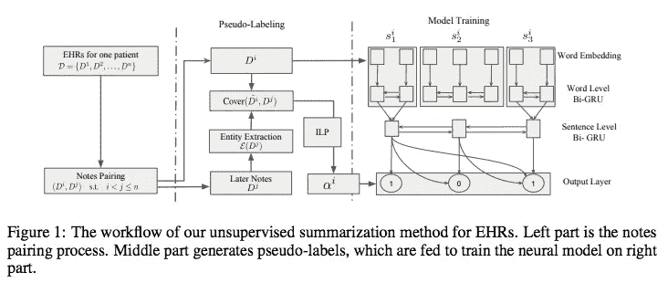
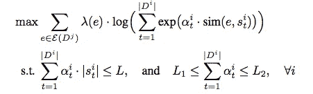
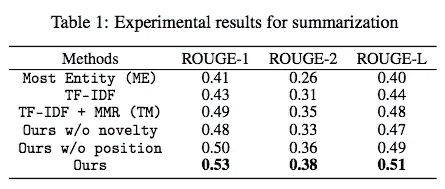
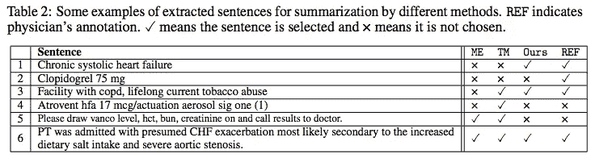

# #NLP365 的第 143 天:NLP 论文摘要—电子健康记录摘要的无监督伪标记

> 原文：<https://towardsdatascience.com/day-143-of-nlp365-nlp-papers-summary-unsupervised-pseudo-labeling-for-extractive-summarization-3b94920e04c6?source=collection_archive---------75----------------------->

阅读和理解研究论文就像拼凑一个未解之谜。汉斯-彼得·高斯特在 [Unsplash](https://unsplash.com/s/photos/research-papers?utm_source=unsplash&utm_medium=referral&utm_content=creditCopyText) 上拍摄的照片。

## [内线艾](https://medium.com/towards-data-science/inside-ai/home) [NLP365](http://towardsdatascience.com/tagged/nlp365)

## NLP 论文摘要是我总结 NLP 研究论文要点的系列文章

项目#NLP365 (+1)是我在 2020 年每天记录我的 NLP 学习旅程的地方。在这里，你可以随意查看我在过去的 280 天里学到了什么。在这篇文章的最后，你可以找到以前按自然语言处理领域分类的论文摘要，你也可以订阅# NLP 365 @[http://eepurl.com/gW7bBP](http://eepurl.com/gW7bBP):)

今天的 NLP 论文是 ***无监督伪标注用于电子健康记录上的抽取摘要*** 。以下是研究论文的要点。

# 目标和贡献

提出了一种有效的无监督生成电子健康记录伪标签的方法，该方法利用了多个电子健康记录之间的内在相关性。然后，我们使用这个伪标签来训练一个提取摘要器，以帮助医生更好地消化 EHR。具体来说，本文回答了以下三个研究问题:

1.  如何衡量同一患者特定疾病总结的质量？
2.  如何利用研究问题 1 生成有效精准的伪标签？
3.  给定生成的伪标签，在医疗环境中应该使用什么模型架构进行总结？

# 方法学

## 问题定义

我们的无监督总结方法的整体架构[1]

对于大多数患者来说，随着时间的推移，存在许多记录的电子病历。我们的目标是找到这些电子病历的子集，最好地总结特定疾病的患者信息。上图展示了我们整体架构。对于第一个研究问题，我们观察到医生在阅读和总结临床笔记时倾向于关注医疗实体，因此我们建议总结临床笔记以涵盖更多相关实体。

每个 EHR 都有一个包含所有医疗实体的实体集。可以想象，每个 EHR 可能包含数百个实体，捕获所有这些实体是一个非常具有挑战性的问题。为了捕捉这些实体，我们观察到早期健康记录中的信息通常持续到后来的记录，提醒医生注意未来的治疗。受此启发，我们使用覆盖率分数来评估基于后来记录的 EHR 的质量。我们使用逆文档频率来衡量实体在整个语料库中的重要性，并通过使用 PubMed 上训练的单词嵌入对实体和 EHR 中的句子进行编码来衡量实体和句子之间的语义相似性。

## 整数线性规划的伪标记

我们使用具有长度约束的整数线性规划来使用后来的记录为 EHR 生成二进制伪标签。下面是最后一个优化问题:

优化问题[1]

## 总结模型

在这里，我们使用生成的伪标签来训练一个有监督的提取总结模型来总结病历。该模型由两层 biGRU 组成，其中第一层集中在单词层并生成句子嵌入，第二层集中在句子层，使用第一层的输出并计算每个句子的最终表示。对于输出层，我们有逻辑函数，它有几个特征，包括内容、显著性、新颖性和位置。突出特征将帮助我们识别当前句子对整个笔记有多重要，新颖特征帮助我们减少冗余。

# 实验和结果

我们的评估数据集是重症监护医疗信息集市 III (MIMIC-III)。我们总共提取了 5875 例包含至少一个与心脏病相关的 ICD 诊断代码的住院病例。我们还利用了记录事件表中的临床记录。我们聘请了一位经验丰富的医生来手动注释 25 个临床笔记，并在推断时间内比较我们的模型的结果。我们的评估指标是 ROUGE 分数的标准汇总指标。

## 模型比较

我们的方法是无监督的，因为我们不需要任何外部注释，所以我们所有的基线模型比较都是无监督的:

1.  *最-实体(ME)* 。挑选大多数医学实体的句子
2.  *TF-IDF + MMR (TM)* 。TFIDF 的扩展旨在减少作为 MMR 度量的信息重复，减少与已经选择的句子具有高相似性的句子的权重
3.  *我们自己模型的消融变异*。我们有没有新颖性特征的模型，没有位置特征的模型，以及完整的模型

## 结果

总体总结结果[1]

如上面的结果表所示，我们的模型相对于所有基线模型获得了最高的 ROUGE 分数。我们还观察到冗余严重影响我们的总结模型。MMR 和新颖性特征显著提高了 TF-IDF 和我们的模型的性能。位置功能也被证明可以提高性能，这是可以预料的，因为临床记录通常是用结构化模板编写的。

下表展示了我们的模型提取的句子的一些示例，并将其与医生的注释进行了比较。从表中我们可以看出，ME 和 TM 倾向于选择实体较多的长句，这是意料之中的。这意味着他们都没有选择像句子 1 和 2 这样重要的短句。我们的模型也有这个问题，但没那么严重。TM 的缺点是，通过使用 TFIDF，当句子包含不常用的术语时，它会误导模型将其分类为重要的，但在医学领域，术语通常非常具体，因此尽管不常用，但它们可能与特定疾病无关。我们的模型被显示选择与我们的医生的注释非常相似的句子。

不同总结方法的定性分析[1]

# 结论和未来工作

总的来说，我们探讨了总结 EHR 的三个研究问题:

1.  使用医疗实体来涵盖一名患者的多个电子病历之间的内在关联
2.  开发了一个优化目标，并使用 ILP 生成伪标签
3.  使用生成的伪标签来训练我们的监督提取摘要模型

潜在的未来工作可能涉及添加新的功能，如覆盖或注意机制，以避免重复和特别注意句子中重要的部分。

来源:

[1]刘，x，徐，k，谢，p，邢，e，2018 .用于电子健康记录摘要的无监督伪标记。 *arXiv 预印本 arXiv:1811.08040* 。

*原载于 2020 年 5 月 22 日***。**

# *特征提取/基于特征的情感分析*

*   *[https://towards data science . com/day-102-of-NLP 365-NLP-papers-summary-implicit-and-explicit-aspect-extraction-in-financial-BDF 00 a 66 db 41](/day-102-of-nlp365-nlp-papers-summary-implicit-and-explicit-aspect-extraction-in-financial-bdf00a66db41)*
*   *[https://towards data science . com/day-103-NLP-research-papers-utilizing-Bert-for-aspect-based-sensation-analysis-via-construction-38ab 3e 1630 a3](/day-103-nlp-research-papers-utilizing-bert-for-aspect-based-sentiment-analysis-via-constructing-38ab3e1630a3)*
*   *[https://towards data science . com/day-104-of-NLP 365-NLP-papers-summary-senthious-targeted-aspect-based-sensitive-analysis-f 24 a2 EC 1 ca 32](/day-104-of-nlp365-nlp-papers-summary-sentihood-targeted-aspect-based-sentiment-analysis-f24a2ec1ca32)*
*   *[https://towards data science . com/day-105-of-NLP 365-NLP-papers-summary-aspect-level-sensation-class ification-with-3a 3539 be 6 AE 8](/day-105-of-nlp365-nlp-papers-summary-aspect-level-sentiment-classification-with-3a3539be6ae8)*
*   *[https://towardsdatascience . com/day-106-of-NLP 365-NLP-papers-summary-an-unsupervised-neural-attention-model-for-aspect-b 874d 007 b 6d 0](/day-106-of-nlp365-nlp-papers-summary-an-unsupervised-neural-attention-model-for-aspect-b874d007b6d0)*
*   *[https://towardsdatascience . com/day-110-of-NLP 365-NLP-papers-summary-double-embedding-and-CNN-based-sequence-labeling-for-b8a 958 F3 bddd](/day-110-of-nlp365-nlp-papers-summary-double-embeddings-and-cnn-based-sequence-labelling-for-b8a958f3bddd)*
*   *[https://towards data science . com/day-112-of-NLP 365-NLP-papers-summary-a-challenge-dataset-and-effective-models-for-aspect-based-35b 7 a5 e 245 b5](/day-112-of-nlp365-nlp-papers-summary-a-challenge-dataset-and-effective-models-for-aspect-based-35b7a5e245b5)*
*   *[https://towards data science . com/day-123-of-NLP 365-NLP-papers-summary-context-aware-embedding-for-targeted-aspect-based-be9f 998d 1131](/day-123-of-nlp365-nlp-papers-summary-context-aware-embedding-for-targeted-aspect-based-be9f998d1131)*

# *总结*

*   *[https://towards data science . com/day-107-of-NLP 365-NLP-papers-summary-make-lead-bias-in-your-favor-a-simple-effective-4c 52 B1 a 569 b 8](/day-107-of-nlp365-nlp-papers-summary-make-lead-bias-in-your-favor-a-simple-and-effective-4c52b1a569b8)*
*   *[https://towards data science . com/day-109-of-NLP 365-NLP-papers-summary-studing-summary-evaluation-metrics-in-the-619 F5 acb1 b 27](/day-109-of-nlp365-nlp-papers-summary-studying-summarization-evaluation-metrics-in-the-619f5acb1b27)*
*   *[https://towards data science . com/day-113-of-NLP 365-NLP-papers-summary-on-extractive-and-abstract-neural-document-87168 b 7 e 90 BC](/day-113-of-nlp365-nlp-papers-summary-on-extractive-and-abstractive-neural-document-87168b7e90bc)*
*   *[https://towards data science . com/day-116-of-NLP 365-NLP-papers-summary-data-driven-summary-of-scientific-articles-3 FBA 016 c 733 b](/day-116-of-nlp365-nlp-papers-summary-data-driven-summarization-of-scientific-articles-3fba016c733b)*
*   *[https://towards data science . com/day-117-of-NLP 365-NLP-papers-summary-abstract-text-summary-a-low-resource-challenge-61 AE 6 CDF 32 f](/day-117-of-nlp365-nlp-papers-summary-abstract-text-summarization-a-low-resource-challenge-61ae6cdf32f)*
*   *[https://towards data science . com/day-118-of-NLP 365-NLP-papers-summary-extractive-summary-of-long-documents-by-combining-AEA 118 a5 eb3f](/day-118-of-nlp365-nlp-papers-summary-extractive-summarization-of-long-documents-by-combining-aea118a5eb3f)*
*   *[https://towards data science . com/day-120-of-NLP 365-NLP-papers-summary-a-simple-theory-model-of-importance-for-summary-843 ddbcb 9b](/day-120-of-nlp365-nlp-papers-summary-a-simple-theoretical-model-of-importance-for-summarization-843ddbbcb9b)*
*   *[https://towards data science . com/day-121-of-NLP 365-NLP-papers-summary-concept-pointer-network-for-abstract-summary-cd55e 577 F6 de](/day-121-of-nlp365-nlp-papers-summary-concept-pointer-network-for-abstractive-summarization-cd55e577f6de)*
*   *[https://towards data science . com/day-124-NLP-papers-summary-tldr-extreme-summary-of-scientific-documents-106 CD 915 F9 a 3](/day-124-nlp-papers-summary-tldr-extreme-summarization-of-scientific-documents-106cd915f9a3)*

# *其他人*

*   *[https://towards data science . com/day-108-of-NLP 365-NLP-papers-summary-simple-Bert-models-for-relation-extraction-and-semantic-98f 7698184 D7](/day-108-of-nlp365-nlp-papers-summary-simple-bert-models-for-relation-extraction-and-semantic-98f7698184d7)*
*   *[https://towards data science . com/day-111-of-NLP 365-NLP-papers-summary-the-risk-of-race-of-bias-in-hate-speech-detection-BFF 7 F5 f 20 ce 5](/day-111-of-nlp365-nlp-papers-summary-the-risk-of-racial-bias-in-hate-speech-detection-bff7f5f20ce5)*
*   *[https://towards data science . com/day-115-of-NLP 365-NLP-papers-summary-scibert-a-pre trained-language-model-for-scientific-text-185785598 e33](/day-115-of-nlp365-nlp-papers-summary-scibert-a-pretrained-language-model-for-scientific-text-185785598e33)*
*   *[https://towards data science . com/day-119-NLP-papers-summary-an-argument-annoted-corpus-of-scientific-publications-d 7 b 9 e 2e ea 1097](/day-119-nlp-papers-summary-an-argument-annotated-corpus-of-scientific-publications-d7b9e2ea1097)*
*   *[https://towards data science . com/day-122-of-NLP 365-NLP-papers-summary-applying-Bert-to-document-retrieval-with-birch-766 EAC 17 ab](/day-122-of-nlp365-nlp-papers-summary-applying-bert-to-document-retrieval-with-birch-766eaeac17ab)*
*   *[https://towards data science . com/day-125-of-NLP 365-NLP-papers-summary-a2n-attending-to-neighbors-for-knowledge-graph-inference-87305 C3 aebe 2](/day-125-of-nlp365-nlp-papers-summary-a2n-attending-to-neighbors-for-knowledge-graph-inference-87305c3aebe2)*
*   *[https://towards data science . com/day-126-of-NLP 365-NLP-papers-summary-neural-news-recommendation-with-topic-aware-news-4eb 9604330 bb](/day-126-of-nlp365-nlp-papers-summary-neural-news-recommendation-with-topic-aware-news-4eb9604330bb)*
*   *[https://towardsdatascience . com/day-140-of-NLP 365-NLP-papers-summary-multimodal-machine-learning-for-automated-ICD-coding-b32e 02997 ea 2](/day-140-of-nlp365-nlp-papers-summary-multimodal-machine-learning-for-automated-icd-coding-b32e02997ea2)*
*   *[https://towards data science . com/day-141-of-NLP 365-NLP-papers-summary-text attack-a-framework-for-adversarial-attack-in-aac2a 282d 72 c](/day-141-of-nlp365-nlp-papers-summary-textattack-a-framework-for-adversarial-attacks-in-aac2a282d72c)*
*   *[https://towards data science . com/day-142-of-NLP 365-NLP-papers-summary-measuring-emotions-in-the-the-新冠肺炎-现实世界-忧虑-d565098a0937](/day-142-of-nlp365-nlp-papers-summary-measuring-emotions-in-the-covid-19-real-world-worry-d565098a0937)*