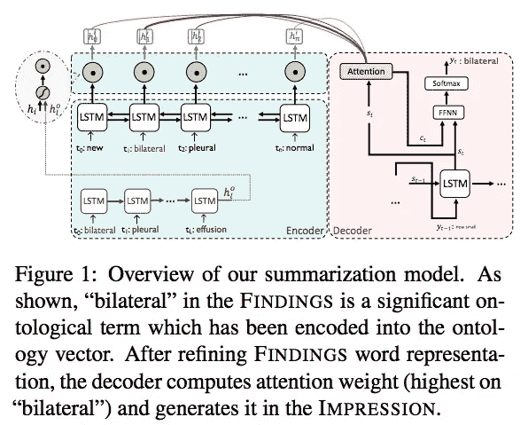
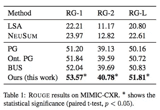
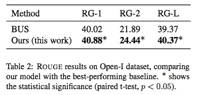
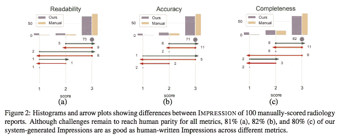

# #NLP365 的第 144 天:NLP 论文摘要-关注医学本体论:临床抽象摘要的内容选择

> 原文：<https://towardsdatascience.com/day-144-of-nlp365-nlp-papers-summary-attend-to-medical-ontologies-content-selection-for-ff7cded5d95b?source=collection_archive---------59----------------------->

阅读和理解研究论文就像拼凑一个未解之谜。汉斯-彼得·高斯特在 [Unsplash](https://unsplash.com/s/photos/research-papers?utm_source=unsplash&utm_medium=referral&utm_content=creditCopyText) 上拍摄的照片。

## [内线艾](https://medium.com/towards-data-science/inside-ai/home) [NLP365](http://towardsdatascience.com/tagged/nlp365)

## NLP 论文摘要是我总结 NLP 研究论文要点的系列文章

项目#NLP365 (+1)是我在 2020 年每天记录我的 NLP 学习旅程的地方。在这里，你可以随意查看我在过去的 280 天里学到了什么。在这篇文章的最后，你可以找到以前按自然语言处理领域分类的论文摘要，你也可以订阅# NLP 365 @[http://eepurl.com/gW7bBP](http://eepurl.com/gW7bBP):)

今天的 NLP 论文是 ***关注医学本体:临床抽象概括的内容选择*** 。以下是研究论文的要点。

# 目标和贡献

传统的抽象文本摘要的主要问题是从源文档中选择关键信息。提出了一种通过在摘要器中加入显著的本体术语来选择临床摘要内容的方法。内容选择被视为单词级序列标记问题。这已被证明改善了基于 MIMIC-CXR 和 OpenI 数据集的 SOTA 结果。我们还获得了专家的评价，并表明我们的方法产生了一个良好的质量摘要相比，地面真相。

# 放射学报告总结

放射学报告包含两个重要部分:发现和印象。发现包括成像研究的详细观察和解释，而印象总结了最关键的发现。在该行业中，大多数临床医生只阅读印象部分，因为他们有有限的时间来回顾冗长的发现部分。印象生成的自动化和改进可以显著改进放射科医生的工作流程。

# 方法学

我们提出的模型有两个主要部分:

1.  内容选择器
2.  总结模型

## 内容选择器

这一部分旨在选择报告中最重要的本体概念，特别是调查结果部分。这可以被视为单词级提取任务，其中我们想要提取可能包含在印象部分中的单词。实际上，如果满足两个标准，每个单词都被标记为 1:

1.  这个词是一个本体论术语
2.  这个词被直接复制到印象中

这使我们能够捕捉每个单词的复制可能性，我们用它来衡量单词的重要性。整体架构是一个位于 BERT 嵌入层之上的 biLSTM(利用上下文嵌入的优势),在推理期间，我们的内容选择器将输出源序列中每个标记的选择概率。

## 总结模型

我们的汇总模型有两个编码器和一个解码器(见下图):

1.  *发现编码器*。这是一个 biLSTM，它在发现部分中包含单词 embeddings，并生成一个编码的隐藏表示
2.  *本体编码器*。这是一个 LSTM，它接收已识别的本体术语(通过我们的内容选择器)并生成一个固定的上下文向量，即我们的本体向量
3.  *印象解码器*。这是一个给人留下印象的 LSTM

总结模型概述[1]

接下来，我们有一个过滤门，使用本体向量来提炼发现词表示，以产生本体感知的词表示。过滤门在每一步连接单词 x 的当前隐藏状态和固定本体向量，并通过具有 sigmoid 激活函数的线性来处理这些。为了计算本体感知的单词表示，我们然后取过滤门的输出，并与单词 x 的当前隐藏状态执行逐元素乘法。

我们的解码器是一个产生印象的 LSTM。解码器将使用先前的隐藏状态和先前生成的标记来计算当前的解码状态。解码器还将使用当前解码状态来计算本体感知单词表示上的注意力分布。注意力分布然后被用于计算上下文向量。最后，上下文向量和当前解码状态被馈入前馈神经网络，以生成下一个令牌或从发现中复制。

# 实验和结果

我们有两个评估数据集:MIMIC-CXR 和 OpenI。MIMIC-CXR 有 107372 份放射学报告，OpenI 有 3366 份报告。对于放射学词汇，我们使用 RadLex，它由 68534 个放射学术语组成。

## 模型比较

我们有两个抽象概括模型(LSA 和 NEUSUM)和三个抽象概括模型(指针生成器(PG)、本体感知 PG 和 BOTTOMSUM)。BOTTOMSUM 与我们的架构最相关，因为它使用了一个单独的内容选择器来进行抽象文本摘要。

## 结果

胭脂结果在模仿——CXR[1]

如上表 1 所示，我们的模型明显优于所有提取和抽象基线模型。抽象模型明显优于提取模型，表明人类书写的摘要是抽象形成的，而不仅仅是从源中选择句子。PG 和本体感知 PG 之间在 ROUGE 性能上的差异展示了在摘要模型中结合显著的本体术语的有效性和有用性。正如预期的那样，BOTTOMSUM 在基线模型中取得了最好的结果，因为它与我们的模型具有最相似的架构。我们相信我们的模型优于 BOTTOMSUM 的原因是因为我们有一个基于本体单词的精炼单词表示的中间阶段。下面的表 3 展示了将内容选择纳入汇总模型的好处。

包含和不包含内容选择的胭脂结果[1]

为了评估我们模型的通用性，我们还在 OpenI 上对比 BOTTOMSUM 评估了我们的模型，结果显示在下面的表 2 中。如图所示，我们的模型也能够胜过 OpenI 中的 BOTTOMSUM，说明了我们的模型的一般化。

总结胭脂结果[1]

## 专家评估

在这里，我们随机抽样了 100 个生成的印象及其相关的金牌摘要。我们请了三位专家对这些印象的可读性、准确性和完整性进行评分，评分标准为 1-3(3 为最佳)。结果显示在下图中。我们观察到，有超过 80%的生成印象被评分为与相关联的人类书写印象一样好。73%和 71%的我们的印象在可读性和准确性以及与人类书写印象的联系方面得分为 3，然而只有 62%的我们的印象在完整性方面得分为 3。我们认为这是由于发现中被认为重要的东西的主观性。总的来说，我们生成的印象似乎是高质量的，然而，在生成的印象和人类书写的印象之间仍然有差距。

100 份人工评分放射学报告之间印象差异的直方图和箭头图[1]

## 来源:

[1]s . sotu DEH，n . Goharian 和 r . w . Filice，2020 年。关注医学本体论:临床摘要的内容选择。arXiv 预印本 arXiv:2005.00163 。

*原载于 2020 年 5 月 23 日 https://ryanong.co.uk**的* [*。*](https://ryanong.co.uk/2020/05/23/day-144-nlp-papers-summary-attend-to-medical-ontologies-content-selection-for-clinical-abstractive-summarization/)

# 特征提取/基于特征的情感分析

*   [https://towards data science . com/day-102-of-NLP 365-NLP-papers-summary-implicit-and-explicit-aspect-extraction-in-financial-BDF 00 a 66 db 41](/day-102-of-nlp365-nlp-papers-summary-implicit-and-explicit-aspect-extraction-in-financial-bdf00a66db41)
*   [https://towards data science . com/day-103-NLP-research-papers-utilizing-Bert-for-aspect-based-sense-analysis-via-construction-38ab 3e 1630 a3](/day-103-nlp-research-papers-utilizing-bert-for-aspect-based-sentiment-analysis-via-constructing-38ab3e1630a3)
*   [https://towards data science . com/day-104-of-NLP 365-NLP-papers-summary-senthious-targeted-aspect-based-sensitive-analysis-f 24 a2 EC 1 ca 32](/day-104-of-nlp365-nlp-papers-summary-sentihood-targeted-aspect-based-sentiment-analysis-f24a2ec1ca32)
*   [https://towards data science . com/day-105-of-NLP 365-NLP-papers-summary-aspect-level-sensation-class ification-with-3a 3539 be 6 AE 8](/day-105-of-nlp365-nlp-papers-summary-aspect-level-sentiment-classification-with-3a3539be6ae8)
*   [https://towards data science . com/day-106-of-NLP 365-NLP-papers-summary-an-unsupervised-neural-attention-model-for-aspect-b 874d 007 b 6d 0](/day-106-of-nlp365-nlp-papers-summary-an-unsupervised-neural-attention-model-for-aspect-b874d007b6d0)
*   [https://towardsdatascience . com/day-110-of-NLP 365-NLP-papers-summary-double-embedding-and-CNN-based-sequence-labeling-for-b8a 958 F3 bddd](/day-110-of-nlp365-nlp-papers-summary-double-embeddings-and-cnn-based-sequence-labelling-for-b8a958f3bddd)
*   [https://towards data science . com/day-112-of-NLP 365-NLP-papers-summary-a-challenge-dataset-and-effective-models-for-aspect-based-35b 7 a5 e 245 b5](/day-112-of-nlp365-nlp-papers-summary-a-challenge-dataset-and-effective-models-for-aspect-based-35b7a5e245b5)
*   [https://towards data science . com/day-123-of-NLP 365-NLP-papers-summary-context-aware-embedding-for-targeted-aspect-based-be9f 998d 1131](/day-123-of-nlp365-nlp-papers-summary-context-aware-embedding-for-targeted-aspect-based-be9f998d1131)

# 总结

*   [https://towards data science . com/day-107-of-NLP 365-NLP-papers-summary-make-lead-bias-in-your-favor-a-simple-effective-4c 52 B1 a 569 b 8](/day-107-of-nlp365-nlp-papers-summary-make-lead-bias-in-your-favor-a-simple-and-effective-4c52b1a569b8)
*   [https://towards data science . com/day-109-of-NLP 365-NLP-papers-summary-studing-summary-evaluation-metrics-in-the-619 F5 acb1 b 27](/day-109-of-nlp365-nlp-papers-summary-studying-summarization-evaluation-metrics-in-the-619f5acb1b27)
*   [https://towards data science . com/day-113-of-NLP 365-NLP-papers-summary-on-extractive-and-abstract-neural-document-87168 b 7 e 90 BC](/day-113-of-nlp365-nlp-papers-summary-on-extractive-and-abstractive-neural-document-87168b7e90bc)
*   [https://towards data science . com/day-116-of-NLP 365-NLP-papers-summary-data-driven-summary-of-scientific-articles-3 FBA 016 c 733 b](/day-116-of-nlp365-nlp-papers-summary-data-driven-summarization-of-scientific-articles-3fba016c733b)
*   [https://towards data science . com/day-117-of-NLP 365-NLP-papers-summary-abstract-text-summary-a-low-resource-challenge-61 AE 6 CDF 32 f](/day-117-of-nlp365-nlp-papers-summary-abstract-text-summarization-a-low-resource-challenge-61ae6cdf32f)
*   [https://towards data science . com/day-118-of-NLP 365-NLP-papers-summary-extractive-summary-of-long-documents-by-combining-AEA 118 a5 eb3f](/day-118-of-nlp365-nlp-papers-summary-extractive-summarization-of-long-documents-by-combining-aea118a5eb3f)
*   [https://towards data science . com/day-120-of-NLP 365-NLP-papers-summary-a-simple-theory-model-of-importance-for-summary-843 ddbcb 9b](/day-120-of-nlp365-nlp-papers-summary-a-simple-theoretical-model-of-importance-for-summarization-843ddbbcb9b)
*   [https://towards data science . com/day-121-of-NLP 365-NLP-papers-summary-concept-pointer-network-for-abstract-summary-cd55e 577 F6 de](/day-121-of-nlp365-nlp-papers-summary-concept-pointer-network-for-abstractive-summarization-cd55e577f6de)
*   [https://towards data science . com/day-124-NLP-papers-summary-tldr-extreme-summary-of-scientific-documents-106 CD 915 F9 a 3](/day-124-nlp-papers-summary-tldr-extreme-summarization-of-scientific-documents-106cd915f9a3)
*   [https://towards data science . com/day-143-of-NLP 365-NLP-papers-summary-unsupervised-pseudo-labeling-for-extract-summary-3b 94920 e04c 6](/day-143-of-nlp365-nlp-papers-summary-unsupervised-pseudo-labeling-for-extractive-summarization-3b94920e04c6)

# 其他人

*   [https://towards data science . com/day-108-of-NLP 365-NLP-papers-summary-simple-Bert-models-for-relation-extraction-and-semantic-98f 7698184 D7](/day-108-of-nlp365-nlp-papers-summary-simple-bert-models-for-relation-extraction-and-semantic-98f7698184d7)
*   [https://towards data science . com/day-111-of-NLP 365-NLP-papers-summary-the-risk-of-race-of-bias-in-hate-speech-detection-BFF 7 F5 f 20 ce 5](/day-111-of-nlp365-nlp-papers-summary-the-risk-of-racial-bias-in-hate-speech-detection-bff7f5f20ce5)
*   [https://towards data science . com/day-115-of-NLP 365-NLP-papers-summary-scibert-a-pre trained-language-model-for-scientific-text-185785598 e33](/day-115-of-nlp365-nlp-papers-summary-scibert-a-pretrained-language-model-for-scientific-text-185785598e33)
*   [https://towards data science . com/day-119-NLP-papers-summary-an-argument-annoted-corpus-of-scientific-publications-d 7 b 9 e 2e ea 1097](/day-119-nlp-papers-summary-an-argument-annotated-corpus-of-scientific-publications-d7b9e2ea1097)
*   [https://towards data science . com/day-122-of-NLP 365-NLP-papers-summary-applying-Bert-to-document-retrieval-with-birch-766 EAC 17 ab](/day-122-of-nlp365-nlp-papers-summary-applying-bert-to-document-retrieval-with-birch-766eaeac17ab)
*   [https://towards data science . com/day-125-of-NLP 365-NLP-papers-summary-a2n-attending-to-neighbors-for-knowledge-graph-inference-87305 C3 aebe 2](/day-125-of-nlp365-nlp-papers-summary-a2n-attending-to-neighbors-for-knowledge-graph-inference-87305c3aebe2)
*   [https://towards data science . com/day-126-of-NLP 365-NLP-papers-summary-neural-news-recommendation-with-topic-aware-news-4eb 9604330 bb](/day-126-of-nlp365-nlp-papers-summary-neural-news-recommendation-with-topic-aware-news-4eb9604330bb)
*   [https://towards data science . com/day-140-of-NLP 365-NLP-papers-summary-multimodal-machine-learning-for-automated-ICD-coding-b32e 02997 ea 2](/day-140-of-nlp365-nlp-papers-summary-multimodal-machine-learning-for-automated-icd-coding-b32e02997ea2)
*   [https://towards data science . com/day-141-of-NLP 365-NLP-papers-summary-text attack-a-framework-for-adversarial-attack-in-aac2a 282d 72 c](/day-141-of-nlp365-nlp-papers-summary-textattack-a-framework-for-adversarial-attacks-in-aac2a282d72c)
*   [https://towards data science . com/day-142-of-NLP 365-NLP-papers-summary-measuring-emotions-in-the-the-新冠肺炎-现实世界-忧虑-d565098a0937](/day-142-of-nlp365-nlp-papers-summary-measuring-emotions-in-the-covid-19-real-world-worry-d565098a0937)