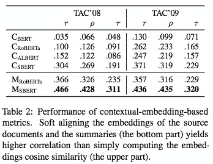

# 第 145 天的#NLP365: NLP 论文摘要 SUPERT:迈向多文档摘要的无监督评估度量的新前沿

> 原文：<https://towardsdatascience.com/day-145-of-nlp365-nlp-papers-summary-supert-towards-new-frontiers-in-unsupervised-evaluation-188295f82ce5?source=collection_archive---------61----------------------->

阅读和理解研究论文就像拼凑一个未解之谜。汉斯-彼得·高斯特在 [Unsplash](https://unsplash.com/s/photos/research-papers?utm_source=unsplash&utm_medium=referral&utm_content=creditCopyText) 上拍摄的照片。

## [内线艾](https://medium.com/towards-data-science/inside-ai/home) [NLP365](http://towardsdatascience.com/tagged/nlp365)

## NLP 论文摘要是我总结 NLP 研究论文要点的系列文章

项目#NLP365 (+1)是我在 2020 年每天记录我的 NLP 学习旅程的地方。在这里，你可以随意查看我在过去的 280 天里学到了什么。在这篇文章的最后，你可以找到以前按自然语言处理领域分类的论文摘要，你也可以订阅# NLP 365 @[http://eepurl.com/gW7bBP](http://eepurl.com/gW7bBP):)

今天的 NLP 论文是 ***SUPERT:迈向多文档摘要的无监督评估度量的新前沿*** 。以下是研究论文的要点。

# 目标和贡献

提出了 SUPERT，一种通过测量摘要和伪引用摘要之间的语义相似性来评估多文档摘要的无监督评估度量。伪引用摘要是通过使用上下文嵌入和软标记对齐从源文档中选择显著句子来生成的。SUPERT 能够实现与人类评估 18–39%的更好的相关性。我们使用 SUPERT 和一个强化学习摘要器，与 SOTA 无监督摘要器相比，它产生了很好的性能。这展示了 SUPERT 的有效性，也意味着我们可以从无限数量的文档中创建许多参考摘要，以增加数据集的大小。

# 数据集和评估指标

我们使用了两个多文档汇总数据集:TAC'08 和 TAC'09。两个 TAC 数据集包含大约 45+个主题，每个主题有 10 篇新闻文章、4 个参考摘要和 55+个机器生成的摘要。我们的评估标准是三个不同的相关系数:皮尔森的，斯皮尔曼的和肯德尔的。

## 模型比较

1.  *TFIDF*
2.  *JS 发散*。测量源和摘要中单词分布之间的 JS 差异
3.  *死神*
4.  *余弦-埃尔莫*。语境化词语嵌入
5.  *波姆 19*
6.  *ROUGE-1 和 ROUGE-2 以及 MoverScore* 。性能测量上限

# 使用伪引用和 bERT (SUPERT)的汇总评估

SUPERT 测量多文档摘要的相关性，它测量来自源文档的摘要中包含多少重要信息。我们用两个步骤来衡量相关性:

1.  从源文档中找出突出的句子
2.  测量伪引用(步骤 1)和生成的摘要之间的语义重叠

SUPERT 的工作流程[1]

下面的结果表展示了所有基准方法在显著低于性能上限时的表现。令人惊讶的是，基于嵌入的方法比基于词典的方法表现更差。这告诉我们，现有的单文档评估度量在评估多文档摘要时是无效的。

不同评估指标和人员评级之间的汇总级相关性[1]

## 用情境化嵌入度量相似性

我们通过探索不同的文本编码器，如 BERT、ROBERTa、ALBERT 和 s BERT，扩展了余弦 ELMo。结果显示如下。如图所示，SBERT 作为具有余弦相似性的文本编码器产生了最高相关性的生成摘要。然而，与基于词典的方法相比，这仍然表现不佳。我们探索的另一个扩展是使用单词移动距离(WMDs)来度量两个文档之间的语义相似性，而不是使用余弦相似性。先前的工作已经证明 WMDs 产生了更强的性能，并且我们下面的结果支持了带 SBERT 的 as WMD(M _ SBERT)明显优于它的余弦相似性对应物和所有基于词典的方法。这让我们想到了计算文档间语义相似度的终极方法，那就是使用 SBERT 和 WMD。

上下文嵌入度量的性能[1]

## 构建伪引用

前面表格中的结果显示了无监督评估和基于参考的评估之间的巨大性能差异。这表明我们仍然需要参考文献摘要，因此我们探索了建立伪参考文献的不同方法。

首先，我们探索了两种建立基线结果的简单策略:选择 N 个随机句子或前 N 个句子。结果显示如下。结果显示了随机选择的句子的较差性能，我们应该选择前 10-15 个句子作为伪引用，因为它优于基于词汇的方法和我们的 M_SBERT 方法。这也说明了新闻文章中的立场偏差。

通过随机选择句子建立伪引用[1]

其次，我们探索了两种基于图的方法来构建伪引用:位置不可知图和位置感知图。对于位置不可知的图，我们使用 SBERT (SLR)扩展了 LexRank 来度量余弦相似性。我们还探索了相似传播聚类算法，该算法对句子进行聚类，并选择每个聚类的中心来建立伪引用。这种聚类算法不需要我们预设聚类数。对于单反和 SC，我们有两种变体:个体图和全局图。个体图为每个源文档构建一个图，并选择前 K 个句子。全局图使用来自同一主题的所有源文档的所有句子构建一个图，并选择前 M 个句子。

对于位置感知图，我们使用 SBERT (SPS)扩展了 PacSum 来度量句子相似性，并且类似地，考虑了个体和全局图版本。PacSum 选择语义中心的句子，这意味着它与后面的句子具有高平均相似度，而与前面的句子具有低平均相似度。此外，我们还提出了 Top + Clique (TC ),它选择前 N 个句子和语义中心句来构建伪引用。TC 是这样工作的:

1.  将每个文档中的前 N 个句子标记为显著
2.  构建一个连接高度相似的非前 N 名句子的图表
3.  从图中识别集团，并从每个集团中选择语义中心句作为潜在的显著句
4.  对于每个潜在的显著句子，将其与前 N 个句子进行比较，如果它与前 N 个句子不高度相似，则将其标记为显著

下表展示了位置不可知图和位置感知图的结果。所有方法(除了 SC_G)都优于上表 1 中的基准模型。我们的位置不可知图表现不如位置感知图。此外，我们的位置感知图表现不如表 3 中选择前 N 个句子的简单句子提取方法。这向我们表明，新闻中的位置偏向是非常强烈的，它仍然是选择正面信息的最有效的方法。

使用位置不可知和位置感知构建伪引用[1]

## 引导强化学习

我们使用我们的新的无监督评估度量来指导基于 RL 的多文档摘要器神经时间差异(NTD)的训练。我们考虑了三个无监督的奖励函数:JS，REAPER 和 SUPERT (SP)。SUPERT 从每个源文档中选择前 10-15 个句子作为伪引用，并使用 SBERT 来测量摘要和伪引用之间的语义相似性。结果如下所示，使用 SUPERT 的 NTD 产生了最强的结果。

NTD 2008 年和 2009 年 TAC 的 ROUGE 结果[1]

来源:

[1]高，杨，赵，魏和埃格，s，2020 .SUPERT:迈向多文档摘要的无监督评估度量的新前沿。arXiv 预印本 arXiv:2005.03724 。

*原载于 2020 年 5 月 24 日 https://ryanong.co.uk***。**

# *特征提取/基于特征的情感分析*

*   *[https://towards data science . com/day-102-of-NLP 365-NLP-papers-summary-implicit-and-explicit-aspect-extraction-in-financial-BDF 00 a 66 db 41](/day-102-of-nlp365-nlp-papers-summary-implicit-and-explicit-aspect-extraction-in-financial-bdf00a66db41)*
*   *[https://towards data science . com/day-103-NLP-research-papers-utilizing-Bert-for-aspect-based-sense-analysis-via-construction-38ab 3e 1630 a3](/day-103-nlp-research-papers-utilizing-bert-for-aspect-based-sentiment-analysis-via-constructing-38ab3e1630a3)*
*   *[https://towards data science . com/day-104-of-NLP 365-NLP-papers-summary-senthious-targeted-aspect-based-sensitive-analysis-f 24 a2 EC 1 ca 32](/day-104-of-nlp365-nlp-papers-summary-sentihood-targeted-aspect-based-sentiment-analysis-f24a2ec1ca32)*
*   *[https://towards data science . com/day-105-of-NLP 365-NLP-papers-summary-aspect-level-sensation-class ification-with-3a 3539 be 6 AE 8](/day-105-of-nlp365-nlp-papers-summary-aspect-level-sentiment-classification-with-3a3539be6ae8)*
*   *[https://towards data science . com/day-106-of-NLP 365-NLP-papers-summary-an-unsupervised-neural-attention-model-for-aspect-b 874d 007 b 6d 0](/day-106-of-nlp365-nlp-papers-summary-an-unsupervised-neural-attention-model-for-aspect-b874d007b6d0)*
*   *[https://towardsdatascience . com/day-110-of-NLP 365-NLP-papers-summary-double-embedding-and-CNN-based-sequence-labeling-for-b8a 958 F3 bddd](/day-110-of-nlp365-nlp-papers-summary-double-embeddings-and-cnn-based-sequence-labelling-for-b8a958f3bddd)*
*   *[https://towards data science . com/day-112-of-NLP 365-NLP-papers-summary-a-challenge-dataset-and-effective-models-for-aspect-based-35b 7 a5 e 245 b5](/day-112-of-nlp365-nlp-papers-summary-a-challenge-dataset-and-effective-models-for-aspect-based-35b7a5e245b5)*
*   *[https://towards data science . com/day-123-of-NLP 365-NLP-papers-summary-context-aware-embedding-for-targeted-aspect-based-be9f 998d 1131](/day-123-of-nlp365-nlp-papers-summary-context-aware-embedding-for-targeted-aspect-based-be9f998d1131)*

# *总结*

*   *[https://towards data science . com/day-107-of-NLP 365-NLP-papers-summary-make-lead-bias-in-your-favor-a-simple-effective-4c 52 B1 a 569 b 8](/day-107-of-nlp365-nlp-papers-summary-make-lead-bias-in-your-favor-a-simple-and-effective-4c52b1a569b8)*
*   *[https://towards data science . com/day-109-of-NLP 365-NLP-papers-summary-studing-summary-evaluation-metrics-in-the-619 F5 acb1 b 27](/day-109-of-nlp365-nlp-papers-summary-studying-summarization-evaluation-metrics-in-the-619f5acb1b27)*
*   *[https://towards data science . com/day-113-of-NLP 365-NLP-papers-summary-on-extractive-and-abstract-neural-document-87168 b 7 e 90 BC](/day-113-of-nlp365-nlp-papers-summary-on-extractive-and-abstractive-neural-document-87168b7e90bc)*
*   *[https://towards data science . com/day-116-of-NLP 365-NLP-papers-summary-data-driven-summary-of-scientific-articles-3 FBA 016 c 733 b](/day-116-of-nlp365-nlp-papers-summary-data-driven-summarization-of-scientific-articles-3fba016c733b)*
*   *[https://towards data science . com/day-117-of-NLP 365-NLP-papers-summary-abstract-text-summary-a-low-resource-challenge-61a E6 CDF 32 f](/day-117-of-nlp365-nlp-papers-summary-abstract-text-summarization-a-low-resource-challenge-61ae6cdf32f)*
*   *[https://towards data science . com/day-118-of-NLP 365-NLP-papers-summary-extractive-summary-of-long-documents-by-combining-AEA 118 a5 eb3f](/day-118-of-nlp365-nlp-papers-summary-extractive-summarization-of-long-documents-by-combining-aea118a5eb3f)*
*   *[https://towards data science . com/day-120-of-NLP 365-NLP-papers-summary-a-simple-theory-model-of-importance-for-summary-843 ddbcb 9b](/day-120-of-nlp365-nlp-papers-summary-a-simple-theoretical-model-of-importance-for-summarization-843ddbbcb9b)*
*   *[https://towards data science . com/day-121-of-NLP 365-NLP-papers-summary-concept-pointer-network-for-abstract-summary-cd55e 577 F6 de](/day-121-of-nlp365-nlp-papers-summary-concept-pointer-network-for-abstractive-summarization-cd55e577f6de)*
*   *[https://towards data science . com/day-124-NLP-papers-summary-tldr-extreme-summary-of-scientific-documents-106 CD 915 F9 a 3](/day-124-nlp-papers-summary-tldr-extreme-summarization-of-scientific-documents-106cd915f9a3)*
*   *[https://towards data science . com/day-143-of-NLP 365-NLP-papers-summary-unsupervised-pseudo-labeling-for-extract-summary-3b 94920 e04c 6](/day-143-of-nlp365-nlp-papers-summary-unsupervised-pseudo-labeling-for-extractive-summarization-3b94920e04c6)*
*   *[https://towards data science . com/day-144-of-NLP 365-NLP-papers-summary-attend-to-medical-ontology-content-selection-for-ff 7 cded 5d 95 b](/day-144-of-nlp365-nlp-papers-summary-attend-to-medical-ontologies-content-selection-for-ff7cded5d95b)*

# *其他人*

*   *[https://towards data science . com/day-108-of-NLP 365-NLP-papers-summary-simple-Bert-models-for-relation-extraction-and-semantic-98f 7698184 D7](/day-108-of-nlp365-nlp-papers-summary-simple-bert-models-for-relation-extraction-and-semantic-98f7698184d7)*
*   *[https://towards data science . com/day-111-of-NLP 365-NLP-papers-summary-the-risk-of-race-of-bias-in-hate-speech-detection-BFF 7 F5 f 20 ce 5](/day-111-of-nlp365-nlp-papers-summary-the-risk-of-racial-bias-in-hate-speech-detection-bff7f5f20ce5)*
*   *[https://towards data science . com/day-115-of-NLP 365-NLP-papers-summary-scibert-a-pre trained-language-model-for-scientific-text-185785598 e33](/day-115-of-nlp365-nlp-papers-summary-scibert-a-pretrained-language-model-for-scientific-text-185785598e33)*
*   *[https://towards data science . com/day-119-NLP-papers-summary-an-argument-annoted-corpus-of-scientific-publications-d 7 b 9 e 2e ea 1097](/day-119-nlp-papers-summary-an-argument-annotated-corpus-of-scientific-publications-d7b9e2ea1097)*
*   *[https://towards data science . com/day-122-of-NLP 365-NLP-papers-summary-applying-Bert-to-document-retrieval-with-birch-766 EAC 17 ab](/day-122-of-nlp365-nlp-papers-summary-applying-bert-to-document-retrieval-with-birch-766eaeac17ab)*
*   *[https://towards data science . com/day-125-of-NLP 365-NLP-papers-summary-a2n-attending-to-neighbors-for-knowledge-graph-inference-87305 C3 aebe 2](/day-125-of-nlp365-nlp-papers-summary-a2n-attending-to-neighbors-for-knowledge-graph-inference-87305c3aebe2)*
*   *[https://towards data science . com/day-126-of-NLP 365-NLP-papers-summary-neural-news-recommendation-with-topic-aware-news-4eb 9604330 bb](/day-126-of-nlp365-nlp-papers-summary-neural-news-recommendation-with-topic-aware-news-4eb9604330bb)*
*   *[https://towards data science . com/day-140-of-NLP 365-NLP-papers-summary-multimodal-machine-learning-for-automated-ICD-coding-b32e 02997 ea 2](/day-140-of-nlp365-nlp-papers-summary-multimodal-machine-learning-for-automated-icd-coding-b32e02997ea2)*
*   *[https://towards data science . com/day-141-of-NLP 365-NLP-papers-summary-text attack-a-framework-for-adversarial-attack-in-aac2a 282d 72 c](/day-141-of-nlp365-nlp-papers-summary-textattack-a-framework-for-adversarial-attacks-in-aac2a282d72c)*
*   *[https://towards data science . com/day-142-of-NLP 365-NLP-papers-summary-measuring-emotions-in-the-the-新冠肺炎-现实世界-忧虑-d565098a0937](/day-142-of-nlp365-nlp-papers-summary-measuring-emotions-in-the-covid-19-real-world-worry-d565098a0937)*