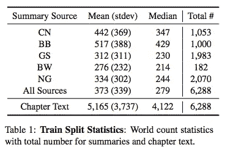
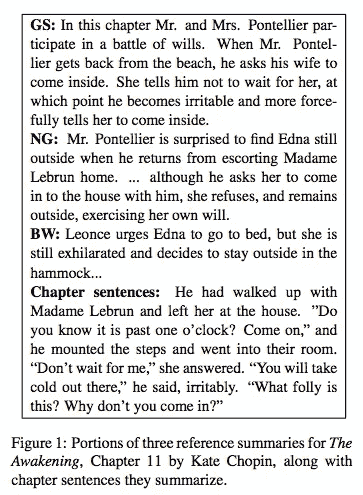
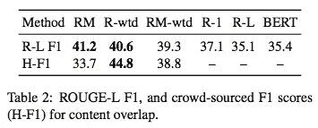
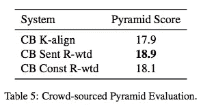

# #NLP365 的第 146 天:NLP 论文摘要——探索小说章节摘要的内容选择

> 原文：<https://towardsdatascience.com/day-146-of-nlp365-nlp-papers-summary-exploring-content-selection-in-summarization-of-novel-a13fa1f6111b?source=collection_archive---------74----------------------->

阅读和理解研究论文就像拼凑一个未解之谜。汉斯-彼得·高斯特在 [Unsplash](https://unsplash.com/s/photos/research-papers?utm_source=unsplash&utm_medium=referral&utm_content=creditCopyText) 上拍摄的照片。

## [内线艾](https://medium.com/towards-data-science/inside-ai/home) [NLP365](http://towardsdatascience.com/tagged/nlp365)

## NLP 论文摘要是我总结 NLP 研究论文要点的系列文章

项目#NLP365 (+1)是我在 2020 年每天记录我的 NLP 学习旅程的地方。在这里，你可以随意查看我在过去的 280 天里学到了什么。在这篇文章的最后，你可以找到以前按自然语言处理领域分类的论文摘要，你也可以订阅# NLP 365 @[http://eepurl.com/gW7bBP](http://eepurl.com/gW7bBP):)

今天的 NLP 论文是 ***探讨小说章节*** 摘要中的内容选择。以下是研究论文的要点。

# 目标和贡献

提出了一个新的总结任务，从在线学习指南中总结小说章节。由于源文件的长度和更高层次的转述，这比新闻摘要更具挑战性。本文的贡献如下:

1.  提出了一个新的概括小说章节的概括任务
2.  提出了一种新的度量标准，用于将参考摘要中的句子与章节中的句子对齐，以创建高质量的“基础事实”摘要来训练我们的摘要模型。通过 ROUGE 分数和金字塔分析，这已被证明比以前的方法有所改进

# 资料组

我们从五个不同的学习指南中收集章节/摘要对:

1.  巴伦书笔记(BB)
2.  书狼
3.  克利夫斯 Notes(中国)
4.  坡度保护器(GS)
5.  小说指南(NG)

我们进行了两轮过滤来处理数据。首先，我们删除任何超过 700 个句子的参考文本，因为它们太大了。其次，我们删除过于冗长的摘要(压缩比小于 2)。我们的最终章节/摘要对总数是 8088 (6288 / 938 / 862)。培训数据统计如下所示。章节正文平均比新闻文章长 7 倍，章节摘要比新闻摘要长 8 倍。此外，对于小说，摘要和章节之间的平均单词重叠率为 33.7%，而对于 CNN/DailyMail news，则为 68.7%，显示了章节摘要中的高水平转述。下面的示例参考摘要中显示了这种大量的解释。

数据集的描述性统计[1]

摘要示例[1]

# 对齐实验

## 相似性度量

参考摘要 vs R-L 贪婪稳定的例子[1]

ROUGE-L 和众包 F1 的内容得分重叠[1]

由于基本事实摘要是抽象的，我们需要创建黄金提取摘要来训练我们的提取摘要模型。这就需要我们把章节和摘要中的句子对齐。为了对齐句子，我们首先需要一个度量来测量相似性。先前的工作大量使用 ROUGE 分数作为相似性度量。然而，胭脂分数分配相等的权重给每个字，然而，我们相信我们应该分配较高的权重给重要的字。为了结合这一点，我们使用平滑的逆频率加权方案，并将其应用于取 ROUGE-1、2 和 L 的平均值，以生成提取(R-wtd)。我们将这种 R-wtd 方法与其他相似性度量进行了比较，如 ROUGE-1、ROUGE-L、BERT 以及未加权和加权的 ROUGE + METEOR (RM)。我们使用 ROUGE-L F1 评分对这些相似性度量进行了自动评估和人工评估。需要人工评估来对照对齐的句子评估每个参考摘要。结果如下所示，R-wtd 在相似性指标中得分最高。

## 对齐方法

一旦我们建立了我们的相似性度量，我们现在探索不同的比对方法，以最终生成我们的黄金提取摘要。以前的工作中有两种主要方法:

1.  *汇总级对齐*。选择最佳句子，与摘要进行比较
2.  *句子级对齐*。选择最佳句子，与摘要中的每个句子进行比较

对于摘要级对齐，我们有两种变体:选择句子直到字数限制(WL)和选择句子直到胭脂分数不再增加(WS 摘要)。对于句子级对齐，我们有两种变体:Gale-Shapley 稳定匹配算法和 greedy 算法。结果如下所示，表明句子级稳定算法的性能明显优于其他对齐方法。

对验证集的人工评估[1]

# 实验和结果

为了评估，我们有三个提取模型:

1.  分级 CNN-LSTM (CB)
2.  Seq2seq 注意(K)
3.  RNN(北)

由于我们的数据分析表明，摘要句通常选自不同的章节，因此我们实验了在单词和成分级别应用的对齐方法。我们的评估指标是 ROUGE-1、2、L 和 METEOR。每章有 2-5 个参考摘要，我们根据所有参考摘要评估我们生成的摘要。

结果

胭脂和流星的分数[1]

上述结果比较了三种不同提取模型的性能以及使用不同对齐方法的性能差异。我们可以看到，我们提出的比对方法在所有三个提取模型中都优于基线方法。使用我们的提取靶标，所有三个模型似乎表现相似，表明选择合适的方法产生提取靶标的重要性。鉴于 ROUGE 的不可靠性，我们进行了人工评估，并在我们的最佳性能模型(CB)上计算了每个比对方法的金字塔分数。人群工作者被要求识别哪个生成的概要最好地传达了采样的参考概要内容。结果显示如下。

金字塔评价[1]

# 结论和未来工作

我们已经表明，具有 R-wtd 相似性度量的句子级稳定匹配对齐方法比先前计算 gold 提取摘要的方法执行得更好。然而，在自动和人工评估中，关于提取在句子还是成分级别更好似乎存在矛盾。我们推测，这可能是因为我们在对提取成分的概要进行评分时没有包括额外的上下文，因此不相关的上下文不会违背系统，而在人类评估中，我们包括句子上下文，因此在生成的概要中包括较少的成分。

在未来的工作中，我们计划研究如何在不包含不相关上下文的情况下，将成分组合成流畅的句子。我们也想探索抽象概括，检查语言模型在我们的领域是否有效。这可能具有挑战性，因为语言模型通常有 512 个标记的限制。截断我们的文档可能会损害我们的新章节摘要模型的性能。

## 来源:

[1]f .拉德哈克，b .李，y .奥奈赞和 k .麦克欧文，2020 年。探索小说章节摘要的内容选择。arXiv 预印本 arXiv:2005.01840 。

*原载于 2020 年 5 月 25 日***。**

# *特征提取/基于特征的情感分析*

*   *[https://towards data science . com/day-102-of-NLP 365-NLP-papers-summary-implicit-and-explicit-aspect-extraction-in-financial-BDF 00 a 66 db 41](/day-102-of-nlp365-nlp-papers-summary-implicit-and-explicit-aspect-extraction-in-financial-bdf00a66db41)*
*   *[https://towards data science . com/day-103-NLP-research-papers-utilizing-Bert-for-aspect-based-sense-analysis-via-construction-38ab 3e 1630 a3](/day-103-nlp-research-papers-utilizing-bert-for-aspect-based-sentiment-analysis-via-constructing-38ab3e1630a3)*
*   *[https://towards data science . com/day-104-of-NLP 365-NLP-papers-summary-senthious-targeted-aspect-based-sensitive-analysis-f 24 a2 EC 1 ca 32](/day-104-of-nlp365-nlp-papers-summary-sentihood-targeted-aspect-based-sentiment-analysis-f24a2ec1ca32)*
*   *[https://towards data science . com/day-105-of-NLP 365-NLP-papers-summary-aspect-level-sensation-class ification-with-3a 3539 be 6 AE 8](/day-105-of-nlp365-nlp-papers-summary-aspect-level-sentiment-classification-with-3a3539be6ae8)*
*   *[https://towards data science . com/day-106-of-NLP 365-NLP-papers-summary-an-unsupervised-neural-attention-model-for-aspect-b 874d 007 b 6d 0](/day-106-of-nlp365-nlp-papers-summary-an-unsupervised-neural-attention-model-for-aspect-b874d007b6d0)*
*   *[https://towardsdatascience . com/day-110-of-NLP 365-NLP-papers-summary-double-embedding-and-CNN-based-sequence-labeling-for-b8a 958 F3 bddd](/day-110-of-nlp365-nlp-papers-summary-double-embeddings-and-cnn-based-sequence-labelling-for-b8a958f3bddd)*
*   *[https://towards data science . com/day-112-of-NLP 365-NLP-papers-summary-a-challenge-dataset-and-effective-models-for-aspect-based-35b 7 a5 e 245 b5](/day-112-of-nlp365-nlp-papers-summary-a-challenge-dataset-and-effective-models-for-aspect-based-35b7a5e245b5)*
*   *[https://towards data science . com/day-123-of-NLP 365-NLP-papers-summary-context-aware-embedding-for-targeted-aspect-based-be9f 998d 1131](/day-123-of-nlp365-nlp-papers-summary-context-aware-embedding-for-targeted-aspect-based-be9f998d1131)*

# *总结*

*   *[https://towards data science . com/day-107-of-NLP 365-NLP-papers-summary-make-lead-bias-in-your-favor-a-simple-effective-4c 52 B1 a 569 b 8](/day-107-of-nlp365-nlp-papers-summary-make-lead-bias-in-your-favor-a-simple-and-effective-4c52b1a569b8)*
*   *[https://towards data science . com/day-109-of-NLP 365-NLP-papers-summary-studing-summary-evaluation-metrics-in-the-619 F5 acb1 b 27](/day-109-of-nlp365-nlp-papers-summary-studying-summarization-evaluation-metrics-in-the-619f5acb1b27)*
*   *[https://towards data science . com/day-113-of-NLP 365-NLP-papers-summary-on-extractive-and-abstract-neural-document-87168 b 7 e 90 BC](/day-113-of-nlp365-nlp-papers-summary-on-extractive-and-abstractive-neural-document-87168b7e90bc)*
*   *[https://towards data science . com/day-116-of-NLP 365-NLP-papers-summary-data-driven-summary-of-scientific-articles-3 FBA 016 c 733 b](/day-116-of-nlp365-nlp-papers-summary-data-driven-summarization-of-scientific-articles-3fba016c733b)*
*   *[https://towards data science . com/day-117-of-NLP 365-NLP-papers-summary-abstract-text-summary-a-low-resource-challenge-61 AE 6 CDF 32 f](/day-117-of-nlp365-nlp-papers-summary-abstract-text-summarization-a-low-resource-challenge-61ae6cdf32f)*
*   *[https://towards data science . com/day-118-of-NLP 365-NLP-papers-summary-extractive-summary-of-long-documents-by-combining-AEA 118 a5 eb3f](/day-118-of-nlp365-nlp-papers-summary-extractive-summarization-of-long-documents-by-combining-aea118a5eb3f)*
*   *[https://towards data science . com/day-120-of-NLP 365-NLP-papers-summary-a-simple-theory-model-of-importance-for-summary-843 ddbcb 9b](/day-120-of-nlp365-nlp-papers-summary-a-simple-theoretical-model-of-importance-for-summarization-843ddbbcb9b)*
*   *[https://towards data science . com/day-121-of-NLP 365-NLP-papers-summary-concept-pointer-network-for-abstract-summary-cd55e 577 F6 de](/day-121-of-nlp365-nlp-papers-summary-concept-pointer-network-for-abstractive-summarization-cd55e577f6de)*
*   *[https://towards data science . com/day-124-NLP-papers-summary-tldr-extreme-summary-of-scientific-documents-106 CD 915 F9 a 3](/day-124-nlp-papers-summary-tldr-extreme-summarization-of-scientific-documents-106cd915f9a3)*
*   *[https://towards data science . com/day-143-of-NLP 365-NLP-papers-summary-unsupervised-pseudo-labeling-for-extract-summary-3b 94920 e04c 6](/day-143-of-nlp365-nlp-papers-summary-unsupervised-pseudo-labeling-for-extractive-summarization-3b94920e04c6)*
*   *[https://towards data science . com/day-144-of-NLP 365-NLP-papers-summary-attend-to-medical-ontology-content-selection-for-ff 7 cded 5d 95 b](/day-144-of-nlp365-nlp-papers-summary-attend-to-medical-ontologies-content-selection-for-ff7cded5d95b)*
*   *[https://towards data science . com/day-145-of-NLP 365-NLP-papers-summary-supert-forward-new-frontiers-in-unsupervised-evaluation-188295 f82ce 5](/day-145-of-nlp365-nlp-papers-summary-supert-towards-new-frontiers-in-unsupervised-evaluation-188295f82ce5)*

# *其他人*

*   *[https://towards data science . com/day-108-of-NLP 365-NLP-papers-summary-simple-Bert-models-for-relation-extraction-and-semantic-98f 7698184 D7](/day-108-of-nlp365-nlp-papers-summary-simple-bert-models-for-relation-extraction-and-semantic-98f7698184d7)*
*   *[https://towards data science . com/day-111-of-NLP 365-NLP-papers-summary-the-risk-of-race-of-bias-in-hate-speech-detection-BFF 7 F5 f 20 ce 5](/day-111-of-nlp365-nlp-papers-summary-the-risk-of-racial-bias-in-hate-speech-detection-bff7f5f20ce5)*
*   *[https://towards data science . com/day-115-of-NLP 365-NLP-papers-summary-scibert-a-pre trained-language-model-for-scientific-text-185785598 e33](/day-115-of-nlp365-nlp-papers-summary-scibert-a-pretrained-language-model-for-scientific-text-185785598e33)*
*   *[https://towards data science . com/day-119-NLP-papers-summary-an-argument-annoted-corpus-of-scientific-publications-d 7 b 9 e 2e ea 1097](/day-119-nlp-papers-summary-an-argument-annotated-corpus-of-scientific-publications-d7b9e2ea1097)*
*   *[https://towards data science . com/day-122-of-NLP 365-NLP-papers-summary-applying-Bert-to-document-retrieval-with-birch-766 EAC 17 ab](/day-122-of-nlp365-nlp-papers-summary-applying-bert-to-document-retrieval-with-birch-766eaeac17ab)*
*   *[https://towards data science . com/day-125-of-NLP 365-NLP-papers-summary-a2n-attending-to-neighbors-for-knowledge-graph-inference-87305 C3 aebe 2](/day-125-of-nlp365-nlp-papers-summary-a2n-attending-to-neighbors-for-knowledge-graph-inference-87305c3aebe2)*
*   *[https://towards data science . com/day-126-of-NLP 365-NLP-papers-summary-neural-news-recommendation-with-topic-aware-news-4eb 9604330 bb](/day-126-of-nlp365-nlp-papers-summary-neural-news-recommendation-with-topic-aware-news-4eb9604330bb)*
*   *[https://towards data science . com/day-140-of-NLP 365-NLP-papers-summary-multimodal-machine-learning-for-automated-ICD-coding-b32e 02997 ea 2](/day-140-of-nlp365-nlp-papers-summary-multimodal-machine-learning-for-automated-icd-coding-b32e02997ea2)*
*   *[https://towards data science . com/day-141-of-NLP 365-NLP-papers-summary-text attack-a-framework-for-adversarial-attack-in-aac2a 282d 72 c](/day-141-of-nlp365-nlp-papers-summary-textattack-a-framework-for-adversarial-attacks-in-aac2a282d72c)*
*   *[https://towards data science . com/day-142-of-NLP 365-NLP-papers-summary-measuring-emotions-in-the-the-新冠肺炎-现实世界-忧虑-d565098a0937](/day-142-of-nlp365-nlp-papers-summary-measuring-emotions-in-the-covid-19-real-world-worry-d565098a0937)*