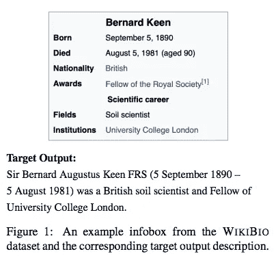
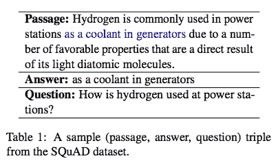
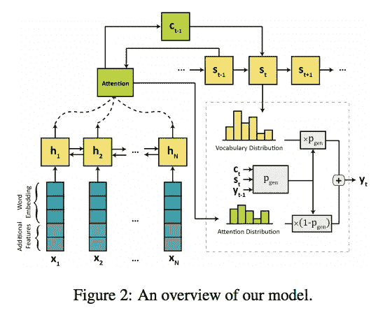
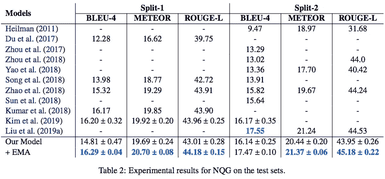
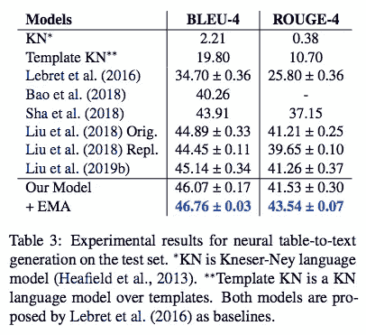

# #NLP365 的第 147 天:NLP 论文摘要——一石二鸟:从结构化和非结构化数据生成文本的简单统一模型

> 原文：<https://towardsdatascience.com/day-147-of-nlp365-nlp-papers-summary-two-birds-one-stone-a-simple-unified-model-for-text-35253aa8289e?source=collection_archive---------82----------------------->

阅读和理解研究论文就像拼凑一个未解之谜。汉斯-彼得·高斯特在 [Unsplash](https://unsplash.com/s/photos/research-papers?utm_source=unsplash&utm_medium=referral&utm_content=creditCopyText) 上拍摄的照片。

## [内线艾](https://medium.com/towards-data-science/inside-ai/home) [NLP365](http://towardsdatascience.com/tagged/nlp365)

## NLP 论文摘要是我总结 NLP 研究论文要点的系列文章

项目#NLP365 (+1)是我在 2020 年每天记录我的 NLP 学习旅程的地方。在这里，你可以随意查看我在过去的 290 天里学到了什么。在这篇文章的最后，你可以找到以前按自然语言处理领域分类的论文摘要，你也可以订阅# NLP 365 @[http://eepurl.com/gW7bBP](http://eepurl.com/gW7bBP):)

今天的 NLP 论文是 ***一石二鸟:一个简单、统一的模型，用于从结构化和非结构化数据生成文本*** 。以下是研究论文的要点。

# 目标和贡献

展示了一个简单的基于双向注意力的 seq2seq 模型，该模型具有通过指数移动平均(EMA)训练的复制机制，可以在表格到文本生成和神经问题生成(NQG)中实现 SOTA 结果。我们表明，适当微调的简单模型也可以实现 SOTA 结果，而不是不断增加神经网络的复杂性，这鼓励我们在引入复杂模型之前彻底探索简单模型。

## 什么是表格到文本的生成任务？

目标是生成表的描述。具体来说，在本文中，我们探索了基于维基百科信息框生成传记，如下所示。

信息框的例子[1]

## 什么是神经问题生成(NQG)任务？

目标是从源文档中生成正确的有意义的问题，并且目标答案在其中。在本文中，我们使用了如下所示的小队数据集。

来自班数据集的样本[1]

# 具有注意和复制机制的双向 Seq2Seq

模型架构有 3 个主要组件:

1.  *编码器*。编码器是一个 biLSTM，它将单词嵌入和附加的特定于任务的特性结合在一起。对于表到文本的生成，额外的特性是字段名和位置信息。对于 NQG，额外的特征是单个比特，指示该单词是否属于目标答案。
2.  *基于注意力的解码器*。我们的解码器使用标准的注意机制和复制机制
3.  *指数移动平均线*。这是模型性能的关键驱动因素。EMA 也称为时间平均。这里，我们有两组参数:a)训练参数和 b)评估参数，它是通过采用训练参数的指数加权移动平均来计算的，由衰减率控制。

整体架构[1]

# 实验和结果

我们使用 WIKIBIO 数据集进行表格到文本的生成，使用 SQUAD 数据集进行 NQG。WIKIBIO 数据集拥有超过 720，000 篇维基百科文章，并使用每篇文章的第一句话作为 infobox 的基本事实描述。SQUAD 数据集拥有 536 篇维基百科文章和超过 100，000 对问答。对于评估指标，我们使用 BLEU-4、METEOR、ROUGE-4 和 ROUGE-L。

## 结果

表格到文本生成和 NQG 的结果如下表所示。总的来说，我们的模型(没有 EMA)在所有指标上的表现都与之前的工作有竞争力。通过额外的 EMA 技术，我们的模型能够在除了 BLEU-4 以外的所有指标中实现 SOTA 结果，在 BLEU-4 中，我们的模型仍然具有竞争力。这着重强调了一个事实，即复杂的架构并不总是最好的方法，我们应该在探索更复杂的模型之前投入更多的时间来探索和改进基本模型，以获得更好的结果。

NQG [1]的测试集结果

表格到文本生成的测试集结果[1]

# 结论和未来工作

潜在的未来工作将是调查 EMA 技术在变压器模型上的使用，以及进行类似的研究，以检查在其他 NLP 任务中对复杂架构的需求。

来源:

[1]:沙希迪，h .，李，m .和林，j .，2019。一石二鸟:从结构化和非结构化数据生成文本的简单统一模型。 *arXiv 预印本 arXiv:1909.10158* 。

*原载于 2020 年 5 月 26 日 https://ryanong.co.uk**的* [*。*](https://ryanong.co.uk/2020/05/26/day-147-nlp-papers-summary-two-birds-one-stone-a-simple-unified-model-for-text-generation-from-structured-and-unstructured-data/)

# 特征提取/基于特征的情感分析

*   [https://towards data science . com/day-102-of-NLP 365-NLP-papers-summary-implicit-and-explicit-aspect-extraction-in-financial-BDF 00 a 66 db 41](/day-102-of-nlp365-nlp-papers-summary-implicit-and-explicit-aspect-extraction-in-financial-bdf00a66db41)
*   [https://towards data science . com/day-103-NLP-research-papers-utilizing-Bert-for-aspect-based-sense-analysis-via-construction-38ab 3e 1630 a3](/day-103-nlp-research-papers-utilizing-bert-for-aspect-based-sentiment-analysis-via-constructing-38ab3e1630a3)
*   [https://towards data science . com/day-104-of-NLP 365-NLP-papers-summary-senthious-targeted-aspect-based-sensitive-analysis-f 24 a2 EC 1 ca 32](/day-104-of-nlp365-nlp-papers-summary-sentihood-targeted-aspect-based-sentiment-analysis-f24a2ec1ca32)
*   [https://towards data science . com/day-105-of-NLP 365-NLP-papers-summary-aspect-level-sensation-class ification-with-3a 3539 be 6 AE 8](/day-105-of-nlp365-nlp-papers-summary-aspect-level-sentiment-classification-with-3a3539be6ae8)
*   [https://towards data science . com/day-106-of-NLP 365-NLP-papers-summary-an-unsupervised-neural-attention-model-for-aspect-b 874d 007 b 6d 0](/day-106-of-nlp365-nlp-papers-summary-an-unsupervised-neural-attention-model-for-aspect-b874d007b6d0)
*   [https://towardsdatascience . com/day-110-of-NLP 365-NLP-papers-summary-double-embedding-and-CNN-based-sequence-labeling-for-b8a 958 F3 bddd](/day-110-of-nlp365-nlp-papers-summary-double-embeddings-and-cnn-based-sequence-labelling-for-b8a958f3bddd)
*   [https://towards data science . com/day-112-of-NLP 365-NLP-papers-summary-a-challenge-dataset-and-effective-models-for-aspect-based-35b 7 a5 e 245 b5](/day-112-of-nlp365-nlp-papers-summary-a-challenge-dataset-and-effective-models-for-aspect-based-35b7a5e245b5)
*   [https://towards data science . com/day-123-of-NLP 365-NLP-papers-summary-context-aware-embedding-for-targeted-aspect-based-be9f 998d 1131](/day-123-of-nlp365-nlp-papers-summary-context-aware-embedding-for-targeted-aspect-based-be9f998d1131)

# 总结

*   [https://towards data science . com/day-107-of-NLP 365-NLP-papers-summary-make-lead-bias-in-your-favor-a-simple-effective-4c 52 B1 a 569 b 8](/day-107-of-nlp365-nlp-papers-summary-make-lead-bias-in-your-favor-a-simple-and-effective-4c52b1a569b8)
*   [https://towards data science . com/day-109-of-NLP 365-NLP-papers-summary-studing-summary-evaluation-metrics-in-the-619 F5 acb1 b 27](/day-109-of-nlp365-nlp-papers-summary-studying-summarization-evaluation-metrics-in-the-619f5acb1b27)
*   [https://towards data science . com/day-113-of-NLP 365-NLP-papers-summary-on-extractive-and-abstract-neural-document-87168 b 7 e 90 BC](/day-113-of-nlp365-nlp-papers-summary-on-extractive-and-abstractive-neural-document-87168b7e90bc)
*   [https://towards data science . com/day-116-of-NLP 365-NLP-papers-summary-data-driven-summary-of-scientific-articles-3 FBA 016 c 733 b](/day-116-of-nlp365-nlp-papers-summary-data-driven-summarization-of-scientific-articles-3fba016c733b)
*   [https://towards data science . com/day-117-of-NLP 365-NLP-papers-summary-abstract-text-summary-a-low-resource-challenge-61 AE 6 CDF 32 f](/day-117-of-nlp365-nlp-papers-summary-abstract-text-summarization-a-low-resource-challenge-61ae6cdf32f)
*   [https://towards data science . com/day-118-of-NLP 365-NLP-papers-summary-extractive-summary-of-long-documents-by-combining-AEA 118 a5 eb3f](/day-118-of-nlp365-nlp-papers-summary-extractive-summarization-of-long-documents-by-combining-aea118a5eb3f)
*   [https://towards data science . com/day-120-of-NLP 365-NLP-papers-summary-a-simple-theory-model-of-importance-for-summary-843 ddbcb 9b](/day-120-of-nlp365-nlp-papers-summary-a-simple-theoretical-model-of-importance-for-summarization-843ddbbcb9b)
*   [https://towards data science . com/day-121-of-NLP 365-NLP-papers-summary-concept-pointer-network-for-abstract-summary-cd55e 577 F6 de](/day-121-of-nlp365-nlp-papers-summary-concept-pointer-network-for-abstractive-summarization-cd55e577f6de)
*   [https://towards data science . com/day-124-NLP-papers-summary-tldr-extreme-summary-of-scientific-documents-106 CD 915 F9 a 3](/day-124-nlp-papers-summary-tldr-extreme-summarization-of-scientific-documents-106cd915f9a3)
*   [https://towards data science . com/day-143-of-NLP 365-NLP-papers-summary-unsupervised-pseudo-labeling-for-extract-summary-3b 94920 e04c 6](/day-143-of-nlp365-nlp-papers-summary-unsupervised-pseudo-labeling-for-extractive-summarization-3b94920e04c6)
*   [https://towards data science . com/day-144-of-NLP 365-NLP-papers-summary-attend-to-medical-ontology-content-selection-for-ff 7 cded 5d 95 b](/day-144-of-nlp365-nlp-papers-summary-attend-to-medical-ontologies-content-selection-for-ff7cded5d95b)
*   [https://towards data science . com/day-145-of-NLP 365-NLP-papers-summary-supert-forward-new-frontiers-in-unsupervised-evaluation-188295 f82ce 5](/day-145-of-nlp365-nlp-papers-summary-supert-towards-new-frontiers-in-unsupervised-evaluation-188295f82ce5)
*   [https://towards data science . com/day-146-of-NLP 365-NLP-papers-summary-exploring-content-selection-in-summary-of-novel-a 13 fa 1 f 6111 b](/day-146-of-nlp365-nlp-papers-summary-exploring-content-selection-in-summarization-of-novel-a13fa1f6111b)

# 其他人

*   [https://towards data science . com/day-108-of-NLP 365-NLP-papers-summary-simple-Bert-models-for-relation-extraction-and-semantic-98f 7698184 D7](/day-108-of-nlp365-nlp-papers-summary-simple-bert-models-for-relation-extraction-and-semantic-98f7698184d7)
*   [https://towards data science . com/day-111-of-NLP 365-NLP-papers-summary-the-risk-of-race-of-bias-in-hate-speech-detection-BFF 7 F5 f 20 ce 5](/day-111-of-nlp365-nlp-papers-summary-the-risk-of-racial-bias-in-hate-speech-detection-bff7f5f20ce5)
*   [https://towards data science . com/day-115-of-NLP 365-NLP-papers-summary-scibert-a-pre trained-language-model-for-scientific-text-185785598 e33](/day-115-of-nlp365-nlp-papers-summary-scibert-a-pretrained-language-model-for-scientific-text-185785598e33)
*   [https://towards data science . com/day-119-NLP-papers-summary-an-argument-annoted-corpus-of-scientific-publications-d 7 b 9 e 2e ea 1097](/day-119-nlp-papers-summary-an-argument-annotated-corpus-of-scientific-publications-d7b9e2ea1097)
*   [https://towards data science . com/day-122-of-NLP 365-NLP-papers-summary-applying-Bert-to-document-retrieval-with-birch-766 EAC 17 ab](/day-122-of-nlp365-nlp-papers-summary-applying-bert-to-document-retrieval-with-birch-766eaeac17ab)
*   [https://towards data science . com/day-125-of-NLP 365-NLP-papers-summary-a2n-attending-to-neighbors-for-knowledge-graph-inference-87305 C3 aebe 2](/day-125-of-nlp365-nlp-papers-summary-a2n-attending-to-neighbors-for-knowledge-graph-inference-87305c3aebe2)
*   [https://towards data science . com/day-126-of-NLP 365-NLP-papers-summary-neural-news-recommendation-with-topic-aware-news-4eb 9604330 bb](/day-126-of-nlp365-nlp-papers-summary-neural-news-recommendation-with-topic-aware-news-4eb9604330bb)
*   [https://towards data science . com/day-140-of-NLP 365-NLP-papers-summary-multimodal-machine-learning-for-automated-ICD-coding-b32e 02997 ea 2](/day-140-of-nlp365-nlp-papers-summary-multimodal-machine-learning-for-automated-icd-coding-b32e02997ea2)
*   [https://towards data science . com/day-141-of-NLP 365-NLP-papers-summary-text attack-a-framework-for-adversarial-attack-in-aac2a 282d 72 c](/day-141-of-nlp365-nlp-papers-summary-textattack-a-framework-for-adversarial-attacks-in-aac2a282d72c)
*   [https://towards data science . com/day-142-of-NLP 365-NLP-papers-summary-measuring-emotions-in-the-the-新冠肺炎-现实世界-忧虑-d565098a0937](/day-142-of-nlp365-nlp-papers-summary-measuring-emotions-in-the-covid-19-real-world-worry-d565098a0937)