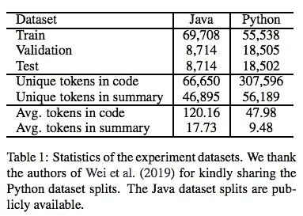
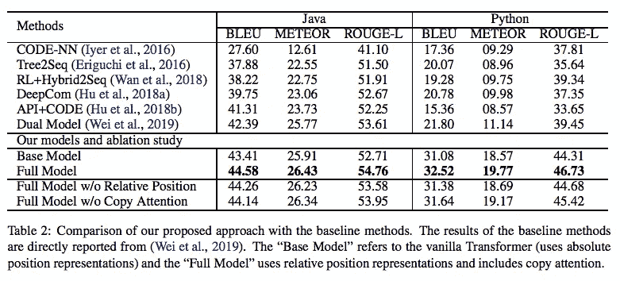
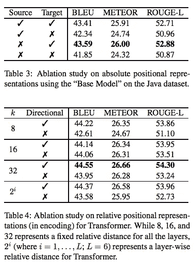
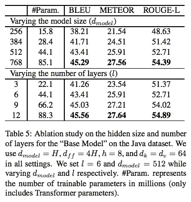
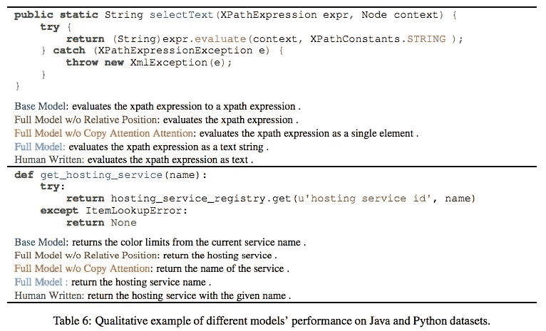

# 第 148 天:NLP 论文摘要—一种基于转换器的源代码摘要方法

> 原文：<https://towardsdatascience.com/day-148-nlp-papers-summary-a-transformer-based-approach-for-source-code-summarization-f07ecdeacf40?source=collection_archive---------76----------------------->

阅读和理解研究论文就像拼凑一个未解之谜。[汉斯-彼得·高斯特](https://unsplash.com/@sloppyperfectionist?utm_source=unsplash&utm_medium=referral&utm_content=creditCopyText)在[号航天飞机](https://unsplash.com/s/photos/research-papers?utm_source=unsplash&utm_medium=referral&utm_content=creditCopyText)上拍摄的照片。

## [内线 AI](https://medium.com/towards-data-science/inside-ai/home) [NLP365](http://towardsdatascience.com/tagged/nlp365)

## 自然语言处理论文摘要是一个系列，在这里我总结了自然语言处理研究论文的要点

项目#NLP365 (+1)是我记录 2020 年每一天 NLP 学习历程的地方。请随意在此查看我在过去 300 天[所学的内容。在本文的最后，您可以找到以前的论文摘要(按 NLP 领域分组，您可以订阅# NLP 365 @](https://ryanong.co.uk/natural-language-processing-365/)[http://eepurl.com/gW7bBP](http://eepurl.com/gW7bBP):)

今天的 NLP 论文是 ***一种基于转换器的源代码摘要方法*** 。以下是该研究论文的主要收获。

# 目标和贡献

利用一个简单的基于变压器的模型与相对位置表示和复制注意机制，以生成源代码总结的 SOTA 结果。我们发现源代码标记位置的绝对编码阻碍了总结的性能，而相对编码显著提高了性能。

## 什么是源代码摘要？

目标是对源代码进行编码，并生成描述程序功能的可读摘要。

# 数据集

我们有两个评估数据集:来自 GitHub 的 Java 和 Python 数据集，如下所示。我们的评估指标为 BLEU、METEOR 和 ROUGE-L。

描述性数据集统计[1]

# 方法学

我们提出的模型是普通的变压器。我们将代码和概要编码为嵌入序列。普通的 Transformer 在编码器和解码器中堆叠了多头注意力和线性变换层。我们还在 Transformer 中包含了复制注意事项，以使模型能够从源代码中复制稀有令牌。

## 位置表示

在这里，我们探索了源代码标记顺序上的绝对位置编码和 Transformer 中的成对关系编码。绝对位置编码旨在捕获源标记的顺序信息，然而，我们发现顺序信息实际上对学习源代码表示没有帮助，并且会导致错误的总结。我们发现，正是令牌之间的相互作用影响了源代码的含义，这也是我们探索成对关系编码的原因。为了捕获输入令牌之间的这种成对关系，我们为每个令牌捕获两个位置 I 和 j 的相对位置表示。

# 结果

如下所示，我们的完整模型优于所有基线模型。事实上，在没有 CamelCase 和 snake_case 代码标记处理的数据集上训练的基本模型，在 ROUGE-L 度量上优于所有基线模型。我们的基线模型没有包含复制注意机制，我们表明复制注意机制确实提高了我们完整模型的性能。

BLEU、METEOR 和 ROUGE-L 的总体结果-我们的方法与基线方法的比较[1]

# 消融研究

## 位置表示的影响

下面的表 3 展示了对源和目标执行绝对位置编码的性能。它展示了当包含绝对位置编码时性能的下降。表 4 展示了学习源代码标记之间成对关系的好处。我们尝试了不同的裁剪距离，以及是否应该包含双向信息。不同裁剪距离的性能与我们完整模型的性能非常相似，包含方向信息的模型优于不包含方向信息的模型。

消融研究-变压器的相对位置表示[1]

## 不同的模型大小和层数

我们下面的结果表明，更深的模型(更多层)比更宽的模型(每层更多神经元)表现更好。我们怀疑更深的模型在源代码总结中更有益，因为它更多地依赖语义信息而不是句法信息。

消融研究 Java 数据集基础模型的隐藏大小和层数[1]

## 定性分析

我们下面的定性例子展示了复制注意力机制使模型能够用更合适的关键词生成更短的摘要。我们观察到，当我们使用相对位置表示时，源代码中的频繁标记具有较高的复制概率。

Java 与 Python 数据集的定性示例[1]

# 结论和今后的工作

未来的一项潜在工作是将代码结构合并到 Transformer 中，并将其应用到其他代码序列生成任务中，例如为源代码更改生成提交消息。

来源:

[1] Ahmad，W.U .，Chakraborty，s .，Ray，b .和 Chang，K.W .，2020 年。一种基于转换器的源代码摘要方法。arXiv 预印本 arXiv:2005.00653 。

*原载于 2020 年 5 月 27 日***。**

# *最新论文*

# *特征提取/基于特征的情感分析*

*   *[https://towardsdatascience . com/day-110-of-NLP 365-NLP-papers-summary-double-embedding-and-CNN-based-sequence-labeling-for-b8a 958 F3 bddd](/day-110-of-nlp365-nlp-papers-summary-double-embeddings-and-cnn-based-sequence-labelling-for-b8a958f3bddd)*
*   *[https://towards data science . com/day-112-of-NLP 365-NLP-papers-summary-a-challenge-dataset-and-effective-models-for-aspect-based-35b 7 a5 e 245 b5](/day-112-of-nlp365-nlp-papers-summary-a-challenge-dataset-and-effective-models-for-aspect-based-35b7a5e245b5)*
*   *[https://towards data science . com/day-123-of-NLP 365-NLP-papers-summary-context-aware-embedding-for-targeted-aspect-based-be9f 998d 1131](/day-123-of-nlp365-nlp-papers-summary-context-aware-embedding-for-targeted-aspect-based-be9f998d1131)*

# *总结*

*   *[https://towards data science . com/day-144-of-NLP 365-NLP-papers-summary-attend-to-medical-ontology-content-selection-for-ff 7 cded 5d 95 b](/day-144-of-nlp365-nlp-papers-summary-attend-to-medical-ontologies-content-selection-for-ff7cded5d95b)*
*   *[https://towards data science . com/day-145-of-NLP 365-NLP-papers-summary-supert-forward-new-frontiers-in-unsupervised-evaluation-188295 f82ce 5](/day-145-of-nlp365-nlp-papers-summary-supert-towards-new-frontiers-in-unsupervised-evaluation-188295f82ce5)*
*   *[https://towards data science . com/day-146-of-NLP 365-NLP-papers-summary-exploring-content-selection-in-summary-of-novel-a 13 fa 1 f 6111 b](/day-146-of-nlp365-nlp-papers-summary-exploring-content-selection-in-summarization-of-novel-a13fa1f6111b)*

# *其他人*

*   *[https://towards data science . com/day-141-of-NLP 365-NLP-papers-summary-text attack-a-framework-for-adversarial-attack-in-aac2a 282d 72 c](/day-141-of-nlp365-nlp-papers-summary-textattack-a-framework-for-adversarial-attacks-in-aac2a282d72c)*
*   *[https://towards data science . com/day-142-of-NLP 365-NLP-papers-summary-measuring-emotions-in-the-the-新冠肺炎-现实世界-忧虑-d565098a0937](/day-142-of-nlp365-nlp-papers-summary-measuring-emotions-in-the-covid-19-real-world-worry-d565098a0937)*
*   *[https://towards data science . com/day-147-of-NLP 365-NLP-papers-summary-two-birds-one-stone-a-simple-unified-model-for-text-35253 aa 8289 e](/day-147-of-nlp365-nlp-papers-summary-two-birds-one-stone-a-simple-unified-model-for-text-35253aa8289e)*