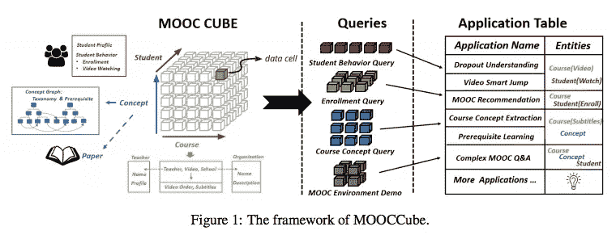
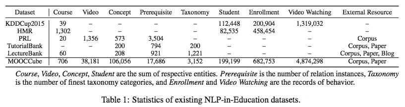
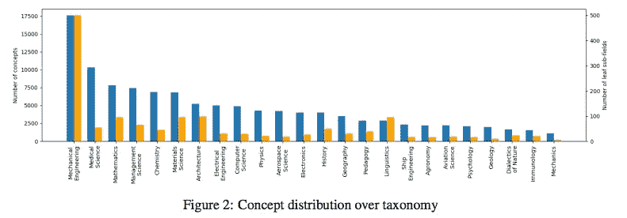
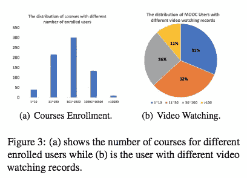
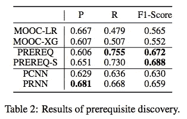

# #NLP365 第 149 天:NLP 论文摘要——mooc cube:mooc cs 中 NLP 应用的大规模数据仓库

> 原文：<https://towardsdatascience.com/day-149-of-nlp365-nlp-papers-summary-mooccube-a-large-scale-data-repository-for-nlp-3fbcab37bfef?source=collection_archive---------84----------------------->

阅读和理解研究论文就像拼凑一个未解之谜。汉斯-彼得·高斯特在 [Unsplash](https://unsplash.com/s/photos/research-papers?utm_source=unsplash&utm_medium=referral&utm_content=creditCopyText) 上拍摄的照片。

## [内线艾](https://medium.com/towards-data-science/inside-ai/home) [NLP365](http://towardsdatascience.com/tagged/nlp365)

## NLP 论文摘要是我总结 NLP 研究论文要点的系列文章

项目#NLP365 (+1)是我在 2020 年每天记录我的 NLP 学习旅程的地方。请随意查看我在过去 305 天里学到的东西。在这篇文章的最后，你可以找到以前按自然语言处理领域分类的论文摘要，你也可以订阅# NLP 365 @[http://eepurl.com/gW7bBP](http://eepurl.com/gW7bBP):)

今天的 NLP 论文是***MOOCCube:MOOCs***中 NLP 应用的大规模数据仓库。以下是研究论文的要点。

# 目标和贡献

展示了 MOOCCube，这是一个大型多维数据存储库，包含 700 多门 MOOC 课程、10 万个概念和 800 万个学生行为以及外部资源。我们执行了一项初步的先决条件关系发现任务，以展示 MOOCCube 的潜力，我们希望这个数据存储库将为教育应用(如课程概念提取)开辟许多 NLP 和 AI 研究。

# MOOCCube

## MOOCCube 与现有的教育数据集有何不同？

1.  *大型多维数据集*。MOOCCube 涵盖了 700 门课程、38K 个视频、200，000 名学生和 100，000 个概念以及 300，000 个关系实例
2.  *高覆盖率*。MOOCCube 涵盖了所有的属性和关系，因为数据是从真实的 MOOC 网站获得的。如下所示，MOOCCube 的一个数据单元以课程、概念和学生为单位，代表学生 s 在课程 c 中学习概念 k。这允许 MOOCCube 提供这些数据单元的不同组合
3.  MOOCCube 可用于为不同任务构建数据集，如辍学预测和概念提取，而以前这是两个不同的数据集

MOOCCube [1]

# 数据集集合

MOOCCube 分为三个主要方面:

1.  课程
2.  概念
3.  学生

## 课程提取

课程是一系列预先录制的视频，对于每个课程，我们提取了大纲、视频列表、教师和组织。我们提取了视频顺序和字幕，并使用 Wikidata 记录了教师和组织的详细描述。

## 概念和概念图

在这个维度中，我们旨在提取课程视频中教授的知识概念。对于每个视频，我们从字幕中提取 10 个最具代表性的课程理念。对于每个概念，我们使用 Wikidata 记录概念描述，并使用 AMiner 搜索前 10 篇相关论文。最后，我们建立了一个新的概念分类法，用先决条件链作为概念图来捕捉概念之间的语义关系。先决条件链是这样形成的，如果概念 A 有助于理解概念 B，那么概念 A 与概念 B 有一个先决条件关系。要建立这个先决条件链:

1.  使用分类信息和视频依赖性减少候选概念对的数量
2.  手动注释和带注释的标签用于训练不同的模型，以进一步构建更大距离的监督先决数据集

## 学生行为

这个维度倾向于支持课程推荐、视频导航、辍学预测以及课程与概念之间关系的研究。在这里，我们保存了 2017-2019 年近 20 万用户的注册记录和视频观看日志。视频观看日志由观看视频时的学生行为组成，例如常见的视频点、点击某个句子等。我们用用户标识匿名用户。

# 数据分析

下图比较了我们的 MOOCCube 数据集与其他教育数据集。我们的 MOOCCube 拥有最大的数据规模，在不同维度上，尤其是概念图维度上，都比以前的教育数据集大得多。此外，我们的 MOOCCube 涵盖了 MOOC 环境中所有不同类型的数据，这与之前涵盖学生行为或课程内容的教育数据集形成了对比。

现有教育数据集的描述性统计[1]

下图展示了我们的概念分布和注册用户的课程分布。总的来说，我们将概念分为 24 个领域。我们的数据集在工程课程中比自然科学中有更多的概念。在图 3 中，显示了 451 门课程注册了超过 100 个用户，并且超过 70%的用户观看了超过 10 个视频。

概念分布[1]

课程注册和视频观看的分布明细[1]

# 应用

作为使用 MOOCCube 的示例应用，我们执行了先决条件关系发现。这就是旨在回答“一个人应该先学什么”这一问题的任务。我们使用 MOOCCube 数据集再现了不同的方法，结果显示在以下先决条件中，表现出最好的 F1 分数，我们相信 MOOCCube 数据的高覆盖率有助于发现先决条件关系。此外，我们的两个基准 PCNN 和 PRNN 产生了有竞争力的结果，展示了我们的数据集的有效性。

精确度、召回率和 F1 值[1]

# 结论和未来工作

潜在的未来工作可能是 a)利用 MOOCCube 的更多数据类型来促进现有主题，b)为现有任务采用高级模型，以及 c)在在线教育领域发现更多创新的 NLP 应用。

来源:

[1]于，李，刘，张，钟，秦，王，杨，罗，李，李，刘，张，唐，2020 年 7 月.mooc cube:mooc 中 NLP 应用的大规模数据仓库。在*计算语言学协会第 58 届年会的会议录*(第 3135–3142 页)。

*原载于 2020 年 5 月 28 日***。**

# *最新论文*

# *特征提取/基于特征的情感分析*

*   *[https://towardsdatascience . com/day-110-of-NLP 365-NLP-papers-summary-double-embedding-and-CNN-based-sequence-labeling-for-b8a 958 F3 bddd](/day-110-of-nlp365-nlp-papers-summary-double-embeddings-and-cnn-based-sequence-labelling-for-b8a958f3bddd)*
*   *[https://towards data science . com/day-112-of-NLP 365-NLP-papers-summary-a-challenge-dataset-and-effective-models-for-aspect-based-35b 7 a5 e 245 b5](/day-112-of-nlp365-nlp-papers-summary-a-challenge-dataset-and-effective-models-for-aspect-based-35b7a5e245b5)*
*   *[https://towards data science . com/day-123-of-NLP 365-NLP-papers-summary-context-aware-embedding-for-targeted-aspect-based-be9f 998d 1131](/day-123-of-nlp365-nlp-papers-summary-context-aware-embedding-for-targeted-aspect-based-be9f998d1131)*

# *总结*

*   *[https://towards data science . com/day-144-of-NLP 365-NLP-papers-summary-attend-to-medical-ontology-content-selection-for-ff 7 cded 5d 95 b](/day-144-of-nlp365-nlp-papers-summary-attend-to-medical-ontologies-content-selection-for-ff7cded5d95b)*
*   *[https://towards data science . com/day-145-of-NLP 365-NLP-papers-summary-supert-forward-new-frontiers-in-unsupervised-evaluation-188295 f82ce 5](/day-145-of-nlp365-nlp-papers-summary-supert-towards-new-frontiers-in-unsupervised-evaluation-188295f82ce5)*
*   *[https://towards data science . com/day-146-of-NLP 365-NLP-papers-summary-exploring-content-selection-in-summary-of-novel-a 13 fa 1 f 6111 b](/day-146-of-nlp365-nlp-papers-summary-exploring-content-selection-in-summarization-of-novel-a13fa1f6111b)*
*   *[https://towards data science . com/day-148-NLP-papers-summary-a-transformer-based-approach-for-source-code-summary-f 07 ecde ACF 40](/day-148-nlp-papers-summary-a-transformer-based-approach-for-source-code-summarization-f07ecdeacf40)*

# *其他人*

*   *[https://towards data science . com/day-141-of-NLP 365-NLP-papers-summary-text attack-a-framework-for-adversarial-attack-in-aac2a 282d 72 c](/day-141-of-nlp365-nlp-papers-summary-textattack-a-framework-for-adversarial-attacks-in-aac2a282d72c)*
*   *[https://towards data science . com/day-142-of-NLP 365-NLP-papers-summary-measuring-emotions-in-the-the-新冠肺炎-现实世界-忧虑-d565098a0937](/day-142-of-nlp365-nlp-papers-summary-measuring-emotions-in-the-covid-19-real-world-worry-d565098a0937)*
*   *[https://towards data science . com/day-147-of-NLP 365-NLP-papers-summary-two-birds-one-stone-a-simple-unified-model-for-text-35253 aa 8289 e](/day-147-of-nlp365-nlp-papers-summary-two-birds-one-stone-a-simple-unified-model-for-text-35253aa8289e)*