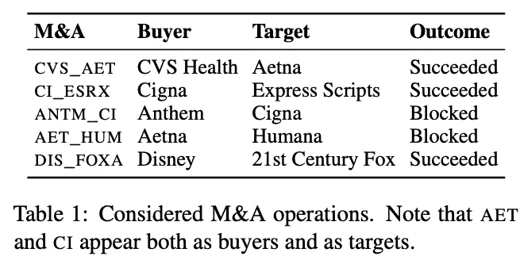
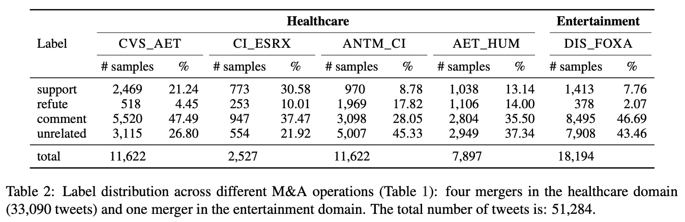
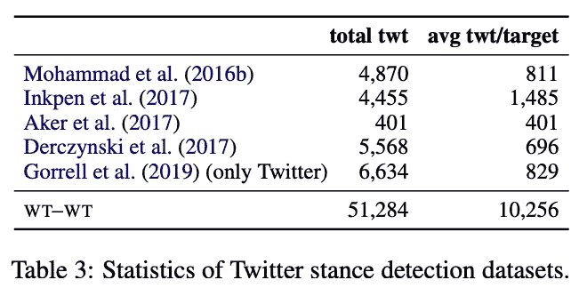
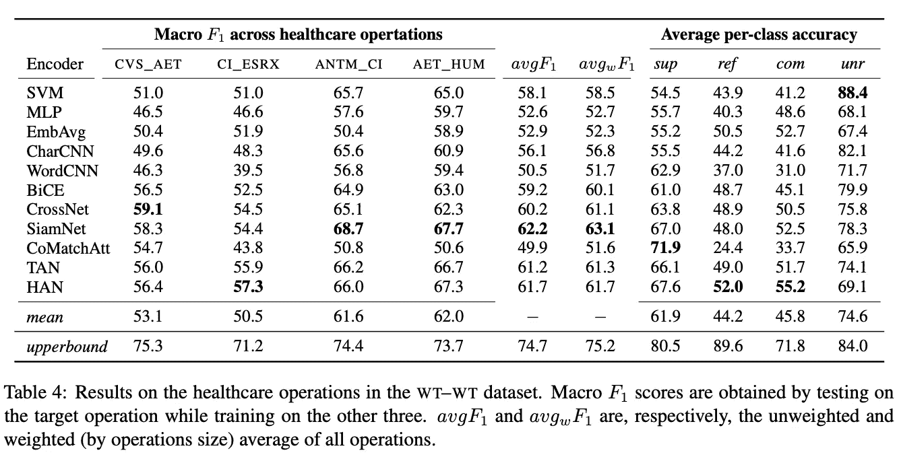
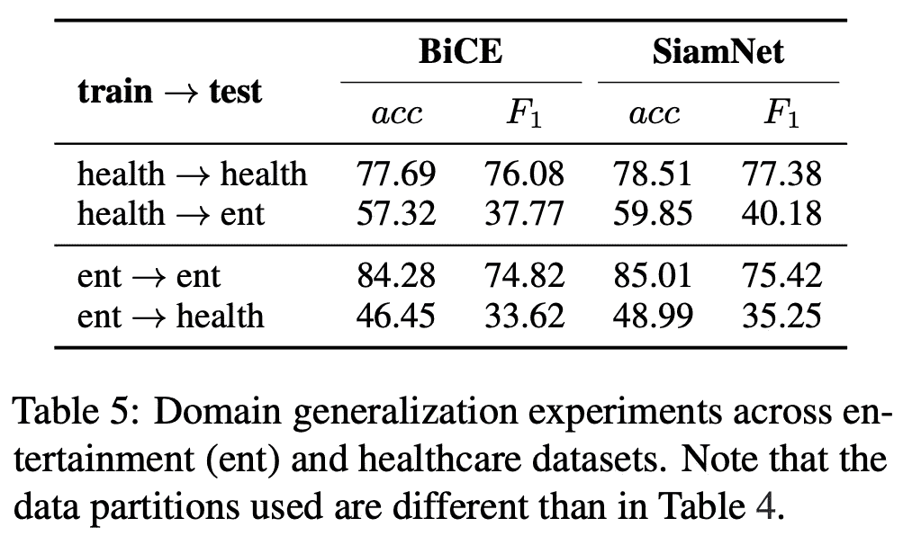

# #NLP365 的第 150 天:NLP 论文摘要——他们会不会——他们不会——他们:一个用于 Twitter 上姿态检测的非常大的数据集

> 原文：<https://towardsdatascience.com/day-150-of-nlp365-nlp-papers-summary-will-they-wont-they-a-very-large-dataset-for-stance-aa877c260b62?source=collection_archive---------74----------------------->

阅读和理解研究论文就像拼凑一个未解之谜。汉斯-彼得·高斯特在 [Unsplash](https://unsplash.com/s/photos/research-papers?utm_source=unsplash&utm_medium=referral&utm_content=creditCopyText) 上拍摄的照片。

## [内线艾](https://medium.com/towards-data-science/inside-ai/home) [NLP365](http://towardsdatascience.com/tagged/nlp365)

## NLP 论文摘要是我总结 NLP 研究论文要点的系列文章

项目#NLP365 (+1)是我在 2020 年每天记录我的 NLP 学习旅程的地方。请随意查看我在过去 305 天里学到的东西。在这篇文章的最后，你可以找到以前按自然语言处理领域分类的论文摘要，你也可以订阅# NLP 365 @[http://eepurl.com/gW7bBP](http://eepurl.com/gW7bBP):)

今天的 NLP 论文是***Will-They-Won-Won-They:Twitter 上一个非常大的姿态检测数据集*** 。以下是研究论文的要点。

# 目标和贡献

提交最大的姿势检测数据集 Will-They-Won-Won-They(WT-WT)，其中包含 51，284 条推文。所有注释都由专家手动标注，确保模型的高质量评估。我们还将 11 个现有的 SOTA 模型应用于我们的数据集，并表明现有的 SOTA 模型与我们的数据集相矛盾，表明我们的数据集对进一步开发模型的未来研究是有用的。最后，我们对娱乐业中的 M&A 操作进行了另一种诠释，并探讨了我们的最佳表现模型在应用于不同领域时的稳健性。我们观察到，我们的模型很难适应哪怕是很小的畴变。

# WT-WT 数据集

该数据集涵盖了金融领域谣言验证的立场检测，特别是在并购领域。这是因为 M&A 过程有许多阶段，Twitter 用户对每个阶段的看法演变与谣言验证相似。构建 WT-WT 数据集的过程包括 4 个不同的步骤，包括 5 种不同的 M&A 运算，如下图所示。

1.  资料检索
2.  任务定义和注释指南
3.  数据注释
4.  质量评估

不同的有针对性的 M&A 行动[1]

## 资料检索

在这里，对于每个操作，我们首先使用 Selenium 来检索以下推文的推文 id:

1.  提到两家公司名称或缩写的推文
2.  提到其中一家公司的推文带有预定义的特定合并条款

日期范围涵盖拟议合并前的一年和合并发生后的六个月。然后，我们使用 Tweepy 通过 Tweets IDs 检索 tweet 的文本。

## 任务定义和注释指南

我们有四个姿势标签:

1.  *支持*。支持合并的推特
2.  *反驳*。对合并表示怀疑的推文
3.  *评论*。对合并发表评论但不支持或反驳的推文
4.  *不相关*。与合并无关的推文

根据目标实体的不同，同一样本可以有不同的标签。此外，我们的立场检测不同于有针对性的情绪分析，因为有人可以在不表达合并是否会发生的情况下推断出对合并的情绪。

## 数据注释

数据注释过程是由剑桥大学的 10 名金融学者分批对 2000 个样本进行的。

## 质量评估

注释者对之间的平均相关性是 0.67，显示了数据的高质量。我们还要求一位领域专家对 3000 条推文样本进行标注，并以此作为人类评估的上限。支持和评论样本在注释者之间引起了最大的分歧，因为我们认为这样的样本大多是主观的。不相关标签的包含导致了不相关样本和评论样本之间更高的不一致性，使得我们的数据集更具挑战性。

## 标签分发

下图展示了每个 M&A 工厂的标签分布情况。我们观察到反驳和支持样本的相对比例与并购被批准或被阻止之间存在相关性。像往常一样，评论推文比支持所有操作更频繁。

跨不同 M&A 运营的标签分布[1]

## 与现有语料库的比较

在这里，我们将我们的数据集与现有数据集进行了比较，如下表所示。如上所述，我们的数据集是最大的姿态检测数据集。除了规模之外，我们的注释过程涉及高技能的领域专家，而不是众包。此外，我们的数据集包含用于跨领域研究的不同领域。

Twitter 姿态检测数据集的描述性统计[1]

# 实验和结果

我们选择并重新实现了之前用于姿态检测的 11 个强模型。结果显示如下。SiamNet 在 F1 平均和加权平均分数方面表现最佳。像往常一样，SVM 为姿态检测提供了一个强大的基线。就不同的类别分类而言，模型在支持和评论类别之间似乎具有相对较高的错误分类数量。包含语言特征似乎减少了错误分类。CharCNN 获得了不相关样本的最佳性能，这表明我们应该为未来的架构使用字符级信息。

WT-WT 数据集中医疗保健操作的结果[1]

## 对畴变的鲁棒性

在这里，我们探索我们的最佳模型如何在娱乐行业的 M&A 事件上进行跨域实验。结果显示如下。当用相同的领域数据集训练和测试模型时，结果显示了很强的性能。当模型在健康或娱乐数据集上训练并在另一个领域上测试时，我们观察到性能显著下降，表明我们的模型具有很强的领域依赖性。

领域概括实验[1]

# 结论和未来工作

我们表明，现有的 SOTA 模型在我们代表人类上限的数据集上表现低 10%。潜在的未来研究可能涉及探索基于转换器的模型和数据集上的不同模型架构。此外，数据集包含多个领域，允许未来使用我们的数据集进行跨目标和跨领域的研究。

来源:

[1]康弗蒂，c .，伯恩特，j .，皮莱赫瓦尔，M.T .，詹尼察鲁，c .，托克斯瓦尔，f .和科利尔，n .，2020 年。will-They-would-They:一个用于 Twitter 上姿势检测的非常大的数据集。arXiv 预印本 arXiv:2005.00388 。

*原载于 2020 年 5 月 29 日***。**

# *最新论文*

# *特征提取/基于特征的情感分析*

*   *[https://towardsdatascience . com/day-110-of-NLP 365-NLP-papers-summary-double-embedding-and-CNN-based-sequence-labeling-for-b8a 958 F3 bddd](/day-110-of-nlp365-nlp-papers-summary-double-embeddings-and-cnn-based-sequence-labelling-for-b8a958f3bddd)*
*   *[https://towards data science . com/day-112-of-NLP 365-NLP-papers-summary-a-challenge-dataset-and-effective-models-for-aspect-based-35b 7 a5 e 245 b5](/day-112-of-nlp365-nlp-papers-summary-a-challenge-dataset-and-effective-models-for-aspect-based-35b7a5e245b5)*
*   *[https://towards data science . com/day-123-of-NLP 365-NLP-papers-summary-context-aware-embedding-for-targeted-aspect-based-be9f 998d 1131](/day-123-of-nlp365-nlp-papers-summary-context-aware-embedding-for-targeted-aspect-based-be9f998d1131)*

# *总结*

*   *[https://towards data science . com/day-144-of-NLP 365-NLP-papers-summary-attend-to-medical-ontology-content-selection-for-ff 7 cded 5d 95 b](/day-144-of-nlp365-nlp-papers-summary-attend-to-medical-ontologies-content-selection-for-ff7cded5d95b)*
*   *[https://towards data science . com/day-145-of-NLP 365-NLP-papers-summary-supert-forward-new-frontiers-in-unsupervised-evaluation-188295 f82ce 5](/day-145-of-nlp365-nlp-papers-summary-supert-towards-new-frontiers-in-unsupervised-evaluation-188295f82ce5)*
*   *[https://towards data science . com/day-146-of-NLP 365-NLP-papers-summary-exploring-content-selection-in-summary-of-novel-a 13 fa 1 f 6111 b](/day-146-of-nlp365-nlp-papers-summary-exploring-content-selection-in-summarization-of-novel-a13fa1f6111b)*
*   *[https://towardsdatascience . com/day-148-NLP-papers-summary-a-transformer-based-approach-for-source-code-summary-f 07 ecde ACF 40](/day-148-nlp-papers-summary-a-transformer-based-approach-for-source-code-summarization-f07ecdeacf40)*

# *其他人*

*   *[https://towards data science . com/day-141-of-NLP 365-NLP-papers-summary-text attack-a-framework-for-adversarial-attack-in-aac2a 282d 72 c](/day-141-of-nlp365-nlp-papers-summary-textattack-a-framework-for-adversarial-attacks-in-aac2a282d72c)*
*   *[https://towards data science . com/day-142-of-NLP 365-NLP-papers-summary-measuring-emotions-in-the-the-新冠肺炎-现实世界-忧虑-d565098a0937](/day-142-of-nlp365-nlp-papers-summary-measuring-emotions-in-the-covid-19-real-world-worry-d565098a0937)*
*   *[https://towards data science . com/day-147-of-NLP 365-NLP-papers-summary-two-birds-one-stone-a-simple-unified-model-for-text-35253 aa 8289 e](/day-147-of-nlp365-nlp-papers-summary-two-birds-one-stone-a-simple-unified-model-for-text-35253aa8289e)*
*   *[https://towards data science . com/day-149-of-NLP 365-NLP-papers-summary-mooccube-a-large-scale-data-repository-for-NLP-3fb cab 37 bfef](/day-149-of-nlp365-nlp-papers-summary-mooccube-a-large-scale-data-repository-for-nlp-3fbcab37bfef)*