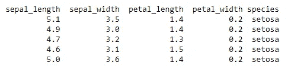
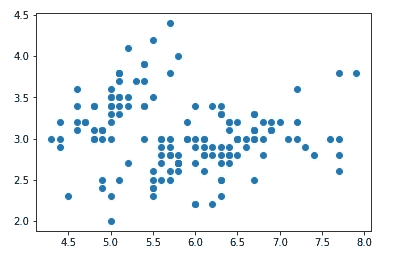
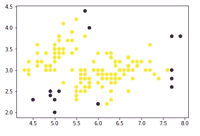
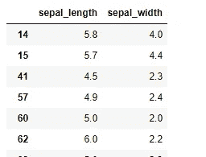

# DBS can——一种基于密度的无监督欺诈检测算法

> 原文：<https://towardsdatascience.com/dbscan-a-density-based-unsupervised-algorithm-for-fraud-detection-887c0f1016e9?source=collection_archive---------13----------------------->


帕特里克·托马索在 [Unsplash](https://unsplash.com?utm_source=medium&utm_medium=referral) 上的照片

## 欺诈检测方面的小数据科学

[根据最近的一份报告](https://www.javelinstrategy.com/coverage-area/2020-identity-fraud-study-genesis-identity-fraud-crisis?ekey=1041077962&edate=20201007&cmpgnid=em-dcp-EFLS_0002M&uniqueid=J41025338000803&lnk_loc=FOOTER)欺诈交易造成的财务损失已达到约 170 亿美元，多达 5%的消费者遭遇过某种形式的欺诈事件。

鉴于如此巨大的财务损失，每个行业都非常重视欺诈检测。不仅仅是金融行业容易受到影响，异常现象在每一个行业都很普遍，并且可能采取多种不同的形式，例如网络入侵、业务绩效中断和 KPI 的突然变化等。

欺诈/异常/异常值检测长期以来一直是数据科学领域的热门研究课题。在不断变化的欺诈检测环境中，每天都在测试和使用新的工具和技术来筛选异常情况。在这一系列文章中，到目前为止，我已经讨论了六种不同的欺诈检测技术:

*   [椭圆形信封](/machine-learning-for-anomaly-detection-elliptic-envelope-2c90528df0a6)
*   [局部异常值因子(LOF)](/anomaly-detection-with-local-outlier-factor-lof-d91e41df10f2)
*   [Z 值](/z-score-for-anomaly-detection-d98b0006f510)
*   [箱线图](/boxplot-for-anomaly-detection-9eac783382fd)
*   [统计技术](/statistical-techniques-for-anomaly-detection-6ac89e32d17a)
*   [时间序列异常检测](/time-series-anomaly-detection-with-anomalize-library-67472003c003)

今天，我将介绍另一种称为 DBSCAN 的技术，它是基于密度的噪声应用空间聚类的缩写。

顾名思义，DBSCAN 是一种基于密度的无监督机器学习算法。它将多维数据作为输入，并根据模型参数(例如ε和最小样本)对其进行聚类。基于这些参数，算法确定数据集中的某些值是否是异常值。

下面是 Python 编程语言的简单演示。

# Scikit-Learn 中的 DBSCAN 实现

Scikit-learn 有一个 DBSCAN 模块，作为其无监督机器学习算法的一部分。只需几个简单的步骤，这种算法就可以立即用于欺诈检测。

## **第一步:导入库**

对于这个演示，我们需要三个关键库来处理数据、可视化和建模。

```
# data wrangling
import pandas as pd# visualization
import matplotlib.pyplot as plt# algorithm
from sklearn.cluster import DBSCAN
```

## **第二步:导入&可视化数据**

我使用的是网上著名的虹膜数据集，所以你可以跟着练习，不用担心从哪里得到数据，如何清理这些数据。

```
# import data
df = pd.read_csv("[https://raw.githubusercontent.com/uiuc-cse/data-fa14/gh-pages/data/iris.csv](https://raw.githubusercontent.com/uiuc-cse/data-fa14/gh-pages/data/iris.csv)")print(df.head())
```



让我们选择一个数据子集来测试算法，并将它们可视化在散点图中。



二维数据散点图

## 第三步:建模

该模型采用的两个最重要的参数值是(i) *esp* ，其指定两点之间的距离，即，数据点彼此应该有多接近以被认为是聚类的一部分；以及(ii) *min_samples，*，其指定一个点在一个聚类中应该具有的邻居的最小数量。

```
# input data
data = df[["sepal_length", "sepal_width"]]# specify & fit model
model = DBSCAN(eps = 0.4, min_samples = 10).fit(data)
```

## **第四步:可视化**

```
# visualize outputs
colors = model.labels_
plt.scatter(data["sepal_length"], data["sepal_width"], c = colors)
```



紫色中检测到异常值

## **步骤 5:创建异常值数据框**

```
# outliers dataframe
outliers = data[model.labels_ == -1]print(outliers)
```



异常值的数据框架

## **总结**

本文的目的是介绍 DBS can——一种基于聚类的无监督机器学习技术，用于欺诈/异常值/异常检测。它的实现可以简单到只需要使用`sklearn`库的五个步骤。当然，这只是一个简单的概念演示。真实世界的应用程序需要更多的实验来找到适合特定环境和行业的最佳模型。