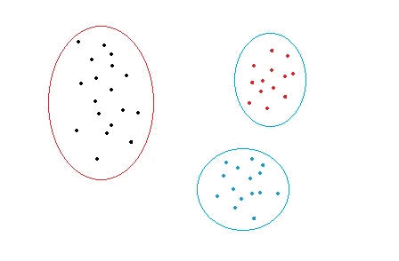
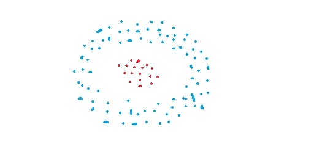
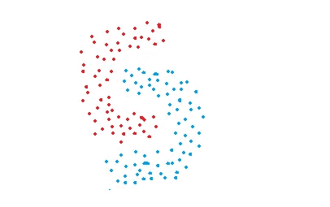
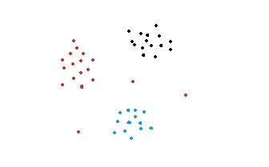
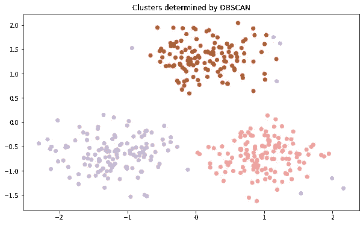

# DBSCAN 集群—解释

> 原文：<https://towardsdatascience.com/dbscan-clustering-explained-97556a2ad556?source=collection_archive---------1----------------------->

## 详细的理论解释和 scikit-learn 实现

聚类是一种对一组数据点进行分组的方法，将相似的数据点分组在一起。因此，聚类算法寻找数据点之间的相似或相异之处。聚类是一种无监督的学习方法，因此没有与数据点相关联的标签。该算法试图找到数据的底层结构。


简·梅乌斯在 [Unsplash](https://unsplash.com/s/photos/cluster?utm_source=unsplash&utm_medium=referral&utm_content=creditCopyText) 上的照片

有不同的方法和算法来执行聚类任务，这些任务可以分为三个子类别:

*   基于分区的聚类:例如 k 均值、k 中值
*   等级聚类:例如聚集、分裂
*   基于密度的聚类:例如 DBSCAN

在这篇文章中，我将尝试详细解释 DBSCAN 算法。如果你想了解其他类型的聚类算法，你也可以访问下面的帖子:

[](/k-means-clustering-explained-4528df86a120) [## k-均值聚类—已解释

### 详细的理论解释和 scikit-learn 实现

towardsdatascience.com](/k-means-clustering-explained-4528df86a120) [](/hierarchical-clustering-explained-e58d2f936323) [## 分层聚类—已解释

### 理论解释和科学学习范例

towardsdatascience.com](/hierarchical-clustering-explained-e58d2f936323) 

# **基于密度的聚类**

基于分区和层次聚类技术对于正常形状的聚类非常有效。然而，当涉及到任意形状的聚类或检测异常值时，基于密度的技术更有效。

例如，使用 k-means 算法可以很容易地将下图中的数据集分成三个聚类。



k 均值聚类

请考虑以下数字:



这些图中的数据点以任意形状分组或者包含异常值。基于密度的聚类算法在发现高密度区域和离群点方面非常有效。对于某些任务来说，检测异常值是非常重要的，例如异常检测。

# **DBSCAN 算法**

DBSCAN 代表**d**en sity-**b**ass**c**lustering of**a**应用与 **n** oise。它能够找到任意形状的聚类和带有噪声的聚类(即异常值)。

DBSCAN 背后的主要思想是，如果一个点靠近来自该簇的许多点，则该点属于该簇。

DBSCAN 有两个关键参数:

*   **eps** :指定邻居的距离。如果两点之间的距离小于或等于 eps，则认为这两点是相邻的。
*   **minPts:** 定义一个聚类的最小个数据点。

基于这两个参数，点被分类为核心点、边界点或异常点:

*   **核心点:**如果一个点在其半径为 eps 的周围区域中至少有 minPts 个数的点(包括该点本身)，则该点是核心点。
*   **边界点:**如果一个点可以从一个核心点到达，并且其周围区域内的点数小于 minPts，那么这个点就是边界点。
*   **离群点:**如果一个点不是核心点，并且从任何核心点都不可达，那么这个点就是离群点。

这些观点可以用形象化来更好地解释。下图摘自维基百科:


[图源](https://en.wikipedia.org/wiki/DBSCAN)

在这种情况下，minPts 是 4。红色点是核心点，因为在其半径为 eps 的周围区域内至少有**4 个点。该区域在图中用圆圈表示。黄色点是边界点，因为它们可以从核心点到达，并且其邻域内的点少于 4 个。可到达意味着在核心点的周围区域。点 B 和 C 在其邻域内(即以 eps 为半径的周围区域)有两个点(包括点本身)。最后，N 是一个异常值，因为它不是一个核心点，不能从核心点到达。**

我们已经学习了参数和不同类型点的定义。现在我们可以谈谈算法是如何工作的。这其实很简单:

*   确定 minPts 和 eps。
*   随机选择一个起始点，使用半径 eps 确定其邻域。如果邻域中至少有 minPts 个数的点，则将该点标记为核心点，并开始形成聚类。如果不是，则该点被标记为噪声。一旦聚类形成开始(假设聚类 A)，初始点邻域内的所有点都成为聚类 A 的一部分。如果这些新点也是核心点，则它们邻域内的点也被添加到聚类 A 中。

> 注意:被标记为噪声的点可以被重新访问，并且是聚类的一部分。

*   下一步是在前面步骤中没有访问过的点中随机选择另一个点。然后同样的程序适用。
*   当所有点都被访问时，该过程结束。

> 使用 k-means 算法中的距离测量方法来确定点之间的距离。最常用的方法是欧氏距离。

通过应用这些步骤，DBSCAN 算法能够找到高密度区域并将它们从低密度区域中分离出来。

一个集群包括相邻的核心点(即彼此可到达的)以及这些核心点的所有边界点。形成集群的必要条件是至少有一个核心点。尽管可能性很小，但我们可能有一个只有一个核心点及其边界点的集群。

# **Scikit-learn 实现**

我们首先使用 scikit-learn 的 datasets 模块创建一个样本数据集。创建样本数据点后，我们将使用 scikit-learn 的预处理模块中的 StandardScaler 类对值进行归一化。

> **注意**:归一化数值很重要，因为这样更容易找到邻域半径(eps)的合适距离。

让我们首先导入库:

```
import numpy as npfrom sklearn.datasets import make_blobs
from sklearn.preprocessing import StandardScalerimport matplotlib.pyplot as plt
%matplotlib inline
```

我们将创建一个包含 3 个聚类的数据集，每个聚类的标准偏差为 0.5。样本数量是 400，我们也选择三个点作为质心(聚类的中心)。您可以使用 make_blobs 函数随意调整这些参数。

```
#Determine centroids
centers = [[0.5, 2], [-1, -1], [1.5, -1]]#Create dataset
X, y = make_blobs(n_samples=400, centers=centers, 
                  cluster_std=0.5, random_state=0)#Normalize the values
X = StandardScaler().fit_transform(X)
```

我们还可以绘制数据集，以查看每个聚类的外观:

```
plt.figure(figsize=(10,6))
plt.scatter(X[:,0], X[:,1], c=y, cmap='Paired')
```


我们现在可以创建一个 DBSCAN 对象并拟合数据:

```
from sklearn.cluster import DBSCANdb = DBSCAN(eps=0.4, min_samples=20)db.fit(X)
```

我们只需要使用 **eps** 和 **min_samples** 参数定义 eps 和 minPts 值。

> **注意**:我们不必指定 DBSCAN 的聚类数，这是 DBSCAN 优于 k-means 聚类的一大优势。

让我们来看一下 DBSCAN 确定的集群:

```
y_pred = db.fit_predict(X)plt.figure(figsize=(10,6))
plt.scatter(X[:,0], X[:,1],c=y_pred, cmap='Paired')
plt.title("Clusters determined by DBSCAN")
```



它能够检测异常值(用蓝色标记)。我们可以使用 labels_ attribute 来访问数据点的标签。噪声(或离群值)被赋予-1 标签。让我们检查异常值的数量:

```
db.labels_[db.labels_ == -1].size
18
```

该样本数据集中的分类实际上并不具有任意形状。但是 DBSCAN 在检测异常值方面表现得非常好，这对于基于分区(例如 k-means)或分层(例如凝聚)的聚类技术来说是不容易的。如果您还将 DBSCAN 应用于具有任意形状的集群的数据集，您也会看到 DBSCAN 的成功。

# **DBS can 的利弊**

**优点:**

*   不需要预先指定簇的数量。
*   适用于任意形状的集群。
*   DBSCAN 对异常值是鲁棒的，并且能够检测异常值。

**缺点:**

*   在某些情况下，确定适当的邻域距离(eps)并不容易，这需要领域知识。
*   如果集群在集群内密度方面差异很大，那么 DBSCAN 就不太适合定义集群。聚类的特征由 eps-minPts 参数的组合来定义。因为我们将一个 eps-minPts 组合传递给该算法，所以它不能很好地推广到具有很大不同密度的聚类。

感谢阅读。如果您有任何反馈，请告诉我。

**参考文献**

*   [https://en.wikipedia.org/wiki/DBSCAN](https://en.wikipedia.org/wiki/DBSCAN)