# 用于交易的 DBSCAN 聚类

> 原文：<https://towardsdatascience.com/dbscan-clustering-for-trading-4c48e5ebffc8?source=collection_archive---------9----------------------->

## 金融中的人工智能

## 发展配对交易策略


图片来源:[锐拍](https://stock.adobe.com/11556619?as_campaign=TinEye&as_content=tineye_match&epi1=11556619&tduid=aff1df247d987defa4e98feaca981780&as_channel=affiliate&as_campclass=redirect&as_source=arvato)

由摩根斯坦利的量化分析师在 80 年代首创的 pairs trading 是一种交易策略，允许交易者在几乎任何市场条件下获利。这种策略包括监控两种历史上相关的证券。一旦发现相关性差异，如一只股票上涨，而另一只股票停滞不前，投资者就会做多表现不佳的证券，做空表现出色的证券，希望证券回到其历史相关性。在这种情况下，投资者从价格趋同中获利。

例如，通用汽车公司和福特汽车公司生产类似的产品(汽车)，因此它们基于整个汽车市场分享类似的股票价格变动。如果通用汽车公司的股票价格大幅上涨，而福特汽车公司的股票价格保持不变，那么实施配对交易策略的人会做空通用汽车公司的股票，并买入福特汽车公司的股票，假设价格将回到其历史平衡点。如果通用汽车的股票下跌，投资者获利，如果福特的股票上涨，投资者也获利。然而，过去的价格并不总是未来趋势的指标，所以这种策略仍然有风险。为了帮助我们找到历史上相关的证券，我们可以使用 DBSCAN 聚类。

# DBSCAN 聚类:简要说明

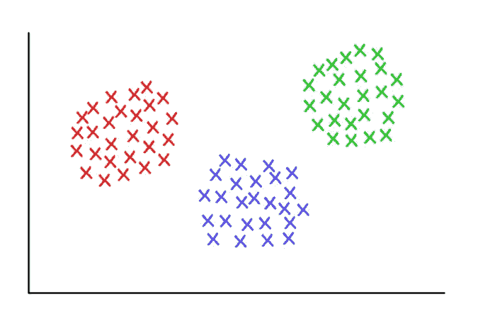

通过谷歌图片搜索的图片，标记为重复使用

机器学习可以用于许多交易策略，配对交易也不例外。基于密度的带噪声应用空间聚类(DBSCAN)可用于对股票进行聚类，并排除不适合聚类的股票。DBSCAN 的两个参数是 eps(被视为聚类一部分的点之间的距离)和 minPoints(形成密集区域的最小点数)。根据这些参数，DBSCAN 算法然后从我们提供给它的一组点中创建聚类。位于低密度区域的点被归类为异常值。K-means 是另一种流行的聚类算法，但它对异常值更敏感，这就是我们使用 DBSCAN 的原因。现在我们已经了解了 pairs trading 和 DBSCAN，让我们开始实现吧。

# 进口/数据

我们从必要的进口开始。值得注意的是，从量子平台进口的产品将用于[量子平台 IDE](https://www.quantopian.com/docs/user-guide/environments/algo-ide) 。

```
import matplotlib.pyplot as plt
import matplotlib.cm as cmimport numpy as np
import pandas as pdfrom sklearn.cluster import DBSCAN
from sklearn.decomposition import PCA
from sklearn.manifold import TSNE
from sklearn import preprocessingfrom statsmodels.tsa.stattools import cointfrom scipy import statsfrom quantopian.pipeline.data import morningstar
from quantopian.pipeline.filters.morningstar import Q500US, Q1500US, Q3000US
from quantopian.pipeline import Pipeline
from quantopian.research import run_pipeline
```

我们将使用的预定义宇宙是 Q1500，它是一个大的流动股票集合。

```
study_date = "2019-12-31"
universe = Q1500US()
```

为了创建我们的渠道，我们使用了来自晨星的信息。

```
pipe = Pipeline(columns = {
'Market Cap': morningstar.valuation.market_cap.latest.quantiles(5),
'Industry':morningstar.asset_classification.morningstar_industry_group_code.latest,
'Financial Health':morningstar.asset_classification.financial_health_grade.latest}, 
screen = universe)res = run_pipeline(pipe, study_date, study_date)
res.index = res.index.droplevel(0)  # drop the single date from the multi-index
```

让我们来看看我们的数据。我们看到它包含了 1486 只股票，以及对财务健康、行业和市值的描述。

```
print res.shape
res.head()
```

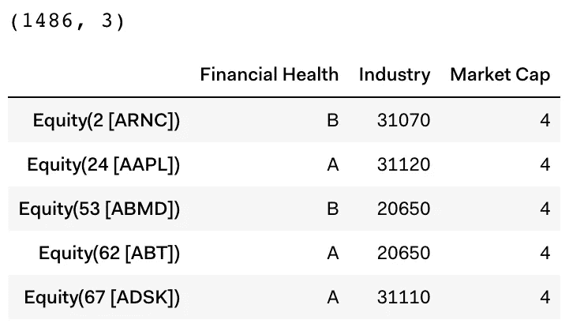

我们不能处理没有财务健康等级的股票，所以我们删除了它们。两只股票缺乏财务健康等级，因此被剔除。

```
res = res[res['Financial Health']!= None]
print res.shape
```


现在，我们将创建一个字典，用数字分数替换财务健康的分类数据。

```
res['Financial Health'] = res['Financial Health'].astype('object')
health_dict = {u'A': 0.1,
               u'B': 0.3,
               u'C': 0.7,
               u'D': 0.9,
               u'F': 1.0}
res = res.replace({'Financial Health': health_dict})
```

为了更好地理解我们的数据，我们使用。描述()以查看一些基本指标，如平均值和标准差。

```
res.describe()
```

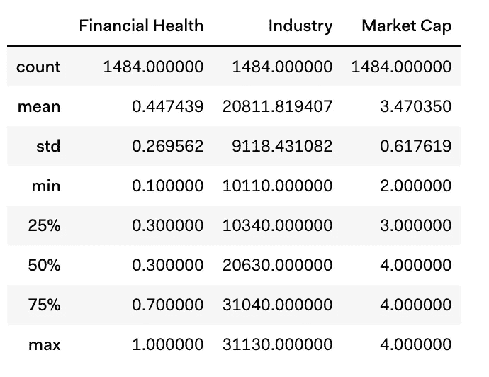

# 每日回报

获取每日回报(股票价格的美元变化占前一天收盘价的百分比)用于我们的策略。然后我们以苹果公司的日回报率为例。

```
pricing = get_pricing(
    symbols=res.index,
    fields='close_price',
    start_date=pd.Timestamp(study_date) - pd.DateOffset(months=24),
    end_date=pd.Timestamp(study_date)
)returns = pricing.pct_change()
returns[symbols(['AAPL'])].plot()
```

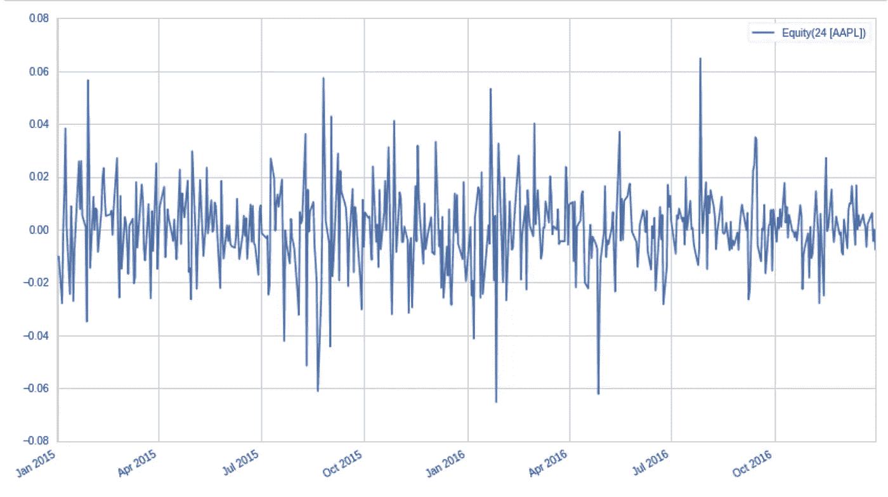

类似于我们对缺乏财务健康等级的股票所做的，我们将不得不删除没有完整回报系列的股票。

```
returns = returns.iloc[1:,:].dropna(axis=1)
print returns.shape
```

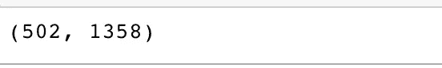

# PCA 和 DBSCAN

我们的下一步是使用主成分分析来降低回报数据的维度，提取每只股票的历史潜在公共因子负载，添加市值/财务健康值，并使用 DBSCAN。

```
prin_components = 50 
pca = PCA(n_components=prin_components)
pca.fit(returns)
```

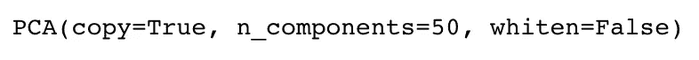

```
X = np.hstack(
    (pca.components_.T,
     res['Market Cap'][returns.columns].values[:, np.newaxis],
     res['Financial Health'][returns.columns].values[:, np.newaxis])
)X = preprocessing.StandardScaler().fit_transform(X)clf = DBSCAN(eps=1.9, min_samples=3)
print clfclf.fit(X)
labels = clf.labels_
n_clusters_ = len(set(labels)) - (1 if -1 in labels else 0)
print "\nClusters discovered: %d" % n_clusters_clustered = clf.labels_
```

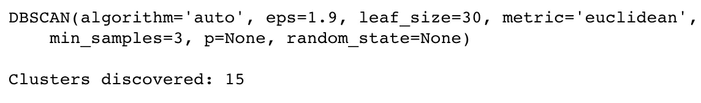

可能的配对总数超过 900，000 个，所以我们将大大减少这个数字，只对我们的配对交易策略中更好的候选配对。

```
ticker_count = len(returns.columns)
print "Total pairs possible in universe: %d " % (ticker_count*(ticker_count-1)/2)
```

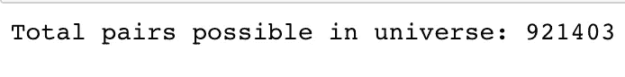

```
clustered_series = pd.Series(index=returns.columns, data=clustered.flatten())
clustered_series_all = pd.Series(index=returns.columns, data=clustered.flatten())
clustered_series = clustered_series[clustered_series != -1]CLUSTER_SIZE_LIMIT = 9999
counts = clustered_series.value_counts()
ticker_count_reduced = counts[(counts>1) & (counts<=CLUSTER_SIZE_LIMIT)]
print "Clusters formed: %d" % len(ticker_count_reduced)
print "Pairs to evaluate: %d" % (ticker_count_reduced*(ticker_count_reduced-1)).sum()
```

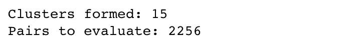

# 形象化

由于数据目前聚集在 52 个维度中，我们可以使用 T-SNE 算法来可视化 2D 的数据，并查看 15 个集群。

```
X_tsne = TSNE(learning_rate=1000, perplexity=25, random_state=1337).fit_transform(X)plt.figure(1, facecolor='white')
plt.clf()
plt.axis('off')plt.scatter(
    X_tsne[(labels!=-1), 0],
    X_tsne[(labels!=-1), 1],
    s=100,
    alpha=0.85,
    c=labels[labels!=-1],
    cmap=cm.Paired
)plt.scatter(
    X_tsne[(clustered_series_all==-1).values, 0],
    X_tsne[(clustered_series_all==-1).values, 1],
    s=100,
    alpha=0.05
)plt.title('T-SNE of all Stocks with DBSCAN Clusters Noted')
```

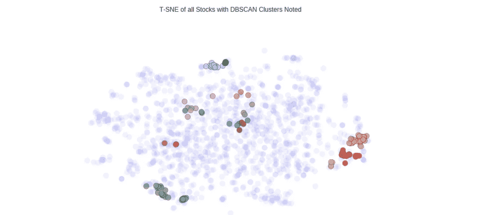

让我们画出每个聚类中的股票数量。

```
plt.barh(
    range(len(clustered_series.value_counts())),
    clustered_series.value_counts()
)
plt.title('Cluster Member Counts')
plt.xlabel('Stocks in Cluster')
plt.ylabel('Cluster Number')
```

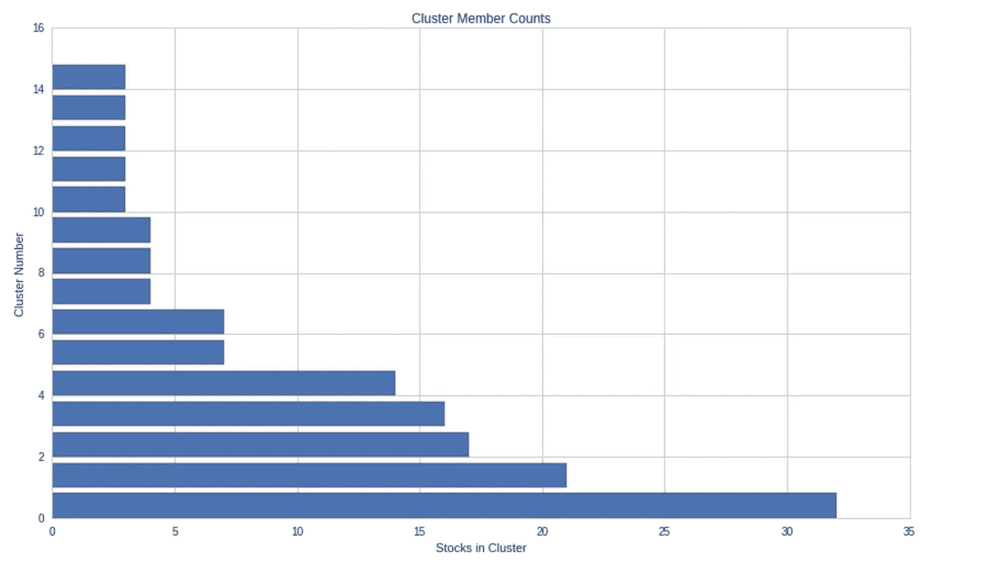

我们将可视化较小的集群以获得历史相关性，从而查看 DBSCAN 是否正确地完成了它的工作。正如我们所看到的，聚类中的股票价格确实有很高的相关性。

```
counts = clustered_series.value_counts()cluster_vis_list = list(counts[(counts<20) & (counts>1)].index)[::-1]for clust in cluster_vis_list[0:min(len(cluster_vis_list), 3)]:
    tickers = list(clustered_series[clustered_series==clust].index)
    means = np.log(pricing[tickers].mean())
    data = np.log(pricing[tickers]).sub(means)
    data.plot(title='Stock Time Series for Cluster %d' % clust)
```

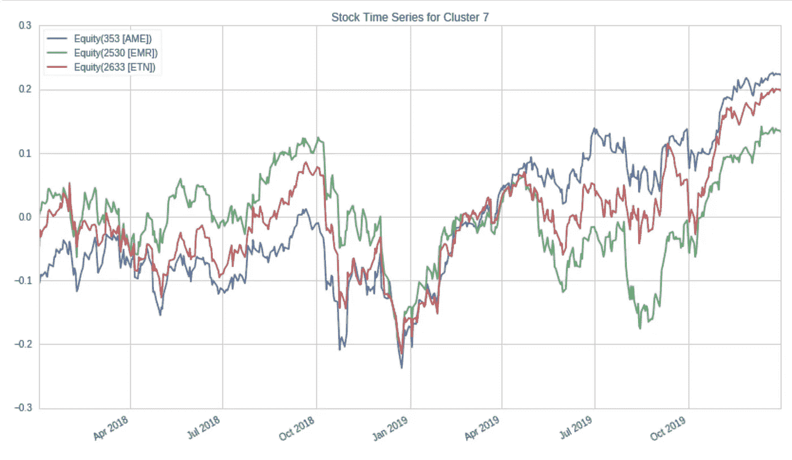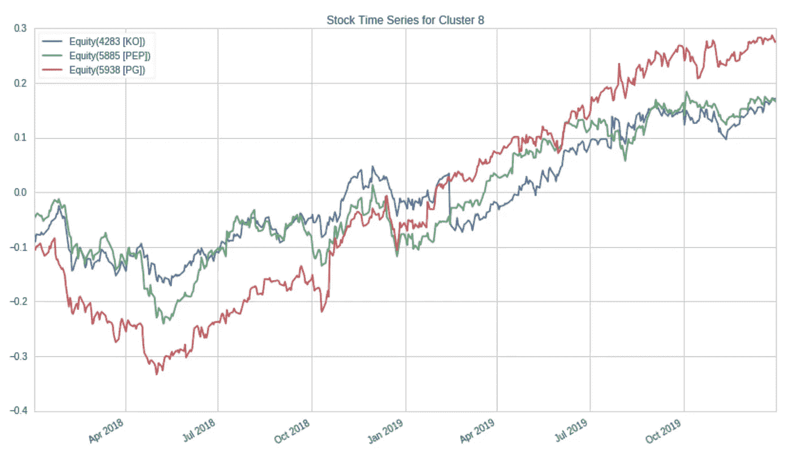

# 获得对子

为了验证协整关系，我们可以使用 Quantopian 提供给我们的函数。然后，我们可以得到我们的配对列表。

```
def find_cointegrated_pairs(data, significance=0.05):
    # This function is from [https://www.quantopian.com/lectures/introduction-to-pairs-trading](https://www.quantopian.com/lectures/introduction-to-pairs-trading)
    n = data.shape[1]
    score_matrix = np.zeros((n, n))
    pvalue_matrix = np.ones((n, n))
    keys = data.keys()
    pairs = []
    for i in range(n):
        for j in range(i+1, n):
            S1 = data[keys[i]]
            S2 = data[keys[j]]
            result = coint(S1, S2)
            score = result[0]
            pvalue = result[1]
            score_matrix[i, j] = score
            pvalue_matrix[i, j] = pvalue
            if pvalue < significance:
                pairs.append((keys[i], keys[j]))
    return score_matrix, pvalue_matrix, pairscluster_dict = {}
for i, which_clust in enumerate(ticker_count_reduced.index):
    tickers = clustered_series[clustered_series == which_clust].index
    score_matrix, pvalue_matrix, pairs = find_cointegrated_pairs(
        pricing[tickers]
    )
    cluster_dict[which_clust] = {}
    cluster_dict[which_clust]['score_matrix'] = score_matrix
    cluster_dict[which_clust]['pvalue_matrix'] = pvalue_matrix
    cluster_dict[which_clust]['pairs'] = pairspairs = []
for clust in cluster_dict.keys():
    pairs.extend(cluster_dict[clust]['pairs'])pairs
```

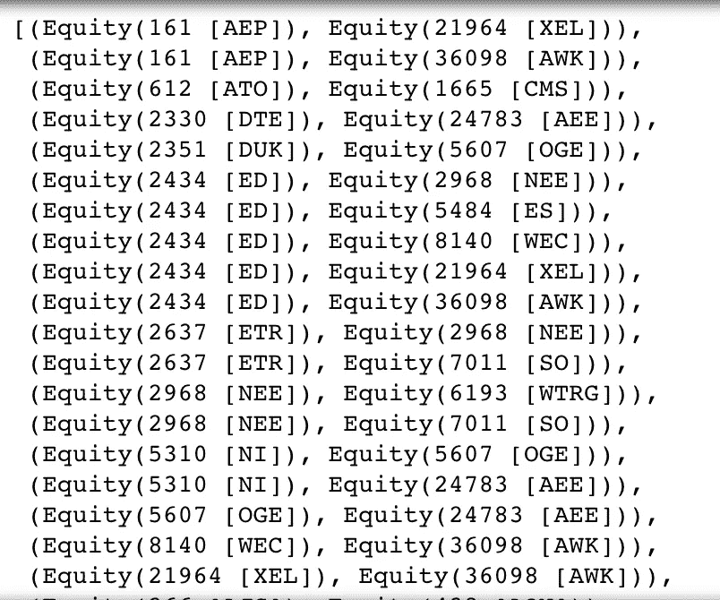

我们留下了一个包含 118 对和 88 个独特代码的列表。作为我们的最后一步，我们将再次使用 T-SNE 可视化我们的验证对。

```
stocks = np.unique(pairs)
X_df = pd.DataFrame(index=returns.T.index, data=X)
in_pairs_series = clustered_series.loc[stocks]
stocks = list(np.unique(pairs))
X_pairs = X_df.loc[stocks]X_tsne = TSNE(learning_rate=50, perplexity=3, random_state=1337).fit_transform(X_pairs)plt.figure(1, facecolor='white')
plt.clf()
plt.axis('off')
for pair in pairs:
    ticker1 = pair[0].symbol
    loc1 = X_pairs.index.get_loc(pair[0])
    x1, y1 = X_tsne[loc1, :]ticker2 = pair[0].symbol
    loc2 = X_pairs.index.get_loc(pair[1])
    x2, y2 = X_tsne[loc2, :]

    plt.plot([x1, x2], [y1, y2], 'k-', alpha=0.3, c='gray');

plt.scatter(X_tsne[:, 0], X_tsne[:, 1], s=220, alpha=0.9, c=[in_pairs_series.values], cmap=cm.Paired)
plt.title('T-SNE Visualization of Validated Pairs');
```

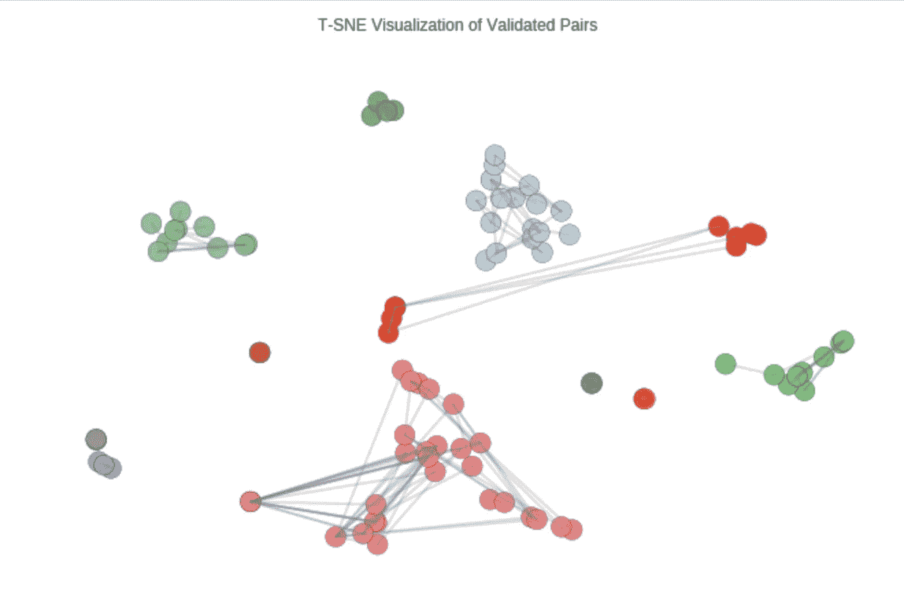

最后，我们完成了寻找配对交易策略的目标。

***注来自《走向数据科学》的编辑:*** *虽然我们允许独立作者根据我们的* [*规则和指导方针*](/questions-96667b06af5) *发表文章，但我们不认可每个作者的贡献。你不应该在没有寻求专业建议的情况下依赖一个作者的作品。详见我们的* [*读者术语*](/readers-terms-b5d780a700a4) *。*

# 参考

[1]乔纳森·拉金，[用机器学习进行配对交易](https://github.com/marketneutral/pairs-trading-with-ML/blob/master/Pairs%2BTrading%2Bwith%2BMachine%2BLearning.ipynb)，Github

**先别走**！

我是 Roshan，16 岁，对人工智能和金融的交叉领域充满热情。关于人工智能在金融领域的广泛观点，请查看这篇文章:[https://towards data science . com/artificial-intelligence-and-its-application-in-finance-9f1e 0588 e 777](/artificial-intelligence-and-its-application-in-finance-9f1e0588e777)。

在 Linkedin 上联系我:[https://www.linkedin.com/in/roshan-adusumilli-96b104194/](https://www.linkedin.com/in/roshan-adusumilli-96b104194/)