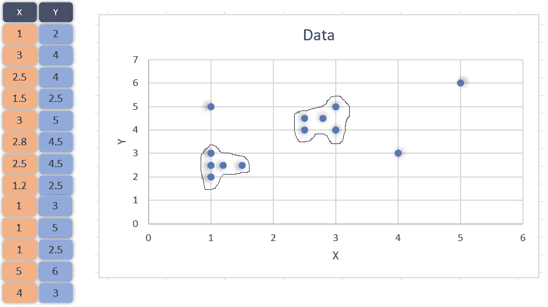
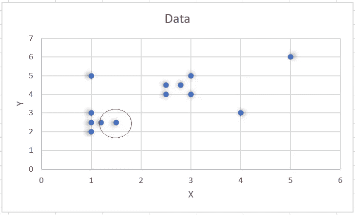
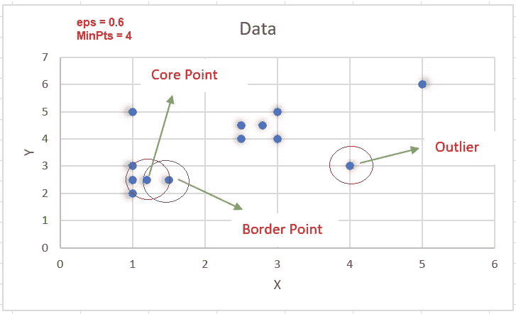
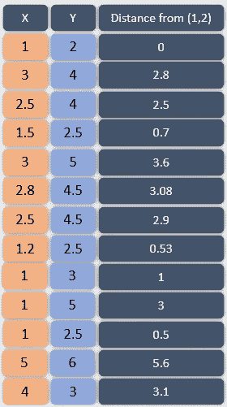
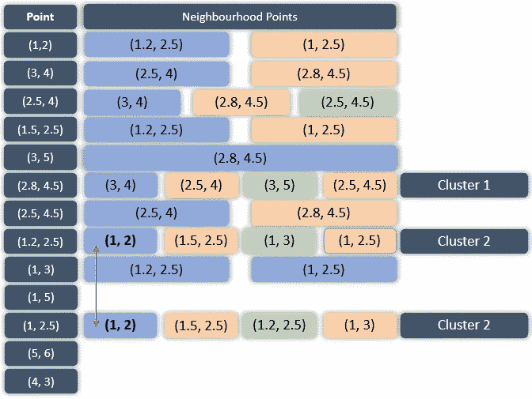
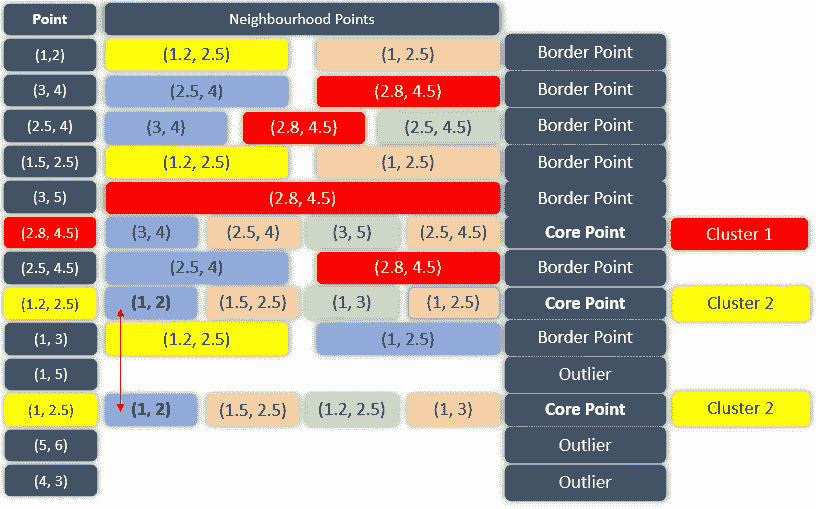
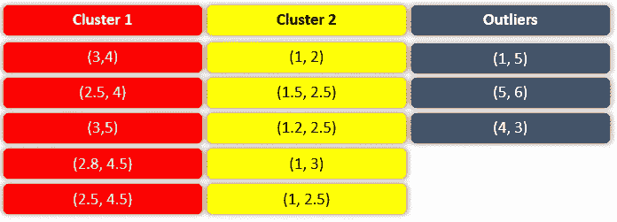

# DBSCAN —手动创建基于密度的集群

> 原文：<https://towardsdatascience.com/dbscan-make-density-based-clusters-by-hand-2689dc335120?source=collection_archive---------11----------------------->

[Ellen Qin](https://unsplash.com/@ellenqin?utm_source=unsplash&utm_medium=referral&utm_content=creditCopyText) 在 [Unsplash](https://unsplash.com/s/photos/balls?utm_source=unsplash&utm_medium=referral&utm_content=creditCopyText) 上拍照

这篇文章也发表在[这里](https://www.wildregressor.com/2020/05/dbscan-make-density-based-clusters-by.html)

DBSCAN 代表带噪声的基于密度的空间聚类应用。它是一种无监督的机器学习算法，根据数据点的密度或数据的接近程度来进行聚类。也就是说，密集区域之外的点被排除在外，并被视为噪声或异常值。DBSCAN 算法的这一特性使其非常适合异常值检测和生成任意形状的聚类。像 [**K-Means 聚类**](https://www.wildregressor.com/2020/04/k-means-clustering-one-rule-to-group.html) 这样的算法缺乏这种特性，并且只产生球形聚类，并且对异常值非常敏感。就敏感性而言，我的意思是通过 K-Means 得到的球形聚类很容易受到单个异常值的影响，因为它们也包括在内。

关于 DBSCAN 的教程/文章通常包含大量数据集和核心程序，这使得读者很难理解核心概念，但在本文中，我们将把该算法应用于一个非常小的数据集来解释它。跳过一些计算，直接显示计算表。建议验证所有这样的计算，这样会让概念对你来说更形象。让我们取一个包含 13 个点的数据集，如下图所示:

二维数据便于可视化和理解，否则 DBSCAN 也可以处理多维数据。数据中可能的聚类在上图中已被标记，以可视化我们想要的聚类。上图中的点(1，5) (4，3) (5，6)位于标记之外，因此应视为异常值。DBSCAN 算法实际上应该生成聚类并排除异常值，正如我们在图中所做的那样。我们先来了解一下算法，以及其中涉及的各个步骤。

**逻辑和步骤:**

DBSCAN 算法有两个输入参数。每个点周围的半径( *eps* )和在该半径内该点周围的最小数据点数( *MinPts* )。例如，考虑点(1.5，2.5)，如果我们取 *eps* = 0.3，那么半径= 0.3 的点周围的圆将只包含它内部的另一个点(1.2，2.5)，如下所示:

因此，对于(1.5，2.5)，当 *eps* = 0.3 时，邻域点的数量仅为 1。在 DBSCAN 中，针对这两个参数检查每个点，并通过以下步骤做出关于聚类的决定:

1.  为 *eps* 和 *MinPts* 选择一个值
2.  对于特定的数据点( **x** )，计算其与其他数据点的距离。
3.  找出 **x** 的所有落在半径为 *eps* 的圆内的邻域点，或者仅仅是到 **x** 的距离小于等于 *eps 的邻域点。*
4.  将 **x** 视为**访问过的**并且如果 **x** 周围的邻域点的数量大于或等于 *MinPts* 那么将 **x** 视为**核心点**，如果它没有被分配给任何聚类，则创建一个新的聚类并将其分配给该聚类。
5.  如果 **x** 周围的邻域点的数量小于 MinPts，并且在其邻域中有一个核心点，则将其视为边界点。
6.  包括所有的**密度连接点**作为一个单独的集群。(密度连接点的含义将在后面描述)
7.  对数据集中的每个未访问点重复上述步骤，找出所有核心点、边界点和离群点。

请注意，上述步骤构成了一个递归过程。第一次循环计算后，一个点可能不会被视为任何核心点的边界点，但在下一次循环中可能会被视为边界点。

如果 **x** 周围的邻域点的数量大于或等于 MinPts，则 **x** 被视为核心点，如果 **x** 周围的邻域点小于 MinPts 但接近核心点，则 **x** 被视为边界点。如果 **x** 既不是核心点也不是边界点，则 **x** 被视为异常值。下图给出了一个想法。我们选择 eps = 0.6，MinPts =4，标记为核心点的点在其邻域内有 4 个其他点(>= min pts)&，标记为边界点的点在核心点的邻域内，但在其邻域内只有一个点(< MinPts)。离群点既不是边界点，也不是核心点。

**运行中的算法**

现在，让我们将 DBSCAN 算法应用于上述数据集，以找出聚类。我们必须首先选择 *eps* 和 *MinPts* 的值。我们选*EPS*= 0.6*min pts*= 4。让我们考虑数据集(1，2) &中的第一个数据点，计算它与数据集中每隔一个数据点的距离。计算值如下所示:

从上表可以明显看出，对于 *eps* 的假设值，点(1，2)在其邻域中只有两个其他点(1，2.5)，(1.2，2.5)，由于其小于 MinPts，我们不能将其声明为核心点。让我们对数据集中的每个点重复上述过程，并找出每个点的邻域。重复时的计算可总结如下:

仔细观察上表，最左边的一列包含了我们数据集中所有的点。在它们的右边是在它们附近的数据点，即距离它们的距离小于或等于 *eps* 值的点。在数据集中有三个点，(2.8，4.5) (1.2，2.5) (1，2.5)，它们周围有 4 个邻域点，因此它们被称为核心点，并且如已经提到的，如果核心点没有被分配给任何聚类，则形成新的聚类。因此，(2.8，4.5)被分配给新的聚类，聚类 1，点(1.2，2.5)，聚类 2 也是如此。还观察到核心点(1.2，2.5)和(1，2.5)共享至少一个公共邻域点(1，2)，因此，它们被分配到相同的集群。下表显示了所有数据点的分类，分为核心点、边界点和异常点。看一看:

DBSCAN 算法在数据集中检测到三种类型的点:核心点、边界点和异常点。每个核心点将被分配到一个新的聚类中，除非一些核心点共享邻域点，否则它们将被包括在同一个聚类中。每个边界点将基于其邻域中的核心点被分配给聚类，例如，第一点(1，2)是边界点，并且在其邻域中具有核心点(1.2，2.5)，其被包括在聚类 2 中，因此，点(1，2)也将被包括在聚类 2 中。整个分类可以总结如下:

为了理解 DBSCAN，需要理解三个术语:

1.**直接密度可达**:如果一个点在其邻域内有一个核心点，则称该点为直接密度可达。考虑点(1，2)，它在其邻域中有一个核心点(1.2，2.5)，因此，它将是一个直接密度可达点。

2.**密度可达**:如果一个点和另一个点通过一系列核心点连接，则称这两个点为密度可达。例如，考虑点(1，3)和(1.5，2.5)，因为它们通过一个核心点(1.2，2.5)连接，所以它们被称为彼此可达的密度。

3.**密度连通**:如果有一个核心点是从这两点密度可达的，那么这两点称为密度连通。

到目前为止，DBSCAN 的算法必须是清晰的。它很漂亮，因为它排除了离群点，并使聚类具有任意形状，而不像 [**k-means 聚类**](https://www.wildregressor.com/2020/04/k-means-clustering-one-rule-to-group.html) 。

关于这篇文章的任何建议，你可以在下面发表你的评论或者通过 [**LinkedIn**](https://www.linkedin.com/in/tanvirhurra/) 联系我。

谢谢，

祝你玩得愉快😊