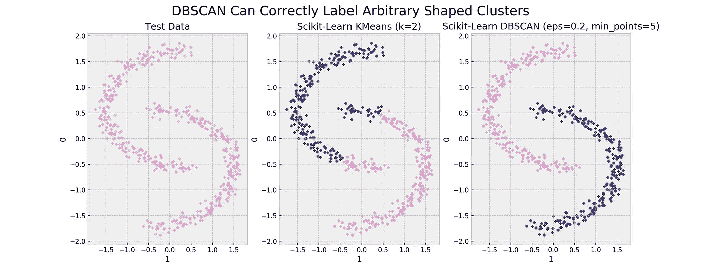
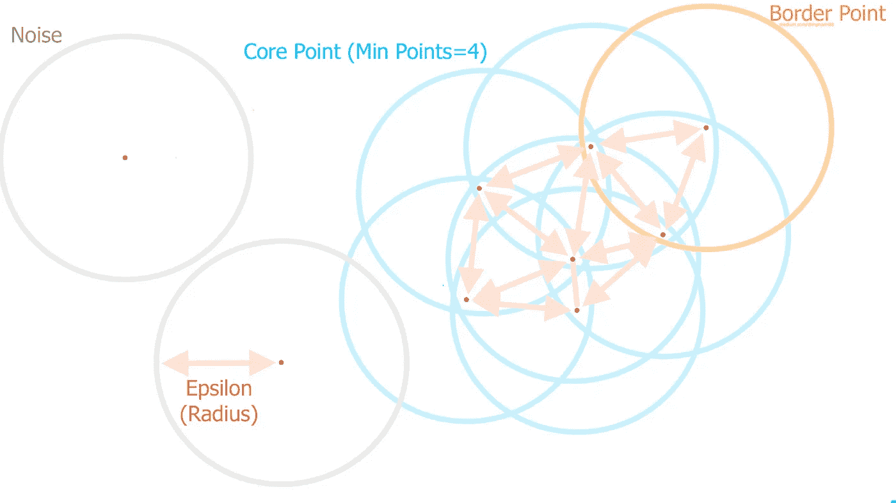
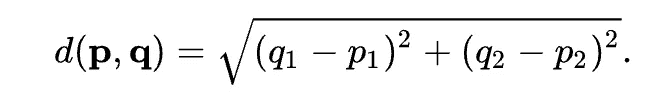
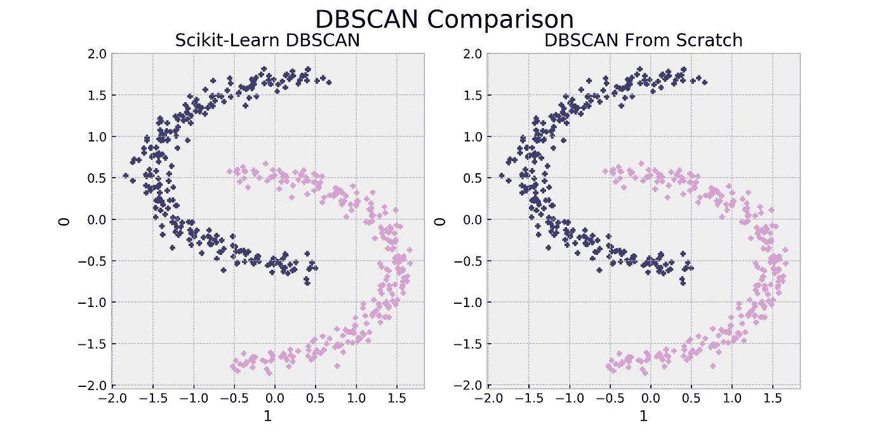

# 使用 Python 的 DBSCAN

> 原文：<https://towardsdatascience.com/dbscan-with-python-743162371dca?source=collection_archive---------10----------------------->

## 包含 GitHub repo 的链接

## 带噪声应用的基于密度的空间聚类初学者指南(带示例)



KMeans 在处理任意形状的簇时有困难。图片由 Mikio Harman 提供

聚类是一种无监督的学习技术，它在数据中寻找模式，而不需要被明确告知要寻找什么模式。

DBSCAN 通过测量每个点之间的距离来做到这一点，如果足够多的点足够靠近，那么 DBSCAN 会将其分类为一个新的聚类。

如上所示，在测试数据中有两个不同的集群。另一种流行的聚类技术 KMeans 无法准确地对这些数据进行聚类，因为当 k=2 时， [KMeans](https://scikit-learn.org/stable/modules/generated/sklearn.cluster.KMeans.html) 在聚类之间创建了一个线性可分的边界。

DBSCAN 根据两个参数定义聚类:Epsilon 和 Min_Points

> **ε**—一个点到另一个点的最大距离被认为是邻居。
> 
> **Min_Points** —在ε的范围内被认为是一个聚类所需的点数。

## DBSCAN 的优势

**确定输入参数需要最少的领域知识。**

其他聚类算法，如 KMeans，要求用户知道数据中存在多少个聚类。

DBSCAN 不要求找到多少个聚类，而是要求用户输入每个数据点可以被认为是一个聚类的一部分的最大距离，以及形成一个聚类需要多少个数据点。

它能发现任何形状的星团。

由于 DBSCAN 基于 epsilon 和每个点的邻居数量来创建聚类，因此它可以找到任何形状的聚类。当集群具有相同的密度(点之间的距离)时，DBSCAN 工作得最好。当存在不同密度的簇时，这会使 DBSCAN 难以识别簇。

## 跟着走！

[点击此处](https://colab.research.google.com/drive/1rCQl2sc5wEGKx0CgG-hW_Dg959qT3qct?usp=sharing)打开实现 Scikit 的 Google Colab 笔记本——从头开始学习 DBSCAN 和 DBSCAN2。如果你想了解更多关于引擎盖下发生的事情，请继续阅读。

```
**# Download the test package**
pip install -i [https://test.pypi.org/simple/](https://test.pypi.org/simple/) dbscan2==0.0.3**# Import it!**
from dbscan2 import dbscan2**# If you would like to plot the results import the following**
from sklearn.datasets import make_moons
import pandas as pd
```

为了从头开始理解和实现 DBSCAN，我们需要知道 DBSCAN 是如何对数据进行聚类的。除了ε点和最小点，还有三个基本术语需要理解:

> **噪声** —这是一个在 epsilon 内没有足够的邻居来成为聚类的一部分(包括其自身)的点。
> 
> **边界点** —这是一个在ε内有邻居但没有足够邻居成为核心点的点。这些点构成了群集的边缘。
> 
> **核心点**——具有 epsilon(包括其自身)内所需最小点数的点。这些点连同边界点将形成一个簇。



图片由 Mikio Harman 提供

我们将使用一个类来实现 DBSCAN，并将其命名为 dbscan2。它将有两个主要方法:拟合和预测。

`**def __init__()**`

将使用标准化的两个特征数组ε和创建聚类所需的点数来初始化该类。它还将用一个簇标签和一个噪声标签来初始化。

```
class dbscan2():
    def __init__(self,df, epsilon=1, min_points=5):
        self.df = np.array(df)
        self.epsilon = epsilon
        self.min_points = min_points
        self.cluster_label = 0
        self.noise = 0
```

**助手功能**

我们将使用欧几里得距离来度量每个点之间的距离。欧几里德距离将测量从一对坐标到另一对坐标的普通直线距离。



图片来自[维基百科](https://en.wikipedia.org/wiki/Euclidean_distance)

```
def dist(self, point1, point2):
    """Euclid distance function"""
    x1 = point1[0]
    x2 = point2[0]
    y1 = point1[1]
    y2 = point2[1]# create the points
    p1 = (x1 - x2)**2
    p2 = (y1 - y2)**2
    return np.sqrt(p1 + p2)
```

我们需要的另一个助手函数叫做`rangeQuery`。该函数将帮助我们找出每个点在ε内有多少个邻居。

```
def rangeQuery(self, x):
    """Query database against x and return all points that are <= 
    epsilon"""neighbors = []for y in range(len(self.df)):
        q = self.df[y, :2]**# If the distance is <= than epsilon then append to 
          neighbors list**
        if self.dist(x, q) <= self.epsilon:
            neighbors.append(y)return neighbors
```

`**def fit():**`

我们的拟合函数将遍历整个数据集，并确定数据集中每个点有多少个邻居。

如果单个点没有足够的邻居(`neighbors < min_points`，那么它将被标记为噪声。

如果一个点有足够多的邻居(`neighbors ≥ min_points`)，那么该点将被分配一个新的聚类标签，并且它的所有邻居也将被赋予相同的标签。fit 函数将进入一个 while 循环，将所有的邻居添加到一个`Queue`中，以便它们可以与新发现的邻居的邻居一起被正确地标记为新聚类的一部分。

这个过程将继续，直到算法已经检查了所有点。

`**def predict():**`

进行预测时，算法将使用`rangeQuery`识别新输入点是否有任何邻居。如果是，那么新点将被预测为具有与其邻居相同的标签。

**这是我们最终完成的类的样子**

**与 Scikit-Learn 版本相比如何？**



图片由 Mikio Harman 提供

正如所料，我们从头开始的实现最终得到了与 Scikit-Learn 版本相同的结果。我们的 DBSCAN 版本需要更长的时间，我仍然会使用 Scikit-Learns 版本，但是希望从头开始实现该算法可以帮助您更好地理解如何使用 DBSCAN 找到任意的簇形状。

**找到博客的代码** [**这里**](https://github.com/mpHarm88/projects/blob/master/dbscan/notebooks/dbscan.ipynb)

## 参考

[一种基于密度的算法，用于在带有噪声的大型空间数据库中发现聚类](https://www.aaai.org/Papers/KDD/1996/KDD96-037.pdf)

[数据库扫描](https://en.wikipedia.org/wiki/DBSCAN)

[欧几里德距离](https://en.wikipedia.org/wiki/Euclidean_distance)