# 揭开 XGBoost 第一部分的神秘面纱

> 原文：<https://towardsdatascience.com/de-mystifying-xgboost-part-i-f37c5e64ec8e?source=collection_archive---------10----------------------->

## 揭开 XGBoost 的神秘面纱

## 想象树木

# 为什么为什么？

已经有很多关于 XGBoost 内部运作的去神秘化的、奇妙的博客。为什么是另一个？我一直认为应该有一个能把它们缝合在一起的。把理论和真实的例子结合在一起。一个真正去神秘化的。一个我自己可以参考的。所以，我想到了做一个系列。如下图。

我想把这个系列分成 5 个部分。

第一部分将介绍 XgBoost 背后的数学原理。更形象地说，把它印入我们的神经网络😀。

在 [**第二部分**](https://medium.com/@b.debanjan/de-mystifying-xgboost-part-ii-175252dcdbc5) 中，我将深入探究使用 XGBoost 时各种参数背后的直觉——将它与数学和真实的例子缝合在一起。回答为什么和什么时候这样的问题。但只有最重要的参数。毫无疑问，这将是最有趣的。

在 [**第三部分**](https://medium.com/@b.debanjan/container-for-almost-all-ml-use-cases-de-mystifying-xgboost-iii-434310b782e8?source=friends_link&sk=c19c4e76d35a1706ed1fb9ed74f33404) 中，我将展示如何创建一个容器，超快，(在 GCP 上)使用它我们可以处理几乎所有的 ML 问题，特别是 XgBoost 使用 python 和 python 内核的 Jupyter 笔记本中的 R！！。

**第四部分**，我们将使用这个容器，看看我们在前面的部分中讨论的所有概念和直觉如何应用于一个公开可用的数据集。

**第五部分**，我将讨论我们在第二部分中没有涉及的其余参数背后的直觉。

那么，我们开始吧。

# 数学

对于这一部分，我们需要知道的只是一点高中微分学。如果你很久以前就离开了高中，对微分学只有一个模糊的概念，那也没关系，相信我:)

如果可能的话，读一点关于乙状结肠函数和逻辑损耗的内容。就是这样。我在参考资料部分有一些不错的链接。以后再做也没问题。

## 函数逼近

让我们直接从泰勒展开 Z= *z 处的函数*l(Z)**开始，不要担心它看起来是否吸引人。会让事情变得简单..

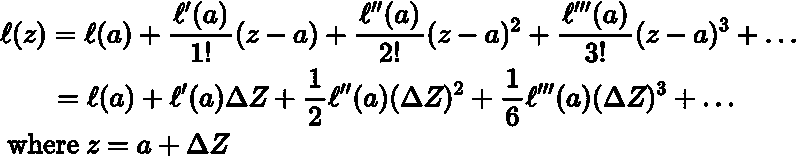

图一。泰勒级数/l(Z)在 Z=z 处的展开式。稍后当你看到图 3 时，你可以在图片的右下方看到一个小的图解。

这意味着，鉴于我们知道如何计算***【l(Z)***at***【Z = a】***，其一、二、三等阶导数 w . r . t***Z***at***【l(a)***，我们知道***δZ***；我们可以近似得到 ***l(Z=z)*** 其中***Z***=***a***+***δZ***，有些 val 接近 ***a*** 。

例如，让我们说 ***l(Z) = Z*** 。 ***Z*** 的一阶和二阶导数分别为 ***2Z*** 和 ***2*** 。现在让我们说 ***a = 2*** 并且我们想要找到 ***l(Z=2.1)*** 。***△Z***= 0.1。让我们用泰勒展开式。

l(2.1) ~ l(2) + ((2*2)/1！)*(2.1–2) + ((2/2!)*(2.1–2) = 4 + 4*0.1 + 0.01

l(2.1) ~ 4.41。这就是，嗯，它到底是什么。酷！

注意，我只使用了上面表达式的一阶和二阶导数。第一，很明显，因为没有 ***Z*** 的三阶导数(是零—对吧？)因此第三项之后的所有项都将是 0。

第二，泰勒级数用作近似值。即使可能有更多有效的导数，我们也可以停在第三项(即直到二阶导数)。我们走得越远，分母和分子分别以指数方式增加和减少，所以不管怎样，它们并没有贡献太多。

现在， ***l(Z) = Z*** 已经不是那么有启发性的例子了吧？我知道，就像加油！对于 ***Z=a*** 的任意值，我们不需要泰勒级数来近似 ***Z*** 的值。咄！。其实，如果 ***l(Z)*** 对每一个 ***Z*** 都有一个固定的形式，而我们手边又有一个计算器，我们就再也不需要泰勒级数来进行一个“近似”了。

但是假设说 ***l(Z)*** 是 **𝑒^Z** (也就是 e 的 Z b.t.w 次方)而你想找 ***l(0.35)*** ，不用计算器。啊哈！抓到你了。🤓。但是你可以用泰勒展开式很容易地近似这个值。你知道 ***l(0)=1，δz = 0.35***而且 e^Z 的一阶和二阶导数也是 e^Z.

所以***l(0.35)***~ = 1+1 * 0.35+1/2 * 0.35 * 0.35 ~ = 1.41125，已经相当接近正确答案 1.4190161 了。

这只是冰山一角。泰勒级数被广泛用于用较少的项表示函数，它在求极限、积分和最小值方面有应用。它还被广泛用于模拟自然力对自然界中物理规律的作用等。完全不同的话题。此外，有很多关于泰勒系列的博客。务必阅读它们。但不是现在！在你看完我的博客之后😀。

现在，让我们再挑战一下。比方说，我们想近似一个函数 ***l(Z=z)*** ，其中***Z***=***a+δZ***，但是***δZ***并不固定。啊？好的。坚持住。它的意思是，我们知道*但是*Z***δZ***可以变化。任务是推导出正确的***△Z***并由此得到下一个 **Z** s.t， ***l(Z=z)*** 是极小的，给定某些条件强加在什么值上***△Z***可以假定。**

**参见下面的可视化**

**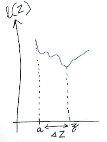**

**试图找到最小值 l(Z)的 Z 和δZ**

**现在，为了做到这一点，并且近似地***【l(Z = Z)】***，我们可以再次使用泰勒级数的技巧。给定，我们可以莫名其妙地计算出 ***l(Z=a)*** 及其一阶和二阶导数，我们可以找到最佳的***δZ***如果我们像下面这样求解。**

**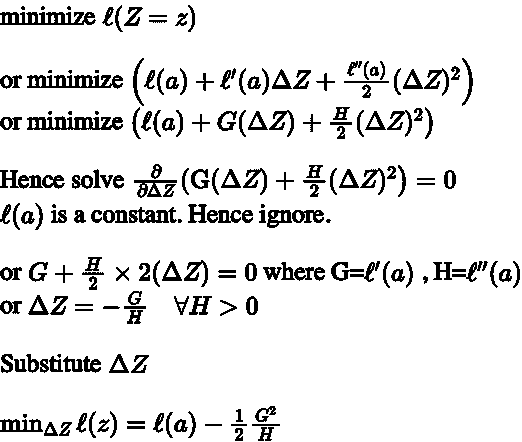**

**图二。从泰勒展开式最小化得到函数 l 的最佳δZ 和最小值。**

**哇！简单对吗？所以如果选择***△Z***为**-【G/H】**，我们将得到次佳的 ***Z*** 为极小值***【Z = Z】******l(Z = Z)***的值将为 ***l(a) -1/2(G /H)。*****

**让我们把它放在上下文中。**

## **我的图片(好，好，我的白板图片)**

**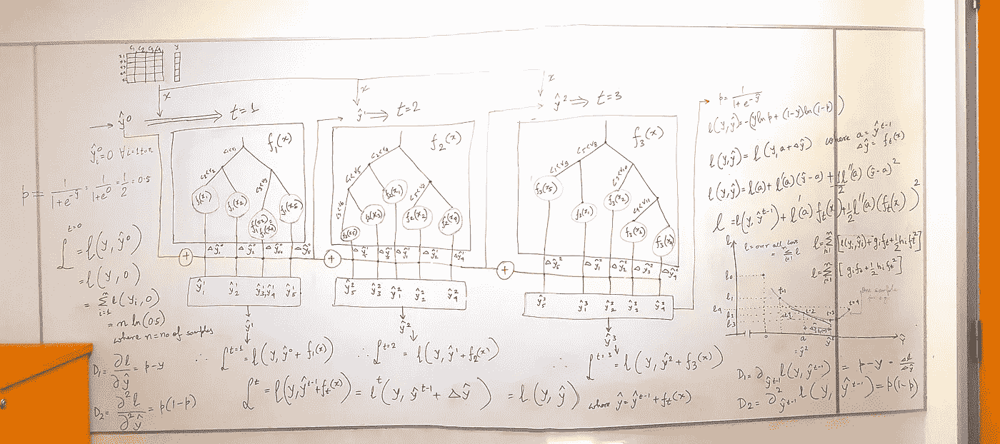**

**图三。不错——嗯？。您也可以在[https://github . com/run 2/demystify-xgboost/blob/master/my board . jpg 找到此图片](https://github.com/run2/demystify-xgboost/blob/master/MyBoard.jpg.)**

**这很像是电路板上的 XgBoost(或者更确切地说是 Boosting 算法)。别担心，我们会把它拆散的。我建议，把图片打印出来(来自 GitHub ),放在手边，以便你阅读博客的其余部分。一定要掩饰一段时间，看看你怎么看这件事。**

**比方说，我们手头有一个二元分类任务。最初，我们有一组样本，它们的已知监督标签 ***y*** 和默认模型分数值 ***y hat*** = 0(这意味着对于所有样本，默认概率值为 0.5；与 XGBoost 中默认 ***base_score*** 相同)。参见图 3 的左侧，以理解为什么使用 Sigmoid 函数，y hat = 0 得分给出 0.5 的概率。**

**下面是一个 sigmoid 函数，仅供我们参考。**

**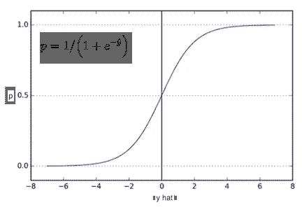**

**图 4。Sigmoid 函数绘制概率值 p 与分数 y 的关系。为了达到 1.0 的概率，y 必须慢慢地从 0 移动到 5 左右。与获得 0 概率的情况正好相反。**

**现在给定 ***y hat = 0，*** 一组具有类似 c1，c2 特征的样本..c5，表示为 ***X*** ，以及已知的标签 ***y*** ，我们必须想办法修改***y hat***s . t 对于标签为 0 的样本，它们向-5 移动，对于标签为 1 的样本则相反。让我们假设有一个函数可以让我们这么做。一个树函数，它会给我们下一个 ***y 帽子*** s，目的是最小化一个损失函数***l***(XGBoost 上下文中也叫目标函数)？我们很快就会知道如何推导树函数。现在，我们姑且说它给了我们***δy 帽子*** s。**

**所以无论你在哪里看到上面图 3 中的***【f(x)***，那个 ***f*** ，就是一个树函数，或者简单的放一棵树。 ***f*** 由诸如树的深度( ***max_depth*** )、树叶中的最小样本权重(或 hessian 的和——我们很快就会知道)(***min _ child _ weight***)、在构造诸如 C1<v1(***col sample _ by tree、colsample_bylevel、colsample_bynode* 这些被称为树增强器参数。****

**假设我们只有 5 个样本。在图 3 中，我们可以看到第一棵树 ***f1*** 有 4 个叶节点。我使用了一些说明性的条件，比如 c1 < v1 来构建树。没有条件标签的路径分别是对应标签路径的 ***非条件*** 。每个叶节点中可以有一个或多个样本。每个样本在叶节点上都有一个值。这被称为叶分数。这些叶子分数是树函数 ***f*** 对 ***X*** 的输出。**

**叶子中的所有样本将具有相同的权重、输出值或分数。(这与 CART 树中的叶子分数相同，以防你想到它)属于叶子的样本由它们的特征值如何与树函数 ***f*** 交互来决定。像树函数 ***f1*** 中的 x5，是在第四片叶子上，因为对于 x5，c1≥v1，c3≥v3。**

**现在，让我们开始用我们已经知道的来拼接图片。**

**如果你注意到，我们从所有样本的 ***y hat = 0*** 开始。 ***y 帽子*** 变量就像上面的***【l(Z)***中的 ***Z*** 。而 0 就像 ***中的一个*** 中的***Z =一个*** 。所有样品都有一个已知的标签**y。给定 ***y 帽子*** 和 ***y，*** 我们有一个如下的损失函数。这被称为逻辑损失函数。如果你还没有读过，那也没关系，只是假设对于二进制分类问题，这个函数总结了犯错误的代价或惩罚。所以我们试着把它最小化，以得到最好的模型。****

**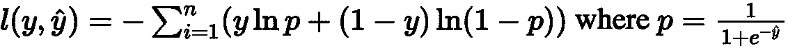**

**图五。我用 Mathpix 剪切工具直接从图 3 中的图片中剪切下来。使用它。很酷！。Btw，上面的 n，是样本数。**

**那么， ***y hat = 0*** 的损失是多少呢？如果 n 或样本数= 5？**

**由于 y 可以是 0 或 1，并且 p 和 1-p 都是 0.5，因此对于所有样品，对数损失=-n * ln(0.5)=-5 *-0.6931472 ~ = 3.465**

**显然，这只是所有样本 0.5 概率的损失。从这里开始，我们想做得更好，尽量减少损失。所以我们开始造树。我们的目标是使用我们的第一棵树 ***ft1*** 找到下一个 ***y 帽子*** (即比默认值 0 更好的东西)。但是，我们必须在确保对 ***ft*** (树增强参数)施加限制的同时找到它。**

**假设我们已经找到了树 ***ft=1*** 。**

**现在，我们可以计算下一个更好的 ***y hat*** ，通过将每个样本的叶子分数加到 ***y hat = 0*** 。也就是说，叶子得分可以认为是***△y 帽子*** 。而 ***y 帽 0***+***△y 帽 0*** 给了我们 ***y 帽 1*** 。**

**如果你在看图 3，你现在会明白在 ***t=1*** 时，样本具有不再等于零的 ***y hat*** 值。例如，样本 X1 有一个 ***y 帽*** 值= ***0 + ft1(X1)*** 。样本 X3 和 X4 在第一棵树的同一片叶子上，具有相同的***y hat***value =**0*****+ft1(X3)***=***0+ft1(X4)***。诸如此类。**

**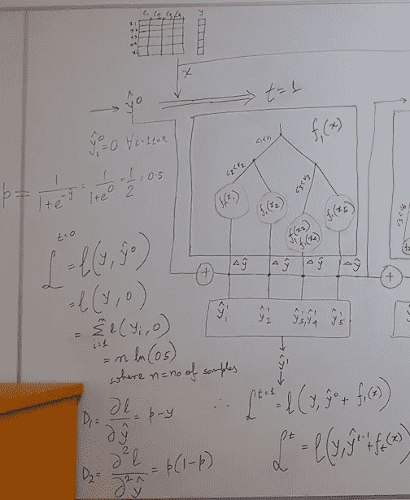**

**图 3 的相关部分**

**现在，我们可以再次计算损失。使用我们的损失公式。对吗？**

**只是这一次，不会是 ***n*** 乘以同一个 ln(0.5)值，因为，不同的样本有不同的 ***y 帽*** s，我们来看一个图解。**

**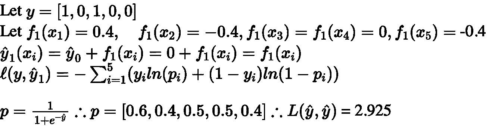**

**图六。第一棵树后的损失。你为什么不做求和，并验证你得到相同的损失？我把正的δy hat 给了 x1，负的δy hat 给了 x2 和 x5。这不是随机的。这是因为，树会给他们分数，分别把他们推到 1 和 0 的最终目的地。对吗？。我将叶子 3 的δy hat 设置为零也是有原因的——我们在阅读时会更好地理解——但如果你注意到，叶子有 x3 和 x4，它们有相反的标签。x4 实际上在这个叶子中被错误分类了。由于这种混淆和错误的消除，叶子分数因此为 0。**

**太好了，我们把损失从 3.465 降到了 2.925。在这一点上不要太担心叶子的分数。我们会回来的。**

**此时，如果我们对损失还不满意，可以试试另一棵树。我们将有类似的先决条件和挑战。我们将有 ***y 帽子*** (只是它不再全是零)*。我们将会有一些树的限制。并且目标将是从 ***ft=2*** s.t 得出一个***δy hat***，在 ***t=2*** 之后的损失使用 ***y hat 2*** 再次是给定前提条件下最小可实现的。***

*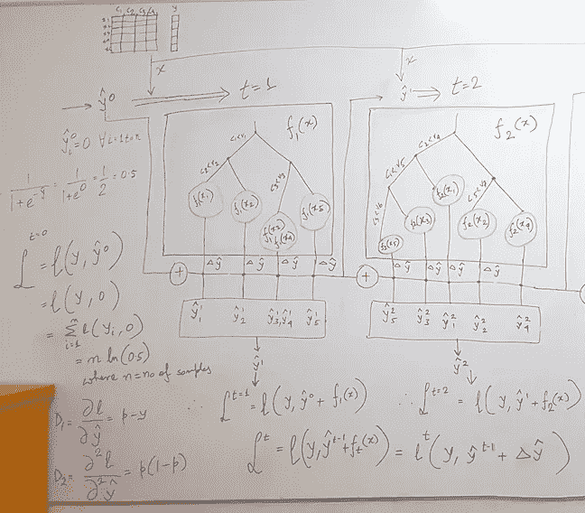*

*图 3 的相关部分。从树 1 到树 2。*

*这听起来很相似，对吗？寻找***δZ***，这将给我们下一个最好的 ***Z=z*** 其中 ***l(Z)*** 将最小。*

*让我们根据博客开头所示的泰勒展开式来编写损失函数，这样我们就可以近似计算下一个最佳损失和下一个最佳树，从而得到最佳的***δy hat***s。*

*但是首先我们需要知道损失函数的一阶和二阶导数。它们分别被称为梯度和黑森。我跳过了梯度和 hessian 的推导，这有点不平凡，但是，它们非常简单和直观。如果你想看到一步一步的推导过程，请查看参考资料中的链接。*

*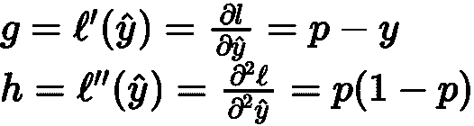*

*雾 7。Logistic 损失的梯度和 Hessian 分别为顶部和底部。但是究竟为什么二阶导数叫海森呢？有人知道吗？*

*太好了。因此使用图 5 中的损失函数，我们可以计算给定值 ***y hat 下的损失。*** 我们可以计算那个值的一阶和二阶导数，因为我们会从 ***y hat*** 知道 ***p*** (图 4)。我们需要找到下一个最好的。我们已经知道该怎么做了。对吗？我们还在等什么？*

*我们来形式化一下。*

## *形式化 XGBoost*

*我们可以将损失函数写成*

*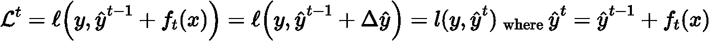*

*图 8。树 t 之后的损失函数，使用树 t 作为变量 ft 重写。y 是已知标签，y 是所有样本直到树 t-1 的叶子分数总和的向量。如果困惑，再看我图 3 的图片。*

*现在让我们像以前一样，用泰勒近似来分解它。*

*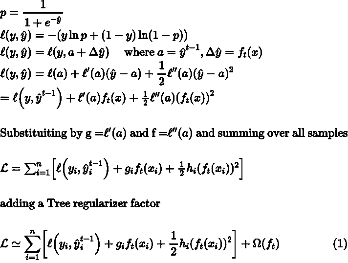*

*图九。损失函数使用泰勒展开和树变量 ft(xi)和正则化。*

*图 3 直观地解释了上面所写的一切，所以这应该很容易理解。任何困惑，请再次看到“我的照片”。*

*简单来说，树 t 后损失，取决于 ***y 帽 t*** ，也就是 ***y 帽 t-1*** 加上 ***ft(x)。*** 因此损失后树*可表示为泰勒近似损失从***【y 帽】t-1、**、δ****即***【ft(x)***。使用一阶和二阶导数，我们得到(1)的最终方程。***

**这里***【ω(ft)】***，代表对树函数/构建过程的不同约束和正则化。这其实是 XGBoost 非常重要的一部分。这是它比其他 Boosting 算法好得多的地方。像 max_depth 是一个约束，min_child_weight 是一个约束。然而，当正式化损失函数时，只需要考虑应用于叶分数或叶权重的 L1 和 L2 正则化。其他的是在构建树时由算法强加的。**

**所以重写**

**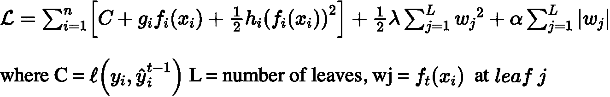**

**图 10。用树正则化参数重写损失函数。L 片叶子上的 n 个样本。注意，这里正则化应用于每个叶分数，而不是每个样本。这是有道理的，对吗？**

**但是，为什么我们需要调整权重呢？因为，权重或叶子分数，是推动 ***y 帽子*** s 的东西，我们总是会有叶子，其中有混合的类，这意味着错误分类的样本。如果砝码太大，则可能会导致样品突然错误移动，从较好的 ***y 帽*** 到糟糕的 ***y 帽*** 。因此，控制权重将确保某棵树上的某条路径不会对 ***y hat*** 运动有太多发言权。如果树中的路径在某些局部条件下过度拟合了呢？稍后将详细介绍。**

**现在，我们知道 L1 正则化(由上面的最后一项表示，用α作为乘数)，当最小化一个函数 w.r.t 到变量时，惩罚了它的变量的纯粹存在。它将试图使叶权重或分数 wj 趋向于 0。如果 wj 变得太小，我们的 ***y hat*** s 一点也不会变——对吗？。实际上，它会阻碍给出 wj > 0 的分数或模数的所有特征值条件。**

**这在 XgBoost 中并不常用。已经基于一些标准选择了这些特征，我们不希望仅仅因为一些叶子导致模数分数> 0 就让它们消失。取而代之的是，L2 正则化(倒数第二项)被广泛使用，它将允许叶子，但是阻止叶子权重过大。稍后在**第二部分**会有更多关于这个的内容。**

**回到家里，让我们只使用 L2 正则化和打破上述函数根据叶。然后通过最小化损失函数，让我们找到最优的***δy hat***或 ***ft(Xi)*** 或每个叶节点中的叶得分或叶权重。**

**首先，我们需要将所有样本的求和重新排列成所有叶的求和(每个叶内样本的求和)。为什么？因为正则化是对每片叶子进行一次。而损失是每个样本的。因此，我们对正则化因子的所有叶子求和，然后在每个叶子内，我们对样本求和。见下文。**

**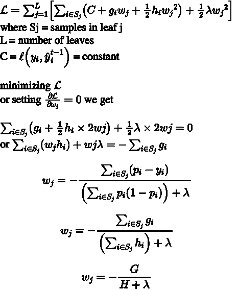**

**图 11。最小化损失函数并找到每片叶子的重量。上面的 Sj 表示叶 j 中的样本。每个 j 或叶中的 ft(Xi)具有相同的值，由上面的 wj 表示。为了适应每个叶而不是每个样本的正则化参数，我们将求和重新安排为每个叶的样本求和。**

**好的，亲爱的。所以我们定义了每片叶子的最佳值 ***、wj*** 。现在我们也可以找到如下所示的最小损失。如上所述，L2 正则化是针对每片叶子的，而不是针对每个样本的。这很有道理，对吗？我们不希望正则化一个叶子中的每个样本。它们都有相同的重量。**

**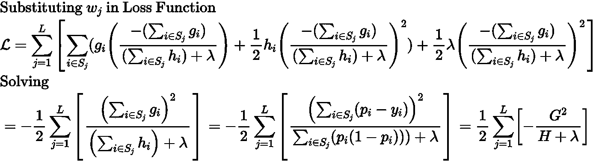**

**图 12。L 叶树最小可能损失的推导。我跳过了几个步骤，但你几乎可以看穿它。**

**酷毙了。我们拥有一切来获得那个价值吗？我们总是从先前的状态(或先前的树)知道 ***y 帽子*** s 所以我们知道***pi；*** 而我们也知道标签*；因此，我们有一切来构建一棵树，并获得树叶的重量或分数。注意，上述损失是所有叶片 L 的总和，第三个括号内的表达式是单个叶片内的损失。***

## ***被蒙蔽了！？***

***好吧，我骗了你，一点点！。在哪里？当在上面的图 11 中对函数求微分并等于 0 时。我哪里作弊了？当然了。叶子的数量。我的意思是，如果这是一个变量，我不能在区分和等同于总损失为 0 的时候忽略它。如果你已经明白了。聪明！！😎。***

***这确实不对。但是我们把 L 看作一个常数。也就是说，所有可能的树的叶子数量都是固定的。但这是不可能的，对吗？。从一堆特征中，假设一个最大深度为 6，我们可以有这么多不同类型的树，有不同数量的叶节点。***

**你是对的，但是那使它几乎不可能找到一个解决办法。所以我们考虑用最佳优先法来建一棵树。或者确切(贪婪)的做法。对于大多数数据集，这是 XGBoost 的默认 ***(自动)tree_method*** 。在这个方法中，首先，我们假设一棵树有一个节点。其具有一堆样本，并且损失是基于 ***y 帽子的先前状态来计算的。然后我们把那个节点分成两个节点 L=2，并遵循下面的过程。*****

**假设 L=1 节点的损失为 ***lp*** 或损失母体。现在，对于该节点中的所有样本，我们遍历所有可能的列(使用树增强器参数中指定的列选择约束)及其值，并找到(column，value)组合以将其拆分为两个节点，其中 L=2 且 Loss***LC***=***(lc1+lc2)***或 Loss children s.t， ***lp-lc*** 为正且最大值。也就是说，从 ***lp*** 到 ***lc*** 的损耗最大限度地降低。或者 ***lc*** 是损耗最小的。**

**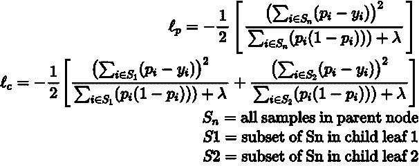**

**图 13。既然我们知道 y hat，我们就知道 p。迭代所有列/值对，从而迭代所有 S1/S2 叶对，直到我们得到 lc 的最小值。这为我们提供了最佳优先方法中两个节点的下一个子树。**

**如果即使在考虑了所有列值元组之后，从 ***lp*** 到 ***lc*** 的损失不能减少，那么我们已经达到了节点的最佳损失。这个节点本身变成了一片叶子。否则，我们将树进一步扩展到下一个子树(直到我们达到最大深度)，直到我们得到所有的叶子。**

**好吧，还记得吗？不久前，当我们在第一棵树后将损失从图 3 中的 3.465 减少到 2.925 时，我说，如果我们对损失减少不满意，我们尝试下一棵树？。好吧，但是为什么我们不能在一棵树上，用无限的深度得到最好的损失减少。还是最好的***△Z***遂 ***z*** 和 ***l(Z=z)*** 一气呵成？为什么我们需要建这么多树？**

**理论上我们可以尝试，无限深度，遍历所有可能的树。但是，我们不能保证只用一个函数就能达到绝对最小值。这也使得树和解决方案对变化非常敏感。然后，它变得对单个树的构建方式和整个训练数据过于敏感。这可不好。**

**这就是为什么 boosting 基于小步学习的哲学。想法是，保持低深度(最好低于 10)，如果可能的话，创建数百棵树，一个接一个，一点一点地学习，直到我们在下一个*树( ***提前停止*** )内不能再获得实质性的损失减少。***

**参见下面的可视化**

**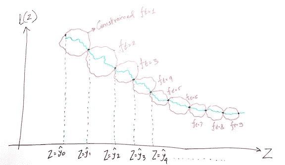**

**在每一步，树构建函数 f 都受到一些规则的约束。在这个受约束的环境中，该算法正在寻找下一个最佳 Z，因此也是下一个最佳 y。该增量是函数 f 对样本及其特征值的结果。**

**此外，我们应该彻底使用子采样和列采样，以便每个新树具有不同的样本和列集，因此不存在与某些列、值、样本元组值的从属关系，从而在每个树中导致类似的分裂。**

## **最后 Eta(学习率)**

**嗯，埃塔确实是人工合成的。它没有出现在上面的任何地方，因为它不是强制性的。这只是一个控制 delta 步长的聪明方法，而不涉及 lambda (L2)或 hessian 或 gradient 的复杂性。**

**η是介于 0 和 1 之间的分数。默认为 0.3。这将使***δy hat***或叶分数减少该分数。**

**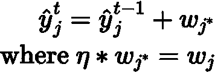**

**这就是 Eta 的全部内容。t 代表一棵树，j 代表一片树叶。图 16。**

**通过保持***δy hat***为低，我们确保在样本 ***y hat*** 中没有突然的跳跃，并因此基于一些局部敏感的列值条件，由于在一些叶子中的局部损失最小化，概率。**

**仅此而已！理解 XGBoost 的数学是有难度的。让我们快速看一个可视化的表示。**

**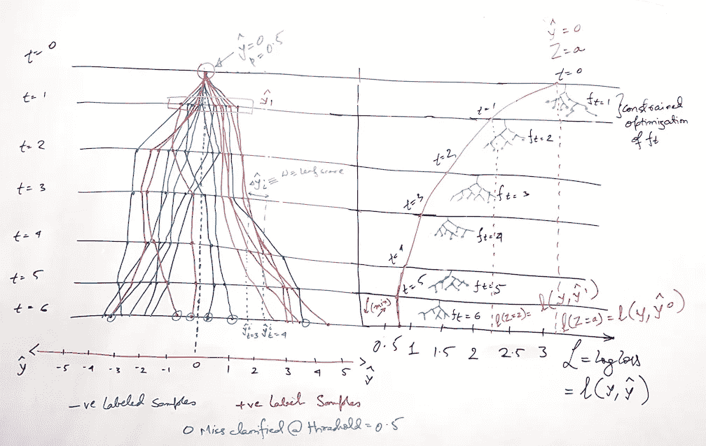**

**直观地看损失和 Y 帽子如何从一棵树到另一棵树不断变化。图 17**

**所以，以上是我们所学的快速浏览。在左侧顶部，当 t=0，y hat = 0，pi = 0.5 时，所有样本都在同一点。一棵树接一棵树，单个样本的 y 值随着小的增量不断变化。基于总的损失最小化，这些增量可以是正的或负的。在每个采油树之后，在训练期间，测井曲线损失应该不断减少。然而，在某一点之后，LogLoss 可能开始增加。一些 y 帽可能与期望的方向相反，导致错误分类的样本。右边是 LogLoss，从一个较大的值开始，然后逐渐减小。这些是 XGBoost 使用 train 的观察列表和 logloss 的 eval_metric 进行训练时看到的值。图片的其余部分应该不言自明。**

**最后，当这样的模型用于预测时，对于未知标签样本，将样本落在每棵树上的所有叶子分数相加，以给出该样本的 ***y hat*** 分数。从 ***y hat*** 分数，使用 Sigmoid 函数，我们得到概率值，并因此基于阈值截止来标记。**

## **快速测验**

1.  **但是我们为什么需要埃塔呢？无论如何，它是综合的，求导和最小化数学不需要它！**
2.  **为什么我不能是 1 岁？可以用 0 深度训练 XGBoost 吗？这是什么意思？会发生什么？**
3.  **在我们使用深度为 0 的树的情况下，我们有或没有正则化或 eta 有什么关系？**
4.  **黑森效应如何伽马或最大德尔塔步？**
5.  **如何为二进制分类估计一个好的最小子权重？**
6.  **我们应该使用阿尔法正则化吗？什么时候？**
7.  **何时使用最小儿童体重或称体重？上面的数学在不平衡的班级情况下表现如何？**
8.  **在不平衡的课堂情况下，当训练分布与看不见的分布不同时，我们应该如何处理体重秤的 pos 重量？**

**如果这些问题激发了你的探索精神，那么这就是第二部分的全部内容。**

# **参考**

**所有资源文件都可以在**

**[https://github.com/run2/demystify-xgboost/tree/master](https://github.com/run2/demystify-xgboost/tree/master)**

** [## sigmoid 函数的导数$\sigma (x) = \frac{1}{1+e^{-x}}$

### 感谢为数学栈交换贡献一个答案！请务必回答问题。提供详细信息…

math.stackexchange.com](https://math.stackexchange.com/questions/78575/derivative-of-sigmoid-function-sigma-x-frac11e-x)  [## 对数损失的梯度和海森如何计算？(问题基于一个数字示例…

### 我想知道 logloss 函数的梯度和 hessian 是如何在 xgboost 中计算的…

stats.stackexchange.com](https://stats.stackexchange.com/questions/231220/how-to-compute-the-gradient-and-hessian-of-logarithmic-loss-question-is-based)  [## 逻辑回归:为什么是乙状结肠函数？

### 回答(第 1 题，共 12 题):在二项式回归中，我们希望将响应变量建模为以下变量的线性组合

www.quora.com](https://www.quora.com/Logistic-Regression-Why-sigmoid-function)  [## 逻辑回归- ML 词汇表文档

### 假设我们得到了学生考试成绩的数据，我们的目标是基于以下因素来预测学生是否会通过考试…

ml-cheatsheet.readthedocs.io](https://ml-cheatsheet.readthedocs.io/en/latest/logistic_regression.html)  [## 理解二元交叉熵/对数损失:一个直观的解释

### 有没有想过用这个损失函数到底是什么意思？

towardsdatascience.com](/understanding-binary-cross-entropy-log-loss-a-visual-explanation-a3ac6025181a)**