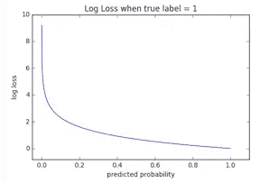

# 揭开 XGBoost 第二部分的神秘面纱

> 原文：<https://towardsdatascience.com/de-mystifying-xgboost-part-ii-175252dcdbc5?source=collection_archive---------18----------------------->

## 揭开 XGBoost 的神秘面纱

## 挖掘超参数

# 序幕

这是去神秘化 XGBoost [第一部分](https://medium.com/@b.debanjan/de-mystifying-xgboost-part-i-f37c5e64ec8e)的延续。如果可能的话，准备一份打印件，因为我会在整个博客中提到它。

在这篇博客中，我将讨论我们在训练 XGBoost 模型时使用的概念和各种参数背后的直觉。很多时候，我们盲目的训练这样的模型。这个算法是如此的符合逻辑，正如你从[第一部分](https://medium.com/@b.debanjan/de-mystifying-xgboost-part-i-f37c5e64ec8e)中所理解的那样，即使盲目地使用所有的检查和平衡(正如我们将在下面讨论的)，也很难得出一个草率的模型。

或者是？你怎么想呢?

在这篇博客的最后，我们应该能够更直观地看到参数，并在调整它们和推理为什么一个模型在看不见的数据上表现不佳时使用直觉。我将只讨论这个故事中的几个参数，其余的将在第五部分讨论。此外，你应该在[第一部分](https://medium.com/@b.debanjan/de-mystifying-xgboost-part-i-f37c5e64ec8e)中找到所有测验问题的答案。

我们开始吧..

# 直觉

## 梯度

我们从第一部分的数学中得到的最直观的东西是梯度的重要性。它是 XGBoost 如何创建和扩展树的基础。我们现在知道，叶分数=-G/(H+λ)，节点中的损失与-G/(H+λ)成比例。拉姆达，记得吗？叶分数的 L2 正则化参数。

因此，为了减少从父节点到子节点的损失，我们需要减少子节点的损失，因此(带有负号)mod G 的值需要更大。g = p-y 的总和。因此，树函数需要找到列值条件，使得(p-y)的模和在每个子代中都很大。这发生在所有的(p-y)符号相同的时候，对吗？想想吧。

对，所以直觉上，一个好的分裂条件会试图将一个标签的样本分离到一个子节点中，而将相反标签的样本分离到其对应的兄弟节点中。它们混合得越多,( p-y)的和就越小。因此，良好的直观分割条件也将损耗降至最低。

再次直观地，权重或 delta 分数与梯度的负值成比例。这意味着***δy hat***将自身调整到梯度(或误差)的相反方向。这就是我们想要的！对吗？纠正错误。

随着这些树不断地校正整体误差，对于一个样本来说，***【pi】***(其从 ***y hat i)*** 不断地从一棵树变化到下一棵树。见[第一部](https://medium.com/@b.debanjan/de-mystifying-xgboost-part-i-f37c5e64ec8e)最后一张图。对于一个样本， ***y hat*** 可能随着它从一棵树移动到下一棵树而增加或减少。在每棵树的末端，(*)或渐变，就是那个样本的误差*。或者是 ***i*** 的最后一个最佳预测值与真实标号之差。和***【π-yi】***的总和或误差(在一片叶子或覆盖物中所有样本的平均值👇)是保持控制所有树中的分裂逻辑的东西。**

**这就是为什么我们说 XgBoost 从错误中不断学习。**

## **粗麻布/封面**

**我们还在[第一部分](https://medium.com/@b.debanjan/de-mystifying-xgboost-part-i-f37c5e64ec8e)中了解到，对于二元 logistic 损失函数，hessian 是 ***p(1-p)*** 。在一个节点上，hessian 的和是 ***pi(1-pi)*** 的和。当 XGBoost 为二进制分类指定最小子权重时，该值被视为最小允许值。让我们想一想这个问题。**

**想象一下，在某棵树上，向下一定深度，有一个节点，当在某种条件下分裂时，给出两个节点，其中一个有 10 个样本。比方说，这些样本的 ***y hat*** 值，在进入树之前，就已经相当成熟，即 ***y hat t-1*** s 接近自己的预期得分或者完全错误。让我们说 ***pi*** 因此，对于具有标签 1 的那些，已经在 avg 0.95 上，对于具有标签 0 的那些，已经在 avg 0.95 上。并且有一些错误分类的标签 1 样品具有 ***pi*** 0.05，反之亦然，标签 0 样品。**

**这片叶子值多少钱？就是~= 0.95*0.05*10 ~= 0.475。即使有一些类 1 样本的 ***pi*** 在错误的一侧，反之亦然，对于类 0 样本，hessian 的和仍然是~= 0.475。**

**如果 XGBoost 的 ***最小子权重*** 设置为 1，则不允许此拆分。而不管它是否从所有可能的子节点中给出最低损失，这些子节点是从该节点上所有可能的特征值分裂条件中导出的。**

**凭直觉，一个低总和的黑森，或低 ***盖*** 意味着，我们正在考虑一个非常渺茫和局部的条件。低的 hessian 或 cover 会导致更高的 ***delta y hat*** s(因为它在分母中)的-G/(H+lambda)。给定默认的λ为 1，非常低的 hessian 几乎导致权重与梯度成比例。这种权重会对错误分类的样本造成大的错误分数移动(它们的 ***y 帽*** 将与它们的错误或梯度相反地移动，以及节点上多数类的样本，它们的 ***y 帽*** 将在期望的方向上移动，与整体梯度相反)。**

**如果，在分割后，每个孩子的样本量> 100；这样的分割是被允许的，因为黑森人的总数将远大于 1。0.95*0.05*100 ~= 4.75.直觉上意味着。在如此大的样本量下，这种拆分更可能是有效的拆分，而不是过度拟合的拆分。我们也可以在看不见的数据中期待同样的特征。并且大的 hessian 将导致节点中所有样本的受控得分/权重(***△y hat***)。**

**或者，也可能是反过来。概率平均值为 0.85 和/或 0.15 的 10 个样本。黑森州的总和应该等于 1.275。在这种情况下，我们也没事。这是一个早期的分裂，大多数 T21π还没有趋向于 1 或 0。梯度很高，但会混淆，总的来说，最佳权重将导致受控的得分移动或增量。并且这种分叉不是过度配合的分叉。我们需要这样的分裂来开始校正梯度。**

**我很快就有了电子表格，它会让你想象这些动作。**

**因此，对于二进制分类，节点上的 hessians 的覆盖或和对样本的数量以及这些样本的概率(计算到最后一棵树)接近 1 或 0 是敏感的。概率越成熟(正确或错误)，证明一个分裂所需的样本数就越高。**

**对于线性回归(实际上，这是一个很好的练习，如果你能再次计算线性回归的话)，损失函数是均方误差，hessian 和为 1*n，即样本数。因此，对于线性回归，cover 就是一个节点上的样本数。**

**因此，为了形象化默认的 ***min child weight*** 为 1，认为需要至少 10 个样本在 ***pi*** 0.85 和 0.15 附近，或者至少 20 个样本在 ***pi*** 0.95 和 0.05 附近，至少 50 个样本在 0.98、0.02 附近，以此类推。如果您认为在您的用例中这是一个公平的节点纯度阈值，那么 1 是一个很好的数字。可以少去也可以多去。一般来说，不建议小于 1，除非你的样本量很小，只有几百个。**

**超过 ***的最小子体重*** 的 1 是安全的，保守的。然而，你爬得越高，矮树越难劈开。所以即使你有一个很高的最大深度，它也可能永远达不到那个深度。我们将很快讨论更多的深度。**

## **梯度黑森权衡**

**你现在一定感觉到了，在 gradient 和 hessian 之间，有一场持续的拉锯战。渐变会尝试给出更高的 mod leaf 分数或 ***delta y hat*** s，而 Hessian 会降低分数或平均分数。**

**当一个模型刚刚开始，我们有高梯度和高 hessians 了。随着我们不断添加树木，我们有较低的梯度，黑森也变小了。事实上，在许多树之后，当大多数样本具有低梯度或误差时，hessian 几乎为零，唯一阻止我们爆炸权重或分数的是分母中的 lambda。**

**总的来说，这是一个控制*的游戏，以便它永远不会太大，并根据每个节点上的误差在正确的方向上。***

## ***希腊字母的第 11 个***

***那么，对于 lambda 该怎么办呢？我会说，默认值 1 是一个非常好的值。它可以防止分数爆炸，同时也不会过多地降低梯度的权重。***

***如果我们增加λ，虽然没有明显的伤害。权重或叶分数将更小，因此模型将学习得更慢。将会有更多的树，更多的内存，需要更多的时间。但对模型没有伤害。但是，如果我们减少它，事情会反过来，我们可能会损害模型。怎么会？我们会在讨论 ***eta*** 的时候讨论。***

**但是，想想看，如果 lambda 小于 1，并且 y hat(*) s 非常接近 1 或 0(导致 hessian 的和几乎为 0 ),我们最终会得到分数或δy hat(*,这可能超过样本上的误差或梯度。对吗？因此，我们将来回超越梯度。听起来不太好，对吧？****

## ***Base_Score 和零深度树***

***现在我们知道了树木是如何生长的。如果我们有 0 深度的树呢？比如为什么要尽量把损耗从 ***lp*** 降低到 ***lc*** 。当我们在图 12 中求导时，L 或叶片数也可能是 1，对吗？完全正确，是的，我们可以在 XgBoost 中训练深度为 0 的树——试试吧。***

**但是会发生什么呢？既然，所有的样本都会在单个节点上，得到相同的分数，想一想，损失最小化的最好方法会是什么？纯直觉说，我们将需要根据类的分数改变 ***y hat*** s。假设我们有 200 个 0 类样本和 20 个 1 类样本。直觉上，我将开始从 0 到-5 减少所有样本的 ***y hat*** s，因为类 0 样本在数量上更大。**

**如果我们选择 w=-G/(H)，就会发生这种情况。如果我们将那个加到 ***y hat*** = 0，我们将得到所有样本的一个分数，这将导致最小的对数损失，并且考虑到上面的例子，δ或 w 将肯定是负数。只是给你那个数字， ***y hat*** = -1.63 将是所有 220 个样本的最佳 ***y hat*** ，导致最小 LogLoss。**

**那么，XgBoost 会训练一轮就停下来吗？(假设我们停止在最佳对数损失)。如果我多轮呢？是的，它会停在一轮，但是，只有当我们不使用 lambda。如果我们使用 ***lambda*** 正则化和 ***eta*** (学习速率)，XGBoost 将在几轮中不断减少 LogLoss，然后一旦无法再减少时，它将停止。为什么？因为我们知道λ和学习率都减慢了实际的***△y 帽子*** 或分数。**

**所以如果 w = -G/H，它将在一轮后停止，但如果 w = eta*-G/(H+1)，它将继续几轮。**

**很酷的事实——对吗？😀。那么，我们为什么不用它呢？因为那只会给我们一个取决于阶级分布的概率。我们可以通过简单的数学计算发现。我们不需要任何功能。当我们考虑到某个事物属于一个类的概率取决于它的特征和价值时，我们需要在条件上进行分解。我们将立即拥有两个节点。L = 2。而我们以 gain =***lp-(lc1***+***【lc2】***)回到 LP 和 lc。当我们一棵接一棵地建立子树时，我们试图最大化收益。**

**事实上，给定 200:20 的类分布，从简单的数学和对数损失的最小化得出的分数(y hat = -1.63)可以用作 ***base_score*** 而不是 0。也就是说，只有当你认为阶级分布对最终概率有很大的发言权(偏差)时。但是请注意，这是假设您的训练样本类分布将始终与未知分布完全相同，并且每个预测都将以该偏差开始。所以——请小心使用。不推荐。**

**使用级联模型时，基本分数有时也会得到不同于 0 的值。就像相同的样本依次经过不同的特征集和/或模型，其中第一个模型的输出变成了第二个模型的偏差，等等。**

## **最大增量步长**

**让我们用一些真实的数据来理解这一点。我在一个节点中创建了一个示例数据集。它在类别 0 中具有 200 个样本的标签分布，在类别 1 中具有 20 个样本的标签分布。在一个条件下，节点分裂成两个节点。一个有 185 个样本，另一个有 35 个样本。假设这 185 人中，有 180 人来自 0 班，5 人来自 1 班。35 人中，0 班 20 人，1 班 15 人。见下图。这实际上看起来像一个很好的分裂，对不对？子 1 中的多数分数类 0 和子 2 中的多数分数类 1。**

**我已经给了样本一些先验概率值，假设父节点在一些树之后。因此， ***y hat*** s 已经远离全= 0。我将大多数 0 类样本(150 个)的概率设为 0.1，并保留不同程度的误差或梯度(下面的第 2 行和第 3 行)。类似地，我将大多数 1 类样本的概率设为 0.9 (8)，并保持不同的梯度(下面的第 2 行和第 4 行)。然后我计算了所有的 G、H、损耗和重量/分数，假设λ为 1。对于父节点和两个子节点。见下文。**

****

**节点根据某种标准分裂成可能的子节点。不平衡的数据。您可以在[https://github . com/run 2/demystify-xgboost/blob/master/DeMystifyXGBoost-example 1 . xlsx](https://github.com/run2/demystify-xgboost/blob/master/DeMystifyXGBoost-Example1.xlsx)访问该电子表格。你可以看到每个单元格上的公式，看看我是如何计算这些值的。玩弄样本数量和或概率。损失，重量，新的概率等将自动改变！:)**

**让我们深入了解一下 Gs 和 Hs。**

**对于 p= 0.1 的 0 级，H = 0.1 *(1–0.1)= 0.09。G =(0.1–0)= 0.1。**

**对于 p = 0.9 的类 1，H 再次= 0.09，G =(0.9-1)=-0.1。**

**所以 G 的 mod 比 H 大，对吧？因此，如果我们有许多样本是 0 类，很少样本是 1 类，那么具有大多数 0 类样本的叶子将倾向于具有比 H 或 H + 1 高得多的 G。在示例中，我们可以看到在子节点 1 中，来自类 0 样本的 G 是 32.5 (K20)。对于 1 类样品，只有 1.6 克的一点点抵消。h 是 21.71。因此，我们最终得到一个权重或分数或δ***y hat***=-1.36**

**如果我们允许这种分割，并且子节点以叶子结束，则子节点 1 中的所有类 1 样本将具有-1.36 的***δy 帽*** 。这意味着，被错误分类的第 1 类样本的概率将突然以相反的方向跳跃(与它们的梯度相反)。例如，2 个类别 1 样本将从概率 0.9 跳到 0.7。看到红色标记。**

**这就是最大增量步长的用武之地。如果最大增量步长设置为 1，则不会发生上述分割，即使它导致最低 ***lc*** 。这将迫使算法搜索其他特征值组合，其中 ***lc*** 可能更高，但是分割将使得分数变化更小。**

***请注意，在上面的 excel 中，在损失母公司计算中，我没有使用我们在数学部分计算的 1/2 因子-1/2*G /(H+1)(图 12 第一部分)。XGBoost 不应用这个 1/2 因子，因为它是父节点和子节点的常数乘数。**

## **学习率**

**我们已经知道，eta 是要乘以叶分数的分数，通过保持***【delta y hat】***为低，我们可以确保基于一些局部敏感的列值条件，不会由于某些叶中的局部损失最小化而导致样本概率突然跳跃。**

**从上面 max delta step 题目中的例子来看，如果我们使用 eta 为 0.3，那么叶子分数和 ***delta y hat*** s 就会降为-1.36*0.3 = -0.4 和 0.035*0.3=0.01。给定一个 ***最大增量步长*** 1，这是一个允许的增量。**

**因此，从子代 1 中的类别 0 误分类样本中，两个红色标记的样本将仅移动到 2.2–0.4 = 1.8 的 ***y hat*** ，概率为 0.85；相比于 ***y hat*** 而言，没有 eta 的概率分别为 0.84 和 0.7。因此，整体学习速度较慢(对于正确分割的样本)，但误差较小(对于错误分割的样本)。**

**这里的关键问题是——eta 仅仅控制学习的速度吗？也就是说，它是否只会影响所需树木的数量。较大的数字为较小的***η***反之亦然？答案是否定的。**

**由于这种方式，每次分割查看梯度，并考虑其他因素，如最大增量步长、gamma(见下文)、最小子权重和其他树增强器参数，很可能高的 eta 或 eta =1 将导致算法进入不能再减少损失的位置(想想超过凹形损失曲线的谷值)，并且基本上停止在非最佳的评估度量值。当λ从 1 减小时，可以看到相同的效果。**

**底线是，保持低 eta 没有坏处，除了学习速度慢。保持较高的 eta 可能会导致较差的模型。显然太低的 eta，像 0.01 也是不推荐的，因为我们的模型将保持几个小时的训练。因此，默认值 0.3 是一个好的开始，我们可以稍微降低它，看看评估指标是否更好。在这个去神秘化系列的第三部分中会有一个关于这个的部分。**

## **微克**

**这就把我们带到了伽马射线。γ，再次，树增强参数是最小增益，或 ***lp-(lc)*** ，或 ***lp-(lc1+lc2)*** ，允许一个节点进一步分裂成两个以上的节点。让我们像下面这样改变上例中每个子节点中类 0 和类 1 的样本数。这是一个糟糕的分裂。我们在每个节点中有几乎 50%的 0 类样本，1 类样本也是如此。我再次计算了每个节点的 G H 和损耗。**

****

**节点根据某种标准分裂成可能节点。低增益。您可以在[https://github . com/run 2/demystify-xgboost/blob/master/DeMystifyXGBoost-example 2 . xlsx](https://github.com/run2/demystify-xgboost/blob/master/DeMystifyXGBoost-Example1.xlsx)访问该电子表格。你可以看到每个单元格上的公式，看看我是如何计算这些值的**

**我们可以看到，增益或者说 ***lp-lc*** 现在是= 0.966。上例中的增益约为 7。直觉上，这种分裂看起来也不太好。如果 gamma 设置为 1，这种分割将被排除。如果该增益是从所有列值组合中可获得的最佳增益，则该节点根本不会分裂。它将成为一个叶节点。**

**总体来说， ***lp*** 和 ***lc*** 依赖于-G/(H+λ)。因此，确保良好的损失减少基本上意味着获得一个分裂，其中在分裂的每个子代中有一个显著的 G. Or，相同符号(+或-)的梯度。我们在讨论梯度的时候已经讨论过了。**

**找到允许的最佳伽玛或最小增益并不容易，低于最佳伽玛或最小增益，就不允许分裂。我们需要真正确定我们的数据大小和分布，才能开始使用它。但是，如果“最大深度”设置为较高的值，具有正的 gamma 值，将会自动修剪树，这样就不会有不必要的分割，并且损失减少非常少。**

**即使我们不设置γ，算法的固有特性，即寻找具有最大增益的分裂，将避免低增益分裂。伽马射线是额外的保护，以确保树木是保守的。特别好使用，如果我们计划使用许多保守的模型，然后集合它们。**

**最小儿童体重和伽玛之间经常会出现混淆。如果你已经到达这里，希望没有这样的困惑。如果你注意到例 2 中的孩子 2，hessian 的和是 9.6 (K42)。如果最小子体重为 10，这将成为无效的分割。最小子重量确保一片叶子有足够的覆盖，从而控制重量或分数。Gamma 确保我们不会分割节点，这样从父节点到子节点的整体增益会非常低。所以他们不一样。**

## **秤 pos 重量和 AUC**

**好吧，这个，我必须承认很难理解。我用了几次，但不知道它的头或尾，每次都有罪恶感。但是现在我们已经掌握了所有的数学知识，尤其是 excel 表格，这应该就像“吃米饭和扁豆汤”一样简单。**

**首先，我们再回忆一下 ***y hat*** 对概率的影响。**

****

**乙状结肠函数。图 17。**

**如我们所见，对于具有类别 1 或正标签的样本，在**T5 处，y hatT7 为~= 5，它们几乎被完全分类。所以对于所有这样的样本，树中的***△y 帽*** s 应该是把 ***y 帽*** s 从 0 推到 5。因此δy hat 应该是正的。对于类别 0 的样本，情况正好相反。****

**第二，逻辑损失函数的本质是惩罚错误，而不是欣赏正确的事情。查看 ML 备忘单中关于物流损失以及 yln(p)或(1-y)ln(1-p)如何惩罚错误的参考资料。为了快速了解，请参见下面代表 yln(p)的图片。(1-y)ln(1-p)看起来肯定和你想象的一样。**

****

**yln(p)与 p 的关系。可以看出，当标签 1 样品的 p 较低时，损耗非常高。极端。**

**这种惩罚和纠正在模型中根深蒂固。在每次分割时，XGBoost 将尝试纠正错误分类的样本，而不是将已经做得很好的样本推到它们的期望值。**

**如果我们有一个坏的分裂，这是反对这种惩罚和纠正的，就像上面的例子 2，你会注意到，***δy hat***s 有可能没有遵循期望的运动性质。两个子节点都有***δy 帽*** s 为负。然而，如果您注意到示例 1，子 1 的***δy hat***具有更多的类 0 样本，具有负值，而叶 2 的相反情况具有更多的类 1 样本。这也说明我们的分裂很糟糕。**

**现在，在一个不平衡的阶级情况下，有时，基于我们想要达到的目标，上述惩罚和纠正并没有很好地发挥作用，即使是在一个好的分裂中。如果你注意到，例子 1 中的孩子 2 只有 0.03(没有 eta 和 0.01 有 eta)正***δy hat***移动。而孩子 1 具有 1.36 的负运动。这种对少数类样本的受限移动是不期望的，特别是，如果我们更关心阈值处的分类准确度，而不是损失的总体减少。**

**让我们稍微讨论一下。**

**第一，为什么在具有多数类 1 样本的子或可能的叶子上，***δy 帽*** 如此小？。这是因为几乎没有任何总体 g。即使它是具有多数分数类别 1 样本的叶子，也总是会有一些错误分类的类别 0 样本。由于与类别 1 样本相比，类别 0 样本如此之多，即使错误分类的样本也可能与正确分类的类别 1 样本一样多——因此它们将抵消总体 g 的很多。因此小***δ帽*** 。**

**相反，分数类 0 样本占多数的孩子，拥有大量样本。总体梯度严重偏正(K33 处为 27.7)。错误分类的 1 类样本非常少，超过了这个梯度。并由此，***δy 帽子*** 相当高且为负(-1.27)。**

**所以 XGBoost 会因为样本数量而有偏差。它正在努力纠正错误。因为有如此多的类 0 样本，所以忽略将类 1 样本推向 1。它更关心的是将类 0 样本推向 0。**

**这将降低对数损耗。但是分类正确或不正确的第 1 类样本将会与错误分类的第 0 类样本混合在一个小概率范围内。将不会有一个强有力的门槛将它们区分开来。**

**如果我们更关心 FPR 的分类或 TPR 的准确性，上述行为就不太好。大多情况下，在不平衡的阶级情况下，积极的阶级是罕见的。比如预测地震。或者对恶意软件进行分类。这些模型需要在低 FPR 下运行，因为将一个干净的文件称为恶意软件并删除它，远比放过一个恶意软件要严重得多。**

**对于这种情况，更重要的是获得正确分类的阳性标记的样品，尽可能远离阴性标记的样品。因此，我们有一条分界线或阈值，在这条分界线上，较低的 FPRs 具有较高的 TPR。**

**这条线在哪里(在 0 和 1 之间)以及个体概率在哪里并不重要。即使所有 0 类样本都在 0.7 和 0.91 之间，所有 1 类样本都在 0.85 和 0.95 之间，我们也可以有一个良好的阈值，比如说 0.9。但是对数损失会很严重(见上图),因为 0 类样本离 0 很远。但是在我们的用例中，这可能没问题。**

**所以有时候，我们希望算法更偏向于在截止点给我们更好的分类，而不是总体上减少 LogLoss。**

**这就是 ***scale_pos_weight*** 的用武之地。在梯度和 hessian 中给予少数类更多的权重，以便这些样本以更大的跳跃更快地远离多数类样本。**

*****scale_pos_weight*** 定义为= s1 =(负样本总和*)/(正样本总和*)。但是没有硬性规定。这取决于与多数样本相比，你对少数样本的重视程度。有人说，对于高度不平衡的类，scale_pos_weight 应该是 s2 = sqrt(负例之和)/sqrt(正例之和)。我们可以选择值> s1 和< s2，并尝试最符合我们评估指标的值。**

**让我们看看下面的例子 3。你不能真的看着它😀。从 Github 下载。**

****

**[https://github . com/run 2/demystify-xgboost/blob/master/DeMystifyXGBoost-example 3 . xlsx](https://github.com/run2/demystify-xgboost/blob/master/DeMystifyXGBoost-Example1.xlsx)。**

**这就是我所做的。**

**我采取了同样的 200:20 分配。在左边，我将样本分成两个节点，没有使用比例位置权重。在右边，我已经将样本分成两个节点，每个子节点使用相同的样本，但是这次对阳性样本赋予了额外的权重。**

**在左上角的父节点下，我首先展示了深度为零的树的效果。如果您注意到，我使用-G/H 来调整先前的 ***y hat*** 分数，以获得新的 ***y hat*** 分数。我还计算了假设深度为零的树的先前测井曲线损失和新测井曲线损失。你会注意到原木损失减少了。分数调整为-1.15。由于梯度变化，它不同于前面讨论的 200:20 分布的-1.63。如果您将 B3 到 JBOY3 乐队的所有概率更改为 0.5，您将看到-G/H 值更改为-1.63。**

**回到右边的两个子节点。秤位置权重用于计算 G 和 h。对于 1 类样品，其在计算中的存在由秤位置权重 4 加权。**

**如果你注意到，在没有秤重的情况下，分割后的原木损失从 61 减少到 51。而用秤称重量，原木损失从 61 减少到 55。因此，很明显，我们在使用称重法减少原木损失方面做得不是很好。但是实际的概率呢？**

**如果我们注意到，在左边，对两个孩子来说，重量或δy 帽子是负的。对于子节点 1，我们有一个很好的正 G。但是在子节点 2 中，即使它是一个 1 类的多数分数节点，总 G 也不可能是负的。因此，对于两个子节点，delta y hat 仅帮助类 0 样本。**

**在右边，这是一个不同的画面。我们在孩子 1 中仍然有一个负 G，但是它不那么明显了。***δy hat***与-1.27 相比为-1。但是奇迹发生在第二个孩子身上。现在我们的重力指数是负的-13.4。因为阳性标签样品上的额外重量。这导致正的***δy hat***，这将把正确分类的 1 个样本推向更高的 ***y hat*** 值，从而在它们和其他样本之间产生空间。**

**为了证明我的观点，我写了一些代码来找出有权重和无权重两种情况下的 FPR/TPR/阈值，并绘制它们的 ROC。(您将在本系列的第四部分找到代码)。对于这些计算，我需要样本的最终概率。我假设两个子节点都以叶子结束，因此它们的最终概率可以从它们之前的分数(B2 到 J2 或 N4 到 V4)加上***δy hat***s(K39 K72 用于无权重的子节点，W41 W74 用于有权重的子节点)中导出。**

**这是中华民国的样子。带和不带秤的 Pos 重量。**

****

**3 个样本的 ROC 图。有秤显示重量和无秤显示。**

**如您所见，在 TPR 与 FPR 的早期 FPR 数据中，带秤重的模型胜过不带秤重的模型。这只是一棵树。当在许多树的模型中使用比例位置权重时，这种差异更加明显。有秤重模型的 AUC 为 0.956875，无秤重模型的 AUC 为 0.941375。**

**如果不使用秤 pos 重量，而是对单个样品进行称重，则适用相同的概念。在这种情况下，每片叶子中每个样本的梯度和 hessian 乘以样本权重。因此，对于第 I 个样本，gi = wi(pi-yi)和 hi = wi(pi)(1-pi)。对于多标签分类，我们可以根据需要调整所有样本的权重。**

**此时可能会出现一个问题。如果当我们被 AUC 困扰时，我们为什么不将其最小化，而不是 LogLoss。答案是，我们不能，因为 AUC 不是我们可以区分和等于零的东西。然后，可以在不同的操作点(即 FPR 值)获得 AUC 值。如果我们的目标是优化一个模型，仅仅是为了在一个操作 FPR 范围内增加 AUC，那么这些树将会过度符合那个特定的标准，因此将会失去一般性。因此，通过使用加权，我们可以增加 AUC，同时保持在优化日志损失的范围内。**

## **培训课程分布与真实课程分布**

**在我们结束这个话题之前，还有最后一点。当培训课程的分布与真实课程的分布不同时，我们所学的知识如何发挥作用？在上面的 200:20 训练课分布的例子中，如果实时未看见的分布是不同的呢？显著地？比如五五开。或者就此而言，在任何这样的训练中，训练集(验证集)和看不见的实时数据的类分布是显著不同的？**

**希望你现在能明白，(特别是如果你已经玩过 excel 表的话)数学和损失最小化对职业平衡很敏感。因此，如果类别分布明显不同，模型将不会如预期的那样在实时不可见分布上执行(和验证)。**

**如果我们知道用于预测的看不见的数据是不平衡的，在我们开始使用体重秤之前，我们需要对它的不平衡程度有一个合理的认识。训练数据不必具有与未知数据相同的分布。更多的时候，我们有大量的回顾性训练数据，其中我们可以有更多的少数民族类样本。在这种情况下，我们可以继续使用整个数据并适当地调整权重或缩放 pos 权重，或者我们可以随机缩小类别以匹配未知的实时数据类别分布并创建多个模型和集合。**

**例如，如果我们在训练中有一个 200:40 的分布，但是我们知道在看不见的数据中有一个 200:20 的分布，我们可以创建两个 200:20 分布的模型并集成它们。或者，我们可以继续使用 200:40 的训练数据集，但是将体重秤位置权重更改为 sqrt(200)/sqrt(20)*1/2。引入最后 1/2 因子是因为训练集中的阳性样本数量是真实数据中的两倍。**

**这意味着，当你在训练数据中获得越来越多的少数类样本时，你可以慢慢减少你的体重秤位置权重。您将获得验证集和维持集或训练数据的可比 AUC。**

**要注意的主要事情是，维持集应该总是具有与真实的不可见数据相同的类分布。这样，在发布模型之前，您可以随时验证 AUC 或 LogLoss(无论您的评估指标是什么)在维持集上的表现是否符合预期。**

**在我写作的时候，我觉得，也许我会在我的系列文章的第 6 部分中详细讨论如何在 XGBoost 中处理不平衡的数据。深入地。**

# **谢谢**

**这就是伙计们，在这个职位。下一篇文章将展示如何快速构建一个 docker 容器，在其中你将能够运行几乎任何 ML 内容，并在 Jupyter Lab 中使用 Jupyter 和 R。这将是第四部分代码的基础，在第四部分中，我将使用真实数据并构建模型来展示我们在第一部分和第二部分中讨论的所有内容。**

# **参考**

**所有资源文件都可以在**

**[https://github.com/run2/demystify-xgboost/tree/master](https://github.com/run2/demystify-xgboost/tree/master)**

** [## sigmoid 函数的导数$\sigma (x) = \frac{1}{1+e^{-x}}$

### 感谢为数学栈交换贡献一个答案！请务必回答问题。提供详细信息…

math.stackexchange.com](https://math.stackexchange.com/questions/78575/derivative-of-sigmoid-function-sigma-x-frac11e-x)  [## 对数损失的梯度和海森如何计算？(问题基于一个数字示例…

### 我想知道 logloss 函数的梯度和 hessian 是如何在 xgboost 中计算的…

stats.stackexchange.com](https://stats.stackexchange.com/questions/231220/how-to-compute-the-gradient-and-hessian-of-logarithmic-loss-question-is-based)  [## 逻辑回归:为什么是乙状结肠函数？

### 回答(第 1 题，共 12 题):在二项式回归中，我们希望将响应变量建模为以下变量的线性组合

www.quora.com](https://www.quora.com/Logistic-Regression-Why-sigmoid-function)  [## 逻辑回归— ML 词汇表文档

### 假设我们得到了学生考试成绩的数据，我们的目标是基于以下因素来预测学生是否会通过考试…

ml-cheatsheet.readthedocs.io](https://ml-cheatsheet.readthedocs.io/en/latest/logistic_regression.html)  [## 理解二元交叉熵/对数损失:一个直观的解释

### 有没有想过用这个损失函数到底是什么意思？

towardsdatascience.com](/understanding-binary-cross-entropy-log-loss-a-visual-explanation-a3ac6025181a)**