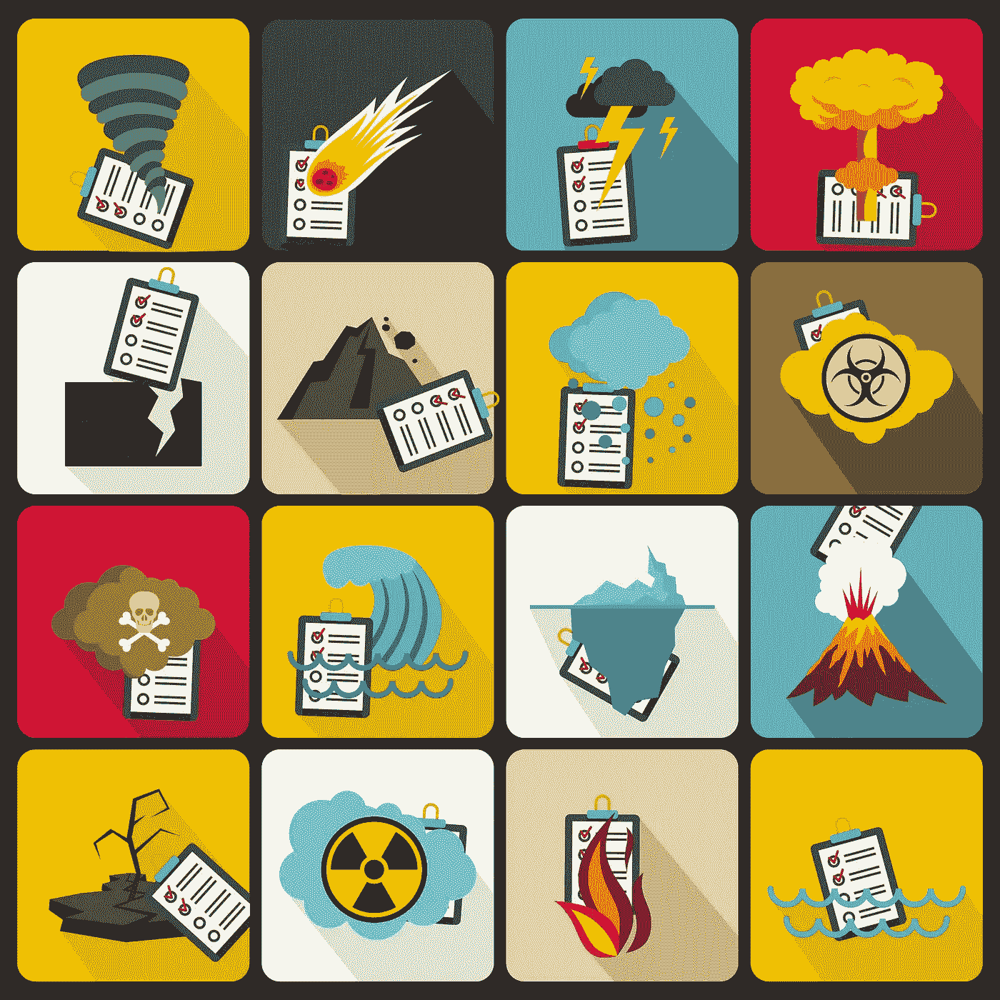

# 应对数据灾难

> 原文：<https://towardsdatascience.com/dealing-with-a-data-disaster-485884e857db?source=collection_archive---------27----------------------->

## 在重大灾难中，您实际上可以做很多事情来挽救和改进您的数据产品。

大多数灾难都可以挽救数据项目。图片来源:汉斯·克劳斯，我们都算

您已经投入了大量的时间、金钱和精力来设计您的数据项目。你已经有了数据收集工具、分析计划和一个重要的研究问题。进入一个大的，完全破坏性的事件。您的数据项目——无论是社会部门的监测和评估、政府部门的循证决策、UX 还是企业部门的产品设计研究——都已跌落悬崖。你能做什么？在您从胎儿位置展开之后，实际上有很多事情可以做，以便在重大中断期间挽救甚至改进您的数据产品。

我有一些经过试验和测试的策略，可以帮助你的数据项目在新冠肺炎和所有相关影响的时候回到正轨。在经营一家数据咨询公司多年后，我曾经经历过数据灾难。在海地地震期间，我和我的团队与大型基金会和公司合作，开发紧急数据收集的新工具和保存地震前收集的数据价值的新方法。在孟加拉国 [hartals(社会动乱)](https://www.aljazeera.com/indepth/features/2013/04/20134184852462667.html)期间，我们与当地的国际发展组织和非营利组织合作，寻找至关重要的新方法，利用我们为不同目的收集的数据来回答新出现的问题，并找到在几乎完全关闭的情况下继续收集可靠数据的方法。在巴基斯坦的[洪灾期间](https://earthobservatory.nasa.gov/features/PakistanFloods)，我们与巴基斯坦政府和当地协会合作，建立了新的统计模型，以利用现有的、状态不佳的数据库，专注于保持社会响应知识的流动。

让我们看看，在当前的世界形势下，我们如何继续构建有用的、合乎道德的、可行的数据产品。

当我们的数据项目遇到重大中断时，我们需要切实可行、易于管理且严格的初步恢复措施。目标是尽可能多地保留您当前拥有的数据的价值，并以现在有意义的方式分析和理解它。首先确定三个基本要素会有所帮助。你在这三个方面的当前状态是你前进的起点。

1.  你的研究问题怎么样了？
2.  您当前的数据收集设计和方法可以通过哪些方式进行调整？
3.  你的分析计划仍然是适当的和可行的吗？
    更改数据收集模式

如果你没有收集太多或任何数据，你可能在适应方法上有最大的灵活性。首先，考虑改变你的数据收集模式。在新冠肺炎焦点小组时代，面对面的 UX 访谈和挨家挨户的数据收集并不是一个好的选择。有很多工具可以远距离收集可靠的数据。使用短信数据收集工具，使用手机数字调查，使用谷歌表格。我们尝试过的一个非常成功的选择是回到电话数据收集。这通常有两个目的——数据收集和个人联系支持。

# 更改数据收集设计。

如何收集数据的设计通常是某种抽样计划。这是您希望以有目的、有组织的方式收集数据的方式，以确保您的数据中所代表的人是您需要回答问题的人。这些设计中的大多数，像 RCT(随机对照试验)和分层或整群抽样，很可能不再是一个选项。我们在灾难或冲突情况下成功使用的两个设计是*滚雪球抽样*和*激励抽样*。如果您正在收集数据，减少您的广义采样工作，增加对收集最重要的剩余样本的最后一点的关注。对现有数据进行快速分析，引导您找到最需要的样本。

# 改变数据收集工具的设计。

一旦你适应了你的数据收集模式和设计，你就可以重新考虑你计划使用的数据收集工具了。根据多年的经验，我会提前告诉你——这可能太长了。减少问题的数量。并改变题型。如果你没有收集很多数据，你可以在不丢失数据的情况下修改这些。如果您已经收集了数据，可以考虑对您现有的数据做一个非常快速的高级分析，看看顶线趋势是什么。这可以帮助您了解哪些问题或工具的哪些部分产生了最有用的信息。保留那些部分。丢弃其余的。如果您已经完成了数据收集，请返回到您的数据中，尽可能详细地记录所有特定的时间、日期和地理位置。当您进入分析阶段时，您将需要这个来调整灾难影响。

# 寻找其他数据来源。

在冲突、灾难和疫情时期，合作总是关键。首先，我们差不多都在这种情况下。和你的关系网、你的资助者的关系网、你公司的其他分支机构和合作伙伴谈谈。看看谁的数据可以填补你数据中的漏洞，反之亦然。有很多关于隐私的规定需要得到尊重，在这些范围内，通过谨慎和慷慨的数据共享可以做很多事情。这也是考虑购买数据的时候，特别是如果你不再能够花费部分预算来收集数据。开放数据也是一种有价值的资源，有助于增强数据集的实力。请记住，无论何时您从外部来源获取数据，都必须通过[数据传记](https://weallcount.com/2019/01/21/an-introduction-to-the-data-biography/)对其进行审查。

# 你的分析计划仍然是适当的和可行的吗？

在动荡时期的分析阶段，你可能会面临许多问题。其中最常见的是:您的样本比您计划的要小，样本不能代表您希望了解的人，数据可能没有以您计划的速度或时间表收集，以及数据可能缺少结束线或“后”轮收集。

如果数据样本太小，可以使用专门的分析技术来优化所需的信息类型。在你所处的情况下，尽可能多地挤出知识。使用什么技术将取决于您的独特情况，但有些包括贝叶斯技术和小面积估计技术。您还可以将您的数据与其他数据集相结合，并使用针对这一事实进行调整的分析技术，这些技术通常也是[贝叶斯](https://idatassist.com/bayesian-methods-can/)。

即使在危机不太严重的时期，不具代表性的样本也比我们大多数人愿意承认的要普遍。是的，你的 RCT 可能已经结束了，但是你仍然可以转而使用为观察数据设计的因果分析方法。根据具体情况，混合效应模型、因果图、贝叶斯分析、一些匹配分析都是很好的起点。

混合效应模型(也称为分级线性模型或多级模型)对于没有在您计划的时间框架内收集的数据也非常有用。像这样的数据经常变得不平衡，这些技术可以帮助解决这个问题。

丢失底线、帖子或后续数据是最具挑战性的数据灾难情况之一。这是混合效应模型——尤其是非线性模型——可以帮助你估计最终会发生什么的另一种情况。你也可以研究荟萃分析。最终，这可能会让你回到第一步，调整你的研究问题。

您在数据项目上投入了大量的时间、精力和资源。虽然结果可能不像你预期的那样，但仍然有很多方法可以在紧急情况下利用你的能力，回答有意义的问题。