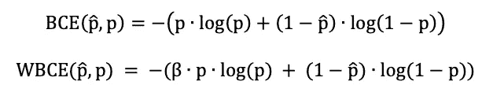
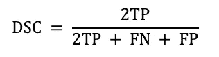
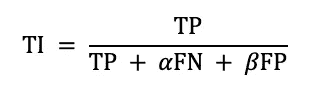
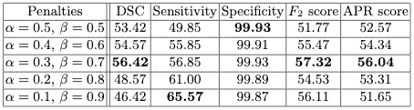
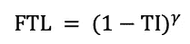
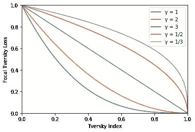
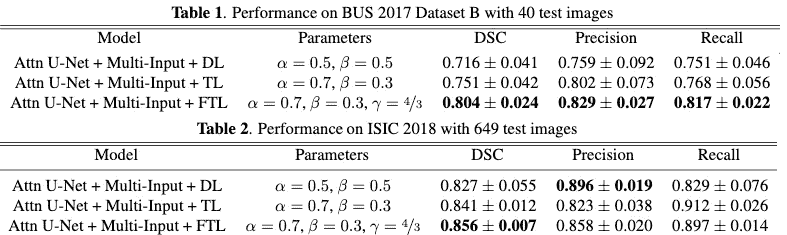

# 利用聚焦 Tversky 损失处理类别不平衡图像数据集

> 原文：<https://towardsdatascience.com/dealing-with-class-imbalanced-image-datasets-1cbd17de76b5?source=collection_archive---------4----------------------->

## 局灶性特沃斯基损失

## 课堂不平衡问题的损失比较以及为什么聚焦特沃斯基损失可能是你的最佳选择

当试图训练分割网络时，类不平衡数据集是经常遇到的问题。我第一次训练图像分割模型时，马上就获得了超过 96%的准确率。要么是我在不知不觉中取得了自第一个 CNN 成立以来最大的突破，要么是我的方法有问题。

我很快意识到，要分割的像素只占图像总像素的很小一部分。该模型所要做的就是预测一个全黑的图像(也就是没有分割)，并且获得了超过 90%的准确率。这是在大多数图像分割任务中遇到的常见问题，其中背景类比其他类大得多。

在这个故事中，我讲述了用来处理班级失衡问题的技巧，以及为什么集中精力学习可能是你最好的选择。

# 概述

1.  处理阶级不平衡的损失
2.  什么是特沃斯基指数？
3.  局灶性特沃斯基损失
4.  结论

# 1.处理阶级不平衡的损失

**a .加权二元交叉熵**

通常用于处理类别不平衡的损失之一是加权二元交叉熵。正常的二值交叉熵的关键在于，它在计算损失时平等地考虑所有像素。在 90%的像素为 0 而只有 10%的像素为 1 的掩码中，即使网络错过了所有的 1，它也会收到较低的损失，这意味着网络没有学到任何东西。

加权二进制交叉熵(WBCE)试图通过**加权正类**来解决这个问题。



p(0 类)= p̂，p(1 类)= p

对于网络预测的每个 1 级，BCE 将 ***log(p)*** 加到损失上，而 WBCE 将*𝜷****log(p)***加到损失上。

因此，如果β > 1，类别 1 的权重较高，这意味着网络不太可能忽略它(较少的假阴性)。反之，如果β < 1, class 0 is weighted higher, meaning there will be lesser false positives.

By controlling, the value of β, you can reduce the problem of class imbalance by weighting the smaller class higher. However, the optimal value of β is hard to ascertain and requires many rounds of trial and error.

Pros: Simple smooth loss surface that is fast in training

Cons: Difficult to optimise and find the sweet spot

**b .骰子系数**

众所周知，Dice 系数是图像分割的首选评估指标，但它也可以用作损失函数。虽然没有像二元交叉熵等其他损失函数那样广泛使用，但 dice 系数在处理类别不平衡时确实很神奇。

与 BCE 不同，dice 系数只考虑分割类，不考虑背景类。像素被分类为真阳性(TP)、假阴性(FN)和假阳性(FP)。



dice 系数是预测遮罩和地面实况的重叠的**度量。因为它不考虑背景类，所以它不能支配较小的分割类。dice 系数输出[0，1]范围内的分数，其中 1 表示完全重叠。因此，(1-DSC)可以用作损失函数。**

考虑到 dice 系数的最大化是网络的目标，直接使用它作为损失函数可以产生良好的结果，因为它在设计上对类不平衡数据工作良好。

然而，dice 系数的一个缺陷是存在爆炸梯度的可能性。在训练的早期，dice 系数接近于 0，这可能导致训练中的不稳定性，因为网络对权重进行大的改变会导致梯度爆炸。然而，使用批量规格化和 ReLUs，这很容易管理。

优点:无需手动优化任何参数，轻松解决等级不平衡问题

缺点:潜在的梯度爆炸，通常比 BCE 训练慢

# 2.什么是特沃斯基指数？

Tversky 指数(TI)是一种不对称的相似性度量，是 dice 系数和 Jaccard 指数的推广。



(1 — T1)可以用作损失函数

特沃斯基指数增加了两个参数，α和𝜷，其中α + 𝜷 = 1。在α = 𝜷 = 0.5 的情况下，它简化为 dice 系数。如果α = 𝜷 = 1，则简化为雅克卡指数。

通过设置α > 𝜷的值，可以更多地惩罚假阴性。这在高度不平衡的数据集中变得有用，在这种情况下，对损失函数的额外控制级别比正常的 dice 系数产生更好的小规模分割。

虽然 tversky 指数只是对 dice 系数的一个简单改进，但它可以证明在需要更精细控制的边缘情况下是有用的。

在 Salehi 等人的论文[使用 3D 完全卷积深度网络进行图像分割的 Tversky 损失函数](https://arxiv.org/abs/1706.05721)中，tversky 损失用于获得多发性硬化病变分割的最理想性能，多发性硬化病变分割是典型的类别不平衡问题。



不同损失版本的绩效比较。注:α和𝜷分别控制 FPs 和 FNs 本文与上图相反。

# 3.局灶性特沃斯基损失

聚焦特沃斯基损失(FTL)是特沃斯基损失的概括。损耗的非线性特性使您可以控制在不同的 tversky 指数值下损耗的表现。



γ是控制损耗非线性的参数。当γ趋于正 **∞** 时，随着特沃斯基指数(TI)趋于 1，损耗的梯度趋于 **∞** 。当γ趋向于 0 时，损耗梯度趋向于 0，当 TI 趋向于 1 时。

本质上，γ < 1, the gradient of the loss is higher for examples where TI >的值为 0.5，迫使模型关注这样的例子。这种行为在训练接近尾声时可能是有用的，因为即使 TI 接近收敛，模型仍然有学习的动机。然而，与此同时，在训练的早期阶段，它会将较容易的例子置于较高的权重，这可能导致较差的学习。

在类不平衡的情况下，当γ > 1 时，FTL 变得有用。对于 TI < 0.5\. This forces the model to focus on harder examples, especially small scale segmentations which usually receive low TI scores.



A plot of the FTL with varying values of γ. In the case where γ = 1, it simplifies into a stanard tversky loss

In the image above, the blue line is the standard tversky loss. The purple line shows the higher gradient and higher loss when TI >为 0.5 的示例，这导致了较高的损耗梯度，而绿线显示了当 TI < 0.5.



([为 0.5 时较高的损耗。al，2018](https://arxiv.org/abs/1810.07842) )表格稍作修改，仅显示相关部分。γ的值在现实中是 3/4。本文用 1/γ代替γ。

上表摘自论文[，一种新的病灶 Tversky 损失函数，采用改进的注意力 U-Net 进行病灶分割](https://arxiv.org/abs/1810.07842)。

在公共汽车数据集中，FTL 在所有类别中都有显著改善。在国际标准行业分类数据集中，尽管总体 dice 系数最高，但该模型没有最高的精确度或召回率。

虽然用 FTL 训练的模型可能不具有最高的精确度或召回率，但重要的是要注意，当用 FTL 训练时，精确度和召回率之间的平衡是最好的，这表明解决类别不平衡的目标得到了满足。最终结果是最佳的整体 dice 系数。

# 4.结论

聚焦特沃斯基损失是解决阶级不平衡的一个简单方法。尽管最佳参数值需要一些反复试验才能确定，但您应该会看到以下结果:

```
α = 0.7, 𝜷 = 0.3, γ = 3/4
```

**Keras 实施**

要获得预先实施了注意力、递归和初始层的 U-Net 的完整实施，请检查[https://github.com/robinvvinod/unet/](https://github.com/robinvvinod/unet/)。