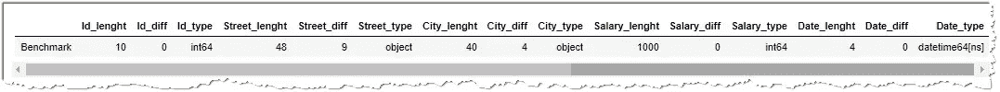
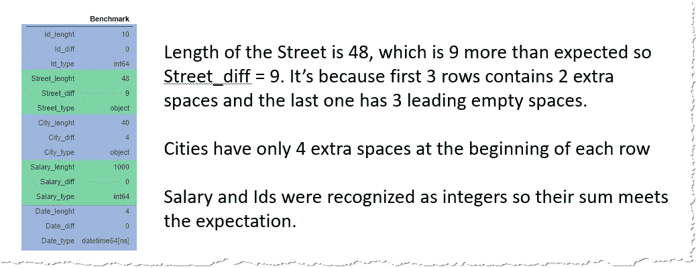
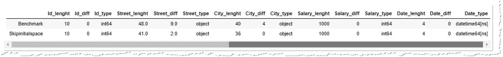
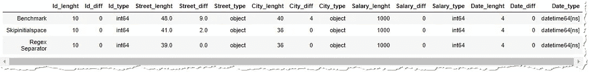
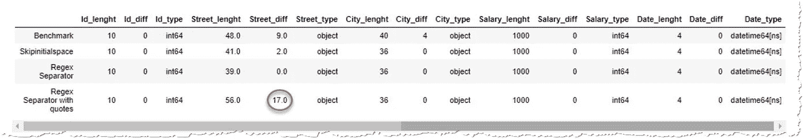
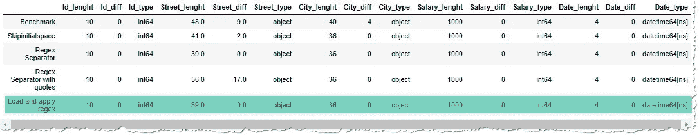
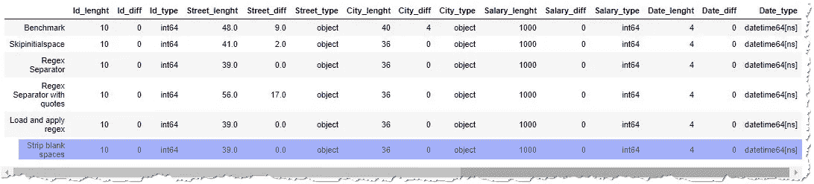
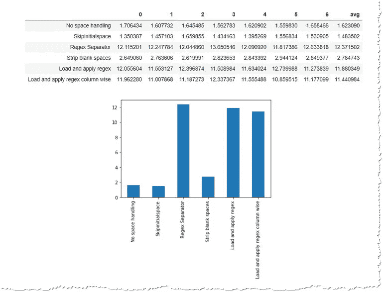

# 阅读熊猫 CSV 时处理多余的空格

> 原文：<https://towardsdatascience.com/dealing-with-extra-white-spaces-while-reading-csv-in-pandas-67b0c2b71e6a?source=collection_archive---------3----------------------->

## 为什么我们关心空白？内置熊猫功能，自定义处理。1M 测试数据的创建和性能测试。


由[凯利·西克玛](https://unsplash.com/@kellysikkema?utm_source=medium&utm_medium=referral)在 [Unsplash](https://unsplash.com?utm_source=medium&utm_medium=referral) 上拍摄的照片

我的同事说。csv 不是一篇论文，所以我们不希望逗号后面有任何空格(或任何其他分隔符)。同样的观点也适用于 rfc4180 的创建者，RFC 4180 通常被理解为 CSV 文件的指导方针。尽管如此，他们仍然是有创造力的开发者。csv 导出带有不必要的空格。这些额外的字符不仅增加了我们数据的大小，而且会带来更大的麻烦。

在本文中，我们将:

*   [回顾我们为什么关注 CSV 中的空格](#965d)
*   [使用 Pandas 的](#2362) `[read_csv()](#2362)` [方法](#2362)设置基准
*   [探索](#0f5a) `[skipinitialspace](#0f5a)` [参数](#0f5a)
*   [试试正则表达式分隔符](#ab04)
*   [由于报价问题，放弃正则表达式分隔符](#c451)
*   [对加载的数据帧应用正则表达式](#9281)
*   [测试](#990f) `[str.strip()](#990f)` [在所有字符串列上应用的列方式](#990f)
*   [解释为什么 NaN 很重要](#2a2d)
*   [使用](#b1dd) `[faker](#b1dd)`生成 100 万行测试数据
*   [测量每个算法在空白区域清理的速度和有效性](#f562)

像往常一样，你可以和我一起使用包含所有练习的 Jupiter 笔记本来遵循代码，这些练习可以从 [GitHub](https://github.com/vaasha/Data-Analysis_in-Examples/blob/master/White%20Spaces%20In%20CSVs/Dealing_with_white_space_in_csv_pandas.ipynb) 下载。

## 为什么空白是一个问题？

1.  比较失败

有和没有空格的字符串是不一样的。`"ABC" != " ABC"`这两个 ABC 并不相等，但差别很小，你往往不会注意到。如果没有引号括住字符串，您很难`ABC != ABC`。但是计算机程序在解释中是不会被腐蚀的，如果这些值是一个合并键，你将会得到一个空的结果。

2.NaN 值

空白字符串、空格和制表符在很多情况下被认为是熊猫中用 NaN 表示的空值。但是不确定数量的空格不会自动转换成 NaN 值，您可能会得到意想不到的结果，因为例如`count(NaN) = 0`而`count(" ")= 1`。

3.大小

尽管空白几乎看不见，但是在文件中堆积数百万个空白，它们会占用一些空间。其他时候，它们可能会溢出数据库列的大小限制，导致更好的情况下出现错误，并修整最后一个字符，该字符的位置被前面的空格偷走。

## 熊猫里的空格怎么处理？

让我们开始探索 Python 的 Pandas 库中处理 CSV 中空白的选项。作为基准，让我们简单地导入。使用`pd.read_csv()`功能的带空格的 csv。

为了描述如何处理空白，我们将使用一个 4 行数据集(为了测试每种方法的性能，我们将生成一百万条记录，并在本文末尾尝试处理它)。我们的数据集包含这些列:

*   **Id** 标识每行
*   **街道**有起始和结尾空白
*   **有前导空格的城市**
*   **工资**是数字
*   **日期**有日期格式

```
data = """Id,Street,City,Salary,Date
1, 5th Ave. , Indiana, 100, 2020-07-01
2, Downing Street , San Francisco, 200, 2020-07-02
3,  , New York, 300, 2020-07-03
4,   1600 Amphitheatre, New York, 400, 2020-07-04
"""
```

您可以看到数据包含不必要的空白，我们的目标是尽可能有效地删除它们。

这样我们就不必将这些数据存储到一个. csv 文件中，我们稍后会读取该文件，我们将使用`io.StringIO(data).`将它传递给 Pandas

```
df = pd.read_csv(io.StringIO(data))
```

为了衡量我们有多成功，我将创建一个函数`df_statistics()`(见下文)，它遍历所有列并计算:

*   字符串列:每行中数据的总长度
*   数字列:所有值的总和
*   其他列:行数

可选地，如果提供了一个带有`expected`长度的字典，它会将测量的长度或总和与我在数据帧中显示为一行的期望值进行比较。我们的基准实现了:



比较实际长度和预期长度的最终熊猫数据帧



为了更好的可读性，让我们调换一下数据帧

```
def df_statistics(df, expected=None):
    """Calculates the length of all items in the column and determine column types
       length of string
       sum of numbers"""

    res = {}
    for col in df.columns:
        if pd.api.types.is_string_dtype(df[col]): 
            # calculate the length of each row and sum it
            # careful, you cannot .apply(len) to columns which contain NAN, because NAN are float. - see [https://stackoverflow.com/questions/51460881/pandas-typeerror-object-of-type-float-has-no-len](https://stackoverflow.com/questions/51460881/pandas-typeerror-object-of-type-float-has-no-len)
            l = df[col].str.len().sum()
        else:
            try:# if it doesn't work, it's probably numeric value, so let's only sum
                l = df[col].sum()
            except:
                l = df[col].count()

        # assigne lenght to the "column_name_lenght" column
        res[str(col) + "_lenght"] = l

        # if a dict with expected values was provided, let's use it to compare with real values
        if expected:
            res[str(col) + "_diff"] = l-expected[col]

        # review the type of the colunmn   
        res[str(col) + "_type"] = df[col].dtype
    return res
```

## 使用 skipinitialspace

因为`.read_csv()`是用 C 写的，为了提高效率，使用这个方法的参数是处理空白的最佳选择。为此，有一个`skipinitialspace`，它删除了分隔符后面的所有空格。



使用 skipinitialspace 的结果近乎完美

因为 City 列只包含前导空格，所以它们都被删除了。Steet 列的最后一行也是固定的，只包含两个空格的那一行变成了 NaN，因为两个空格被删除了，pandas 本身将空格表示为 NaN(除非另有说明，见下文)。)

但是如何处理行尾的空格，即最后一个字符或数据和分隔符之间的空格。熊猫没有任何`skiptrailingspaces`参数，所以我们必须使用不同的方法。

## 正则表达式分隔符

你知道在熊猫中可以使用正则表达式分隔符吗？ [read_csv 文档](https://pandas.pydata.org/pandas-docs/stable/reference/api/pandas.read_csv.html)说:

> 此外，长度超过 1 个字符且不同于`'\s+'`的分隔符将被解释为正则表达式，并将强制使用 Python 解析引擎。注意，正则表达式分隔符容易忽略引用的数据。Regex 示例:`'\r\t'`。

在我们的例子中，我们可以尝试分隔符`sep="\s*[,]\s*"`。`\s*`表示任意数量的空格，`[,]`表示逗号。在 Jupiter notebook 中，还必须指定`engine="pyhton"`，因为 regex 分隔符是通过 python 脚本处理的，而不是原生的基于 c 的代码。让我们来看看结果:



我们不需要的所有空格都被删除，所有列都有预期的数据类型

结果似乎很完美。所有不需要的空格都被删除(all _diff 列等于 0)，并且所有列都具有预期的数据类型和长度。但闪光的不都是金子。

## 带引号的正则表达式分隔符

手册中有一个重要的注释:`regex delimiters are prone to ignoring quoted data.`

我们的数据没有被引用。但如果是的话，假设这条街会被引用:

```
data = """Id,Street,City,Salary,Date
1,**"** 5th Ave. ", Indiana, 100, 2020-07-01
2,**"** Downing Street **"**, San Francisco, 200, 2020-07-02
3,**"**  **"**, New York, 300, 2020-07-03
4,**"**   1600 Amphitheatre**"**, New York, 400, 2020-07-04
"""
```

那么正则表达式分隔符不仅会遗漏引号内的空格，而且还会将引号视为数据的一部分，额外空格的数量甚至会增加:



正则表达式分隔符与带引号的数据进行斗争，这不仅导致数据集中保留空格，而且引号也被视为字符串的有效部分

如果引号是为了屏蔽字符串中的分隔符(在我们的例子中是街道名称中的逗号),使其不被视为分隔符，则会出现更糟糕的情况。`" Downing Street, London "`受引号保护的是一个包含逗号的有效字符串，但如果我们使用 regex 分隔符，它会认为还有另一个分隔符而失败:

```
Expected 5 fields in line 3, saw 6\. Error could possibly be due to **quotes being ignored** when a **multi-char delimiter is used**.
```

所以正则表达式分隔符真的不是一个选项。

## 之后应用正则表达式

我们仍然可以使用正则表达式，但只是作为第二步。我们将 CSV 读数分为 3 个步骤:

*   阅读。csv，考虑带标准`read_csv()`的报价
*   替换空格
*   删除空格后，将“”转换为 NaN

为了方便地测量这种操作的性能，让我们使用一个函数:

```
def **read_csv_regex**(data, date_columns=[]):
    df = pd.read_csv(data, quotechar='"', parse_dates=date_columns)

    # remove front and ending blank spaces
    df = df.replace({"^\s*|\s*$":""}, regex=True) 

    # if there remained only empty string "", change to Nan
    df = df.replace({"":np.nan}) 
    return df
```



read_csv 处理引号，应用正则表达式将删除空格。

结果终于令人鼓舞。所有列都有预期的长度和类型。但是性能好吗？

## 剥掉绳子

Python 有一个本地方法来删除前面和结尾的空格— `.strip()`，我们可以很容易地在我们的数据上使用它。因为这是一个字符串操作，我们需要使用`str.strip()`，它只能应用于字符串列。因此，我们必须检查该列是否是字符串格式。

```
# use internal method api.types.is_string_dtype to find out if the columns is a string
if pd.api.types.**is_string_dtype**(df["column_name"]):
   df["column_name"] = df["column_name"].str.strip()
```

同样，我们将操作包装到一个函数中，以便稍后在性能测试中使用它。像以前一样，我们将把所有空字符串转换成 NaN。

```
def **read_csv_strip**(data, date_columns=[]):
    df = pd.read_csv(data, quotechar='"', parse_dates=date_columns)

    # for each column
    for col in df.columns:
        # check if the columns contains string data
        if pd.api.types.**is_string_dtype**(df[col]):
            df[col] = df[col]**.str.strip()**
    df = df.replace({"":np.nan}) # if there remained only empty string "", change to Nan
    return df
```



结果与使用正则表达式相同。

在字符串列上使用`str.strip()`会导致相同质量的结果。比较每种方法的速度会很有趣。

> 注意:不要使用`df[col].apply(len)`,而要使用`df[col].str.len()`,因为`apply(len)`在 NaN 值上失败，这些值在技术上是浮点而不是字符串。

## NaN 值

为什么我们要把所有的空弦都变成 NaNs？默认情况下，熊猫认为所有这些值都是 nan:

> '，' #不适用'，' #不适用'，' #不适用'，'-1。#IND '，'-1。#QNAN '，'-nan '，'-NaN '，' 1。#IND '，' 1。#QNAN '，''，' n/a '，' NA '，' null '，' NAN '，' N/A '，' NaN '，' NULL '

它有一个很好的理由，因为 NaN 值的行为不同于空字符串" "。

*   `count(NaN) = 0`而`count("")=1`
*   您可以对 NaN 值应用`fillna()`或`dropna()`方法

但是 pandas 只是将一个空字符串`""`转换成 NaN，而不是`" "`一个空格、两个空格、制表符或类似的空空格。这就是为什么我们必须在？csv 已加载到数据帧中。

# 特性试验

## 生成测试数据

每种建议的方法有多快？我们会认为内置方法是最快的，但是它们不符合我们的目的。让我们准备一些数据，以便了解操作的实际速度。

几行总是在一瞥之间被处理，所以我们需要大量的数据来测试性能，比如说一百万条记录。为此，我想试试 python 的`faker`库，它有一个快速的界面来创建随机的名字、地址和其他数据。

```
import faker
import random# initiate the faker with a seed
f = faker.Faker()
faker.Faker.seed(123)# generate million lines with extra white spaces
data = []
for i in range(1000000):
    data.append(["  " + f.address(),
                 " " + f.name() + " ",
                 " " + str(random.randint(1,1000000))])
```

我正在创建一个包含一百万行和三列的列表:

*   地址开头多留两个空格
*   以空格开头和结尾的名称
*   和用空格表示字符串的随机数

生成的数据帧具有以下参数

```
[In]: df = pd.DataFrame(data, columns=["Address","Name","Salary"])
      df.info()
[Out]:
      <class 'pandas.core.frame.DataFrame'>
      RangeIndex: 1000000 entries, 0 to 999999
      Data columns (total 3 columns):
      Address    1000000 non-null object
      Name       1000000 non-null object
      Salary     1000000 non-null object
      dtypes: object(3)
      memory usage: 22.9+ MB
```

因为 faker 生成的地址不仅包含逗号，还包含换行符，所以当我们将它们导出到 csv 时，它们将被用引号括起来。示例地址:

```
"  1068 Peterson Cape
South Jacquelineville, RI 78829"
```

`faker`提供了许多方法。如果您想要单行地址，例如使用`.street_address()`或`.street_address() + ", " + .city()`。你可以在这里研究 [faker 文档](https://faker.readthedocs.io/en/master/)。

## 100 万样本的性能

可以肯定的是，我们测量了合理的处理时间，并且没有受到 CPU 的一些峰值使用的影响，例如，当防病毒软件运行时，我们将对上述每种方法进行 7 次测试。

```
import timedef process_seven_times(function, params={}):
    processing_time = [] for i in range(7):
        start = time.time()
        df = function("test_data.csv", **params)
        processing_time.append(time.time() - start) return processing_time, df
```

您可以为每个场景发布这段代码，但是最好使用 python 将函数存储在变量中的能力，准备一个包含所有函数的字典，并对其进行迭代。

```
functions = {"No space handling": {"function": pd.read_csv, "params": {}},
            "Skipinitialspace": {"function": pd.read_csv, "params": {"skipinitialspace": True}},
            "Regex Separator": {"function": pd.read_csv, "params": {"sep":"\s*[,]\s*", "engine":"python"}},
             "Strip blank spaces": {"function": read_csv_strip, "params": {}},
             "Load and apply regex": {"function": read_csv_regex, "params": {}},
             "Load and apply regex column wise": {"function": read_csv_regex_col, "params": {}},         
            }
```

字典中的每个键都包括一个函数及其参数——skipinitialspace、separtor、engine 等。数据的路径总是相同的，所以我们不必作为参数重复多次。

我们还将存储处理时间，并使用`df_statistics(df)`计算统计数据

```
results = []
statistics = []for name, function in functions.items(): processing_time, df = process_seven_times(function, params=f["params"]) # create a Series with processing time and name it based on the    function used    
    s = pd.Series(processing_time)
    s.name = name
    results.append(s) statistics.append(pd.DataFrame(df_statistics(df), index=[name]))
```

几分钟后，当我们测试完所有功能后，我们可以显示结果:

```
stats_perf_df = pd.DataFrame(results)
stats_perf_df["avg"] = stats_perf_df.mean(axis=1)
stats_perf_df, stats_perf_df["avg"].plot(kind="bar")
```



每个函数运行 7 次，表明大型数据集上的正则表达式操作非常慢。

性能测试证实了我们的预期。内置方法胜过自定义算法。尽管它们没有达到我们想要的效果，但我们可以使用`str.strip()`从加载的数据帧中移除空白。大约是。比没有剥离的过程慢 50%，但仍然比使用正则表达式快 5 倍。

您可能已经注意到，使用`skipinitialspace`可以在没有任何空白处理的情况下完成加载，因此，如果速度是我们关注的问题，将这个参数与加载的数据帧的后处理结合起来可以带来更好的结果。您可以再次运行性能测试，以确认这不是一个异常。

# 结论

在数据集被额外的空格污染的情况下，空白处理非常重要，这不仅是为了减少数据的大小，而且主要是为了正确地将数据与其他源连接起来，并接收数据和 nan 聚合的预期结果。

Pandas 包含一些内置参数，有助于处理最常见的情况。任何进一步的处理都必须由自定义函数来完成，这会降低处理速度。出于这个原因，请始终尝试与您的数据提供商达成一致。符合标准的 csv 文件。

您可以使用 github 上的这个 [Jupyter 笔记本执行本文描述的所有代码。测试数据不包括在内，但您可以通过此笔记本生成它们。](https://github.com/vaasha/Data-Analysis_in-Examples/blob/master/White%20Spaces%20In%20CSVs/Dealing_with_white_space_in_csv_pandas.ipynb)

[](/exploratory-data-analysis-passport-numbers-in-pandas-4ccb567115b6) [## 探索性数据分析——熊猫的护照号码

### 探索前导和尾随零，字母和数字的分布，常见前缀，正则表达式…

towardsdatascience.com](/exploratory-data-analysis-passport-numbers-in-pandas-4ccb567115b6)