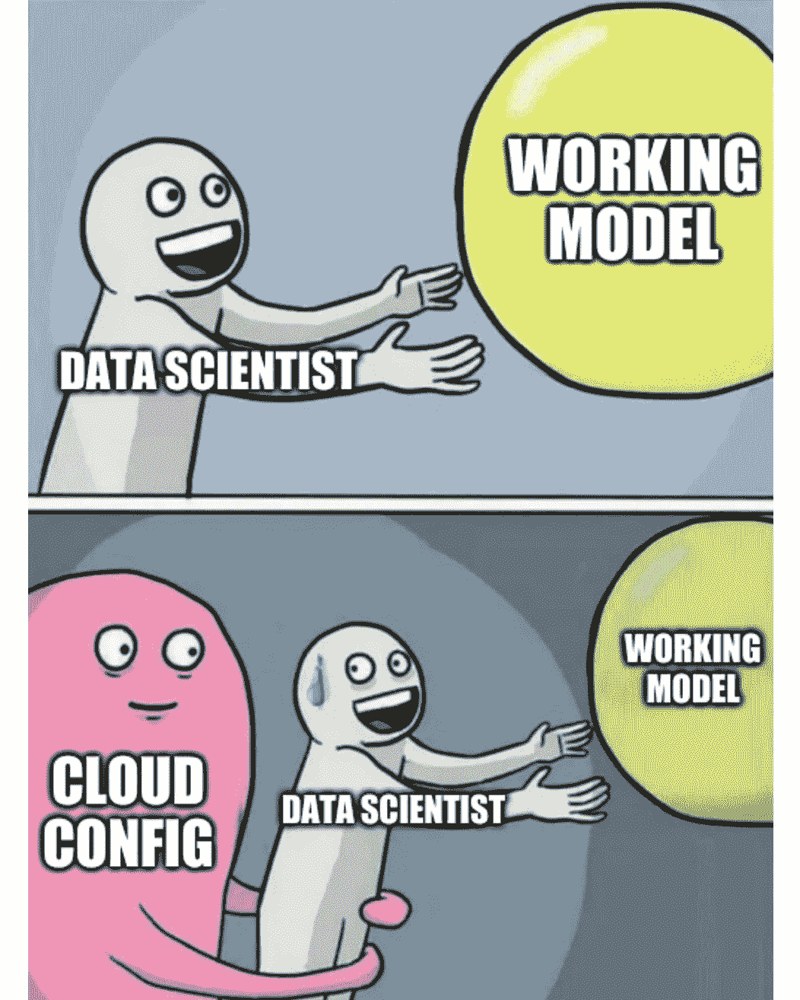
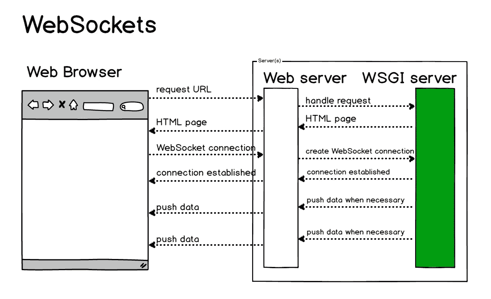
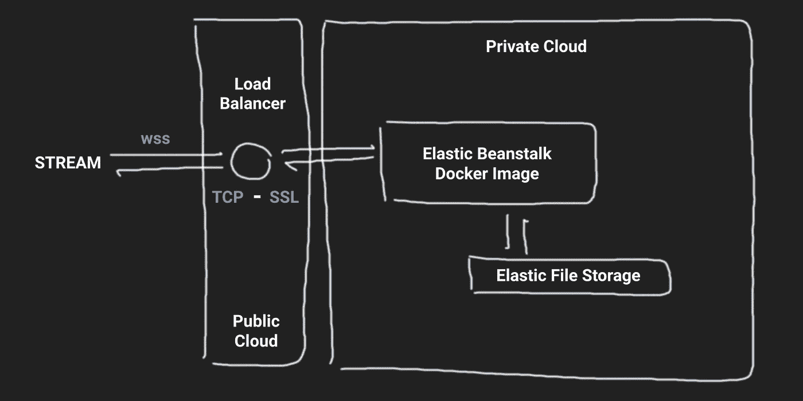
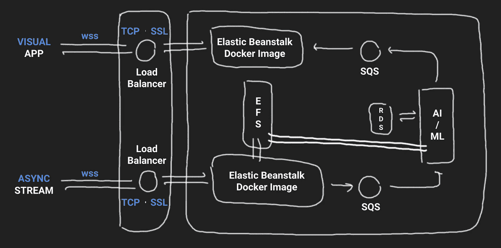
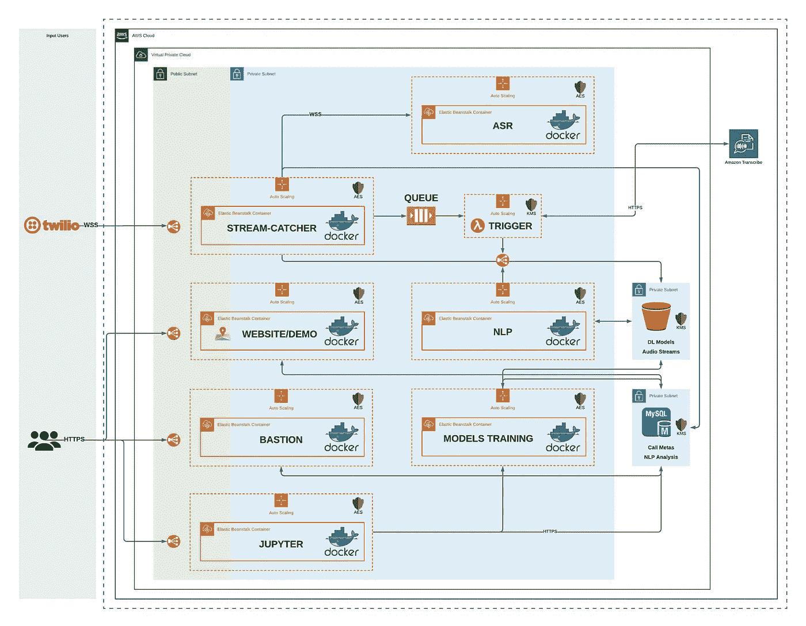

# 处理越来越不耐烦？在 AWS 上将您的实时 ML 服务推向生产！

> 原文：<https://towardsdatascience.com/dealing-with-growing-impatience-push-your-real-time-ml-services-to-production-on-aws-b5c948b05078?source=collection_archive---------34----------------------->

## 为您的 ML 应用程序构建正确的云基础设施通常被低估。这里可以看到，由于广泛普及的云资源调配，这变得多么容易。

最近，我看到研究小组、学生或同事想出一个取得巨大成就的模型的次数令人吃惊。(我不是在说通过 CT 扫描检测 COVID 的 50 张图像的 95%准确性……)人工智能革命已经将它的一桶新应用带到了现实世界，但都面临着同样的问题:产品-市场-适合(这是一个太大的主题，无法在这里涵盖)和具体化。幸运的是，由于硬件价格的下降和云计算可靠性的提高，超大规模和大计算已经迅速普及。在本文中，我将花一些时间来讨论一组特定的 ML 应用程序的后者:实时服务。

其中，最受欢迎的当然是实时异常或欺诈检测、即时定价、社交媒体平台、聊天机器人或花式流媒体。在牵强的一端，你们中的一些在协作平台上工作的人已经使用了一些，甚至没有注意到通过推荐或音频流去噪。决策正在快速发展，急躁是最新一代人的最大特点之一，这迫使当前设计的应用程序必须巧妙应对实时交互和解释的需求。

[机器学习应用:不同行业过去和现在的研究趋势](https://www.mdpi.com/2411-5134/4/1/8)

Alriiiiiight，太多让人兴奋的理由了！我将尽我所能帮助您弄清楚构建这样的服务并使您的用户能够使用它们需要做些什么。

# 流式要求 101

在架构方面，流确实意味着你需要为两个利益相关者之间的持续信息流打开大门。该流将源自一个用户，并且必须保持活动，直到该用户或他的对应方关闭该流。在协议方面，这涉及到 WebSockets 的创建。从概念上讲，它们主要是一个允许信息同时从 A 传到 B，从 B 传到 A 的系统。这就是我们所说的全双工连接。

演职员表:[fullstackpython.com/websockets.html](https://www.fullstackpython.com/websockets.html)

幸运的是，有多种方法可以将 WebSockets 服务包含到您的产品中。我给你一个沙盒模板，让你在我的 [Github](https://github.com/Coricos/Challenger/tree/master/templates/beanstalk-streaming) 上玩。在那个例子中，我使用**砂箱**作为基础，**砂箱插座**作为工人， **gunicorn** 作为主管。flask-sockets 附带了一个非常方便的包装，可以快速制作原型并对产品进行足够的控制。

烧瓶插座用法的沙盒示例

出乎意料的是，我总是发现测试一个依赖于 WebSockets 的端点比实际实现它更难。在这些可能性中，有一种是由 [**Ngrok**](https://ngrok.com/) 提供的，这种服务允许你通过安全的隧道管理将你的本地机器转换成具有公共地址的适当端点。然而，Ngrok 的免费版本有一些限制(一次 1 个服务，上限为每分钟 40 个连接)。在某些情况下，它非常方便，但在其他情况下就不那么方便了。我建议你随时尝试一下！:)

同时，只需使用下面的代码片段运行启用了 WebSocket workers 的 Flask 服务器:

运行本地接受 WebSockets 的实例的代码段

下面的代码片段通过这些工人将文件传输到您的应用程序:

流媒体应用的测试功能示例

前面的示例使您能够发送来自音频文件的流。很明显，您可以调整前面的代码片段来发送您的麦克风、视频帧、消息等输入……可能性是无限的！

# **AWS 上生产实例的技巧和提示**

保留前面的步骤已经很不错了，因为它让你能够展示你从一开始就在起草的申请。最有趣的部分是把管道放到云上，让其他人也能使用。以下是要遵循的步骤，所有代码都可以在 [Github](https://github.com/Coricos/Challenger/tree/master/templates/beanstalk-streaming) 上找到:

*   *以正确的方式建立你的 Docker 形象:*

流式应用程序的 Dockerfile

这可能是您可以在本地运行的最后一个测试。在这一点上，浏览 **Docker** 是关于云基础设施的良好实践。容器化使您能够为自己保留一些**云不可知论**，同时控制您的版本。为了最大化这种不可知论，我的方法通常是使用 AWS 的 **Elastic Beanstalk** 实例，它可以非常无缝地运行我的 Docker 映像，并支持足够的配置。

*   *基础架构草案:*

安全性是一个大问题，但我不会在本文中详细讨论虚拟私有云和静态加密。我将从一个简单的概念证明开始，您可以在自己的云上运行和扩展。共享的代码片段将使您能够构建一个安全的 WebSocket 连接，通过**经典负载平衡器**捕获流，并通过 **SSL** 将该信息传输到您的应用程序。这里的这个应用程序仅仅是一个将接收到的数据存储在一个**弹性文件存储器**(仅仅是一个挂载的虚拟硬盘驱动器)上的应用程序，您可以在不同的实例之间共享它以供进一步处理。

*   *举个有用的例子:*

# 最后一步:实例配置！

这就是奇迹发生的地方。由于我必须浏览大量的论坛和文档，这当然是你会发现最有价值的地方！:)

*   使您的听众能够听到入站流:

。ebextensions/listeners.config

*   使您的实例能够在 WebSockets 端口上反向代理:

。ebextensions/websockets.config

对于配置的其余部分，一切都在`.ebextensions`目录中可用。在其他任务中，这些文件将启用 **HTTPS** ，在您的请求中启用**头**的使用，并且**将您的弹性文件存储虚拟硬盘**挂载到您的实例中。`.Dockerrun.aws.json`文件将与安装 EFS 端点的实例进行通信。

# 有多有用？让我向你介绍卡拉斯特！

阿拉斯特是一个设计用于紧急呼叫中心收集、分析和优先排序信息的平台。更好的信息可以帮助急救人员以更有效的方式应对紧急情况。通过从呼叫分析到可视化的一系列服务，CalAster 允许急救人员更好地了解紧急情况并做好心理准备。此外，CalAster 的优先排序工具可以有效地对来电进行分类。在自然灾害期间，当资源短缺，紧急呼叫中心不堪重负时，这一点尤其有用。以下是该架构过去的一瞥，让我们进入了 2019 年 **代码的 [**决赛。**](https://funginstitute.berkeley.edu/news/meng-alumni-address-disaster-response-through-project-aster/)**

# **为了冒险者…**

你们中的一些人可能已经在抱怨了，因为实时 ML 的真正界限通常是推理时间。当你在大型模型上工作时，即使是在 GPU 上，也很难让它运行得和你的入站流一样快。目前思考这个问题的方式仍在前进:策略中有模型**量化**和模型**修剪**。我将让您探索这两个 Github 库，它们仍在积极开发中！

> [Condensa](https://github.com/NVlabs/condensa) 是 Python 中*可编程模型压缩*的框架。它附带了一组内置的压缩运算符，可用于针对 DNN 体系结构、硬件平台和优化目标的特定组合构建复杂的压缩方案。为了恢复压缩过程中的任何精度损失，Condensa 使用模型压缩的约束优化公式，并采用基于增强拉格朗日的算法作为优化器。
> 
> 激流是一个函数、脚本和工具的集合，它使得超低位宽的神经网络能够被容易地高速训练和部署。激流建立在 Tensorflow 之上，用于训练，TVM 用于部署。激流模型使用一种称为*融合胶*的新型算子来取代二进制神经网络内部的所有浮点运算。通过将融合的粘合层与其他优化(如 *Bitpack Fusion* )相结合，Riptide 能够生成比 Raspberry Pi 上的浮点对等物运行速度快 4-12 倍的模型。

# 拜托，要有创意！

有那么多的问题需要解决，而解决这些问题的人却那么少。如果你有了一个想法，要知道有大量的信息可供你建立你的想法，并把它从一个概念变成一个有影响力的实际产品！

有兴趣保持联系吗？:D[Twitter](https://twitter.com/DindinMeryll)|[LinkedIn](https://www.linkedin.com/in/dindin-meryll/)|[Github](https://github.com/Coricos)|[Medium](https://medium.com/@merylldin)