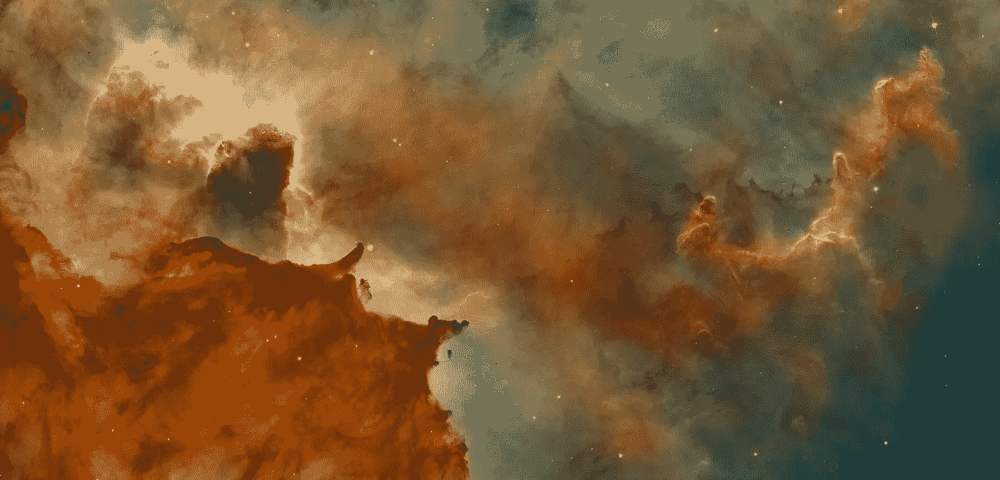
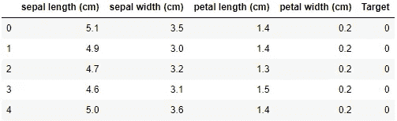
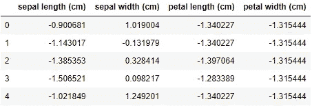
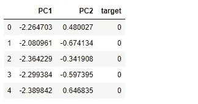
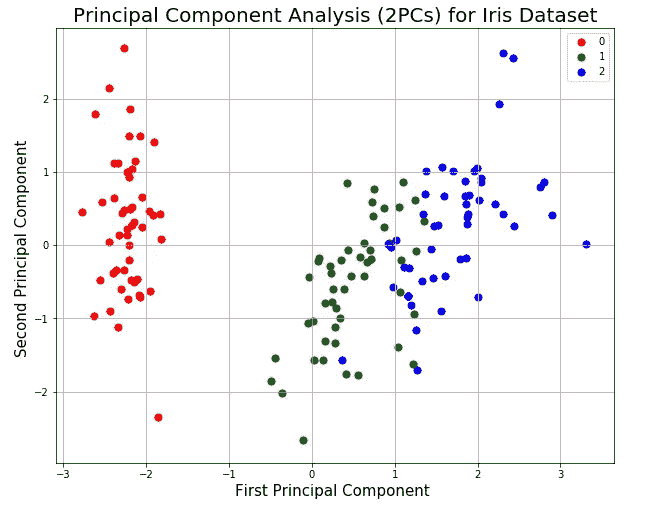

# 使用主成分分析(PCA)处理高维数据

> 原文：<https://towardsdatascience.com/dealing-with-highly-dimensional-data-using-principal-component-analysis-pca-fea1ca817fe6?source=collection_archive---------9----------------------->

## PCA 入门指南以及如何用 sklearn 实现(带代码！)


纳比尔·侯赛因在 [Unsplash](https://unsplash.com/s/photos/3d?utm_source=unsplash&utm_medium=referral&utm_content=creditCopyText) 上的照片

数据科学家在创建算法时的一个常见问题是变量太多。很自然，你会认为添加更多的信息只会让你的模型更好，但是你添加的每一个特性都会带来另一个维度。作为人类，我们只能想象二维或三维的事物。对于数据，此规则不适用！数据可以有无限多的维度，但这就是维度诅咒发挥作用的地方。

***维数灾难*** 是数据科学家经常面临的悖论。为了提高机器学习模型的准确性，您希望使用更多的信息，但是添加的功能越多，维数(n)就会增加。随着特征空间的维数增加，配置的数量呈指数增加，并且反过来，观察覆盖的配置的数量减少。

作为数据科学家，我们的最终目标是创建能够快速运行且易于解释的简单模型。当我们有大量的特征时，我们的模型变得更加复杂，可解释性降低。为了处理这些复杂的数据集，主成分分析是降低数据维数的理想方法。

## **什么是主成分分析，用来做什么？**

***主成分分析*** ，或者更俗称 ***PCA*** ，是一种在保持大部分重要信息的同时减少变量数量的方法。它将多个可能相关的变量转化为数量较少的不相关变量，称为 ***主成分*** 。主成分是原始变量的线性组合，这些变量在特定的正交维度上由它们的方差(或特征值)加权。PCA 的主要目的是将模型特征简化为更少的组件，以帮助可视化数据中的模式，并帮助模型更快地运行。使用 PCA 还可以通过消除高度相关的特征来减少过度拟合模型的机会。

需要注意的是，你应该只对 ***连续*** 变量应用 PCA，而不是分类变量。虽然从技术上讲，您可以对一位热编码或二进制数据使用 PCA，但它的效果不是很好。这是因为 PCA 被设计为最小化方差(方差),这在对二元变量执行时没有太大意义。如果您有混合数据，替代方法如[***MCA***](https://www.researchgate.net/profile/Dominique_Valentin/publication/239542271_Multiple_Correspondence_Analysis/links/54a979900cf256bf8bb95c95.pdf)*可能会更好。*

## ***那么，您如何知道您的 PCA 中保留了多少信息呢？***

*我们使用 ***解释方差比率*** 作为一种度量标准来评估您的主成分的有用性，并选择在您的模型中使用多少成分。解释的差异比率是由每个所选组件引起的差异的百分比。理想情况下，您可以通过添加每个组件的解释方差比率来选择要包括在您的模型中的组件数量，直到您达到大约 0.8 或 80%的总数，以避免过度拟合。*

*幸运的是，sklearn 通过他们的 ***很容易得到解释的方差比。解释 _ 方差 _ 比率 _*** 参数！我们将在编码示例中使用它。*

**

*美国宇航局在 [Unsplash](https://unsplash.com/s/photos/galaxy?utm_source=unsplash&utm_medium=referral&utm_content=creditCopyText) 上拍摄的照片*

# *使用 Sklearn 的 PCA 示例*

1.  *首先，让我们为我们的长代码示例加载 iris 数据集。iris 数据集是一个著名的数据集，包含来自三个不同物种的 150 朵 iris 花的测量数据。*

```
*from sklearn import datasets
import pandas as pd

iris = datasets.load_iris()
df = pd.DataFrame(iris.data, columns=iris.feature_names)
df['Target'] = iris.get('target')
df.head()*
```

**

*2.接下来，我们将把“features”列表中的所有列分隔成变量“X ”,把“target”变量分隔成变量“y”。*

```
*# Create features and target datasets
features = ['sepal length (cm)', 'sepal width (cm)', 'petal length (cm)', 'petal width (cm)']
X = df[features].values
y = df['Target'].values*
```

*3.在实现 PCA 之前，我们必须将数据标准化。这是**绝对必要的**，因为 PCA 使用我们数据的标准偏差计算我们数据在新轴上的新投影。PCA 给予方差较高的变量比方差较低的变量更大的权重，因此在相同的尺度上归一化数据以获得合理的协方差是很重要的。*

```
*from sklearn.preprocessing import StandardScaler

# Standardize the features
X = StandardScaler().fit_transform(X)

# Preview X
pd.DataFrame(data=X, columns=features).head()*
```

**

*4.现在，我们将使用 sklearn 导入 PCA，并将我们的原始数据(4 维)投影到 2 维。在这一部分中，sklearn 创建了一个协方差矩阵来计算特征向量(主分量)及其对应的特征值。 ***特征向量*** 确定新特征空间的方向，而 ***特征值*** 确定沿着新特征轴的数据的幅度或方差。*

```
*# Import PCA from sklearn
from sklearn.decomposition import PCA

# Instantiate PCA
pca = PCA(n_components=2)

# Fit PCA to features
principalComponents = pca.fit_transform(X)*
```

*5.为了更好地可视化主成分，让我们将它们与熊猫数据帧中与特定观察相关联的目标(花类型)配对。*

```
*# Create a new dataset from principal components 
df = pd.DataFrame(data = principalComponents, 
                  columns = ['PC1', 'PC2'])

target = pd.Series(iris['target'], name='target')

result_df = pd.concat([df, target], axis=1)
result_df.head(5)*
```

**

*6.现在，我们可以使用目标数据根据类别分布来可视化主成分。这段代码根据主要成分创建了一个散点图，同时根据每个示例被分类的花类型对示例进行了颜色编码。*

```
*# Visualize Principal Components with a scatter plot
fig = plt.figure(figsize = (12,10))
ax = fig.add_subplot(1,1,1) 
ax.set_xlabel('First Principal Component ', fontsize = 15)
ax.set_ylabel('Second Principal Component ', fontsize = 15)
ax.set_title('Principal Component Analysis (2PCs) for Iris Dataset', fontsize = 20)

targets = [0, 1, 2]
colors = ['r', 'g', 'b']
for target, color in zip(targets, colors):
    indicesToKeep = iris['target'] == target
    ax.scatter(result_df.loc[indicesToKeep, 'PC1'], 
               result_df.loc[indicesToKeep, 'PC2'], 
               c = color, 
               s = 50)
ax.legend(targets)
ax.grid()*
```

**

*7.我们可以看到，这三个类是截然不同的，也是完全可以分开的。我们可以得出结论，压缩的数据表示对于分类模型来说很可能是足够的。我们可以将整个数据集中的差异与使用。解释 _ 方差 _ 比率 _。*

```
*# Calculate the variance explained by priciple components
print('Variance of each component:', pca.explained_variance_ratio_)
print('\n Total Variance Explained:', round(sum(list(pca.explained_variance_ratio_))*100, 2)*
```

**

*我们可以看到，我们的前两个主成分解释了该数据集中的大部分方差(95.81%)！这是与原始数据相比所表示的总信息的指示。*

# *摘要*

*这篇文章的要点是:*

*   *PCA 是一种常用的**降维**技术。*
*   *PCA 的目标是将模型要素简化为更少的不相关要素，以帮助可视化数据中的模式，并帮助它更快地运行。*
*   *仅对**连续**数据应用 PCA。*
*   *在应用 PCA 之前，请确保您的数据已经过**规范化**！！*

*****

***感谢阅读！***

***如果你喜欢我的博文，可以关注我的媒体** [***这里***](https://medium.com/@isalindgren313) **支持我。也可以通过我的 LinkedIn** [***这里***](https://www.linkedin.com/in/isabellalindgren/) **与我联系。***

*****

***参考文献:***

1.  *[https://towards data science . com/a-一站式主成分分析-5582fb7e0a9c](/a-one-stop-shop-for-principal-component-analysis-5582fb7e0a9c)*
2.  *[https://deepai . org/machine-learning-glossary-and-terms/curse-of-dimensionality](https://deepai.org/machine-learning-glossary-and-terms/curse-of-dimensionality)*
3.  *[https://elitedata science . com/over fitting-in-machine-learning](https://elitedatascience.com/overfitting-in-machine-learning)*
4.  *[https://www . geeks forgeeks . org/principal-component-analysis-with-python/](https://www.geeksforgeeks.org/principal-component-analysis-with-python/)*
5.  *[https://sci kit-learn . org/stable/modules/generated/sk learn . decomposition . PCA . html](https://scikit-learn.org/stable/modules/generated/sklearn.decomposition.PCA.html)*
6.  *[https://www . research gate . net/profile/Dominique _ Valentin/publication/239542271 _ Multiple _ communication _ Analysis/links/54a 979900 cf 256 BF 8 bb 95 c 95 . pdf](https://www.researchgate.net/profile/Dominique_Valentin/publication/239542271_Multiple_Correspondence_Analysis/links/54a979900cf256bf8bb95c95.pdf)*
7.  *[https://www . vision dummy . com/2014/03/特征值-特征向量/](https://www.visiondummy.com/2014/03/eigenvalues-eigenvectors/)*
8.  *[https://sebastianraschka . com/Articles/2015 _ PCA _ in _ 3 _ steps . html](https://sebastianraschka.com/Articles/2015_pca_in_3_steps.html)*
9.  *[https://etav.github.io/python/scikit_pca.html](https://etav.github.io/python/scikit_pca.html)*
10.  *熨斗数据科学课程第 37 节*