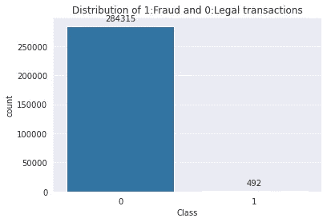
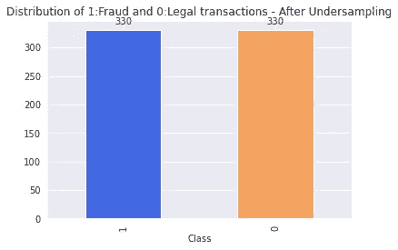

# 处理不平衡数据集

> 原文：<https://towardsdatascience.com/dealing-with-imbalanced-dataset-642a5f6ee297?source=collection_archive---------12----------------------->

## 处理不平衡数据的技术


图片来自[菲德尔·费尔南多](https://unsplash.com/photos/qEG6w8vqsaU)，来自 Unsplash

现实问题中的不平衡数据集并不罕见。通俗地说，不平衡数据集就是类分布不均衡的数据集。不平衡的数据会在分类任务中产生问题。在深入研究不平衡数据的处理之前，我们应该知道不平衡数据集可能产生的问题。

我们将以一个信用卡欺诈检测问题为例，来理解不平衡的数据集以及如何以更好的方式处理它。

**示例—信用卡欺诈检测**


图片由[负空间](https://www.pexels.com/photo/working-macbook-computer-keyboard-34577/)拍摄，来自 Pexels

信用卡欺诈检测的数据集取自 Kaggle。该数据集包含两天内发生的交易，其中

数据中的总交易数= 284，807

数据有两类: **0** 和 **1** 分别代表合法交易和欺诈交易。绘制等级分布图将使我们对不平衡(如果存在的话)有所了解。



作者图片

合法交易总数为 284807 笔中的 284315 笔，占 **99.83%。**欺诈交易在整个数据集中只有 492 笔( **0.17%** )。不平衡的数据集可能出现在其他场景中，如癌症检测，其中大量受试者为阴性，只有少数人患有癌症。

## 不平衡数据集可能造成的问题

如果我们使用准确性作为性能指标，这可能会产生一个巨大的问题。假设我们的模型预测每个交易都是合法的(哑模型)。在信用卡数据集上使用准确性度量将给出 99.83%的准确性，这是非常好的。**是好结果吗？否**

对于不平衡数据集，应使用其他性能指标，如精确召回 AUC 分数、F1 分数等..而且，模型会偏向多数阶级。由于大多数机器学习技术都被设计为能够很好地处理平衡的数据集，因此我们必须从不平衡的数据集创建平衡的数据。**怎么做？**

**注意:**在改变数据集之前，我们必须将数据集分为训练和测试，因为改变只是为了训练。

```
>>>from sklearn.model_selection import train_test_split
>>>X_train, X_test, y_train, y_test = train_test_split(X, y, test_size = 0.33, 
random_state = 2, shuffle = True, stratify = y)
```

训练数据集的形状:
**0: 190430 事务
1: 330 事务**

我们将在本文中讨论从不平衡数据创建平衡数据集的三种方法:

*   **欠采样**
*   **过采样**
*   **创建合成数据**

## 1.欠采样

欠采样对数据中的多数类点进行重采样，使其等于少数类点。我们将使用欠采样从原始数据集创建一个新的数据集。我们将对信用卡欺诈检测中的合法交易(数量为 190490)进行随机抽样，以使 0 类数据点等于 330(少数类)。

```
>>>from imblearn.under_sampling import RandomUnderSampler
>>>rus = RandomUnderSampler(random_state=0)
>>>X_resampled_under, y_resampled_under =rus.fit_resample(X_train, y_train)
```



作者图片

欠采样的主要缺点是我们没有使用大量的数据，其中包含一些信息**。在我们的示例中，我们删除了 190160(190490–330)个数据点。**因此，我们在丢失信息，结果，我们不会得到显著的结果。

我们可以通过使用一种称为过采样而不是欠采样的技术来避免这种情况。

## 2.过采样

过采样是指对少数类点进行重采样，使其等于多数点的总数。少数类点的重复是一种这样的过采样技术。

除了重复之外，我们可以向两个类提供类权重。给少数类提供大的权重将会给出与复读相同的结果。

## 3.创建合成数据

重复数据的问题是它不提供任何额外的信息。增加数据信息的一种方法是创建合成数据点。一种这样的技术是 **SMOTE(合成少数过采样技术)**。顾名思义，SMOTE 是一种过采样技术。通俗地说，SMOTE 会为小众阶层创建合成数据点。它在少数阶级之间创造了新的实例。

我们可以使用 **imblearn** 库对训练数据集应用 SMOTE。

```
>>>from imblearn.over_sampling import SMOTE
>>>sm = SMOTE(random_state = 42)
>>>X_train_new, y_train_new = sm.fit_sample(X_train, y_train)
```


作者图片

# 结论

在处理现实世界的场景时，不平衡的数据集非常常见。如果机器学习模型出于训练目的而使用不平衡的数据集，则该模型是不健壮的。因此，平衡数据集是训练机器学习模型的首选。欠采样、过采样和 SMOTE 等技术可用于创建平衡数据。

感谢阅读！