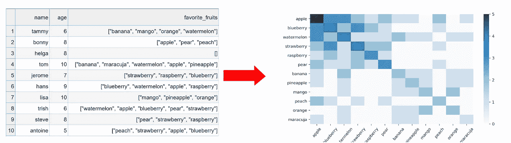
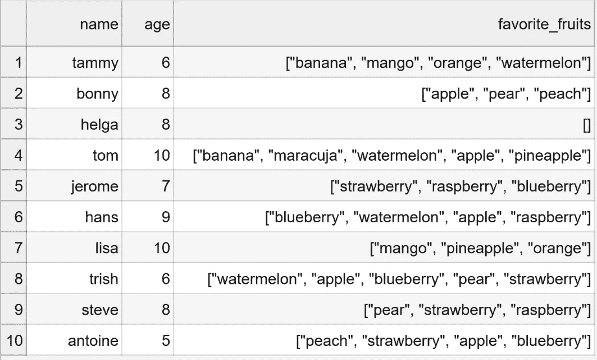
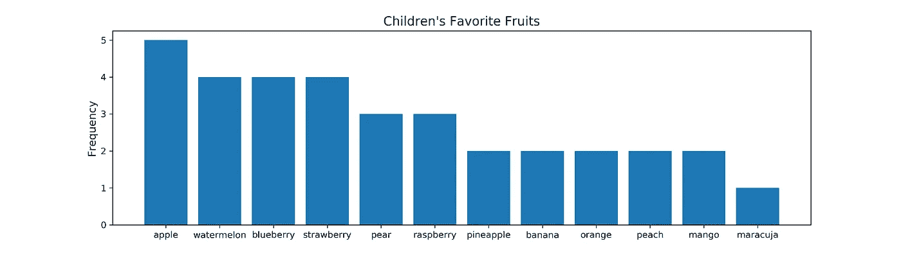
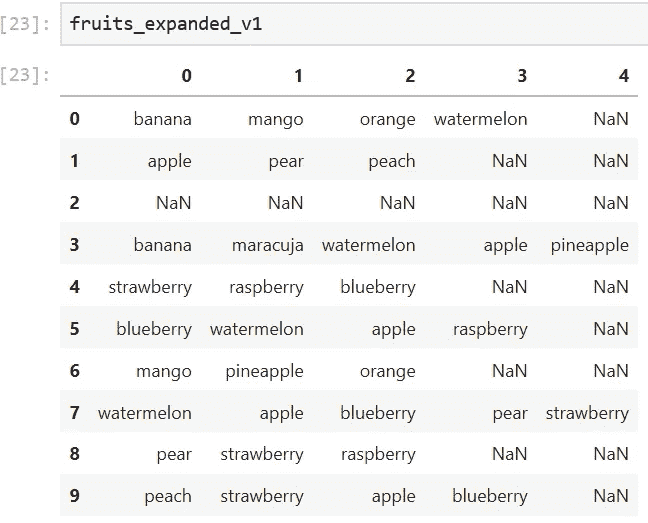
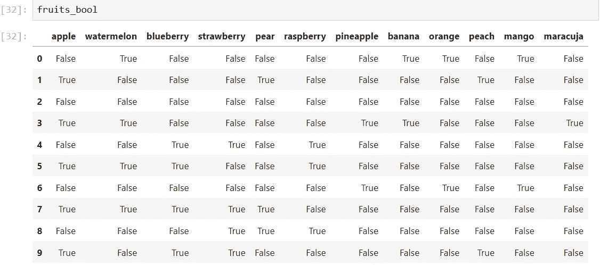
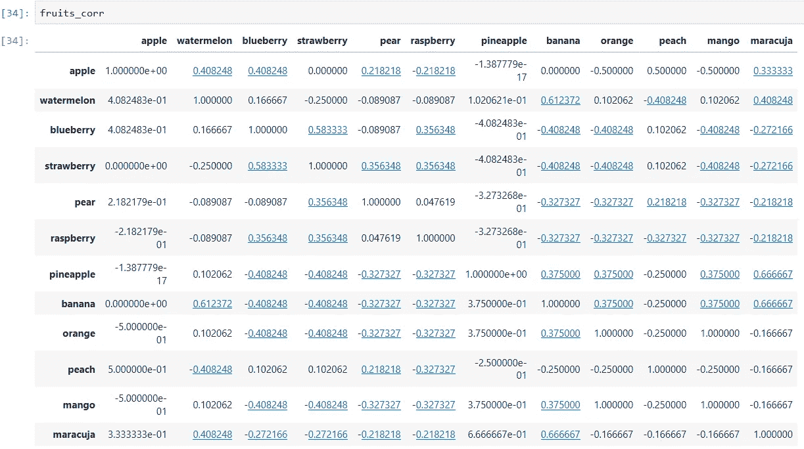
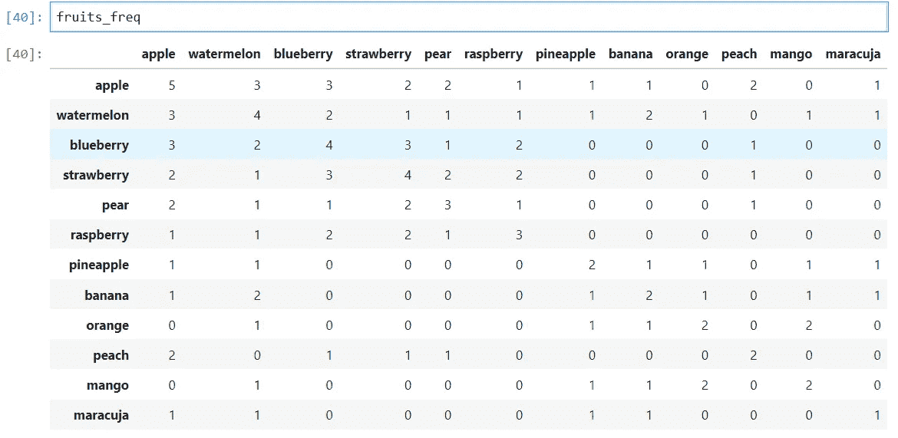
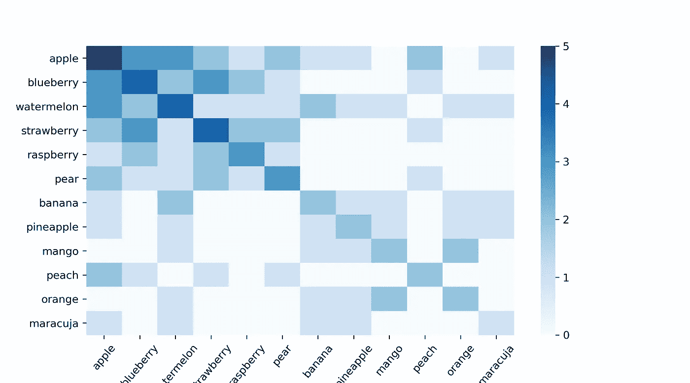

# 处理熊猫数据框架中的列表值

> 原文：<https://towardsdatascience.com/dealing-with-list-values-in-pandas-dataframes-a177e534f173?source=collection_archive---------0----------------------->

## 这里有一些避免过多循环并获得良好结果的技巧



图 1 —标题图像。

您曾经处理过需要您处理列表值的数据集吗？如果是这样，你就会明白这有多痛苦。如果你还没有，你最好做好准备。

如果你仔细看，你会发现列表无处不在！这里有一些实际问题，你可能会遇到列表值。

*   音频或视频标签
*   调查数据中的开放式问题
*   所有作者、艺术家、制作人等的名单。参与创新产品


图 2 —滑稽猫视频的标签列表。

我最近参与了多个需要我分析这类数据的项目。经过几个小时的痛苦思考，我意识到必须在这里分享我的知识来节省你的时间。

我将向你展示你可能会遇到的各种问题，并为他们提供切实可行的解决方案。

# 快速准备

要学习本教程，请随意下载用于所有示例的虚构数据集。包括代码在内的所有资料均可在[本报告](https://github.com/MaxHilsdorf/dealing_with_lists_in_pandas)中找到。

此外，请导入所有必要的库并加载数据框架。

```
import pandas as pd
import numpy as np
import matplotlib as plt
fruits = pd.read_csv("fruits.csv", delimiter = ";")
```



图 3 —数据集示例

# 列表值到底有什么问题？

请允许我直入主题:列表值打乱了你所知道的关于数据分析的一切。没有无休止的循环，最简单的操作也无法执行。让我给你看一个简单的例子:

对于示例数据集中的“年龄”列，我们可以很容易地使用 *value_counts()* 函数来计算该年龄被观察了多少次。

```
fruits["age"].value_counts()
```

```
## OUTPUT ##
8     3
10    2
6     2
9     1
7     1
5     1
```

如果我们想知道哪些水果被命名的次数最多呢？原则上，我们在“favorite_fruits”列中有所有需要的数据。然而，如果我们应用同样的函数，结果并非毫无用处。

```
fruits["favorite_fruits"].value_counts()
```

```
## OUTPUT ##
["strawberry", "raspberry", "blueberry"]                      1
["mango", "pineapple", "orange"]                              1
["blueberry", "watermelon", "apple", "raspberry"]             1
["apple", "pear", "peach"]                                    1
["pear", "strawberry", "raspberry"]                           1
["banana", "maracuja", "watermelon", "apple", "pineapple"]    1
["peach", "strawberry", "apple", "blueberry"]                 1
[]                                                            1
["banana", "mango", "orange", "watermelon"]                   1
["watermelon", "apple", "blueberry", "pear", "strawberry"]    1
```

这不起作用的原因是熊猫不能直接访问列表中的每一个元素。因此，Pandas 无法正确应用 *value_counts()* 等函数。那么，我们该怎么办呢？我现在就给你看！

# 问题 1:我的列表存储为字符串

你会经常遇到的一个问题是，熊猫会把你的列表读成字符串，而不是列表。

```
for i, l in enumerate(fruits["favorite_fruits"]):
    print("list",i,"is",type(l))
```

这意味着您甚至不能遍历列表来计算唯一的值或频率。根据列表在数据帧中的格式，有一个简单或复杂的解决方案。在任何情况下，您都可以简单地使用我提供的代码。

## **你的琴弦是不是长这样:“['草莓'，'苹果'，'橘子']”？**

在这种情况下，有一个使用 *apply()* 和 *eval()* 函数的快捷方法。

```
fruits["favorite_fruits"] = fruits["favorite_fruits"].apply(eval)
```

## **你的琴弦是这样的吗:“【草莓、苹果、橘子】”？**

这一个更难，因为 *eval()* 函数将不起作用，因为 list 缺少内部引号以便被识别为 list 对象。快速而肮脏的解决方法是简单地给字符串加上引号，然后应用 *eval()* 。使用此功能:

```
def clean_alt_list(list_):
    list_ = list_.replace(', ', '","')
    list_ = list_.replace('[', '["')
    list_ = list_.replace(']', '"]')
    return list_
```

要将此应用于您的数据帧，请使用以下代码:

```
df[col] = df[col].apply(clean_alt_list)
```

请注意，在这两种情况下，Pandas 仍将为系列分配一个“O”数据类型，这通常用于字符串。但是不要让这个迷惑了你。您可以使用以下命令检查实际的数据类型:

```
for i, l in enumerate(fruits["favorite_fruits"]):
 print("list",i,"is",type(l))
```

```
## OUTPUT ##
list 0 is <class 'list'>
list 1 is <class 'list'>
list 2 is <class 'list'>
list 3 is <class 'list'>
list 4 is <class 'list'>
list 5 is <class 'list'>
list 6 is <class 'list'>
list 7 is <class 'list'>
list 8 is <class 'list'>
list 9 is <class 'list'>
```

# **问题 2:获取唯一值或值计数**

在这第一步之后，我们的名单最终被熊猫认可。但是，我们不能使用标准函数，因为它们不是为列表应用程序设计的。

至少我们现在可以对任何事情都使用循环。这种方法适用于小数据集，但对于大数据集可能会非常慢。例如，我必须分析大约 50 万首音乐曲目的多达 999 个标签的标签列表。这意味着，内部循环将有数以亿计的迭代，这将花费许多小时，并可能使我的计算机崩溃。一会儿我会告诉你一个更干净快捷的方法。但是，如果您真的想使用循环，下面是代码:

```
fruit_dict = {}
for i in fruits["favorite_fruits"]:
    for j in j:
        if j not in fruit_dict:
            fruit_dict[j] = 1
        else:
            fruit_dict[j] += 1
```

这是我花了一段时间才想出来的干净方法。如果我们将 favorite_fruits 列概念化为一个 2D 数组，那么将其维度从 2 减少到 1 将允许我们再次应用典型的 pandas 函数。为此，您可以使用此函数:

```
def to_1D(series):
 return pd.Series([x for _list in series for x in _list])
```

如果我们现在使用 *value_counts()* ，就会得到我们想要的结果。

```
to_1D(fruits["favorite_fruits"]).value_counts()
```

```
## OUTPUT ##
apple         5
blueberry     4
watermelon    4
strawberry    4
raspberry     3
pear          3
banana        2
pineapple     2
mango         2
peach         2
orange        2
maracuja      1
```

要获得唯一值，只需从链接*的结果中提取它们。index()* 跃然纸上。

在这一点上，我们可以产生我们的第一个有意义的可视化。

```
# Get unique items & counts
unique_values = to_1D(fruits["favorite_fruits"]).value_counts().index.tolist()
unique_value_counts = to_1D(fruits["favorite_fruits"]).value_counts().values

# Create plot
fig, ax = plt.subplots(figsize = (14,4))
ax.bar(unique_values, unique_value_counts)
ax.set_ylabel("Frequency", size = 12)
ax.set_title("Children's Favorite Fruits", size = 14)
```



图 4 —显示所有水果频率的条形图。

# 问题 3:所有唯一值的单独列

在这一点上，事情越来越先进。如果你对我们之前得到的结果满意，你可以到此为止。然而，你的研究目标可能需要更深层次的分析。也许您希望将所有列表元素相互关联起来，以计算相似性得分。例如，吃香蕉的孩子通常也喜欢芒果吗？或者你可能想知道哪种水果被大多数孩子列为最喜欢的水果。这些问题只有在更深层次的分析中才能得到解答。

为此，我将介绍两个有用的方法。它们在复杂性上有所不同，但在如何处理它们的结果上也有所不同。

## 方法 1

这是我偶然发现的一个非常简单快捷的方法。而且是这么有用！你所需要的只是一行代码。

```
fruits_expanded_v1 = fruits["favorite_fruits"].apply(pd.Series)
```



图 5 —使用方法 1 的水果列表的扩展版本。

如您所见，这个一行程序生成了一个数据帧，其中每个列表都被分割成单个元素。这些列表示水果在列表中的排列顺序。使用这种方法，您将始终获得一个形状为(n，len(longest_list))的数据帧。在这种情况下，10 个孩子中的 2 个说出了 5 种最喜欢的水果，这就产生了一个 10x5 的数据帧。

利用这个，我们可以找出哪种水果最常被命名为最受欢迎的水果。

```
fruits_expanded_v1.iloc[:,0].value_counts(normalize = True)
```

```
## OUTPUT ##
banana        0.222222 pear          0.111111 watermelon    0.111111 blueberry     0.111111 strawberry    0.111111 apple         0.111111 peach         0.111111 mango         0.111111
```

我们可以看到香蕉通常是孩子们最喜欢的水果。

或者，我们可以针对单个水果，找出它们在列表的每个位置被命名的次数。这是我为此写的函数:

```
def get_rankings(item, df):

    # Empty dict for results
    item_count_dict = {}

    # For every tag in df
    for i in range(df.shape[1]):

        # Calculate % of cases that tagged the item
        val_counts = df.iloc[:,i].value_counts(normalize = True)
        if item in val_counts.index:
            item_counts = val_counts[item]
        else:
            item_counts = 0

        # Add score to dict
        item_count_dict["tag_{}".format(i)] = item_counts

    return item_count_dict
```

如果我们应用它，我们得到:

```
get_rankings(item = "apple", df = fruits_expanded_v1)
```

```
## OUTPUT ##
{'tag_0': 0.1111111111111111,  'tag_1': 0.1111111111111111,  'tag_2': 0.2222222222222222,  'tag_3': 0.2,  'tag_4': 0}
```

如您所见，我们可以使用这种方法很好地执行基于等级的分析。然而，这种方法对其他方法几乎没有用处。因为列不代表单个标记，而是代表一个等级，所以大多数基于标记的操作都无法正常进行。例如，用我们从方法 1 中得到的数据框架计算香蕉和桃子之间的相关性是不可能的。如果这是你的研究目标，使用下一种方法。

## 方法 2

这种方法更复杂，需要更多的资源。我们的想法是创建一个数据帧，其中的行保持不变，但是每个水果都被分配了自己的列。如果只有 kid #2 命名为 bananas，那么 banana 列的第 2 行将有一个“真”值，而其他所有地方都有“假”值(参见图 6)。我写了一个函数来执行这个操作。它依赖于循环，这意味着它将花费大量时间处理大型数据集。然而，在我尝试过的所有方法中，这是最有效的方法。

```
def boolean_df(item_lists, unique_items):
# Create empty dict
    bool_dict = {}

    # Loop through all the tags
    for i, item in enumerate(unique_items):

        # Apply boolean mask
        bool_dict[item] = item_lists.apply(lambda x: item in x)

    # Return the results as a dataframe
    return pd.DataFrame(bool_dict)
```

如果我们现在应用这个函数

```
fruits_bool = boolean_df(
  item_lists = fruits["favorite_fruits"],
  unique_items = unique_values
)
```

我们得到了这个数据框架:



图 6 —布尔数据帧。

从这里，我们可以很容易地计算相关性。请注意，“相关性”并不是真正正确的术语，因为我们使用的不是公制或序数，而是二进制数据。要想正确，就用“联想”。我不会。

同样，有多种方法可以将这些水果联系起来。一个直接的方法是皮尔逊相关系数，它也可以用于二进制数据。熊猫有一个内置的功能。

```
fruits_corr = fruits_bool.corr(method = "pearson")
```



图 7——皮尔逊相关数据框架。

另一种方法是简单地计算一种水果和其他水果一起被命名的次数。这可以用矩阵乘法来解决。为此，我们需要将布尔数据帧转换为基于 first 的整数。

```
fruits_int = fruits_bool.astype(int)
```

然后，我们可以计算频率。

```
fruits_freq_mat = np.dot(fruits_int.T, fruits_int)
```

```
## OUTPUT ##array([[5, 3, 3, 2, 2, 1, 1, 1, 0, 2, 0, 1],
       [3, 4, 2, 1, 1, 1, 1, 2, 1, 0, 1, 1],
       [3, 2, 4, 3, 1, 2, 0, 0, 0, 1, 0, 0],
       [2, 1, 3, 4, 2, 2, 0, 0, 0, 1, 0, 0],
       [2, 1, 1, 2, 3, 1, 0, 0, 0, 1, 0, 0],
       [1, 1, 2, 2, 1, 3, 0, 0, 0, 0, 0, 0],
       [1, 1, 0, 0, 0, 0, 2, 1, 1, 0, 1, 1],
       [1, 2, 0, 0, 0, 0, 1, 2, 1, 0, 1, 1],
       [0, 1, 0, 0, 0, 0, 1, 1, 2, 0, 2, 0],
       [2, 0, 1, 1, 1, 0, 0, 0, 0, 2, 0, 0],
       [0, 1, 0, 0, 0, 0, 1, 1, 2, 0, 2, 0],
       [1, 1, 0, 0, 0, 0, 1, 1, 0, 0, 0, 1]])
```

我们现在需要做的就是添加标签并将其转换回数据帧。

```
fruits_freq = pd.DataFrame(
    fruits_freq_mat,
    columns = unique_items.keys(),
    index = unique_items.keys()
)
```



图 8 —频率数据帧。

如果你正在寻找一个好的可视化，你可以用 seaborn 库创建一个热图。

```
import seaborn as sn
fig, ax = plt.subplots(figsize = (9,5))
sn.heatmap(fruits_freq, cmap = "Blues")
plt.xticks(rotation=50)
plt.savefig("heatmap.png", dpi = 300)
```



图 9 —热图。

有了皮尔逊矩阵，我们可以很容易地建立一个水果推荐系统。比如你输入你喜欢香蕉，它会给你推荐一个 maracuja，因为那两个相关性最高(0.67)。你会惊讶于这个简单的方法有多么强大。我已经成功使用多次了。如果你想对频率数据帧做类似的事情，你需要先将数据标准化。然而，这是另一篇文章的主题。

我希望这份指南对你有用，能节省你的时间或启发你。感谢大家的阅读！