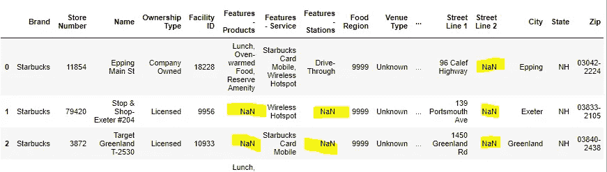
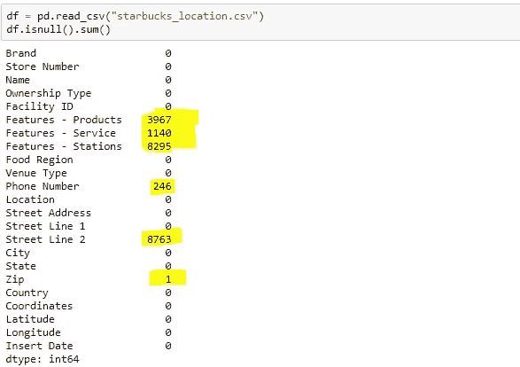

# 处理数据科学项目中的缺失数据

> 原文：<https://towardsdatascience.com/dealing-with-missing-data-in-data-science-projects-e8ac7a4efdff?source=collection_archive---------22----------------------->

## 如何不因丢失数据而丢失有价值的信息


由[艾米丽·莫特](https://unsplash.com/@emilymorter?utm_source=medium&utm_medium=referral)在 [Unsplash](https://unsplash.com?utm_source=medium&utm_medium=referral) 上拍摄的照片

这是关于连接点…..它们在数据科学中是真实的。

缺失数据一直存在，一直是个问题。人们通常会根据数据集的大小和问题的严重程度来临时处理这些问题。

由于数据的激增以及随之而来的不可避免的价值缺失，它最近越来越受到关注。人们在如何处理这些问题上很有创意，甚至发表了关于缺失数据问题和处理方法的学术论文。

本文的目的是总结其中的一些讨论和技术，并演示如何在数据科学项目中导航。所以请容忍我。

# **什么是缺失数据**

缺失数据是没有记录在数据集中的值。它们可以是单个单元格中缺少的单个值，也可以是整个观察值(行)中缺少的值。连续变量(如学生的身高)或分类变量(如人口的性别)都可能出现缺失数据。

缺失数据在自然科学或行为科学的任何领域都很常见，但在社会科学研究数据中尤其常见。

在编程语言中，丢失的值被表示为`NA`或`NaN`或者只是对象中的一个空单元格。



图:熊猫数据帧中显示为 NaN 的缺失值

# **缺失数据的来源**

那么，缺失的价值观从何而来，它们为什么会存在？

举个例子吧。您正在对受访者样本进行问卷调查；在问卷中，你问了一个关于家庭收入的问题。现在，如果一个回答者拒绝回答这个问题呢？你会编造还是留空白？您可能会将该单元格留空，从而创建一个缺少值的实例。

或者一个丢失的值可能仅仅是由于人为错误引起的。有人可能输入了错误的数据(还记得异常值吗？)在数据清理或探索性数据分析(EDA)过程中被检测到并删除。

在另一个例子中，一些时间序列数据-特别是调查数据集-可能包含缺失的观测值。这可能仅仅是因为在一个系列的一年或几年中没有进行调查。

# **引起的问题**

缺失值肯定是不可取的，但在统计和机器学习项目中，很难量化影响的大小。如果它是一个大型数据集，并且丢失了很小一部分数据，那么这种影响可能根本无法察觉。

但是，如果数据集相对较小，每个数据点都很重要。在这些情况下，丢失数据点意味着丢失有价值的信息。

在任何情况下，通常缺失的数据会造成不平衡的观察，导致有偏见的估计，在极端情况下，甚至会导致无效的结论。

# **如何处理丢失的数据**

预防胜于治疗！

因此，最大限度地减少生产中丢失数据的发生是处理它们的最有效方法。如果你正在进行客户调查，尽量不要让任何一个字段为空，继续跟进未回答的问题。如果样本量很小，确定缺失值的可接受阈值。如果超过了阈值，则扩大样本量。设计实验或收集数据，明确地以最小化缺失值为目标。

如果不可避免，以下是处理缺失数据的一些其他常用方法:

*   **案例删除:**如果数据集相对较大，则删除带有缺失值的完整记录
*   **替换:**用(a)列平均值、(b)最近邻居的平均值、(c)移动平均值或(c)用最后一次观察值填充来替换缺失的单元格
*   **统计插补:**在给定数据集中其他信息的情况下，回归可能是确定缺失像元值的有效方法
*   **敏感性分析:**如果样本较小或缺失值相对较大，则进行多变量结果的敏感性分析。

# 数据科学解决方案

那么它在实践中是如何工作的呢？下面是几个带有 Python 代码的示例。出于演示的目的，我使用了美国大陆上星巴克位置的数据集。

## **1。检查缺失值**

将`pandas`和`numpy`库以及数据集作为 pandas dataframe 导入。

```
# import libraries
import pandas as pd
import numpy as np# import data
df = pd.read_csv("starbucks_location.csv")
```

您可以用一行代码检查每一列中缺失值的总数。

```
df.isnull().sum()
```



您还可以检查缺失值占所有观察值的百分比。

```
df.isnull().sum()*100/len(df)
```

## 2.删除缺少的值

对缺失值的一种处理方法是，如果数据集相对较大且缺失案例较少，则完全丢弃观察值。

```
# drop all rows containing null
df.dropna()# drop all columns containing null
df.dropna(axis=1)# drop columns with less than 5 na values
df.dropna(axis=1, thresh=5)
```

## 3.归罪

您可以根据需要用适当的数据替换丢失的值。有很多方法可以做到这一点，看看哪种方法最适合你的目标。

```
# replace all na values with -9999
df.fillna(-9999)# fill na values with NaN
df.fillna(np.NaN)# fill na values with strings
df.fillna("data missing")# fill na values with mean of columns
df.fillna(df.mean())# replace na values with mean value of specific columns
df["col1"] = df["col1"].fillna(df.mean)
```

## 4.插入

如果是时间序列数据，你可以插值或使用移动平均。

```
# interpolation of missing values of all columns
df.interpolate()# interpolation of missing values of specific columns
df["col"] = df["col"].interpolate()# using moving average or rolling window
df['col'] = df['col'].rolling(window = 5).mean
```

## **最终想法**

在这篇文章中，我总结了丢失数据的来源，它们引起的问题以及消除/处理它们的方法。一些统计软件包会在执行统计分析之前自动消除缺失数据，但这并不总是最好的选择。作为一名数据科学家，您需要更好地处理如何处理缺失的观察值，我在本文中强调了一些行业最佳实践。