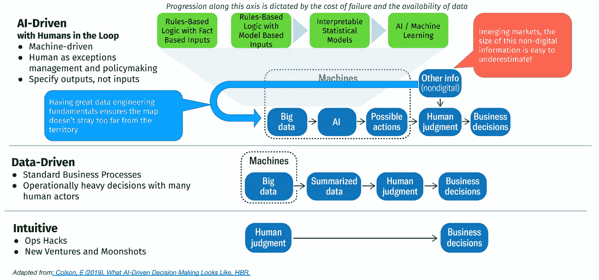

# 处理数据产品中的模型不确定性

> 原文：<https://towardsdatascience.com/dealing-with-model-uncertainty-in-data-products-148580a644c1?source=collection_archive---------43----------------------->

照片由 [Rich Tervet](https://unsplash.com/@richtervet?utm_source=medium&utm_medium=referral) 在 [Unsplash](https://unsplash.com?utm_source=medium&utm_medium=referral) 上拍摄，经作者许可编辑

随着软件越来越接近传统行业(想想拼车、金融科技、农业科技等等)。)，越来越多的数据产品被构建来支持或自动化通常由人类专家做出的决策。当这种情况发生时，通常会有一个有效的疑问，即一个数据产品是否能够将解决方案自动化到足够高的标准，从而值得投资。

如果不加以管理，这种不确定性可能会阻碍优秀数据产品的生产。要么数据产品的开发方式会严重损害业务，因为数据科学家高估了他们模型的价值，要么人类专家会完全拒绝该产品，永远不会从他们的数据中实现任何价值。

我试图写下一些处理数据产品中设计不确定性的技巧:(a)在你的数据产品中建立参数化或敏捷性，(b)以敏捷的方式发展你的数据产品。这些概念对于产品管理来说通常并不陌生，但当数据科学家发现自己不得不成为自己的产品经理时，我认为从这个角度来表述是有用的。

# 在我们没有数据的地方建立参数化

我们应该把信用额度限制在 1000 万 PHP 还是 1500 万 PHP？有时，没有数据驱动的方法来回答这个问题，因为我们没有用户对这个政策会有什么反应的例子。领域专家可能也不愿意做出这个数字应该是多少的强有力的决定，但是在典型的软件开发环境中，有一种需求是将用户故事细化到精确的参数。

在这些情况下，最好的做法是花时间将这些决策参数化。我们可以将它们设置为目前有意义的值，但一旦我们有了新的信息，就内置到产品功能中来快速切换该参数(一旦我们有了足够的示例，就用一些机器学习的决策来替换它)。

通过这种方式，产品开发可以向前推进，而不必做出潜在的成本高昂且难以逆转的决策。

换句话说:你可以建立完美的预测，这样你就可以在推出数据产品时准确地知道会发生什么，或者你可以建立瞬间反应时间，这样你就永远不会真正需要预测。

# 不断发展的数据产品

不是所有的东西一开始都必须是神经网络；事实上，如果你开始一个项目时首先想到的是统计建模或机器学习，你可能会面临很多问题。

处理模型性能不确定性的一种方法是在您的自动化旅程中采取较小的步骤。您可以在这里看到三个不同的层面，在这三个层面上，数据在决策中扮演着越来越重要的角色。虽然从“直觉”到“数据驱动”再到“人工智能驱动”的进展是清晰的，并且可能没有人会发现试图在这个阶梯上前进的问题，但项目往往会在绿框(人工智能参与的水平)中出错。

作者照片

在这里，我们可以从典型的软件(基于规则的逻辑和基于事实的输入)开始，沿着绿色的盒子前进。一旦我们适应并继续收集数据/减少关于如何做出正确决策的不确定性，您就可以在链上前进并向其中添加更多的建模元素。

有两个因素会影响您跨越绿色轴的速度:

1.  **失败成本** —这是你试图自动化的决策所固有的。担保不良贷款的失败成本将比在电子商务网站上提供错误的推荐低得多。
2.  **数据完整性** —这是数据工程基础绝对重要的地方。像图像处理这样的问题是数据完整；100%确定某物是狗还是猫所需的任何信息都已经在图像中了。然而，当你试图借钱给某人时，你很难观察到那个人如何管理他/她的财务或经营他/她的生意的每个方面。如果你能以一种便宜且自动化的方式自动化数据收集，那么你就更有可能进步到更高级的决策自动化形式。

# 那么这一切意味着什么呢？

数据科学课程和训练营中教授的机器学习和人工智能是一种具有非常不确定的攻击面的解决方案(即，我们还不知道它到底适合解决什么类型的问题)。

这就是为什么当不再有大量的宣传时，很难让企业投资这项技术的一个重要原因，即使*可能会带来巨大的、改变游戏规则的好处。*

为了推进项目，数据从业者需要:

*   通过参数化构建内在敏捷的产品，以及
*   从简单的基于规则的系统一直到完全自动化的决策，以增量和敏捷的方式移动，最大限度地降低风险并在此过程中纳入新数据。

*原载于*[*https://tjpalanca.com*](https://tjpalanca.com/posts/2020-08-06-dealing-with-model-uncertainty-in-data-products/)*。*