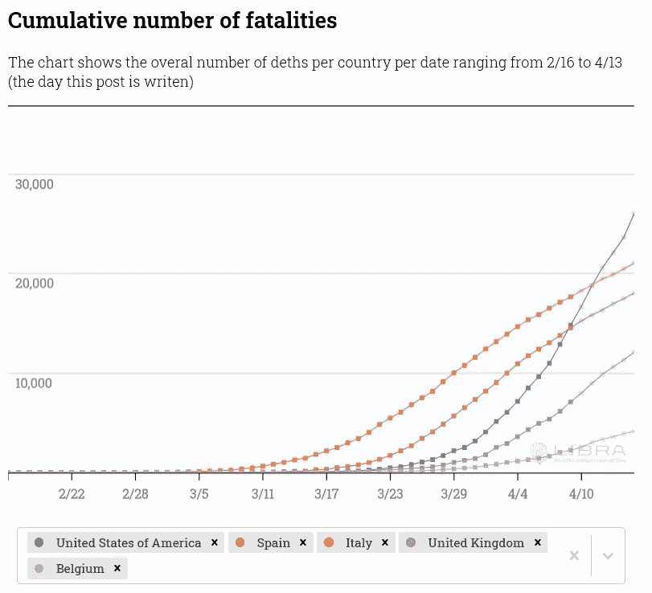
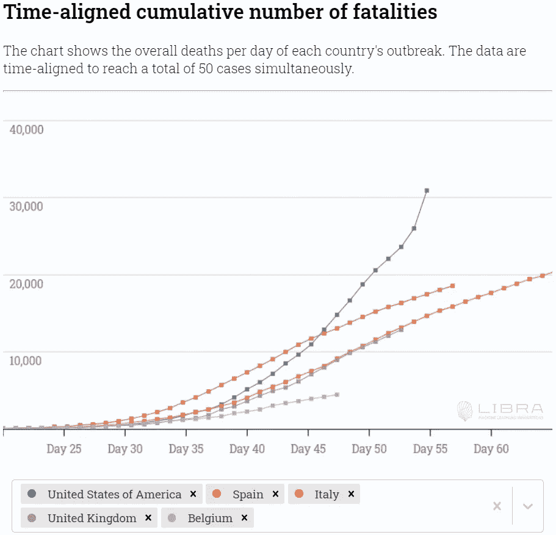
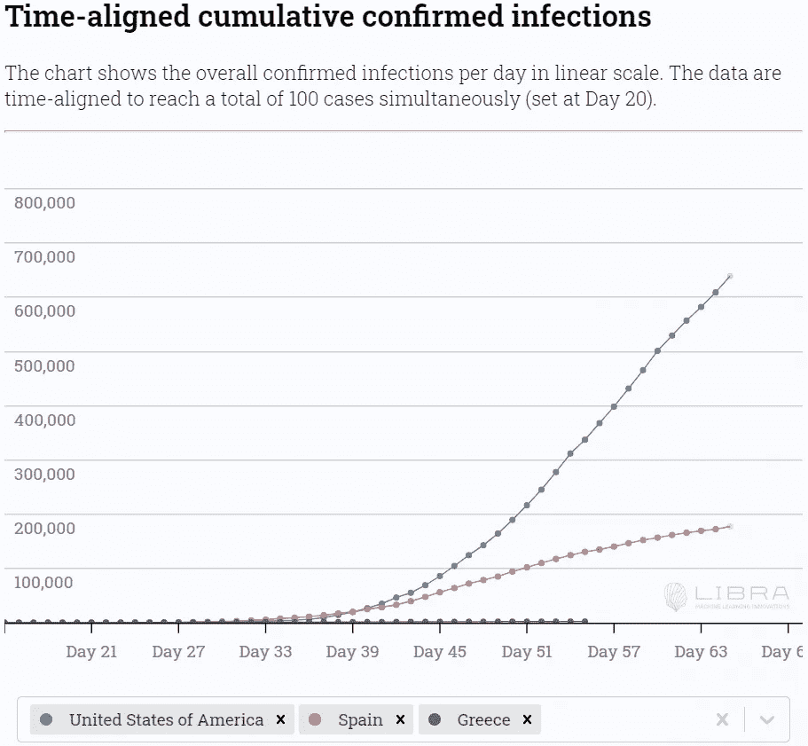
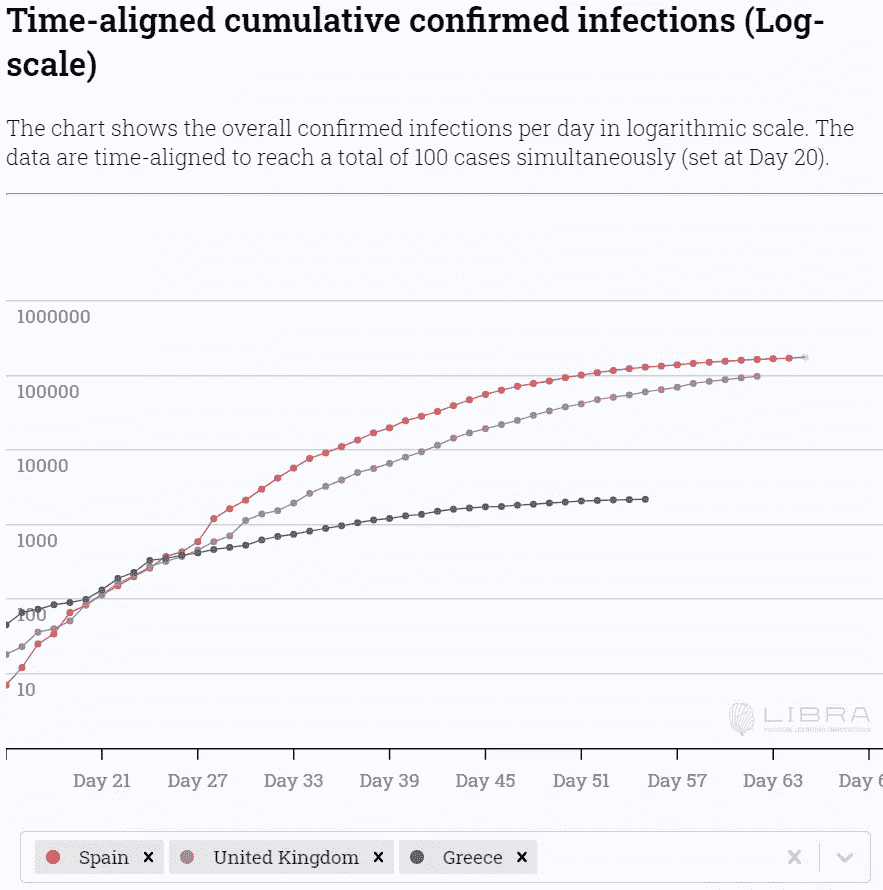
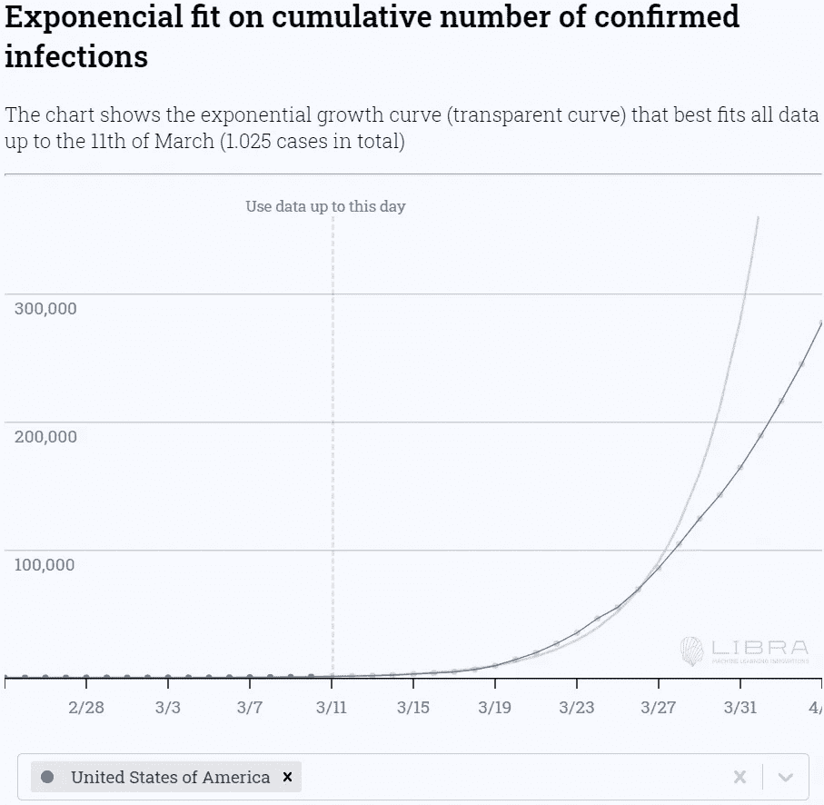

# 处理我们对新冠肺炎指数增长的系统性误判

> 原文：<https://towardsdatascience.com/dealing-with-our-systematic-misjudgment-of-covid-19-exponential-growth-3d367c9546d9?source=collection_archive---------36----------------------->

Unsplash 上 Fusion 医疗动画
的照片

## 指数增长偏差使我们无法掌握指数增长的实际动态。让我们看看简单的数据可视化和分析技术。

> 由迪奥尼西斯·雷维斯和灭霸·巴洛梅诺斯合著。
> 这篇文章的一个稍加修改的版本首先发表在[天秤座 MLI 的博客](https://www.libramli.ai/blog/How%20to%20deal%20with%20exponential%20growth%20bias%20in%20COVID19%20pandemic)上，其中包括通过[新冠肺炎比较分析工具](https://www.libramli.ai/tools/covid-19-visualisation-tool-A)生成的互动图表

我们人类正在遭受理性判断和理解世界的系统性缺陷。这种感知上的系统性错误被称为认知偏差。维基百科列出了 100 多种经过充分研究的认知偏见,如果你认为这些偏见与你无关，那么，你并不孤单。像我们大多数人一样，你只是受到偏见盲点的困扰，这本身就是一种认知偏见！

# 人类的直觉很难实现指数增长

随着当前新冠肺炎疫情的持续，困扰全球数百万居家隔离者的认知偏差是*指数增长偏差*[**【1】**](#_ftn1)。我们的大脑不具备指数思维的能力。如果我们从前门走 30 步，我们可以很容易地估计我们会到达哪里，但是如果我们走 30 个指数级的步骤，也就是每次走一倍，我们就无法估计我们会走多远。1+2+4+8+16.答案是，我们会绕地球 26 圈！

冠状病毒呈指数传播，而不是线性传播。指数增长偏差使得公民很难评估疫情在他们国家的地位，包括未来几天的潜在后果。我们新冠肺炎系列博文的一个主要目的是展示和提供非专业人士也能理解的交互式可视化和工具，这将有助于缓解指数增长偏差障碍，并揭示支撑新冠肺炎数据的趋势和相关性。

# 对抗指数增长偏差的可视化方法

在深入研究视觉评估新冠肺炎疫情的方法之前，让我们考虑从 2 月 22 日至今(即 4 月 10 日)的每日死亡报告。我们选择了 5 个国家作为例子:意大利和西班牙，代表遭受严重影响的国家，但它们已经达到高峰，英国和美国，它们在晚些时候受到影响，在感染人数和死亡人数方面仍在恶化，最后，我们有比利时代表受影响病例增加相对较晚的国家。

如果我们绘制每个日期的累计(总体)死亡人数，我们会得到上面的图表。我们得到的印象是，意大利和西班牙的情况相似，英国的情况较温和，而美国的情况在快速恶化。但是，请注意，如果我们回到 4 月 4 日，那么我们只有到那时为止的数据，那么我们可能会得出结论，美国可能会像西班牙和意大利一样。就比利时而言，它似乎经历了一场温和得多且相对得到良好控制的疫情。在这张图表的交互式版本中，可以在原始帖子中找到[，您可以在国家选择窗格中包含您选择的国家。这张图表是直观感受指数增长和评估每个国家情况的最佳方法吗？简单的回答是不！](https://www.libramli.ai/blog/How%20to%20deal%20with%20exponential%20growth%20bias%20in%20COVID19%20pandemic)

我们建议依靠三种互补的技术:*时间校准*，*使用对数标度*和*指数拟合*。

## 时间校准

媒体和政策制定者发表声明，如“我们落后 X 国 2 到 3 周”，其中 X 通常是意大利。这种比较，如果正确的话，提供了一个具体的形势评估，并绕过指数增长偏差。

> 时间排列允许在爆发之间进行可靠的比较分析

要概括这样的比较分析，我们必须将所有国家在时间上对齐，就好像疫情是在同一天开始的一样。有许多方法可以实现这一点。一个不太详细的日期是第一天，即每个国家记录第一个病例的日期。一个稍微好一点的选择是让几个案例累积起来，并使所有国家在一个普通的日子里有一个固定的案例总数，例如 50 个。在下一张图中，我们遵循后一种方法。

我们现在所能得出的结论有了很大的改进。与意大利相比，西班牙的情况显然更糟(至少在第 45 天左右)，与西班牙和意大利相比，美国的情况正在迅速恶化。英国的情况和意大利一样糟糕。另一方面，与我们在没有时间校准的情况下观察到的情况相比，比利时的情况似乎更糟。

当比较在时间上相隔很远或在发展的早期阶段发生的疾病爆发时，时间比对更为有益。

## 对数标度的使用

虽然时间排列揭示了每个国家疫情爆发的灵活性，但有一个明显的问题需要解决。每次疫情爆发的早期都被压缩在图表底部附近，很难进行比较。这是不可避免的，因为指数增长的本质，它需要一段时间才能开始，但不久，它就会飞速增长。接下来描述了这样一个例子，涉及美国、西班牙和希腊的确诊感染。

显然，很难对美国和西班牙疫情的早期阶段进行比较，对希腊的任何直观评估都是不可行的。

解决方法是将图表的纵轴从线性刻度改为对数刻度。这意味着，不是线性上升，而是 10，20，30…，1000 等等。以指数方式增加，例如 10 的幂，(10，100，1000…)。除非你精通数学，否则很难理解这一点。在对数尺度上可视化数据时，只需要带两件东西；a)我们在纵轴上保留的用于可视化情况 1 至 10 的空间等于我们为情况 11 至 100 或 101 至 1000、1001 至 10000 等保留的空间。这很有帮助，因为我们现在可以为与每次爆发相对应的小数据值提供更多空间。b)如果一个国家的病例呈指数增长，那么在对数尺度上，它们将出现在一条直线上。在以后的文章中，我们可能还会调查对数标度表示的潜力，揭示每个国家采取的最有影响力的遏制措施。让我们看看当纵轴是对数标度而不是线性标度时，前面的例子是怎样出现的:

解决了小值的混乱。一个额外的优点是，我们可以很容易地计算出每个国家将报告病例增加 10 倍所需的天数，比如从 1.000 到 10.000。我们只需要计算相应网格线之间的点，这揭示了在疫情的早期阶段，西班牙确诊病例的上升速度比美国要快。西班牙从 100 到 10000 用了 15 天，而美国用了 17 天。之后，西班牙的增长率放缓(从 10.000 到 100.000 又需要 15 天，而美国只需要 9 天)。

> 对数标度在关注疾病爆发的早期阶段是有益的

最常见的是，当冠状病毒传播与指数增长相关时，隐含着固定增长率的指数增长。增长率表示每天病例增加的百分比。10%的增长率意味着，如果你有 100 个案例，第二天就会有 110 个，或者当你有 1，000，000 个案例时，第二天就会有另外的 100，000 个案例。在对数标度图中，这意味着从对数标度图的一条网格线到下一条网格线需要相同的天数，这相当于所有的点都在一条直线上。幸运的是，真实数据显示，这种行为只是在疫情的早期阶段，比如在美国，从 100 例到 20，000 例，才是大致准确的近似值。此后，增长率越来越低，原因有几个，包括各州为遏制疫情采取的过度措施，以及病毒感染新人的能力逐渐降低，要么是因为潜在候选人生病并康复，因此具有免疫力，要么是因为他们去世了。

## 指数拟合

无法掌握指数级进化的现象意味着什么？这意味着当你有从 A 日到 B 日的一系列数据时，我们无法想象接下来几天的数据。那么，预测建模的帮助来了！我们可以采用一个被约束为服从指数增长行为的模型，并以数据驱动的方式(即使用从日期 A 到日期 B 的可用数据)对其进行调整，以使其最适合。这个动作被解释为:在所有可能的指数增长曲线(无限的)中，找到并使用尽可能紧密跟随可用数据的曲线。

> *假设固定增长，指数拟合估计预期的未来病例数*

让我们以美国为例，找出最符合前 1.025 例确诊感染数据的指数曲线，即垂直虚线所示的 3 月 11 日(“使用至今的数据”)。

薄的透明曲线是预测的指数曲线，正如可以看到的那样，非常适合直到 3 月 27 日，其中病例总数约为 85.000。而且，如果我们用[新冠肺炎比较分析工具](https://www.libramli.ai/tools/covid-19-visualisation-tool-A)复制这个图表，悬停在美国的指数曲线上，我们得到预测的指数拟合的增长率，是 32.51%。这意味着，据预测，美国每天的确诊感染人数比前一天增加了 32.51%。幸运的是，感染的真实增长率不是固定的，在 3 月 27 日之后，估计模型偏离真实数据，增长率下降。

# 家庭作业

假设 X 国的增长率固定为 10%。从 10 个案例到 1000 个案例需要多少天
如果你的答案是 100 天，不要担心，这是指数增长偏差造成的！

# 参考

[【1】](#_ftnref1)利维，M.R .和塔索夫，j . 2017。指数增长偏差和过度自信。*《经济心理学杂志》*， *58* ，第 1–14 页。

这个好例子摘自彼得·迪亚曼迪斯和史蒂文·科特勒著的《富足:未来比你想象的更好》，西蒙和舒斯特出版社，2012 年。

***编者注:*** [*走向数据科学*](http://towardsdatascience.com) *是一份以研究数据科学和机器学习为主的中型刊物。我们不是健康专家或流行病学家，本文的观点不应被解释为专业建议。想了解更多关于疫情冠状病毒的信息，可以点击* [*这里*](https://www.who.int/emergencies/diseases/novel-coronavirus-2019/situation-reports) *。*